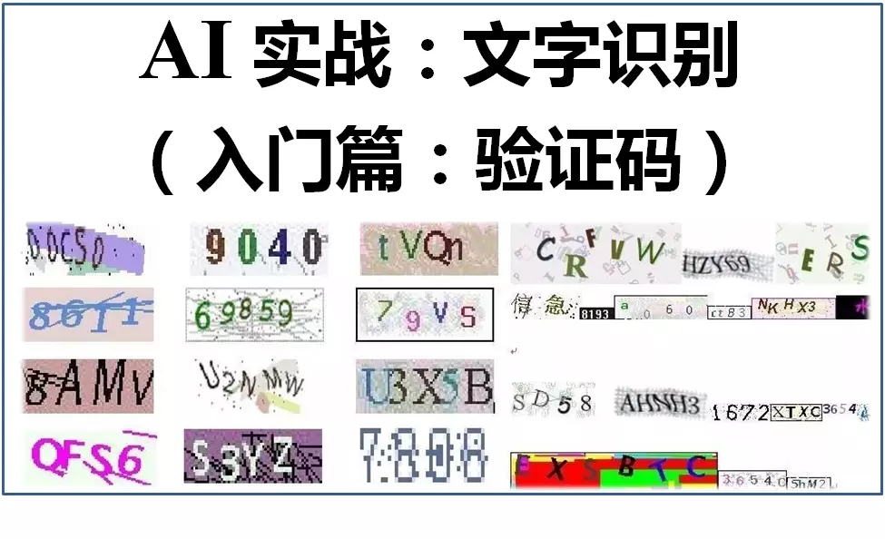
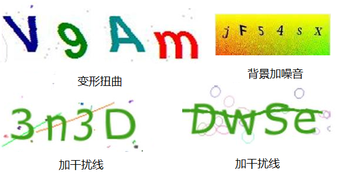
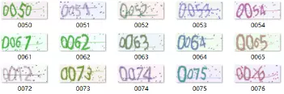
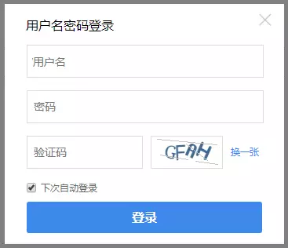
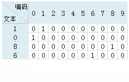
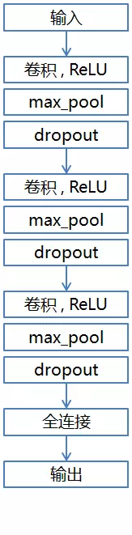
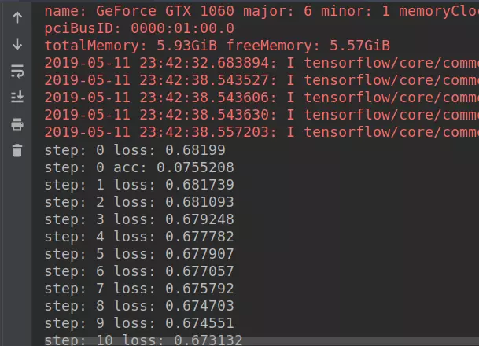

**来源**:https://my.oschina.net/u/876354/blog/3048523

  

文字识别在现实生活中有着非常重要的应用，主要由文字检测、内容识别两个关键步骤组成，在本博客之前的文章中已介绍了文字检测、内容识别的经典模型原理（见文章：[大话文本检测经典模型：CTPN](https://my.oschina.net/u/876354/blog/3047851) ， [大话文本识别经典模型：CRNN](https://my.oschina.net/u/876354/blog/3047853)），本文主要从实战的角度介绍如何实现文字识别模型。  

在之前的文章中，已经介绍过了跟文字识别相关的实战内容：基于MNIST数据集识别手写数字的实战内容（见文章：[训练你的第一个AI模型：MNIST手写数字识别模型](https://my.oschina.net/u/876354/blog/1926060)），这个相对简单。今天再介绍文字识别的另一个经典应用：`验证码识别`，作为文字识别的实战入门篇。  

验证码在手机APP、WEB网站中非常普遍，主要是为了防止恶意登录、刷票、灌水、爬虫等异常行为，也可能是为了缓解系统的后台压力（例如在秒杀、抢票时，强制要求输入验证码）。本文主要介绍文本型验证码的识别，文本型验证码由数字、英文大小写字母，甚至中文随机组成，再进行变形扭曲、加干扰线、加背景噪音等操作，主要是为了防止被光学字符识别（OCR）之类的程序自动识别出图片上的文字而失去效果，如下图：  
  


由于存在着比较强的干扰信息，因此，直接使用OCR进行识别，效果很不理想，而通过AI可很好地实现这种复杂信息的识别。目前百度等AI开放平台，也提供了验证码识别的开放接口，但由于验证码可由各APP、网站根据任意自定的规则随机组合生成，因此，这些AI平台的验证码识别开放接口在某些场景下效果很好，在某些场景下可能就失灵了。针对具体的场景，我们通过自己训练验证码识别的AI模型，能很好地解决该场景下的验证码识别问题。  

下面开始介绍使用Tensorflow构建验证码的识别模型，主要步骤如下：  

* step 1. 获取验证码图片
* step 2. 图片标注
* step 3. 训练模型
* step 4. 模型应用  

##### 获取验证码图片  

1. 如果是自己练习的，可直接随机生成验证码图片作为基础数据集。在python里面使用captcha库来快速生成验证码图片，通过pip install captcha进行安装，或者手动下载captcha-0.3-py3-none-any.whl文件进行安装。（注：anaconda无法通过conda install 直接安装captcha，但可使用anaconda里面的pip来安装captcha），核心代码如下：  

```python
from captcha.image import ImageCaptcha
import random

# 生成验证码的字符集
CHAR_SET = ['0','1','2','3','4','5','6','7','8','9']
CHAR_SET_LEN = len(CHAR_SET)

# 验证码长度
CAPTCHA_LEN  = 4

for i in range(CHAR_SET_LEN):
    for j in range(CHAR_SET_LEN):
        for k in range(CHAR_SET_LEN):
            for l in range(CHAR_SET_LEN):
                captcha_text = CHAR_SET[i] + CHAR_SET[j] + CHAR_SET[k] + CHAR_SET[l]
                image = ImageCaptcha()
                image.write(captcha_text, '/tmp/mydata/' + captcha_text + '.jpg')
```

生成的效果如下图  
  


2. 如果是要针对某个网站的验证码进行识别的，则可使用一些工具将对应的验证码下载下来。一般网站登录的界面如下：  
  

其中，通常可直接点击验证码图片，或旁边的“换一张”按钮，更换验证码图片。这时，可使用像“按键精灵”之类的模拟鼠标操作的软件，录制一段脚本，然后在验证码图片处模拟右键鼠标保存图片，再点击验证码图片更换新的验证码，如此反复，即可下载该网站的大量验证码图片，用于训练模型。至于这个下载验证码图片的脚本嘛，为了不教坏大家，此处省略500字，嘿嘿~  


##### 图片标注  

如果第1步是自己随机生成验证码图片的，那么在保存图片时，文件名便是该验证码图片的文本内容，无须再进行标注。  

如果第1步是下载了某个网站的验证码图片的，那么需要先人工对验证码图片的文本内容进行标注，以方便接下来的模型训练。可通过观察，将验证码图片的文本信息记在文件名中（重命名），通过这种方式进行图片标注，也可以单独记录在文本文件中。  


##### 训练模型  

###### 标签one-hot编码  

为了能够将验证码图片的文本信息输入到卷积神经网络模型里面去训练，需要将文本信息向量化编码。在这里使用“热独编码”（one-hot），即使用01编码表示文本信息。本项目的验证码文本长度为4位，验证码编码由0至9的数字组成，例如验证码文本信息为“1086”，则one-hot编码时在相应的位置标为1，其余为0，如下图  
  

则“1086”经one-hot编码后变为[0 1 0 0 0 0 0 0 0 0 1 0 0 0 0 0 0 0 0 0 0 0 0 0 0 0 0 0 1 0 0 0 0 0 0 0 1 0 0 0] 。将验证码文本信息进行one-hot编码的核心代码如下：  

```python
def text2label(text):
    label = np.zeros(CAPTCHA_LEN * CHAR_SET_LEN)
    for i in range(len(text)):
        idx = i * CHAR_SET_LEN + CHAR_SET.index(text[i])
        label[idx] = 1
    return label
```

###### 读取图片文件  

读取验证码图片、验证码文本内容（保存在文件名中），并编写获取下个批量数据的方法，主要函数如下：  

```python
# 获取验证码图片路径及文本内容
def get_image_file_name(img_path):
    img_files = []
    img_labels = []
    for root, dirs, files in os.walk(img_path):
        for file in files:
            if os.path.splitext(file)[1] == '.jpg':
                img_files.append(root+'/'+file)
                img_labels.append(text2label(os.path.splitext(file)[0]))
    return img_files,img_labels

# 批量获取数据
def get_next_batch(img_files,img_labels,batch_size):
    batch_x = np.zeros([batch_size, IMAGE_WIDTH*IMAGE_HEIGHT])
    batch_y = np.zeros([batch_size, CAPTCHA_LEN * CHAR_SET_LEN])

    for i in range(batch_size):
        idx = random.randint(0, len(img_files) - 1)
        file_path = img_files[idx]
        image = cv2.imread(file_path)
        image = cv2.resize(image, (IMAGE_WIDTH, IMAGE_HEIGHT))
        image = image.astype(np.float32)
        image = np.multiply(image, 1.0 / 255.0)
        batch_x[i, :] = image
        batch_y[i, :] = img_labels[idx]

    return batch_x,batch_y
```


###### 构建CNN模型  

由于验证码的识别相对比较简单，借鉴LeNet的网络结构构建CNN模型，由3个卷积层和1个全连接层组成，网络结构图如下：  
  

核心代码如下：  

```python
# 图像尺寸
IMAGE_HEIGHT = 60
IMAGE_WIDTH = 160

# 网络相关变量
X = tf.placeholder(tf.float32, [None, IMAGE_HEIGHT * IMAGE_WIDTH])
Y = tf.placeholder(tf.float32, [None, CAPTCHA_LEN * CHAR_SET_LEN])
keep_prob = tf.placeholder(tf.float32)  # dropout

# 验证码 CNN 网络
def crack_captcha_cnn_network (w_alpha=0.01, b_alpha=0.1):
    x = tf.reshape(X, shape=[-1, IMAGE_HEIGHT, IMAGE_WIDTH, 1])

    w_c1 = tf.Variable(w_alpha * tf.random_normal([3, 3, 1, 32]))
    b_c1 = tf.Variable(b_alpha * tf.random_normal([32]))
    conv1 = tf.nn.relu(tf.nn.bias_add(tf.nn.conv2d(x, w_c1, strides=[1, 1, 1, 1], padding='SAME'), b_c1))
    conv1 = tf.nn.max_pool(conv1, ksize=[1, 2, 2, 1], strides=[1, 2, 2, 1], padding='SAME')
    conv1 = tf.nn.dropout(conv1, keep_prob)

    w_c2 = tf.Variable(w_alpha * tf.random_normal([3, 3, 32, 64]))
    b_c2 = tf.Variable(b_alpha * tf.random_normal([64]))
    conv2 = tf.nn.relu(tf.nn.bias_add(tf.nn.conv2d(conv1, w_c2, strides=[1, 1, 1, 1], padding='SAME'), b_c2))
    conv2 = tf.nn.max_pool(conv2, ksize=[1, 2, 2, 1], strides=[1, 2, 2, 1], padding='SAME')
    conv2 = tf.nn.dropout(conv2, keep_prob)

    w_c3 = tf.Variable(w_alpha * tf.random_normal([3, 3, 64, 64]))
    b_c3 = tf.Variable(b_alpha * tf.random_normal([64]))
    conv3 = tf.nn.relu(tf.nn.bias_add(tf.nn.conv2d(conv2, w_c3, strides=[1, 1, 1, 1], padding='SAME'), b_c3))
    conv3 = tf.nn.max_pool(conv3, ksize=[1, 2, 2, 1], strides=[1, 2, 2, 1], padding='SAME')
    conv3 = tf.nn.dropout(conv3, keep_prob)

    w_d = tf.Variable(w_alpha * tf.random_normal([8 * 20 * 64, 1024]))
    b_d = tf.Variable(b_alpha * tf.random_normal([1024]))
    dense = tf.reshape(conv3, [-1, w_d.get_shape().as_list()[0]])
    dense = tf.nn.relu(tf.add(tf.matmul(dense, w_d), b_d))
    dense = tf.nn.dropout(dense, keep_prob)

    w_out = tf.Variable(w_alpha * tf.random_normal([1024, CAPTCHA_LEN * CHAR_SET_LEN]))
    b_out = tf.Variable(b_alpha * tf.random_normal([CAPTCHA_LEN * CHAR_SET_LEN]))
    out = tf.add(tf.matmul(dense, w_out), b_out)
    return out
```


###### 训练模型  

通过设置好模型训练的迭代轮次、批量获取样本数量、学习率等参数，读取验证码图片集，并随机划分出训练集、测试集，再加载本项目的网络模型进行训练，每100步评估一次准确率和保存模型文件。核心代码如下：  

```python
# 模型的相关参数
step_cnt = 200000  # 迭代轮数
batch_size = 16  # 批量获取样本数量
learning_rate = 0.0001  # 学习率

# 读取验证码图片集
img_path = '/tmp/mydata/'
img_files, img_labels = get_image_file_name(img_path)

# 划分出训练集、测试集
x_train,x_test,y_train,y_test=train_test_split(img_files,img_labels,test_size=0.2,random_state=33)

# 加载网络结构
output = crack_captcha_cnn_network()

# 损失函数、优化器
loss = tf.reduce_mean(tf.nn.sigmoid_cross_entropy_with_logits(logits=output, labels=Y))
optimizer = tf.train.AdamOptimizer(learning_rate=learning_rate).minimize(loss)

# 评估准确率
predict = tf.reshape(output, [-1, CAPTCHA_LEN, CHAR_SET_LEN])
max_idx_p = tf.argmax(predict, 2)
max_idx_l = tf.argmax(tf.reshape(Y, [-1, CAPTCHA_LEN, CHAR_SET_LEN]), 2)
correct_pred = tf.equal(max_idx_p, max_idx_l)
accuracy = tf.reduce_mean(tf.cast(correct_pred, tf.float32))

with tf.Session() as sess:
    sess.run(tf.global_variables_initializer())
    saver = tf.train.Saver(tf.global_variables(), max_to_keep=5)

for step in range(step_cnt):
    # 训练模型
        batch_x, batch_y = get_next_batch(x_train, y_train,batch_size)
        _, loss_ = sess.run([optimizer, loss], feed_dict={X: batch_x, Y: batch_y, keep_prob: 0.75})
        print('step:',step, 'loss:',loss_)

        # 每100步评估一次准确率
        if step % 100 == 0:
            batch_x_test, batch_y_test = get_next_batch(x_test, y_test,batch_size)
            acc = sess.run(accuracy, feed_dict={X: batch_x_test, Y: batch_y_test, keep_prob: 1.})
            print('step:',step,'acc:',acc)

            # 保存模型
            saver.save(sess, '/tmp/mymodel/crack_captcha.ctpk', global_step=step)

        step += 1
```


训练的过程如下图所示：  
  

经过一段时间的训练后，评估的准确率可达到99%以上，能非常准确地识别出验证码。  


###### 模型应用  

通过加载训练好后的模型文件，即可输入图片进行验证码识别，核心代码如下：  

```python
# 加载网络结构
output = crack_captcha_cnn_network()

saver = tf.train.Saver()
with tf.Session() as sess:
    model_path = '/tmp/mymodel/'
    saver.restore(sess, tf.train.latest_checkpoint(model_path))

    output_rate=tf.reshape(output, [-1, CAPTCHA_LEN, CHAR_SET_LEN])
    predict = tf.argmax(output_rate, 2)
    text_list,rate_list = sess.run([predict,output_rate], feed_dict={X: [captcha_image], keep_prob: 1})   # captcha_image 为待识别的验证码图片

    tmptext = text_list[0].tolist()
    text=''
    for i in range(len(tmptext)):
        text = text + CHAR_SET[tmptext[i]]

    print('识别结果：',text)
```

以上就是文字识别的入门实战内容：验证码图片文本识别。通过本次的学习，可了解简单的文本识别的实现方式。  

##### 完整代码  

```python
import numpy as np
import tensorflow as tf
from sklearn.model_selection import train_test_split
from captcha.image import ImageCaptcha
import random
import os

# 生成验证码的字符集
CHAR_SET = ['0','1','2','3','4','5','6','7','8','9']
CHAR_SET_LEN = len(CHAR_SET)

# 验证码长度
CAPTCHA_LEN = 4

# 生成验证码图片
def gen_captcha_image():
    for i in range(CHAR_SET_LEN):
        for j in range(CHAR_SET_LEN):
            for k in range(CHAR_SET_LEN):
                for l in range(CHAR_SET_LEN):
                    captcha_text = CHAR_SET[i] + CHAR_SET[j] + CHAR_SET[k] + CHAR_SET[l]
                    image = ImageCaptcha()
                    image.write(captcha_text, '/tmp/mydata/' + captcha_text + '.jpg')

# 图像大小
IMAGE_HEIGHT = 60
IMAGE_WIDTH = 160

# 验证码文本信息one-hot编码
def text2label(text):
    label = np.zeros(CAPTCHA_LEN * CHAR_SET_LEN)
    for i in range(len(text)):
        idx = i * CHAR_SET_LEN + CHAR_SET.index(text[i])
        label[idx] = 1
    return label

# 获取验证码图片路径及文本内容
def get_image_file_name(img_path):
    img_files = []
    img_labels = []
    for root, dirs, files in os.walk(img_path):
        for file in files:
            if os.path.splitext(file)[1] == '.jpg':
                img_files.append(root+'/'+file)
                img_labels.append(text2label(os.path.splitext(file)[0]))
    return img_files,img_labels

# 批量获取数据
def get_next_batch(img_files,img_labels,batch_size):
    batch_x = np.zeros([batch_size, IMAGE_WIDTH*IMAGE_HEIGHT])
    batch_y = np.zeros([batch_size, CAPTCHA_LEN * CHAR_SET_LEN])
    for i in range(batch_size):
        idx = random.randint(0, len(img_files) - 1)
        file_path = img_files[idx]
        image = cv2.imread(file_path)
        image = cv2.resize(image, (IMAGE_WIDTH, IMAGE_HEIGHT))
        image = image.astype(np.float32)
        image = np.multiply(image, 1.0 / 255.0)
        batch_x[i, :] = image
        batch_y[i, :] = img_labels[idx]

    return batch_x,batch_y

# 网络相关变量
X = tf.placeholder(tf.float32, [None, IMAGE_HEIGHT * IMAGE_WIDTH])
Y = tf.placeholder(tf.float32, [None, CAPTCHA_LEN * CHAR_SET_LEN])
keep_prob = tf.placeholder(tf.float32)  # dropout

# 验证码 CNN 网络
def crack_captcha_cnn_network(w_alpha=0.01, b_alpha=0.1):
    x = tf.reshape(X, shape=[-1, IMAGE_HEIGHT, IMAGE_WIDTH, 1])

    w_c1 = tf.Variable(w_alpha * tf.random_normal([3, 3, 1, 32]))
    b_c1 = tf.Variable(b_alpha * tf.random_normal([32]))
    conv1 = tf.nn.relu(tf.nn.bias_add(tf.nn.conv2d(x, w_c1, strides=[1, 1, 1, 1], padding='SAME'), b_c1))
    conv1 = tf.nn.max_pool(conv1, ksize=[1, 2, 2, 1], strides=[1, 2, 2, 1], padding='SAME')
    conv1 = tf.nn.dropout(conv1, keep_prob)

    w_c2 = tf.Variable(w_alpha * tf.random_normal([3, 3, 32, 64]))
    b_c2 = tf.Variable(b_alpha * tf.random_normal([64]))
    conv2 = tf.nn.relu(tf.nn.bias_add(tf.nn.conv2d(conv1, w_c2, strides=[1, 1, 1, 1], padding='SAME'), b_c2))
    conv2 = tf.nn.max_pool(conv2, ksize=[1, 2, 2, 1], strides=[1, 2, 2, 1], padding='SAME')
    conv2 = tf.nn.dropout(conv2, keep_prob)

    w_c3 = tf.Variable(w_alpha * tf.random_normal([3, 3, 64, 64]))
    b_c3 = tf.Variable(b_alpha * tf.random_normal([64]))
    conv3 = tf.nn.relu(tf.nn.bias_add(tf.nn.conv2d(conv2, w_c3, strides=[1, 1, 1, 1], padding='SAME'), b_c3))
    conv3 = tf.nn.max_pool(conv3, ksize=[1, 2, 2, 1], strides=[1, 2, 2, 1], padding='SAME')
    conv3 = tf.nn.dropout(conv3, keep_prob)

    w_d = tf.Variable(w_alpha * tf.random_normal([8 * 20 * 64, 1024]))
    b_d = tf.Variable(b_alpha * tf.random_normal([1024]))
    dense = tf.reshape(conv3, [-1, w_d.get_shape().as_list()[0]])
    dense = tf.nn.relu(tf.add(tf.matmul(dense, w_d), b_d))
    dense = tf.nn.dropout(dense, keep_prob)

    w_out = tf.Variable(w_alpha * tf.random_normal([1024, CAPTCHA_LEN * CHAR_SET_LEN]))
    b_out = tf.Variable(b_alpha * tf.random_normal([CAPTCHA_LEN * CHAR_SET_LEN]))
    out = tf.add(tf.matmul(dense, w_out), b_out)
    return out

# 训练模型
def train_crack_captcha_cnn():
    # 模型的相关参数
    step_cnt = 200000  # 迭代轮数
    batch_size = 16  # 批量获取样本数量
    learning_rate = 0.0001  # 学习率

    # 读取验证码图片集
    img_path = '/tmp/mydata/'
    img_files, img_labels = get_image_file_name(img_path)

    # 划分出训练集、测试集
    x_train,x_test,y_train,y_test=train_test_split(img_files,img_labels,test_size=0.2,random_state=33)

    # 加载网络结构
    output = crack_captcha_cnn_network()

    # 损失函数、优化器
    loss = tf.reduce_mean(tf.nn.sigmoid_cross_entropy_with_logits(logits=output, labels=Y))
    optimizer = tf.train.AdamOptimizer(learning_rate=learning_rate).minimize(loss)

    # 评估准确率
    predict = tf.reshape(output, [-1, CAPTCHA_LEN, CHAR_SET_LEN])
    max_idx_p = tf.argmax(predict, 2)
    max_idx_l = tf.argmax(tf.reshape(Y, [-1, CAPTCHA_LEN, CHAR_SET_LEN]), 2)
    correct_pred = tf.equal(max_idx_p, max_idx_l)
    accuracy = tf.reduce_mean(tf.cast(correct_pred, tf.float32))

    with tf.Session() as sess:
        sess.run(tf.global_variables_initializer())
        saver = tf.train.Saver(tf.global_variables(), max_to_keep=5)

        for step in range(step_cnt):
            batch_x, batch_y = get_next_batch(x_train, y_train,batch_size)
            _, loss_ = sess.run([optimizer, loss], feed_dict={X: batch_x, Y: batch_y, keep_prob: 0.75})
            print('step:',step, 'loss:',loss_)

            # 每100步评估一次准确率
            if step % 100 == 0:
                batch_x_test, batch_y_test = get_next_batch(x_test, y_test,batch_size)
                acc = sess.run(accuracy, feed_dict={X: batch_x_test, Y: batch_y_test, keep_prob: 1.})
                print('step:',step,'acc:',acc)
                # 保存模型
                saver.save(sess, '/tmp/mymodel/crack_captcha.ctpk', global_step=step)
                
            step += 1
# 模型预测

def predict_captcha(captcha_image):
    # 加载网络结构
    output = crack_captcha_cnn_network()

    saver = tf.train.Saver()

    with tf.Session() as sess:
        model_path = '/tmp/mymodel/'
        saver.restore(sess, tf.train.latest_checkpoint(model_path))
        output_rate=tf.reshape(output, [-1, CAPTCHA_LEN, CHAR_SET_LEN])
        predict = tf.argmax(output_rate, 2)
        text_list,rate_list = sess.run([predict,output_rate], feed_dict={X: [captcha_image], keep_prob: 1})

        tmptext = text_list[0].tolist()
        text=''
        for i in range(len(tmptext)):
            text = text + CHAR_SET[tmptext[i]]

        print('识别结果：',text)


        return text
```