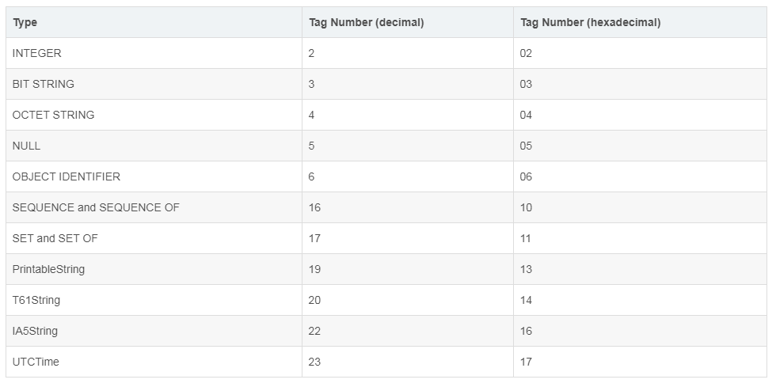
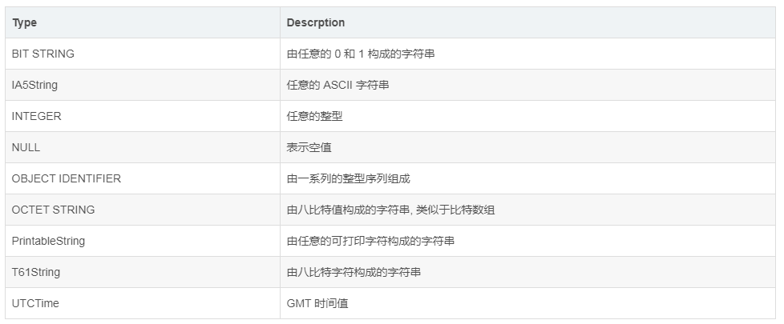
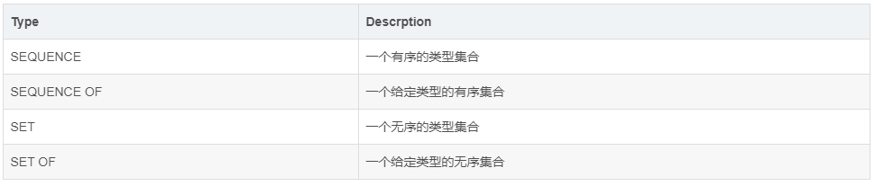
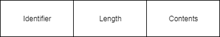
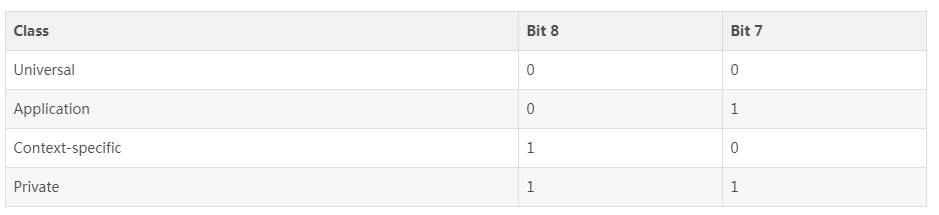
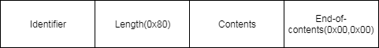
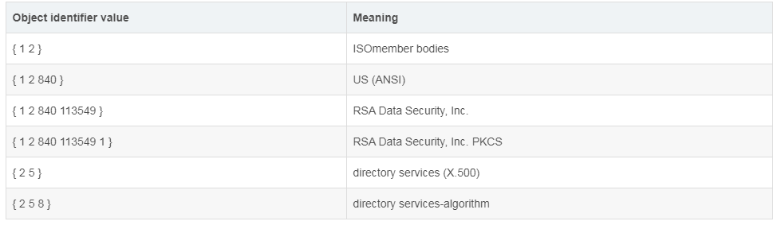
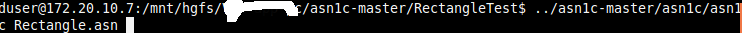
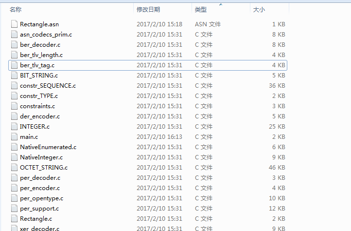
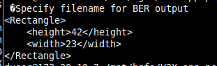

参考 http://luca.ntop.org/Teaching/Appunti/asn1.html.  

#### 一、简介  

ASN.1 全称 Abstract Syntax Natation One. 是一个用来描述抽象类型抽象数据的语法. 类似于 XML, JSON 等, 主要用于编码数据以便于在网络中交换数据. 比如, X509 证书.  

ASN.1 中定义了四种类型:

* 简单类型 (Simple types) : 用于编码基本的数据类型. 如 整形,字符串,二进制数据等.
* 结构类型 (Structured types) : 用于编码复杂数据类型. 如, X509 证书中的公钥.
* 标记的类型 (Tagged types) : 用于编码从其他几种类型引申而来的类型.
* 其他类型 (Other types) : CHOICE 或 Any.  

ASN.1 中每个类型都对应与一个 class 和 非负的 tag number. 用来区别不同的 ASN.1 类型.  

**四种 class**:

* Universal: 用来表示在所有应用中都具有相同意义的类型. 这些类型定义在 X.208
* Application: 用来表示针对于具体应用的类型. 在不同的应用中这些类型的意义往往不同
* Private: 用来表示针对用于具体企业的类型
* Context-specific: 用来表示针对于具体上下文该类型意义会变化的类型  

列出这些类型仅供参考, 其在网络协议中往往应用较少. 因为具体的协议往往会规定某个数据的具体ASN.1结构. 对于每个数据的每个字段也都有严格的规定.  

**Tag Numbers**:

  

下面我们详细介绍每一种类型. 我们的目标是通过本文的描述,我们可以手工的解析一个X509证书.  

```console

-----BEGIN CERTIFICATE-----
MIIDdTCCAl2gAwIBAgILBAAAAAABFUtaw5QwDQYJKoZIhvcNAQEFBQAwVzELMAkG
A1UEBhMCQkUxGTAXBgNVBAoTEEdsb2JhbFNpZ24gbnYtc2ExEDAOBgNVBAsTB1Jv
b3QgQ0ExGzAZBgNVBAMTEkdsb2JhbFNpZ24gUm9vdCBDQTAeFw05ODA5MDExMjAw
MDBaFw0yODAxMjgxMjAwMDBaMFcxCzAJBgNVBAYTAkJFMRkwFwYDVQQKExBHbG9i
YWxTaWduIG52LXNhMRAwDgYDVQQLEwdSb290IENBMRswGQYDVQQDExJHbG9iYWxT
aWduIFJvb3QgQ0EwggEiMA0GCSqGSIb3DQEBAQUAA4IBDwAwggEKAoIBAQDaDuaZ
jc6j40+Kfvvxi4Mla+pIH/EqsLmVEQS98GPR4mdmzxzdzxtIK+6NiY6arymAZavp
xy0Sy6scTHAHoT0KMM0VjU/43dSMUBUc71DuxC73/OlS8pF94G3VNTCOXkNz8kHp
1Wrjsok6Vjk4bwY8iGlbKk3Fp1S4bInMm/k8yuX9ifUSPJJ4ltbcdG6TRGHRjcdG
snUOhugZitVtbNV4FpWi6cgKOOvyJBNPc1STE4U6G7weNLWLBYy5d4ux2x8gkasJ
U26Qzns3dLlwR5EiUWMWea6xrkEmCMgZK9FGqkjWZCrXgzT/LCrBbBlDSgeF59N8
9iFo7+ryUp9/k5DPAgMBAAGjQjBAMA4GA1UdDwEB/wQEAwIBBjAPBgNVHRMBAf8E
BTADAQH/MB0GA1UdDgQWBBRge2YaRQ2XyolQL30EzTSo//z9SzANBgkqhkiG9w0B
AQUFAAOCAQEA1nPnfE920I2/7LqivjTFKDK1fPxsnCwrvQmeU79rXqoRSLblCKOz
yj1hTdNGCbM+w6DjY1Ub8rrvrTnhQ7k4o+YviiY776BQVvnGCv04zcQLcFGUl5gE
38NflNUVyRRBnMRddWQVDf9VMOyGj/8N7yy5Y0b2qvzfvGn9LhJIZJrglfCm7ymP
AbEVtQwdpf5pLGkkeB6zpxxxYu7KyJesF12KwvhHhm4qxFYxldBniYUr+WymXUad
DKqC5JlR3XC321Y9YeRq4VzW9v493kHMB65jUr9TU/Qr6cf9tveCX4XSQRjbgbME
HMUfpIBvFSDJ3gyICh3WZlXi/EjJKSZp4A==
-----END CERTIFICATE-----

```

#### 二、常用数据类型  

##### 简单类型  
  


##### 结构类型  
  

结构类型中可以包含可选的部分, 可选部分也可以有默认值.  


#### 三、Basic Encoding Rules  

Basic Encoding Rules 简称为 BER, 规定了如何将 ASN.1 值表示为比特数组.  

针对不同给数据类型, BER 规定了如下三种编码方法: 

* Primitive, definte-length encoding, 
* Contructed, definite-length encoding, 
* Constructed, indefinite-length encoding.  

BER 编码包含以下部分:

* Identifier octets: 由类型的 class 和 tag number 构成. 用来声明该类型是基本类型还是结构化类型.
* Length octets: 对于定长编码方法, 该部分给定 content 的长度. 对于不定长编码方法, 该部分指明该类型是不定长的.
* Contents octets: 对于基本类型, 这部分包含对应数据的字节表示. 对于复杂类型, 这部分包含了该数据的 BER 编码结果.
* End-of-contents octets: 对于不定长编码方法, 该部分标识 content 的结束. 其他编码方法, 这部分省略.  

下面我们学习一下上述三种编码方法:  

##### 1.Primitive, definite-length encoding  
基本数据类型除字符串类型外均使用这种编码方式. 这种情况下我们的数据编码结果会是以下形式:  
  
其中不包含 End-of-contents 部分, 因为这里我们使用定长编码.  
**对于 Identifier, 有两种形式**:  

* low tag number form: 这种形式下, Identifier 仅用一个字节表示. bit8 和 bit7 用来表示 class, bit6 为 0, 用来表示是基本类型. bit5-1表示 tag number.
* high tag number form: 这种形式下, Identifier 会占用一到多个字节. 第一个字节任然是 low tag number form 形式. 但是 bit5-1 应该全为 1. 其余比特用来表示 tag number, 高字节在前.  
  

**对于 Length, 也有两种形式:**  

* Short form: 这种形式下, Length 占用一个字节. bit 8 为 0, 其余七字节用于编码长度, 因此这种形式用于表示长度 0-127.
* Long form: 这种形式下, Length 占用的字节长度为 2-127 个字节. 第一个字节的 bit8 为 1, 其余字节用于表示紧接着有多少个字节用来编码长度. 高字节在前.  


##### 2. Constructed, definite-length encoding  

这种编码方法用于编码复杂类型和简单类型中的字符串类型且**编码长度已知**.编码形式与 Primitive, definte-length encoding 类似. 除了 Identifier 字段的第一个字节的 bit6 为 1, 用来表示是复杂类型.  

##### 3.Constructed, indefinite-length encoding  

这种编码方法用于编码复杂类型和简单类型中的字符串类型且**编码长度未知**.编码形式如下:  
  
这里 Length 字段的值为 0x80, End-of-contents 字段的值为两个字节的 0. 表示该编码方式为不定长编码.其余字段的编码与 Contructed, definite-length encoding 类似.  


#### 四、Distinguished Encoding Rules  

Distinguished Encoding Rules 简称为 DER, 是 DER 编码的一个子集. 区别在于 BER 编码结果不唯一, 而 DER 编码结果唯一.  

DER 编码在 BER 编码的规则之上添加了如下限制:  

* 当编码长度在 0-127 之间时, 必须使用 short form 形式编码 Length 字段
* 当编码长度大于 128 时, 必须使用 long form 形式且应使用最少的字节对长度进行编码,也就是说如果长度为192, 那么 Length 字段只能占两个字节. 第一个字节为0x81, 表示 Length 字段使用 Long form, 且紧接着只有一个字节用于编码长度信息. 第二个字节为 0xc0, 用来表示长度为 192
* 对于简单字符串类型, 必须使用 primitive, definite-length 进行编码
* 对于复杂类型, 必须使用 constructed definite-length 进行编码  


#### 五、编码示例  

##### BIT STRING  

对 “00000110011011100101110111000000” 进行编码,  

对于 BIT STRING 类型, Identifier 字段应该为 03(这里我们不考虑 class, 仅仅考虑 tag number). 对于 Length 字段, 因为每个1或者0代表一个bit, 因此该值需要 4 字节进行编码, 因此 Length 字段应该为 04.  

编码结果为:  

```console
BER short form encoding/DER encoding: 03 04 06 6e 5d c0
BER long form encoding: 03 81 04 06 6e 5d c0
```

##### IA5String  

对 "test1@rsa.com" 进行编码, 编码结果为:  

```console
BER short form encoding/DER encoding: 16 0d 74 65 73 74 31 40 72 73 61 2e 63 6f 6d
BER long form encoding: 16 81 0d 74 65 73 74 31 40 72 73 61 2e 63 6f 6d
```
假设我们想将 "test1@rsa.com" 编码为一个 IA5String 的集合, 该集合中由三个 IA5String 构成: “test1”, “@”, “rsa.com”.  

这里我们要编码一个复杂类型, 那么 Identifier 的 bit6 应该为 1, 代表复杂类型. 而 IA5String 的 tag number 为 0x16, 因此 Identifier 的值应该为 0x36. 因此编码结果如下:  

```console
   36 13                         
   16 05 74 65 73 74 31
   16 01 40
   16 07 72 73 61 2e 63 6f 6d
```

##### INTEGER  

对 0 进行编码, 编码结果如下:`02 01 00`  

对 127 进行编码, 编码结果如下: `02 01 7F`  

对 128 进行编码, 编码结果如下: `02 02 00 80`  


##### NULL  

编码结果为: `05 00 `或 `05 81 00`  


##### OCTET STRING  

对 `01 23 45 67 89 ab cd ef` 进行编码, 编码结果如下: `04 08 01 23 45 67 89 ab cd ef`  

##### UTCTime  

将要进行 ANS1 编码的 UTCTime 应该是以下形式之一:  

```console
YYMMDDhhmmZ
YYMMDDhhmm+hh'mm'
YYMMDDhhmm-hh'mm'
YYMMDDhhmmssZ
YYMMDDhhmmss+hh'mm'
YYMMDDhhmmss-hh'mm'

where:

YY is the least significant two digits of the year
MM is the month (01 to 12)
DD is the day (01 to 31)
hh is the hour (00 to 23)
mm are the minutes (00 to 59)
ss are the seconds (00 to 59)
Z indicates that local time is GMT, + indicates that local time is later than GMT, and - indicates that local time is earlier than GMT
hh' is the absolute value of the offset from GMT in hours
mm' is the absolute value of the offset from GMT in minutes
```

对于时间 4:45:40 p.m. Pacific Daylight Time on May 6, 1991 进行编码,  
它的所有表示形式中存在以下两种:  

```console
"910506164540-0700"
"910506234540Z"
```

对他们进行编码的结果为:  

```console
17 11 39 31 30 35 30 36 31 36 34 35 34 30 2D 30 37 30 30
17 0d 39 31 30 35 30 36 32 33 34 35 34 30 5a
```

##### OBJECT IDENTIFIER  

一个 Object identifier 的含义是由 registration authorities 赋予的, 这里我们不多说. 列举一些 Oid 作为示例.  
  

如何编码呢 ?  
编码后的第一个字节的值为 40 * value1 + value2. (value1 要求是 0, 1 或者 2. value2 要求是 0-39.)  

接下来的 value3, value4, …, valuen 以 128 为 base 进行编码, 高字节在前. 每个数字编码后除了最后一个字节外其他字节的 bit8 均为 1.  

举个例子, 对 { 1 2  840  113549 } 进行编码:  

首先, 40 * 1 + 2 = 42. 因此编码后第一个自己应该为 0x2a.   
840 = 6 * 128 + 72. 因此 第二字节应该编码的值是 6 且 bit8 为 1, 因此第二位 0x86.   
72 编码为第三字节, 为 0x48.   
113549 = 6 * 1282 + 0x77 * 128 + 0x0d. 因此编码之后应该为 `0x86, 0xF7, 0x0d`.
因此,最终编码结果为 `06 06 2a 86 48 86 f7 0d`.  


#### 六、编码 Name (X.501 type)  

这一节, 我们试着来对 Name 类型进行 ASN.1 编码.  

Name 类型的 ASN.1 描述如下:  

```asn
Name ::= CHOICE {
  RDNSequence }

RDNSequence ::= SEQUENCE OF RelativeDistinguishedName

RelativeDistinguishedName ::=
  SET OF AttributeValueAssertion

AttributeValueAssertion ::= SEQUENCE {
   AttributeType,
   AttributeValue }

AttributeType ::= OBJECT IDENTIFIER

AttributeValue ::= ANY

X.502 中定义 AttrubteType 可以有以下值:

attributeType OBJECT IDENTIFIER ::=
  { joint-iso-ccitt(2) ds(5) 4 }

countryName OBJECT IDENTIFIER ::= { attributeType 6 }

organizationName OBJECT IDENTIFIER ::=
  { attributeType 10 }

commonUnitName OBJECT IDENTIFIER ::=
  { attributeType 3 }
```  

下面我们来一步一步的编码!  

##### 1.AttributeType  

上述 countryName, organizationName, commonName 的值均为 OCTET STRING. 因此他们的 DER 编码方法应该为 primitive, definite-length. 对于 OBJECT IDENTIFIER 类型, Identifier 字段应该为 06. bit8 和 bit7 为 0, 代表 Universal class. 他们的 Oid 分别为 { 2 5 4 6 }, { 2 5 4 10}, { 2 5 4 3}. 因此编码分别为:  

```console
06 03 55 04 06   // countryName
06 03 55 04 0a   // organizationName
06 03 55 04 03   // commonName
```

##### 2.AttributeValue  

假设上述 countryName, organizationName, commonName 属性的值类型均为 PrintableString, 且值分别为 “US”, “Example Organization”, “Test User 1”.  
编码结果分别为:  

```console
13 02 55 53  // "US"
13 14 45 78 61 6d 70 6c 65 20 4f 72 67 61 6e 69 7a 61 74 69 6f 6e // "Example Organization"
13 0b 54 65 73 74 20 55 73 65 72 20 31 // "Test User 1"
```

##### 3.AttributeValueAssertion  

AttributeValueAssertion 是 AttributeType 和 AttributeValue 的有序集合. 编码结果如下:  

```console
30 09           // countryName = "US"
06 03 55 04 06
13 02 55 53 
30 1b           // organizationName = "Example Organization"
06 03 55 04 0a
13 14 45 78 61 6d 70 6c 65 20 4f 72 67 61 6e 69 7a 61 74 69 6f 6e
30 12          // commonName = "Test User 1"
06 03 55 04 0b
13 0b 54 65 73 74 20 55 73 65 72 20 31
```

##### 4.RelativeDistinguishedName  

RelativeDistinguishedName 是 AttributeValueAssertion 的无序集合.编码结果如下, 为了直观, 我们省略了部分编码结果, 该结果均为上述步骤编码所得.  

```console
31 0b
30 09 ... 55 53

31 1d
30 1b ... 6f 6e

31 14
30 12 ... 20 31
```

##### 5.RDNSequence  

RDNSequence 是 RelativeDistinguishedName 的有序集合.编码结果如下:  

```console
30 42
31 0b ... 55 53
31 1d ... 6f 6e
31 14 ... 20 31
```

##### 6.Name  

Name 的值是一个 CHOICE 类型. 编码结果如下:  

```console
30 42
    31 0b
        30 09                                   
            06 03 55 04 06 // attributeType = countryName           
            13 02 55 53 // attributeValue = "US"

    31 1d
        30 1b
            06 03 55 04 0a // attributeType = organizationName                 
            13 14 45 78 61 6d 70 6c 65 20 4f 72 67 67 61 6e 69 7a 61 74 69 6f 6e  // attributeValue = "Example Organization"

    31 14
        30 12
            06 03 55 04 03 // attributeType = commonName                   
            13 0b 54 65 73 74 20 55 73 65 72 20 31 // attributeValue = "Test User 1"

```

Ending.  
最后分享一个好用的在线解析 ASN.1 的工具: https://lapo.it/asn1js/.  


#### 七、将asn文件转换成C代码  
 openh323项目中的协议代码由asnparse工具生产
1. 从https://github.com/willamowius/ptlib下载ptlib的源码；
2. 编译完成后，编译tools中的asnparse工具


----------------------------------------------------
1. 从https://github.com/vlm/asn1c 下载最新版的asn1c的源码；
2. 打开Linux系统，将asn1c源码解压，找到INSTALL.md文件，根据INSTALL.md文件步骤安装即可；
3. 将下述内容的asn文件保存为Rectangle.asn文件（假设所在文件夹目录为../RectangleTest,./目录为asn1c安装目录asn1c-master）  

```asn
RectangleTest DEFINITIONS ::= BEGIN
Rectangle ::= SEQUENCE {
height INTEGER, -- Height of the rectangle
width INTEGER -- Width of the rectangle
}
END
```
4. 编译asn文件  
  

5. 生成的C文件在RectangleTest目录中  
  

6. 将下述代码保存为main.c文件  

```c
#include <stdio.h>
#include <sys/types.h>
#include <Rectangle.h> /* Rectangle ASN.1 type */

/* Write the encoded output into some FILE stream. */
static int write_out(const void *buffer, size_t size, void *app_key) {
    FILE *out_fp = app_key;
    size_t wrote = fwrite(buffer, 1, size, out_fp);
    return (wrote == size) ? 0 : -1;
}

int main(int ac, char **av) {
    Rectangle_t *rectangle; /* Type to encode */
    asn_enc_rval_t ec; /* Encoder return value */
    /* Allocate the Rectangle_t */
    rectangle = calloc(1, sizeof(Rectangle_t)); /* not malloc! */
    
    if(!rectangle) {
        perror("calloc() failed ");
        exit(1);
    }
    
    /* Initialize the Rectangle members */
    rectangle->height = 42; /* any random value */
    rectangle->width = 23; /* any random value */
    
    /* BER encode the data if filename is given */
    if(ac < 2) {
        fprintf(stderr," specify filename for BER output\n");
    } else {
        const char *filename = av[1];
        FILE *fp = fopen(filename, "wb"); /* for BER output */
        if(!fp) {
            perror(filename);
            exit(1);
        }
    
        /* Encode the Rectangle type as BER (DER) */
        ec = der_encode(&asn_DEF_Rectangle, rectangle, write_out, fp);
        fclose(fp);
    
        if(ec.encoded == -1) {
            fprintf(stderr, "”Could not encode Rectangle (at %s)\n”",
            ec.failed_type ? ec.failed_type->name : "unknown");
            exit(1);
        } else {
            fprintf(stderr, "”Created %s with BER encoded Rectangle\n”", filename);
        }
    }
    /* Also print the constructed Rectangle XER encoded (XML) */
    xer_fprint(stdout, &asn_DEF_Rectangle, rectangle);
    return 0; /* Encoding finished successfully */
}
```

7. 输入gcc -I. -o rencode *.c ，生成recode文件
8. 执行./recode，结果如下：  
