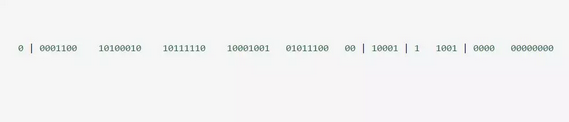

SnowFlake 算法，是 Twitter 开源的分布式 id 生成算法。其核心思想就是：使用一个 64 bit 的 long 型的数字作为全局唯一 id。这 64 个 bit 中，其中 1 个 bit 是不用的，然后用其中的 41 bit 作为毫秒数，用 10 bit 作为工作机器 id，12 bit 作为序列号。  
  

给大家举个例子吧，比如下面那个 64 bit 的 long 型数字：  

* 第一个部分，是 1 个 bit：0，这个是无意义的。
    因为二进制里第一个 bit 为如果是 1，那么都是负数，但是我们生成的 id 都是正数，所以第一个 bit 统一都是 0。

* 第二个部分是 41 个 bit：表示的是时间戳。
    41 bit 可以表示的数字多达 2^41 - 1，也就是可以标识 2 ^ 41 - 1 个毫秒值，换算成年就是表示 69 年的时间。

* 第三个部分是 5 个 bit：表示的是机房 id，10001。
* 第四个部分是 5 个 bit：表示的是机器 id，1 1001。
    但是 10 bit 里 5 个 bit 代表机房 id，5 个 bit 代表机器 id。意思就是最多代表 2 ^ 5 个机房（32 个机房），每个机房里可以代表 2 ^ 5 个机器（32 台机器）。

* 第五个部分是 12 个 bit：表示的序号，就是某个机房某台机器上这一毫秒内同时生成的 id 的序号，0000 00000000。  
    12 bit 可以代表的最大正整数是 2 ^ 12 - 1 = 4096，也就是说可以用这个 12 bit 代表的数字来区分同一个毫秒内的 4096 个不同的 id。简单来说，你的某个服务假设要生成一个全局唯一 id，那么就可以发送一个请求给部署了 SnowFlake 算法的系统，由这个 SnowFlake 算法系统来生成唯一 id。  

这个 SnowFlake 算法系统首先肯定是知道自己所在的机房和机器的，比如机房 id = 17，机器 id = 12。  

接着 SnowFlake 算法系统接收到这个请求之后，首先就会用二进制位运算的方式生成一个 64 bit 的 long 型 id，64 个 bit 中的第一个 bit 是无意义的。  

接着 41 个 bit，就可以用当前时间戳（单位到毫秒），然后接着 5 个 bit 设置上这个机房 id，还有 5 个 bit 设置上机器 id。  

最后再判断一下，当前这台机房的这台机器上这一毫秒内，这是第几个请求，给这次生成 id 的请求累加一个序号，作为最后的 12 个 bit。  

最终一个 64 个 bit 的 id 就出来了，类似于：  
  


这个算法可以保证说，一个机房的一台机器上，在同一毫秒内，生成了一个唯一的 id。可能一个毫秒内会生成多个 id，但是有最后 12 个 bit 的序号来区分开来。  

下面我们简单看看这个 SnowFlake 算法的一个代码实现，这就是个示例，大家如果理解了这个意思之后，以后可以自己尝试改造这个算法。  

总之就是用一个 64 bit 的数字中各个 bit 位来设置不同的标志位，区分每一个 id。  

```java
import java.util.ArrayList;
import java.util.HashMap;
import java.util.HashSet;
import java.util.List;
import java.util.Map;
import java.util.Set;
import java.util.concurrent.CountDownLatch;
import org.slf4j.Logger;
import org.slf4j.LoggerFactory;
import lombok.ToString;

/**   
* Copyright: Copyright (c) 2019 
* 
* @ClassName: IdWorker.java
* @Description: <p>SnowFlake 算法，是 Twitter 开源的分布式 id 生成算法。
* 					其核心思想就是：使用一个 64 bit 的 long 型的数字作为全局唯一 id。
* 					这 64 个 bit 中，其中 1 个 bit 是不用的，然后用其中的 41 bit 作为毫秒数，
* 					用 10 bit 作为工作机器 id，12 bit 作为序列号
*				</p>
* @version: v1.0.0
* @author: BianPeng
* @date: 2019年4月11日 下午3:13:41 
*
* Modification History:
* Date         		Author          Version          Description
*---------------------------------------------------------------*
* 2019年4月11日      		BianPeng        v1.0.0           initialize
*/
@ToString
public class SnowflakeIdFactory {
 
	static Logger log = LoggerFactory.getLogger(SnowflakeIdFactory.class);
	
    private final long twepoch = 1288834974657L;
    private final long workerIdBits = 5L;
    private final long datacenterIdBits = 5L;
    private final long maxWorkerId = -1L ^ (-1L << workerIdBits);
    private final long maxDatacenterId = -1L ^ (-1L << datacenterIdBits);
    private final long sequenceBits = 12L;
    private final long workerIdShift = sequenceBits;
    private final long datacenterIdShift = sequenceBits + workerIdBits;
    private final long timestampLeftShift = sequenceBits + workerIdBits + datacenterIdBits;
    private final long sequenceMask = -1L ^ (-1L << sequenceBits);
 
    private long workerId;
    private long datacenterId;
    private long sequence = 0L;
    private long lastTimestamp = -1L;
 
 
 
    public SnowflakeIdFactory(long workerId, long datacenterId) {
        if (workerId > maxWorkerId || workerId < 0) {
            throw new IllegalArgumentException(String.format("worker Id can't be greater than %d or less than 0", maxWorkerId));
        }
        if (datacenterId > maxDatacenterId || datacenterId < 0) {
            throw new IllegalArgumentException(String.format("datacenter Id can't be greater than %d or less than 0", maxDatacenterId));
        }
        this.workerId = workerId;
        this.datacenterId = datacenterId;
    }
 
    public synchronized long nextId() {
        long timestamp = timeGen();
        if (timestamp < lastTimestamp) {
            //服务器时钟被调整了,ID生成器停止服务.
            throw new RuntimeException(String.format("Clock moved backwards.  Refusing to generate id for %d milliseconds", lastTimestamp - timestamp));
        }
        if (lastTimestamp == timestamp) {
            sequence = (sequence + 1) & sequenceMask;
            if (sequence == 0) {
                timestamp = tilNextMillis(lastTimestamp);
            }
        } else {
            sequence = 0L;
        }
 
        lastTimestamp = timestamp;
        return ((timestamp - twepoch) << timestampLeftShift) | (datacenterId << datacenterIdShift) | (workerId << workerIdShift) | sequence;
    }
 
    protected long tilNextMillis(long lastTimestamp) {
        long timestamp = timeGen();
        while (timestamp <= lastTimestamp) {
            timestamp = timeGen();
        }
        return timestamp;
    }
 
    protected long timeGen() {
        return System.currentTimeMillis();
    }
 
    public static void testProductIdByMoreThread(int dataCenterId, int workerId, int n) throws InterruptedException {
        List<Thread> tlist = new ArrayList<>();
        Set<Long> setAll = new HashSet<>();
        CountDownLatch cdLatch = new CountDownLatch(10);
        long start = System.currentTimeMillis();
        int threadNo = dataCenterId;
        Map<String,SnowflakeIdFactory> idFactories = new HashMap<>();
        for(int i=0;i<10;i++){
            //用线程名称做map key.
            idFactories.put("snowflake"+i,new SnowflakeIdFactory(workerId, threadNo++));
        }
        for(int i=0;i<10;i++){
            Thread temp =new Thread(new Runnable() {
                @Override
                public void run() {
                    Set<Long> setId = new HashSet<>();
                    SnowflakeIdFactory idWorker = idFactories.get(Thread.currentThread().getName());
                    for(int j=0;j<n;j++){
                        setId.add(idWorker.nextId());
                    }
                    synchronized (setAll){
                        setAll.addAll(setId);
                        log.info("{}生产了{}个id,并成功加入到setAll中.",Thread.currentThread().getName(),n);
                    }
                    cdLatch.countDown();
                }
            },"snowflake"+i);
            tlist.add(temp);
        }
        for(int j=0;j<10;j++){
            tlist.get(j).start();
        }
        cdLatch.await();
 
        long end1 = System.currentTimeMillis() - start;
 
        log.info("共耗时:{}毫秒,预期应该生产{}个id, 实际合并总计生成ID个数:{}",end1,10*n,setAll.size());
 
    }
 
    public static void testProductId(int dataCenterId, int workerId, int n){
        SnowflakeIdFactory idWorker = new SnowflakeIdFactory(workerId, dataCenterId);
        SnowflakeIdFactory idWorker2 = new SnowflakeIdFactory(workerId+1, dataCenterId);
        Set<Long> setOne = new HashSet<>();
        Set<Long> setTow = new HashSet<>();
        long start = System.currentTimeMillis();
        for (int i = 0; i < n; i++) {
            setOne.add(idWorker.nextId());//加入set
        }
        long end1 = System.currentTimeMillis() - start;
        log.info("第一批ID预计生成{}个,实际生成{}个<<<<*>>>>共耗时:{}",n,setOne.size(),end1);
 
        for (int i = 0; i < n; i++) {
            setTow.add(idWorker2.nextId());//加入set
        }
        long end2 = System.currentTimeMillis() - start;
        log.info("第二批ID预计生成{}个,实际生成{}个<<<<*>>>>共耗时:{}",n,setTow.size(),end2);
 
        setOne.addAll(setTow);
        log.info("合并总计生成ID个数:{}",setOne.size());
 
    }
 
    public static void testPerSecondProductIdNums(){
        SnowflakeIdFactory idWorker = new SnowflakeIdFactory(1, 2);
        long start = System.currentTimeMillis();
        int count = 0;
        for (int i = 0; System.currentTimeMillis()-start<1000; i++,count=i) {
            /**  测试方法一: 此用法纯粹的生产ID,每秒生产ID个数为400w+ */
        	//idWorker.nextId();
            /**  测试方法二: 在log中打印,同时获取ID,此用法生产ID的能力受限于log.error()的吞吐能力.
             * 每秒徘徊在10万左右. */
        	log.info(""+idWorker.nextId());
        }
        long end = System.currentTimeMillis()-start;
        System.out.println(end);
        System.out.println(count);
    }
 
    public static void main(String[] args) {
        /** case1: 测试每秒生产id个数?
         *   结论: 每秒生产id个数400w+ 
         */
        //testPerSecondProductIdNums();
 
        /** case2: 单线程-测试多个生产者同时生产N个id,验证id是否有重复?
         *   结论: 验证通过,没有重复. 
         */
        //testProductId(1,2,10000);//验证通过!
        //testProductId(1,2,20000);//验证通过!
 
        /** case3: 多线程-测试多个生产者同时生产N个id, 全部id在全局范围内是否会重复?
         *   结论: 验证通过,没有重复.
         */
        try {
            testProductIdByMoreThread(1,2,100000);//单机测试此场景,性能损失至少折半!
        } catch (InterruptedException e) {
            e.printStackTrace();
        }
 
    }
}
```

这个算法也叫雪花算法我使用的类源码：  
https://gitee.com/flying-cattle/earn_knife/blob/master/item-common/src/main/java/com/item/util/SnowflakeIdWorker.java  

项目是一个递进的过程:
1. 优先考虑缓存
2. 其次读写分离
3. 再分表分库  
  
  当然这只是个人想法，各位伙伴还是根据自己的项目和业务来综合考虑实行方案。