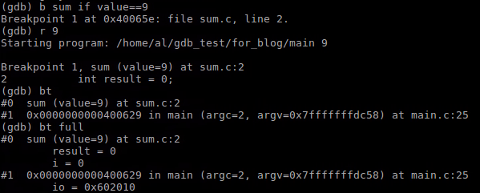
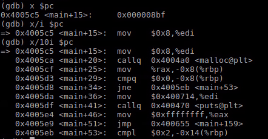
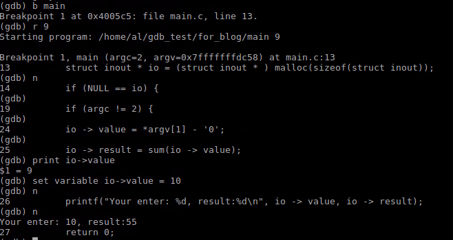
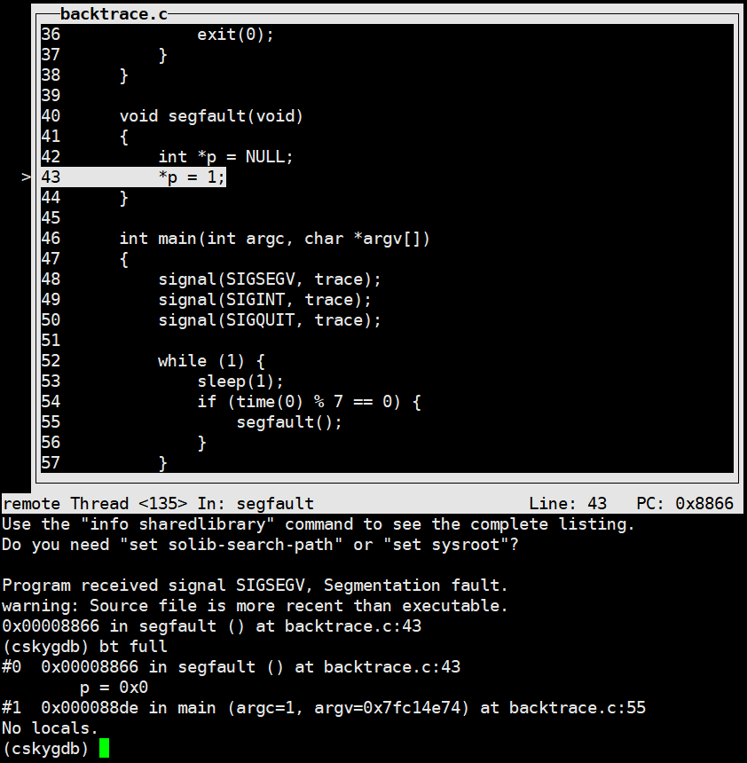
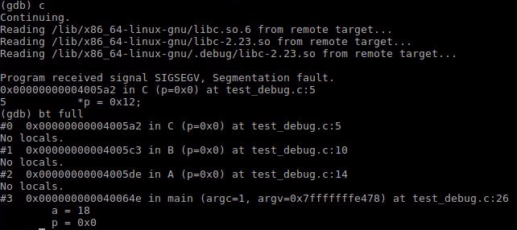

GDB调试的三种方式：  

1. 目标板直接使用GDB进行调试。
2. 目标板使用gdbserver，主机使用xxx-linux-gdb作为客户端。
3. 目标板使用ulimit -c unlimited，生成core文件；然后主机使用xxx-linux-gdb ./test ./core。  

Brendan Gregg关于gdb介绍《[gdb Debugging Full Example (Tutorial): ncurses](http://www.brendangregg.com/blog/2016-08-09/gdb-example-ncurses.html)》。  


#### 1. gdb调试  
构造测试程序如下main.c和sum.c如下:  

```c
////main.c:
#include <stdio.h>
#include <stdlib.h>
 
extern int sum(int value);
 
struct inout {
    int value;
    int result;
};

int main(int argc, char * argv[])
{
    struct inout * io = (struct inout * ) malloc(sizeof(struct inout));
    if (NULL == io) {
        printf("Malloc failed.\n");
        return -1;
    }

    if (argc != 2) {
        printf("Wrong para!\n");
        return -1;
    }

    io -> value = *argv[1] - '0';
    io -> result = sum(io -> value);
    printf("Your enter: %d, result:%d\n", io -> value, io -> result);
    return 0;
}

////sum.c:
int sum(int value) {
    int result = 0;
    int i = 0;
    for (i = 0; i < value; i++)
        result += (i + 1);
    return result;
}
```

```console
gcc main.c sum.c -o main -g #得到main可执行文件.
```

下面介绍了gdb大部分功能,，`1.1 设置断点`以及` 1.3显示栈帧`是常用功能；调试过程中可以需要`1.6 单步执行`，并且`1.4 显示变量`、`1.5显示寄存器`、`1.8 监视点`、`1.9 改变变量的值`。  

如果进程已经运行中，需要`1.11 attach`到进程，或者`1.10 生成转储文件`进行分析。当然为了提高效率可以自定义`1.13 初始化文件`。  


##### 1.1 设置断点  

```console
#设置断点可以通过b或者break设置断点，断点的设置可以通过函数名、行号、文件名+函数名、文件名+行号以及偏移量、地址等进行设置。格式为：

break 函数名
break 行号
break 文件名:函数名
break 文件名:行号
break +偏移量
break -偏移量
break *地址
```

查看断点，通过`info break`查看断点列表。  
  

```console
#删除断点通过命令包括：
delete <断点id>：删除指定断点
delete：删除所有断点
clear
clear 函数名
clear 行号
clear 文件名：行号
clear 文件名：函数名
```
  

```console
#断点还可以条件断住:
break 断点 if 条件；比如break sum if value==9，当输入的value为9的时候才会断住。
condition 断点编号：给指定断点删除触发条件
condition 断点编号 条件：给指定断点添加触发条件
```
如下可以看出，当入参为9的时候被断住，而入参为8的时候运行到结束。  
  

```console
#断点还可以通过disable/enable临时停用启用。
disable
disable 断点编号
disable display 显示编号
disable mem 内存区域

enable
enable 断点编号
enable once 断点编号：该断点只启用一次，程序运行到该断点并暂停后，该断点即被禁用。
enable delete 断点编号
enable display 显示编号
enable mem 内存区域
```

###### 1.1.1 断点commands高级功能  
大多数时候需要在断点处执行一系列动作，gdb提供了在断点处执行命令的高级功能`commands`。  

```c
#include <stdio.h>

int total = 0;
int square(int i)
{
    int result=0;
    result = i*i;
    return result;
}

int main(int argc, char **argv)
{
    int i;
    for(i=0; i<10; i++)
    {
        total += square(i);
    }
    return 0;
}
```
比如需要对如上程序square参数i为5的时候断点，并在此时打印栈、局部变量以及total的值,编写gdb.init如下：  

```gdb
set logging on gdb.log

b square if i == 5
commands
  bt full
  i locals
  p total
  print "Hit break when i == 5"
end
```
在gdb shell中source gdb.init，然后r执行命令，结果如下：  
  
可以看出断点在i==5的时候断住了，并且此时打印了正确的值。  

##### 1.2 运行  
`gdb 命令`之后，run可以在gdb下运行命令；如果命令需要参数则跟在run之后。  
  

如果需要断点在`main()`处，直接执行`start`就可以。  
  

##### 1.3 显示栈帧  
如果遇到断点而暂停执行，或者coredump可以显示栈帧。  
通过`bt`可以显示栈帧，`bt full`可以显示局部变量。  
  

```console
#命令格式如下：
bt
bt full：不仅显示backtrace，还显示局部变量
bt N：显示开头N个栈帧
bt full N
```

##### 1.4 显示变量  
`print 变量`可以显示变量内容。  
  
如果需要一行监控多个变量，可以通过`p {var1, var2, var3}`。  
如果要跟踪自动显示，可以使用`display {var1, var2, var3}`  

##### 1.5 显示寄存器  
`info reg`可以显示寄存器内容。  
  
在寄存器名之前加`$`可以显示寄存器内容，  
```console
p $寄存器：显示寄存器内容
p/x $寄存器：十六进制显示寄存器内容。
```
  

用x命令可以显示内容内容， `x/格式 地址`。  
```console
x $pc：显示程序指针内容
x/i $pc：显示程序指针汇编。
x/10i $pc：显示程序指针之后10条指令。
x/128wx 0xfc207000：从0xfc20700开始以16进制打印128个word。
```
  

还可以通过`disassemble`指令来反汇编。  
```console
disassemble
disassemble 程序计数器 ：反汇编pc所在函数的整个函数。
disassemble addr-0x40,addr+0x40：反汇编addr前后0x40大小。
```

##### 1.6 单步执行  
单步执行有两个命令next和step，两者的区别是next遇到函数不会进入函数内部，step会执行到函数内部。  
如果需要逐条汇编指令执行，可以分别使用nexti和stepi。  

##### 1.7 继续执行  
调试时，使用continue命令继续执行程序。程序遇到断电后再次暂停执行；如果没有断点，就会一直执行到结束。  
```console
continue：继续执行
continue 次数：继续执行一定次数。
```

##### 1.8 监视点  
要想找到变量在何处被改变，可以使用watch命令设置监视点watchpoint。  
```console
watch <表达式>：表达式发生变化时暂停运行
awatch <表达式>：表达式被访问、改变是暂停执行
rwatch <表达式>：表达式被访问时暂停执行
```
  
其他变种还包括`watch expr [thread thread-id] [mask maskvalue]`，其中mask需要架构支持。  
GDB不能监控一个常量，比如`watch 0x600850`报错。  
但是可以`watch *(int *)0x600850`。  

##### 1.9 改变变量的值  
通过`set variable <变量>=<表达式>` 来修改变量的值。  
  
`set $r0=xxx：设置r0寄存器的值为xxx。`  

##### 1.10 生成内核转储文件  
通过`generate-core-file`生成`core.xxxx`转储文件。  
然后`gdb ./main ./core.xxxx`查看恢复的现场。  
  
另一命令`gcore`可以从`命令行`直接生成内核转储文件。  
```console
gcore `pidof 命令`：无需停止正在执行的程序已获得转储文件。
```

##### 1.11 attach到进程  
如果程序已经运行，或者是调试陷入死循环而无法返回控制台进程，可以使用attach命令。  
```console
attach pid
```
通过`ps aux`可以查看进程的pid，然后使用`bt`查看栈帧。  
以top为例操作步骤为：  
```console
1. ps -aux查看进程pid，为16974.
2. sudo gdb attach 16974，使用gdb 附着到top命令。
3. 使用bt full查看，当前栈帧。此时使用print等查看信息。
4. 还可以通过info proc查看进程信息。
```

##### 1.12 反复执行  
continue、step、stepi、next、nexti都可以指定重复执行的次数。  
ignore 断点编号 次数：可以忽略指定次数断点。  

##### 1.13 初始化文件  
Linux环境下初始化文件为`.gdbinit`。  
如果存在`.gdbinit`文件，gdb在启动的之前就将其作为命令文件运行。  
初始化文件和命令文件执行顺序为：`HOME/.gdbinit > 运行命令行选项 > ./.gdbinit > -x指定命令文件`。  

##### 1.14 设置源码目录  
调试过程中如果需要关联到源码，查看更详细的信息。  
可以通过`directory`或者`set substitute-path`来制定源码目录。  

##### 1.15 TUI调试  
TUI（TextUser Interface）为GDB调试的文本用户界面，可以方便地显示源代码、汇编和寄存器文本窗口。  
源代码窗口和汇编窗口会高亮显示程序运行位置并以'>'符号标记。有两个特殊标记用于标识断点，  
第一个标记用于标识断点类型：  
B：程序至少有一次运行到了该断点  
b：程序没有运行到过该断点  
H：程序至少有一次运行到了该硬件断点  
h：程序没有运行到过该硬件断点     

第二个标记用于标识断点使能与否:  
+：断点使能Breakpointis enabled.  
-：断点被禁用Breakpointis disabled.  
当调试程序时，源代码窗口、汇编窗口和寄存器窗口的内容会自动更新。  
  
  

##### 1.16 Catchpoint  
catch可以根据某些类型事件来停止程序执行。  
可以通过catch syscall close，捕捉产生系统调用close的时候停止程序执行。  
其他的catch事件还包括，throw、syscall、assert、exception等等。  

##### 1.17 自定义脚本  
命令行的入参可以通过argc和*argv获取  
###### 1.17.0 注释、赋值、显示  
```console
# - 为脚本添加注释
set - 为变量赋值，以$开头，以便区分gdb还是调试程序变量。
例如：set $x = 1
显示变量可以通过echo、printf。
```

###### 1.17.1自定义命令  
利用`define`命令可以自行定义命令，还可以使用`document`命令给自定义命令添加说明。  
```gdb
define adder
  if $argc == 2
    print $arg0 + $arg1
  end
  if $argc == 3
    print $arg0 + $arg1 + $arg2
  end
end

document adder
  Sum two or three variables.
end
```
执行bf自定义命令，结果如下。  
  
无行参声明，但可以直接用$arg0,$arg1引用， $argc 为形参个数  

###### 1.17.2 条件语句  
条件命令：if...else...end。这个同其它语言中提供的if命令没什么区别，只是注意结尾的end。  

###### 1.17.3 循环语句  
循环命令：while...end。gdb同样提供了loop_break和loop_continue命令分别对应其它语言中的break和continue，另外同样注意结尾的end。  
```gdb
set logging on overwrite gdb.log------------将显示log保存到gdb.log中。
set pagination off--------------------------关闭分页显示功能。

tar jtag jtag://localhost:1025--------------连接上JTAG。

d-------------------------------------------删除现有断点。

b func_a------------------------------------在func_a增加断点。
commands------------------------------------断点后，执行如下命令。
  b func_b----------------------------------在func_a断点之后，在func_b增加断点。
    commands
      bt full-------------------------------打印func_b处栈帧。
      c-------------------------------------继续执行。
    end
  b file.c:555------------------------------在file.c的555行增加断点
    commands
      while 1-------------------------------无限执行next命令。
        next
      end
    end
  c-----------------------------------------继续执行，才会触发func_b和file.c:555断点。
end

c-------------------------------------------是程序得到继续执行。
```
在命令行`gdb -x gdb.init bin`；或者`gdb bin`，然后在命令行`soruce gdb.init`同样可以更新脚本。  


##### 1.18 dump内存到指定文件  
在gdb调试中可能需要将一段内存导出到文件中，可以借助`dump`命令。命令格式：  
```console
dump binary memory FILE START STOP
#比如
dump binary memory ./dump.bin 0x0 0x008000000，将内存区间从0x0到0x00800000导出到dump.bin中。
```

#### 2. gdb+gdbserver远程调试  
目标板gdbserver+主机gdb远程调试的方式，比较适合目标板性能受限，只能提供gdbserver功能。  
在主机上执行gdb进行远程调试。测试程序如下。  

```c
#include <stdio.h>

void C(int *p)
{
    *p = 0x12;
}

void B(int *p)
{
    C(p);
}
void A(int *p)
{
    B(p);
}
void A2(int *p)
{
    C(p);
}
int main(int argc, char **argv)
{
    int a;
    int *p = NULL;
    A2(&a);  // A2 > C
    printf("a = 0x%x\n", a);
    A(p);    // A > B > C
    return 0;
}
```

对目标板的设置方式是：开启端口2345作为gdbserver铜线端口。  
```console
gdbserver :2345 test_debug
```
  
主机上执行`gdb test_debug`，然后`tar remote 192.168.2.84:2345`连接远程gdbserver。  
目标板会收到`Remote debugging from host 192.168.33.77`消息，表示两者连接成功。  
  
主机上就可以进行远程调试，continue之后两端得到的结果如下：  
目标板输出`a=0x12`之后停止运行:` a = 0x12`.  
主机上得到SIGSEGV，并可以查看backtrace信息。可以看出问题点在指针p指向NULL，0指针赋值错误。  
  

#### 3. 通过core+gdb离线分析  
在目标板上执行`ulimit -c unlimited`，执行应用程序。  
程序出错后，会在当前目录下生成core文件。  
将core文件拷出后，再PC上执行`xxx-linux-gdb ./test ./core`进行分析。  

##### 3.1 加载库文件  
在运行`xxx-linux-gdb ./test ./core`之后，可能存在库文件关联不上的情况。  
使用`info sharedlibrary`，查看库加载情况。  
```console
From        To          Syms Read   Shared Object Library
                        No          xxx.so
                        No          /lib/libdl.so.2
                        No          /lib/libpthread.so.0
0x2ab6ec00  0x2ac09ba4  Yes         xxx/lib/libstdc++.so.6
                        No          /lib/libm.so.6
0x2acec460  0x2acf626c  Yes         xxx/lib/libgcc_s.so.1
                        No          /lib/libc.so.6
                        No          /lib/ld.so.1
```

可以通过`set solib-search-path`和`set solib-absolute-prefix`来设置，对应库所在的路径。  
```console
From        To          Syms Read   Shared Object Library
0x2aaca050  0x2aacc8d0  Yes         xxx.so
0x2aad0ad0  0x2aad17ac  Yes (*)     xxx/lib/libdl.so.2
0x2aad8a50  0x2aae7434  Yes (*)     xxx/lib/libpthread.so.0
0x2ab6ec00  0x2ac09ba4  Yes         xxx/lib/libstdc++.so.6
0x2ac4b3d0  0x2acb1988  Yes         xxx/lib/libm.so.6
0x2acec460  0x2acf626c  Yes         xxx/lib/libgcc_s.so.1
0x2ad17b80  0x2adf699e  Yes         xxx/lib/libc.so.6
0x2aaa89e0  0x2aabf66c  Yes (*)     xxx/lib/ld.so.1
(*): Shared library is missing debugging information.
```
可以看出相关库文件都已经加载，只是部分库文件没有调试信息。  

##### 3.2 查看backtrace  
查看coredump的backtrace通过bt即可，更全的信息通过bt full。查看函数调用栈的几个函数  
```console
bt：显示所有的函数调用栈帧的信息，每个帧一行。
bt n：显示栈定的n个帧信息。
bt -n：显示栈底的n个帧信息。
bt full：显示栈中所有帧的完全信息如：函数参数，本地变量。
bt full n：用法同上。
bt full -n
```

```console
(gdb) bt
#0  0x2ad71f1e in memcpy () from xxx/lib/libc.so.6
#1  0x2ad71ac0 in memmove () from xxx/lib/libc.so.6
#2  0x0011f36c in std::__copy_move<false, true, std::random_access_iterator_tag>::__copy_m<unsigned char> (__first=0x34dfb008 "\377\330\377", <incomplete sequence \340>, __last=0x34eeea2c "", 
    ...
#3  0x0011ee22 in std::__copy_move_a<false, unsigned char*, unsigned char*> (__first=0x34dfb008 "\377\330\377", <incomplete sequence \340>, __last=0x34eeea2c "", __result=0x2b2013c0 "\377\330\377", <incomplete sequence \340>)
    at xxxinclude/c++/6.3.0/bits/stl_algobase.h:386
#4  0x0011e7e2 in std::__copy_move_a2<false, __gnu_cxx::__normal_iterator<unsigned char*, std::vector<unsigned char> >, unsigned char*> (__first=..., __last=..., __result=0x2b2013c0 "\377\330\377", <incomplete sequence \340>)
    at xxx/bits/stl_algobase.h:424
#5  0x0011dfd2 in std::copy<__gnu_cxx::__normal_iterator<unsigned char*, std::vector<unsigned char> >, unsigned char*> (__first=..., __last=..., __result=0x2b2013c0 "\377\330\377", <incomplete sequence \340>)
    at xxx/6.3.0/bits/stl_algobase.h:456
#6  0x0011c948 in xxx
#7  0x00133e08 in xxx
#8  0x2aada31e in start_thread () from xxx/libc/lib/libpthread.so.0
#9  0x005a11b4 in ?? ()
```

##### 3.3 CoreDump核心转存储文件目录和命名规则  
默认情况下core文件存在应用当前路径下，为了区分可以进行设置。  
区分core主要通过`/proc/sys/kernel/core_uses_pid`和`/proc/sys/kernel/core_pattern`进行设置。  
`/proc/sys/kernel/core_uses_pid`：可以控制产生的core文件的文件名中是否添加pid作为扩展，如果添加则文件内容为1，否则为0。  
`/proc/sys/kernel/core_pattern`：可以设置格式化的core文件保存位置或文件名，比如原来文件内容是`core-%e`  
`echo "/tmp/core-%e-%p" > core_pattern`将会控制所产生的core文件会存放到/corefile目录下，产生的文件名为`core-命令名-pid-时间戳`  
```console
#以下是参数列表:
    %p - insert pid into filename 添加pid
    %u - insert current uid into filename 添加当前uid
    %g - insert current gid into filename 添加当前gid
    %s - insert signal that caused the coredump into the filename 添加导致产生core的信号
    %t - insert UNIX time that the coredump occurred into filename 添加core文件生成时的unix时间
    %h - insert hostname where the coredump happened into filename 添加主机名
    %e - insert coredumping executable name into filename 添加命令名

#当然，你可以用下列方式来完成：
sysctl -w kernel.core_pattern=/tmp/core-%e-%p
```

##### 3.4 ulimit的使用  
```console
#功能说明：控制shell程序的资源。
#语　　法：ulimit [-aHS][-c <core文件上限>][-d <数据节区大小>][-f <文件大小>][-m <内存大小>][-n <文件数目>][-p <缓冲区大小>][-s <堆叠大小>][-t <CPU时间>][-u <程序数目>][-v <虚拟内存大小>]
#补充说明：ulimit为shell内建指令，可用来控制shell执行程序的资源。
参　　数：
   -a 　显示目前资源限制的设定。 
   -c <core文件上限> 　设定core文件的最大值，单位为区块。 
   -d <数据节区大小> 　程序数据节区的最大值，单位为KB。 
   -f <文件大小> 　shell所能建立的最大文件，单位为区块。 
   -H 　设定资源的硬性限制，也就是管理员所设下的限制。 
   -m <内存大小> 　指定可使用内存的上限，单位为KB。 
   -n <文件数目> 　指定同一时间最多可开启的文件数。 
   -p <缓冲区大小> 　指定管道缓冲区的大小，单位512字节。 
   -s <堆叠大小> 　指定堆叠的上限，单位为KB。 
   -S 　设定资源的弹性限制。 
   -t <CPU时间> 　指定CPU使用时间的上限，单位为秒。 
   -u <程序数目> 　用户最多可开启的程序数目。 
   -v <虚拟内存大小> 　指定可使用的虚拟内存上限，单位为KB。
```

#### 4. GDB小技巧  
##### 4.1 关闭 `Type <return> to continue, or q <return> to quit---`  
当现实内容多的时候，GDB会强制分页，现实就会暂停。但是可能并不需要，可以通过`set pagination off`关闭。  

##### 4.2 附着到已运行kernel  
在已运行的Linux上，如果发生死机异常等问题，这时候定位问题需要使用jtag连接上。  
连接方法是：  

```console
gdb-----------------------------------------------进入gdb shell。
target remote localhost:1025-------------------在gdb shell中通过ip:port连接上target。
file vmlinux----------------------------------------加载符号表。
```
然后就可以在线查看运行状态了。  


#### 参考文档：  

1. [Linux环境下段错误的产生原因及调试方法小结](https://www.cnblogs.com/panfeng412/archive/2011/11/06/segmentation-fault-in-linux.html)
2. [linux应用调试技术之GDB和GDBServer](https://www.cnblogs.com/veryStrong/p/6240769.html)
3. [gdbServer + gdb 调试](https://www.cnblogs.com/Dennis-mi/articles/5018745.html)