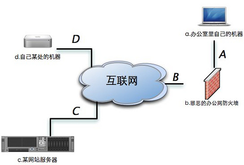
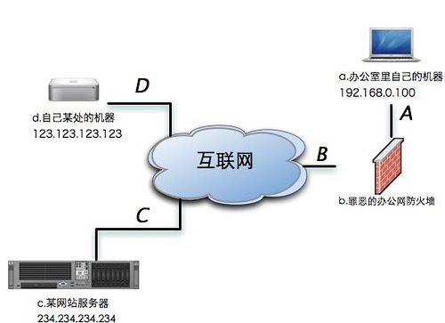

#### 什么是SSH隧道  
首 先看下面这张图，我们所面临的大部分情况都和它类似。我们的电脑在左上角，通过公司带有防火墙功能的路由器接入互联网（当然可能还有交换机什么的在中间连 接着你和路由器，但是在我们的问题中交换机并不起到什么关键性的作用）。左下脚的部分是一个网站的服务器，它是我们公司防火墙策略的一部分，也就是说公司 不希望我们访问这个服务器。在左上还有一台机器，它也是属于我们的。但是这台机器并不在我们公司里面，换句话说他不受到公司防火墙的限制。最后也是最重 要的一点是，我们能够在公司通过互联网直接访问这台机器。或者说这台位于公司防火墙外面的机器需要拥有一个独立的互联网IP，同时公司的防火墙规则不会屏 蔽这台机器，并且这台机器运行着一个OpenSSH服务器。  
  

现 在，我们清楚地知道了自己所处的网络环境。并且不难理解我们在公司无法访问那个服务器的原因是：线路A-B-C上A-B之间的防火墙屏蔽了对那个服务器的 访问。与此同时，我们也很快注意到，线路A-B-D之间、D-C之间是不受阻碍的。相信你已经想到了，在A-B之间的防火墙不会屏蔽对机器d的访问。因此 我们可以通过机器d建立一个通道A-B-D-C，从而访问到机器c上的数据。  

这条通道可以用很多技术来建立，这里我们仅仅介绍如何使用SSH服务器来建立这样一个通道－他被称为SSH隧道。  

#### 一、如何建立本地SSH隧道  
在我们计划建立一个本地SSH隧道之前，我们必须清楚下面这些数据：  

1. 中间服务器d的IP地址
2. 要访问服务器c的IP地址
3. 要访问服务器c的端口  

现在，我们把上面这张图变得具体一些，给这些机器加上IP地址。并且根据下面这张图列出我们的计划：  
  

1. 需要访问234.234.234.234的FTP服务，也就是端口21
2. 中间服务器是123.123.123.123  

现在我们使用下面这条命令来达成我们的目的  

```console
ssh -N -f -L 2121:234.234.234.234:21 123.123.123.123
ftp localhost:2121 # 现在访问本地2121端口，就能连接234.234.234.234的21端口了
```
这里我们用到了SSH客户端的三个参数，下面我们一一做出解释：  

* -N 告诉SSH客户端，这个连接不需要执行任何命令。仅仅做端口转发
* -f 告诉SSH客户端在后台运行
* -L 做本地映射端口，被冒号分割的三个部分含义分别是最后一个参数是我们用来建立隧道的中间机器的IP地址(IP: 123.123.123.123)
    * 需要使用的本地端口号
    * 需要访问的目标机器IP地址（IP: 234.234.234.234）
    * 需要访问的目标机器端口（端口: 21)  

我们再重复一下-L参数的行为。-L X:Y:Z的含义是，将IP为Y的机器的Z端口通过中间服务器映射到本地机器的X端口。  
在这条命令成功执行之后，我们已经具有绕过公司防火墙的能力，并且成功访问到了我们喜欢的一个FTP服务器了。  


#### 二、如何建立远程SSH隧道  
通 过建立本地SSH隧道，我们成功地绕过防火墙开始下载FTP上的资源了。那么当我们在家里的时候想要察看下载进度怎么办呢？大多数公司的网络是通过路由器 接入互联网的，公司内部的机器不会直接与互联网连接，也就是不能通过互联网直接访问。通过线路D-B-A访问公司里的机器a便是不可能的。也许你已经注意 到了，虽然D-B-A这个方向的连接不通，但是A-B-D这个方向的连接是没有问题的。那么，我们能否利用一条已经连接好的A-B-D方向的连接来完成 D-B-A方向的访问呢？答案是肯定的，这就是远程SSH隧道的用途。  

与本地SSH一样，我们在建立远程SSH隧道之前要清楚下面几个参数：  

* 需要访问内部机器的远程机器的IP地址（这里是123.123.123.123）
* 需要让远程机器能访问的内部机器的IP地址(这里因为是想把本机映射出去，因此IP是127.0.0.1)
* 需要让远程机器能访问的内部机器的端口号(端口:22)

在清楚了上面的参数后，我们使用下面的命令来建立一个远程SSH隧道，在192.168.0.100的主机上执行下面的命令：  
```console
ssh -Nf -R 2222:127.0.0.1:22 123.123.123.123
```
现在，在IP是123.123.123.123的机器上我们用下面的命令就可以登陆公司的IP是192.168.0.100的机器了。  
```console
ssh -p 2222 localhost
```
-N，-f 这两个参数我们已经在本地SSH隧道中介绍过了。我们现在重点说说参数-R。该参数的三个部分的含义分别是:  

* 远程机器使用的端口（2222）
* 需要映射的内部机器的IP地址(127.0.0.1)
* 需要映射的内部机器的端口(22)  

例如：-R X:Y:Z 就是把我们内部的Y机器的Z端口映射到远程机器的X端口上。  


#### 三、建立SSH隧道的几个技巧  

##### 自动重连  
隧道可能因为某些原因断开，例如：机器重启，长时间没有数据通信而被路由器切断等等。因此我们可以用程序控制隧道的重新连接，例如一个简单的循环或者使用 [djb’s daemontools](http://cr.yp.to/daemontools.html) . 不管用哪种方法，重连时都应避免因输入密码而卡死程序。关于如何安全的避免输入密码的方法，请参考我的[如何实现安全的免密码ssh登录](http://blog.jianingy.com/node/73) 。这里请注意，如果通过其他程序控制隧道连接，应当避免将SSH客户端放到后台执行，也就是去掉-f参数。  

##### 保持长时间连接  
有些路由器会把长时间没有通信的连接断开。SSH客户端的TCPKeepAlive选项可以避免这个问题的发生，默认情况下它是被开启的。如果它被关闭了，可以在ssh的命令上加上-o TCPKeepAlive=yes来开启。  

另一种方法是，去掉-N参数，加入一个定期能产生输出的命令。例如: top或者vmstat。下面给出一个这种方法的例子：  
```console
ssh -R 2222:localhost:22 123.123.123.123 "vmstat 30"
```

##### 检查隧道状态  
有些时候隧道会因为一些原因通信不畅而卡死，例如：由于传输数据量太大，被路由器带入stalled状态。这种时候，往往SSH客户端并不退出，而是卡死在 那里。一种应对方法是，使用SSH客户端的ServerAliveInterval和ServerAliveCountMax选项。 ServerAliveInterval会在隧道无通信后的一段设置好的时间后发送一个请求给服务器要求服务器响应。如果服务器在 ServerAliveCountMax次请求后都没能响应，那么SSH客户端就自动断开连接并退出，将控制权交给你的监控程序。这两个选项的设置方法分 别是在ssh时加入-o ServerAliveInterval=n和-o ServerAliveCountMax=m。其中n, m可以自行定义。  

##### 如何将端口绑定到外部地址上  
使用上面的方法，映射的端口只能绑定在127.0.0.1这个接口上。也就是说，只能被本机自己访问到。如何才能让其他机器访问这个端口呢？我们可以把这个 映射的端口绑定在0.0.0.0的接口上，方法是加上参数-b 0.0.0.0。同时还需要打开SSH服务器端的一个选项－GatewayPorts。默认情况下它应当是被打开的。如果被关闭的话，可以在/etc /sshd_config中修改GatewayPorts no为GatewayPorts yes来打开它。  

##### 如何寻找中间服务器  
如果你家里使用ADSL上网，多半你会比较幸运。一般的ADSL（例如 联通 的ADSL）都是有互联网地址的。你只需要在家里的路由器上一台装有OpenSSH server机器的SSH端口映射出去即可。同时一些提供SSH访问的虚拟主机也可以用于这一用途。例如： [Hostmonser](http://www.hostmonster.com/) 或者 [Dreamhost](http://www.dreamhost.com/) .  

#### 四、通过SSH隧道建立SOCKS服务器  
如果我们需要借助一台中间服务器访问很多资源，一个个映射显然不是高明的办法（事实上，高明确实没有用这个方法）。幸好，SSH客户端为我们提供了通过SSH隧道建立SOCKS服务器的功能。  
通过下面的命令我们可以建立一个通过123.123.123.123的SOCKS服务器。  

```console
ssh -N -f -D 1080 123.123.123 # 将端口绑定在127.0.0.1上
ssh -N -f -D 0.0.0.0:1080 123.123.123.123 # 将端口绑定在0.0.0.0上
```
通过SSH建立的SOCKS服务器使用的是SOCKS5协议，在为应用程序设置SOCKS代理的时候要特别注意。  

#### 五、总结  
至 此，我们已经对如何利用SSH隧道有一个基本的认识了。现在，文章开始时的那些问题应该迎刃而解了吧。这里要特别说一下，由于SSH隧道也使用了SSH加 密协议，因此是不会被防火墙上的内容过滤器监控到的。也就是说一切在隧道中传输的数据都是被加密的。当然，离开隧道后的数据还是会保持自己原有的样子，没 有加密的数据还是会被后续的路由设备监控到。  


#### PS:编者另注  
在大多数情况下，我们建立ssh隧道的时候，往往是想通过一台公网的主机或者是大家都可以访问的主机做跳转机，来访问内部或者外部不能直接访问的机器。所以一般像这种情况下，请将跳转机中的ssh服务器中的GatewayPorts设为yes  

1. 建立本地的ssh隧道时，可以指定本地主机的地址，如下：`ssh -Nf -L 192.168.0.100:2121:234.234.234.234:21 123.123.123.123`
那么本地局域网的任何机器访问192.168.0.100:2121都会自动被映射到234.234.234.234:21
2. 建立远程的ssh隧道时，可以指定公网的主机地址，不过一般情况是要访问内网的主机，所以这条命令应该在任何一台内网主机上执行，比如在192.168.0.102的主机上运行：`ssh -Nf -R 123.123.123.123:2222:192.168.0.100:22 123.123.123.123`  
 只要在局域网里192.168.0.102可以直接连接内网主机192.168.0.100，且192.168.0.102可以直接与公网主机123.123.123.123建立ssh连接。那么任何外网主机通过访问公网主机123.123.123.123:2222就会被连接到192.168.0.100:22，从而可以完成外网穿越NAT到内网的访问，而不需要在内网网关和路由器上做任何操作。  
 

另外，你也可以通过Xshell、Putty等工具来实现linux主机与本地windows的端口转发、socket代理，还有一些像ProxyChains 工具的使用。  
