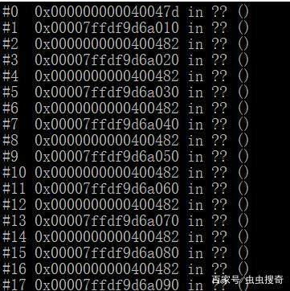
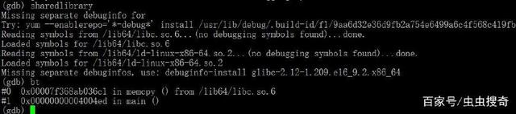
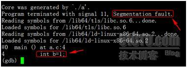
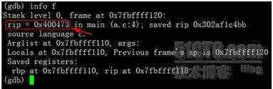
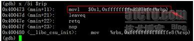
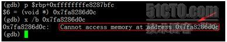
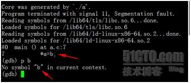
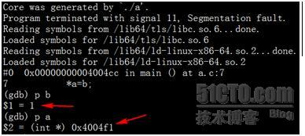

#### 开启core dump文件功能  

##### 设置core文件大小  
    
**列出所有资源的限制：** `ulimit -a`  

**设置core文件大小：** `ulimit -c fileSize`  

**注意：**  

尽量将这个文件大小设置得大一些，程序崩溃时生成Core文件大小即为程序运行时占用的内存大小。可能发生堆栈溢出的时候，占用更大的内存  

##### 设置core文件的名称和文件路径  

默认生成路径：输入可执行文件运行命令的同一路径下  

默认生成名字：默认命名为core。新的core文件会覆盖旧的core文件  

* 设置pid作为文件扩展名    
   * 1：添加pid作为扩展名，生成的core文件名称为core.pid
   * 0：不添加pid作为扩展名，生成的core文件名称为core  

```console
 echo "1" > /proc/sys/kernel/core_uses_pid
 #或者
 sysctl -w kernel.core_uses_pid=1 kernel.core_uses_pid = 1
```

##### 控制core文件保存位置和文件名格式  

```console
echo "/corefile/core-%e-%p-%t" > /proc/sys/kernel/core_pattern
#或者
sysctl -w kernel.core_pattern=/corefile/core-%e-%p-%t kernel.core_pattern = /corefile/core-%e-%p-%t
#可以将core文件统一生成到/corefile目录下，产生的文件名为core-命令名-pid-时间戳
```
以下是参数列表:  

| 占位符 |                                         描述                                         |
| ----- | ------------------------------------------------------------------------------------ |
| %p    | insert pid into filename 添加pid(进程id)                                              |
| %u    | insert current uid into filename 添加当前uid(用户id)                                  |
| %g    | insert current gid into filename 添加当前gid(用户组id)                                |
| %s    | insert signal that caused the coredump into the filename 添加导致产生core的信号        |
| %t    | insert UNIX time that the coredump occurred into filename 添加core文件生成时的unix时间 |
| %h    | insert hostname where the coredump happened into filename 添加主机名                  |
| %e    | insert coredumping executable name into filename 添加导致产生core的命令名              |  

##### 测试是否能生成core文件  

```console
kill -s SIGSEGV $$
##查看/corefile目录下是否生成了core文件
```

##### 程序中开启core dump  

```c
#include <sys/resource.h>
int getrlimit(int resource, struct rlimit *rlim);
int setrlimit(int resource, const struct rlimit *rlim);
```
示例程序

```c
#include <unistd.h>
#include <sys/time.h>
#include <sys/resource.h>
#include <stdio.h>
#define CORE_SIZE   1024 * 1024 * 500
int main()
{
    struct rlimit rlmt;
    if (getrlimit(RLIMIT_CORE, &rlmt) == -1) {
        return -1; 
    }   
    printf("Before set rlimit CORE dump current is:%d, max is:%d\n", (int)rlmt.rlim_cur, (int)rlmt.rlim_max);

    rlmt.rlim_cur = (rlim_t)CORE_SIZE;
    rlmt.rlim_max  = (rlim_t)CORE_SIZE;

    if (setrlimit(RLIMIT_CORE, &rlmt) == -1) {
        return -1; 
    }   

    if (getrlimit(RLIMIT_CORE, &rlmt) == -1) {
        return -1; 
    }   
    printf("After set rlimit CORE dump current is:%d, max is:%d\n", (int)rlmt.rlim_cur, (int)rlmt.rlim_max);

    /*测试非法内存，产生core文件*/
    int *ptr = NULL;
    *ptr = 10; 

    return 0;
}
```

#### gdb调试1

gdb命令打开一个core dump文件：

```console
gdb -c my_core_file
```

接下来，我们想知道程序崩溃时的堆栈是什么。在gdb提示符下运行bt会给你一个堆栈追踪。默认情况下，编译时候没有做符号调试，gdb无法加载二进制符号，所以追踪结果中会都是??。如下图所示：  
  

这种情况下，我们需要加载符号符号表，使得显示正常。可通过在gdb命令下执行：  

```console
symbol-file 应用的执行程序（绝对路径）
sharedlibrary
```
这会从二进制程序文件及其引入的共享库中加载符号。执行后，再次输入bt，gdb就会返回带有行号堆栈跟踪信息。  
  

如果你想让其工作正常，在做程序做调试时候应该启用哦调试符号编译（`gcc -g`）。在试图找出程序崩溃的原因时，在堆栈跟踪中有行号非常有用。  

在gdb也可以查看每个线程的堆栈，具体方法如下： thread apply all bt full  


#### gdb调试2  

##### 调试命令  

```console
 gdb exec_file core_file
 #参数说明: exec_file 为可执行程序名，core_file 为生成的 core 文件名。
 #示例: gdb ./test     core-test-31421-1476266571
```

##### Core文件中符号表信息  

**如果没有无法进行调试**

```console
objdump –x core_file | tail
# 我们看到如下两行信息：
SYMBOL TABLE:
no symbols
#表明当前的ELF格式文件中没有符号表信息。
```


##### 示例

```c
#include “stdio.h”

int main(){
    int stack_of[100000000];
    int b=1;
    int* a;
    *a=b;
}
```

编译:  

```console
这段程序使用gcc –g a.c –o a进行编译，运行后直接会Core掉，使用gdb a core_file查看栈信息，可见其Core在了这行代码：
int stack_of[100000000];
```

原因很明显，直接在栈上申请如此大的数组，导致栈空间溢出，触犯了OS对于栈空间大小的限制，所以出Core（这里是否出Core还和OS对栈空间的大小配置有关，一般为8M）。但是这里要明确一点，真正出Core的代码不是分配栈空间的int stack_of[100000000]， 而是后面这句int b=1, 为何？出Core的一种原因是因为对内存的非法访问，在上面的代码中分配数组stack_of时并未访问它，但是在其后声明变量并赋值，就相当于进行了越界访问，继而出Core。为了解释得更详细些，让我们使用gdb来看一下出Core的地方，使用命令`gdb a core_file`可见：  
  

可知程序出现了段错误“Segmentation fault”， 代码是int b=1这句。我们来查看一下当前的栈信息：  
  

其中可见指令指针rip指向地址为0×400473, 我们来看下当前的指令是什么：  
  

这条movl指令要把立即数1送到0xffffffffe8287bfc(%rbp)这个地址去，其中rbp存储的是帧指针，而0xffffffffe8287bfc很明显是一个负数，结果计算为-400000004。这就可以解释了：其中我们申请的int stack_of[100000000]占用400000000字节，b是int类型，占用4个字节，且栈空间是由高地址向低地址延伸，那么b的栈地址就是0xffffffffe8287bfc(%rbp)，也就是$rbp-400000004。当我们尝试访问此地址时：  
  

可以看到无法访问此内存地址，这是因为它已经超过了OS允许的范围。  
下面我们把程序进行改进：  

```c
#include “stdio.h”
int main(){
    int* stack_of = malloc(sizeof(int)*100000000);
    int b=1;
    int* a;
    *a=b;
}
```
使用`gcc –O3 –g a.c –o a`进行编译,运行后会再次Core掉，使用gdb查看栈信息，请见下图：  
  

可见BUG出在第7行，也就是*a=b这句，这时我们尝试打印b的值，却发现符号表中找不到b的信息。为何？原因在于gcc使用了-O3参数，此参数可以对程序进行优化，一个负面效应是优化过程中会舍弃部分局部变量，导致调试时出现困难。在我们的代码中，b声明时即赋值，随后用于为*a赋值。优化后，此变量不再需要，直接为*a赋值为1即可，如果汇编级代码上讲，此优化可以减少一条MOV语句，节省一个寄存器。  

此时我们的调试信息已经出现了一些扭曲，为此我们重新编译源程序，去掉-O3参数（这就解释了为何一些大型软件都会有debug版本存在，因为debug是未经优化的版本，包含了完整的符号表信息，易于调试），并重新运行，得到新的core并查看，如下图：  
  

这次就比较明显了，b中的值没有问题，有问题的是a，其指向的地址是非法区域，也就是a没有分配内存导致的Core。当然，本例中的问题其实非常明显，几乎一眼就能看出来，但不妨碍它成为一个例子，用来解释在看Core过程中，需要注意的一些问题。  
