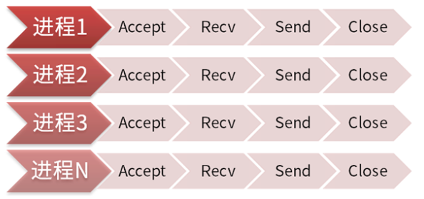
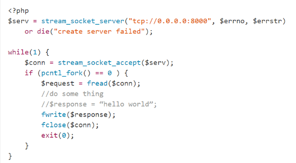
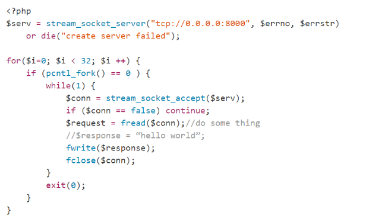
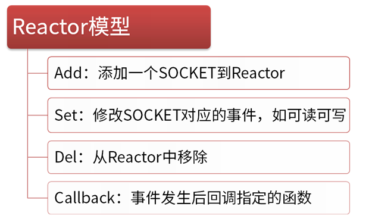
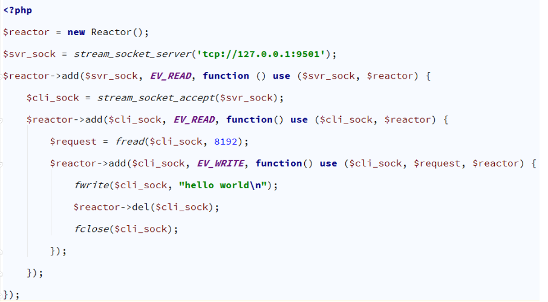

##### 预备知识  
一直以来很少看到有多少人使用PHP的socket模块来做一些事情，大概大家都把它定位在脚本语言的范畴内吧，但是其实php的socket模块可以做很多事情，包括做ftplist,http post提交，smtp提交，组包并进行特殊报文的交互（如smpp协议），whois查询。这些都是比较常见的查询。特别是php的socket扩展库可以做的事情简直不会比c差多少。  
1. 集成于内核的socket  
    这个系列的函数仅仅只能做主动连接无法实现端口监听相关的功能。而且在4.3.0之前所有socket连接只能工作在阻塞模式下。此系列函数包括`fsockopen，pfsockopen`这两个函数的具体信息可以查询php.net的用户手册他们均会返回一个资源编号对于这个资源可以使用几乎所有对文件操作的函数对其进行操作如fgets(),fwrite(), fclose()等单注意的是所有函数遵循这些函数面对网络信息流时的规律，例如：`fread()` 从文件指针 `handle` 读取最多 `length` 个字节。 该函数在读取完` length` 个字节数，或到达 EOF 的时候，或（对于网络流）当一个包可用时就会停止读取文件，视乎先碰到哪种情况。 可以看出对于网络流就必须注意取到的是一个完整的包就停止。  

2. php扩展模块带有的socket功能。  
   php4.x 以后有这么一个模块`extension=php_sockets.dll`，Linux上是一个`extension=php_sockets.so`。当打开这个此模块以后就意味着php拥有了强大的socket功能，包括listen端口，阻塞及非阻塞模式的切换，multi-client 交互式处理等这个系列的函数列表参看`http://www.php.net/manual/en/ref.sockets.php`看过这个列表觉得是不是非常丰富呢？不过非常遗憾这个模块还非常年轻还有很多地方不成熟，相关的参考文档也非常少：（我也正在研究中，因此暂时不具体讨论它，仅给大家一个参考文章`http://www.zend.com/pecl/tutorials/sockets.php`)

##### 使用PHP socket扩展  
服务器端代码：  
```php
<?php  
/** 
 * File name server.php 
 * 服务器端代码 
 *  
 * @author guisu.huang 
 * @since 2012-04-11 
 *  
 */  
  
//确保在连接客户端时不会超时  
set_time_limit(0);  
//设置IP和端口号  
$address = "127.0.0.1";  
$port = 2046; //调试的时候，可以多换端口来测试程序！  
/** 
 * 创建一个SOCKET  
 * AF_INET=是ipv4 如果用ipv6，则参数为 AF_INET6 
 * SOCK_STREAM为socket的tcp类型，如果是UDP则使用SOCK_DGRAM 
*/  
$sock = socket_create(AF_INET, SOCK_STREAM, SOL_TCP) or die("socket_create() 失败的原因是:" . socket_strerror(socket_last_error()) . "/n");  
//阻塞模式  
socket_set_block($sock) or die("socket_set_block() 失败的原因是:" . socket_strerror(socket_last_error()) . "/n");  
//绑定到socket端口  
$result = socket_bind($sock, $address, $port) or die("socket_bind() 失败的原因是:" . socket_strerror(socket_last_error()) . "/n");  
//开始监听  
$result = socket_listen($sock, 4) or die("socket_listen() 失败的原因是:" . socket_strerror(socket_last_error()) . "/n");  
echo "OK\nBinding the socket on $address:$port ... ";  
echo "OK\nNow ready to accept connections.\nListening on the socket ... \n";  
do { // never stop the daemon  
    //它接收连接请求并调用一个子连接Socket来处理客户端和服务器间的信息  
    $msgsock = socket_accept($sock) or  die("socket_accept() failed: reason: " . socket_strerror(socket_last_error()) . "/n");  
      
    //读取客户端数据  
    echo "Read client data \n";  
    //socket_read函数会一直读取客户端数据,直到遇见\n,\t或者\0字符.PHP脚本把这写字符看做是输入的结束符.  
    $buf = socket_read($msgsock, 8192);  
    echo "Received msg: $buf   \n";  
      
    //数据传送 向客户端写入返回结果  
    $msg = "welcome \n";  
    socket_write($msgsock, $msg, strlen($msg)) or die("socket_write() failed: reason: " . socket_strerror(socket_last_error()) ."/n");  
    //一旦输出被返回到客户端,父/子socket都应通过socket_close($msgsock)函数来终止  
    socket_close($msgsock);  
} while (true);  
socket_close($sock); 
```
客户端代码：  
```php
<?php  
/** 
 * File name:client.php 
 * 客户端代码 
 *  
 * @author guisu.huang 
 * @since 2012-04-11 
 */  
set_time_limit(0);  
  
$host = "127.0.0.1";  
$port = 2046;  
$socket = socket_create(AF_INET, SOCK_STREAM, SOL_TCP)or die("Could not create  socket\n"); // 创建一个Socket  
   
$connection = socket_connect($socket, $host, $port) or die("Could not connet server\n");    //  连接  
socket_write($socket, "hello socket") or die("Write failed\n"); // 数据传送 向服务器发送消息  
while ($buff = socket_read($socket, 1024, PHP_NORMAL_READ)) {  
    echo("Response was:" . $buff . "\n");  
}  
socket_close($socket);
```
使用cli方式启动server：`php server.php`
`这里注意socket_read函数：`
可选的类型参数是一个命名的常数：

* PHP_BINARY_READ - 使用系统recv（）函数。用于读取二进制数据的安全。 （在PHP>“默认= 4.1.0）  
* PHP_NORMAL_READ - 读停在\ n或\r（在PHP <= 4.0.6默认）  
* 针对参数PHP_NORMAL_READ ，如果服务器的响应结果没有\ n。造成socket_read(): unable to read from socket  


##### PHP的并发IO编程  
###### 多进程/多线程同步阻塞  
最早的服务器端程序都是通过多进程、多线程来解决并发IO的问题。进程模型出现的最早，从Unix系统诞生就开始有了进程的概念。最早的服务器端程序一般都是Accept一个客户端连接就创建一个进程，然后子进程进入循环同步阻塞地与客户端连接进行交互，收发处理数据。  

  

多线程模式出现要晚一些，线程与进程相比更轻量，而且线程之间是共享内存堆栈的，所以不同的线程之间交互非常容易实现。比如聊天室这样的程序，客户端连接之间可以交互，比聊天室中的玩家可以任意的其他人发消息。用多线程模式实现非常简单，线程中可以直接读写某一个客户端连接。而多进程模式就要用到管道、消息队列、共享内存实现数据交互，统称进程间通信（IPC）复杂的技术才能实现。  

代码实例：  
  
多进程/线程模型的流程是:  

* 创建一个 socket，绑定服务器端口（bind），监听端口（listen），在PHP中用stream_socket_server一个函数就能完成上面3个步骤，当然也可以使用php sockets扩展分别实现。
* 进入while循环，阻塞在accept操作上，等待客户端连接进入。此时程序会进入随眠状态，直到有新的客户端发起connect到服务器，操作系统会唤醒此进程。accept函数返回客户端连接的socket
* 主进程在多进程模型下通过fork（php: pcntl_fork）创建子进程，多线程模型下使用pthread_create（php: new Thread）创建子线程。下文如无特殊声明将使用进程同时表示进程/线程。
* 子进程创建成功后进入while循环，阻塞在recv（php: fread）调用上，等待客户端向服务器发送数据。收到数据后服务器程序进行处理然后使用send（php: fwrite）向客户端发送响应。长连接的服务会持续与客户端交互，而短连接服务一般收到响应就会close。
* 当客户端连接关闭时，子进程退出并销毁所有资源。主进程会回收掉此子进程。
这种模式最大的问题是，进程/线程创建和销毁的开销很大。所以上面的模式没办法应用于非常繁忙的服务器程序。对应的改进版解决了此问题，这就是经典的Leader-Follower模型。

  

它的特点是程序启动后就会创建N个进程。每个子进程进入Accept，等待新的连接进入。当客户端连接到服务器时，其中一个子进程会被唤醒，开始处理客户端请求，并且不再接受新的TCP连接。当此连接关闭时，子进程会释放，重新进入Accept，参与处理新的连接。  

这个模型的优势是完全可以复用进程，没有额外消耗，性能非常好。很多常见的服务器程序都是基于此模型的，比如Apache、PHP-FPM。  
多进程模型也有一些缺点：  

* 这种模型严重依赖进程的数量解决并发问题，一个客户端连接就需要占用一个进程，工作进程的数量有多少，并发处理能力就有多少。操作系统可以创建的进程数量是有限的。
* 启动大量进程会带来额外的进程调度消耗。数百个进程时可能进程上下文切换调度消耗占CPU不到1%可以忽略不接，如果启动数千甚至数万个进程，消耗就会直线上升。调度消耗可能占到CPU的百分之几十甚至100%。

另外有一些场景多进程模型无法解决，比如即时聊天程序（IM），一台服务器要同时维持上万甚至几十万上百万的连接（经典的C10K问题），多进程模型就力不从心了。  

还有一种场景也是多进程模型的软肋。通常Web服务器启动100个进程，如果一个请求消耗100ms，100个进程可以提供1000qps，这样的处理能力还是不错的。但是如果请求内要调用外网Http接口，像QQ、微博登录，耗时会很长，一个请求需要10s。那一个进程1秒只能处理0.1个请求，100个进程只能达到10qps，这样的处理能力就太差了。  

有没有一种技术可以在一个进程内处理所有并发IO呢？答案是有，这就是IO复用技术。  

###### IO复用/事件循环/异步非阻塞  
其实IO复用的历史和多进程一样长，Linux很早就提供了select系统调用，可以在一个进程内维持1024个连接。后来又加入了poll系统调用，poll做了一些改进，解决了1024限制的问题，可以维持任意数量的连接。但select/poll还有一个问题就是，它需要循环检测连接是否有事件。这样问题就来了，如果服务器有100万个连接，在某一时间只有一个连接向服务器发送了数据，select/poll需要做循环100万次，其中只有1次是命中的，剩下的99万9999次都是无效的，白白浪费了CPU资源。  

直到linux 2.6内核提供了新的epoll系统调用，可以维持无限数量的连接，而且无需轮询，这才真正解决了C10K问题。现在各种高并发异步IO的服务器程序都是基于epoll实现的，比如Nginx、Node.js、Erlang、Golang。像node.js这样单进程单线程的程序，都可以维持超过1百万TCP连接，全部归功于epoll技术。  

IO复用异步非阻塞程序使用经典的Reactor模型，Reactor顾名思义就是反应堆的意思，它本身不处理任何数据收发。只是可以监视一个socket句柄的事件变化。  
  

Reactor有4个核心的操作：  

* add添加socket监听到reactor，可以是listen socket也可以使客户端socket，也可以是管道、eventfd、信号等
* set修改事件监听，可以设置监听的类型，如可读、可写。可读很好理解，对于listen socket就是有新客户端连接到来了需要accept。对于客户端连接就是收到数据，需要recv。可写事件比较难理解一些。一个SOCKET是有缓存区的，如果要向客户端连接发送2M的数据，一次性是发不出去的，操作系统默认TCP缓存区只有256K。一次性只能发256K，缓存区满了之后send就会返回EAGAIN错误。这时候就要监听可写事件，在纯异步的编程中，必须去监听可写才能保证send操作是完全非阻塞的
* del从reactor中移除，不再监听事件
* callback就是事件发生后对应的处理逻辑，一般在add/set时制定。C语言用函数指针实现，JS可以用匿名函数，PHP可以用匿名函数、对象方法数组、字符串函数名。  

Reactor只是一个事件发生器，实际对socket句柄的操作，如connect/accept、send/recv、close是在callback中完成的。具体编码可参考下面的伪代码：  
Reactor模型还可以与多进程、多线程结合起来用，既实现异步非阻塞IO，又利用到多核。目前流行的异步服务器程序都是这样的方式：如  

* Nginx：多进程Reactor
* Nginx+Lua：多进程Reactor+协程
* Golang：单线程Reactor+多线程协程
* Swoole：多线程Reactor+多进程Worker  
  


##### PHP socket内部源码  
从PHP内部源码来看，PHP提供的socket编程是在socket，bind,listen等函数外添加了一个层，让其更加简单和方便调用。但是一些业务逻辑的程序还是需要程序员自己去实现。  
下面我们以`socket_create`的源码实现来说明PHP的内部实现。  
前面我们有说到php的socket是以扩展的方式实现的。在源码的ext目录，我们找到sockets目录。这个目录存放了PHP对于socket的实现。直接搜索`PHP_FUNCTION(socket_create)`，在`sockets.c`文件中找到了此函数的实现。如下所示代码：  

```php
/* {{{ proto resource socket_create(int domain, int type, int protocol) U 
   Creates an endpoint for communication in the domain specified by domain, of type specified by type */  
PHP_FUNCTION(socket_create)  
{  
        long            arg1, arg2, arg3;  
        php_socket      *php_sock = (php_socket*)emalloc(sizeof(php_socket));  
   
        if (zend_parse_parameters(ZEND_NUM_ARGS() TSRMLS_CC, "lll", &arg1, &arg2, &arg3) == FAILURE) {  
                efree(php_sock);  
                return;  
        }  
   
        if (arg1 != AF_UNIX  
#if HAVE_IPV6  
                && arg1 != AF_INET6  
#endif  
                && arg1 != AF_INET) {  
                php_error_docref(NULL TSRMLS_CC, E_WARNING, "invalid socket domain [%ld] specified for argument 1, assuming AF_INET", arg1);  
                arg1 = AF_INET;  
        }  
   
        if (arg2 > 10) {  
                php_error_docref(NULL TSRMLS_CC, E_WARNING, "invalid socket type [%ld] specified for argument 2, assuming SOCK_STREAM", arg2);  
                arg2 = SOCK_STREAM;  
        }  
   
        php_sock->bsd_socket = socket(arg1, arg2, arg3);  
        php_sock->type = arg1;  
   
        if (IS_INVALID_SOCKET(php_sock)) {  
                SOCKETS_G(last_error) = errno;  
                php_error_docref(NULL TSRMLS_CC, E_WARNING, "Unable to create socket [%d]: %s", errno, php_strerror(errno TSRMLS_CC));  
                efree(php_sock);  
                RETURN_FALSE;  
        }  
   
        php_sock->error = 0;  
        php_sock->blocking = 1;  
                                                                                                                                          
        ZEND_REGISTER_RESOURCE(return_value, php_sock, le_socket);  
}  
/* }}} */  
```
Zend API实际对c函数socket做了包装，供PHP使用。 而在c的socket编程中，我们使用如下方式初始化socket。  
```php
//初始化Socket    
if( (socket_fd = socket(AF_INET, SOCK_STREAM, 0)) == -1 ){    
     printf("create socket error: %s(errno: %d)\n",strerror(errno),errno);    
     exit(0);    
} 
```

##### socket函数  
```php
函数名 描述
socket_accept() 接受一个Socket连接
socket_bind() 把socket绑定在一个IP地址和端口上
socket_clear_error() 清除socket的错误或最后的错误代码
socket_close() 关闭一个socket资源
socket_connect() 开始一个socket连接
socket_create_listen() 在指定端口打开一个socket监听
socket_create_pair() 产生一对没有差别的socket到一个数组里
socket_create() 产生一个socket，相当于产生一个socket的数据结构
socket_get_option() 获取socket选项
socket_getpeername() 获取远程类似主机的ip地址
socket_getsockname() 获取本地socket的ip地址
socket_iovec_add() 添加一个新的向量到一个分散/聚合的数组
socket_iovec_alloc() 这个函数创建一个能够发送接收读写的iovec数据结构
socket_iovec_delete() 删除一个已分配的iovec
socket_iovec_fetch() 返回指定的iovec资源的数据
socket_iovec_free() 释放一个iovec资源
socket_iovec_set() 设置iovec的数据新值
socket_last_error() 获取当前socket的最后错误代码
socket_listen() 监听由指定socket的所有连接
socket_read() 读取指定长度的数据
socket_readv() 读取从分散/聚合数组过来的数据
socket_recv() 从socket里结束数据到缓存
socket_recvfrom() 接受数据从指定的socket，如果没有指定则默认当前socket
socket_recvmsg() 从iovec里接受消息
socket_select() 多路选择
socket_send() 这个函数发送数据到已连接的socket
socket_sendmsg() 发送消息到socket
socket_sendto() 发送消息到指定地址的socket
socket_set_block() 在socket里设置为块模式
socket_set_nonblock() socket里设置为非块模式
socket_set_option() 设置socket选项
socket_shutdown() 这个函数允许你关闭读、写、或指定的socket
socket_strerror() 返回指定错误号的周详错误
socket_write() 写数据到socket缓存
socket_writev() 写数据到分散/聚合数组
```

#####  PHP Socket模拟请求  
我们使用stream_socket来模拟：  
```php
/** 
 *  
 * @param $data= array=array('key'=>value) 
 */  
function post_contents($data = array()) {  
    $post = $data ? http_build_query($data) : '';  
    $header = "POST /test/ HTTP/1.1" . "\n";  
    $header .= "User-Agent: Mozilla/4.0+(compatible;+MSIE+6.0;+Windows+NT+5.1;+SV1)" . "\n";  
    $header .= "Host: localhost" . "\n";  
    $header .= "Accept: */*" . "\n";  
    $header .= "Referer: http://localhost/test/" . "\n";  
    $header .= "Content-Length: ". strlen($post) . "\n";  
    $header .= "Content-Type: application/x-www-form-urlencoded" . "\n";  
    $header .= "\r\n";  
    $ddd = $header . $post;  
    $fp = stream_socket_client("tcp://localhost:80", $errno, $errstr, 30);  
    $response = '';  
    if (!$fp) {  
        echo "$errstr ($errno)<br />\n";  
    } else {  
        fwrite($fp, $ddd);  
        $i = 1;  
        while ( !feof($fp) ) {  
            $r = fgets($fp, 1024);  
            $response .= $r;  
            //处理这一行  
        }  
    }  
    fclose($fp);  
    return $response;  
}  
```
注意，以上程序可能会进入死循环；  
这个PHP的`feof($fp)` 需要注意的地方了，我们来分析为什么进入死循环。  
```php
while ( !feof($fp) ) {  
    $r = fgets($fp, 1024);  
    $response .= $r;  
}  
```
实际上，`feof`是可靠的，但是结合`fgets`函数一块使用的时候，必须要小心了。一个常见的做法是：  
```php
$fp = fopen("myfile.txt", "r");  
while (!feof($fp)) {  
   $current_line = fgets($fp);  
   //对结果做进一步处理,防止进入死循环  
}  
```
当处理纯文本的时候，fgets获取最后一行字符后，foef函数返回的结果并不是TRUE。实际的运算过程如下：  
1. while（）继续循环。
2. fgets 获取倒数第二行的字符串
3. feof返回false，进入下一次循环
4. fgets获取最后一行数据
5. 一旦fegets函数被调用，feof函数仍然返回的是false。所以继续执行循环
6. fget试图获取另外一行，但实际结果是空的。实际代码没有意识到这一点，试图处理另外根本不存在的一行，但fgets被调用了，feof放回的结果仍然是false
7. ......
8. 进入死循环