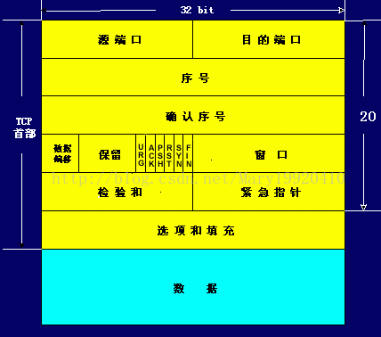

* 采用面向连接的三次握手实现可靠对象传输。
* 使用数据窗口机制协商队列大小实现数据队列传输。
* 通过序列化应答和必要时重发数据包，TCP 为应用程序提供了可靠的传输流和虚拟连接服务。

###### TCP协议  
* TCP 通过以下方式提供可靠性： 
    * 应用程序分割为TCP认为最合适发送的数据块。由TCP传递给IP的信息单位叫做报文段。
    * 当TCP发出一个报文段后，它启动一个定时器，等待目的端确认收到这个报文段。如果不能记时收到一个确认，它 就重发这个报文段。 
    * 当TCP收到发自TCP连接另一端的数据，它将发送一个确认。这个确认不是立即发送，通常延迟几分之一秒。 
    * TCP将保持它首部和数据的检验和。这是一个端到端的检验和，目的是检测数据在传输过程中的任何变化如果收到报文段的检验和有差错，TCP将丢弃这个报文段和不确认收到这个报文段。
    * 既然TCP报文段作为IP数据报来传输，而IP数据报的到达可能失序，因此TCP报文段的到达也可能失序。如果必要，TCP将对收到的数据进行排序，将收到的数据以正确的顺序交给应用层。
    * 既然IP数据报会发生重复，TCP连接端必须丢弃重复的数据。 
    * TCP还能提供流量控制，TCP连接的每一方都有固定大小的缓冲空间。TCP的接收端只允许另一端发送接收端缓冲区所能接纳的数据。这将防止较快主机致使较慢主机的缓冲区溢出。 
  另外，TCP对字节流的内容不作任何解释。
* TCP首部：
    TCP数据被封装在一个IP数据报中，格式如下：   
    | IP首部20 | TCP首部20 | TCP首部 |
    | --- | --- | --- |  
    
    TCP首部格式如下：      
        
说明：  

    * 每个TCP段都包括源端和目的端的端口号，用于寻找发送端和接收端的应用进程。这两个值加上IP首部的源端IP地址和目的端IP地址唯一确定一个TCP连接。
    * 序号用来标识从TCP发送端向接收端发送的数据字节流，它表示在这个报文段中的第一个数据字节。如果将字节流看作在两个应用程序间的单向流动，则TCP用序号对每个字节进行计数。
    * 当建立一个新连接时，SYN标志变1。序号字段包含由这个主机选择的该连接的初始序号ISN，该主机要发送数据的第一个字节的序号为这个ISN加1，因为SYN标志使用了一个序号。
    * 既然每个被传输的字节都被计数，确认序号包含发送确认的一端所期望收到的下一个序号。因此，确认序号应当时上次已成功收到数据字节序号加1。只有ACK标志为1时确认序号字段才有效。
    * 发送ACK无需任何代价，因为32位的确认序号字段和ACK标志一样，总是TCP首部的一部分。因此一旦一个连接建立起来，这个字段总是被设置，ACK标志也总是被设置为1。
    * TCP为应用层提供全双工的服务。因此，连接的每一端必须保持每个方向上的传输数据序号。
    * TCP可以表述为一个没有选择确认或否认的华东窗口协议。因此TCP首部中的确认序号表示发送方已成功收到字节，但还不包含确认序号所指的字节。当前还无法对数据流中选定的部分进行确认。
    * 首部长度需要设置，因为任选字段的长度是可变的。TCP首部最多60个字节。
    * 6个标志位中的多个可同时设置为1
        * URG－紧急指针有效
        * ACK－确认序号有效
        * PSH－接收方应尽快将这个报文段交给应用层
        * RST－重建连接
        * SYN－同步序号用来发起一个连接
        * FIN－发送端完成发送任务
    * TCP的流量控制由连接的每一端通过声明的窗口大小来提供。窗口大小为字节数，起始于确认序号字段指明的值，这个值是接收端期望接收的字节数。窗口大小是一个16为的字段，因而窗口大小最大为65535字节。
    * 检验和覆盖整个TCP报文端：TCP首部和TCP数据。这是一个强制性的字段，一定是由发送端计算和存储，并由接收端进行验证。TCP检验和的计算和UDP首部检验和的计算一样，也使用伪首部。
    * 紧急指针是一个正的偏移量，黄蓉序号字段中的值相加表示紧急数据最后一个字节的序号。TCP的紧急方式是发送端向另一端发送紧急数据的一种方式。
    * 最常见的可选字段是最长报文大小MMS，每个连接方通常都在通信的第一个报文段中指明这个选项。它指明本端所能接收的最大长度的报文段。
###### TCP连接的建立和终止  
1. 建立连接协议
    * 请求端发送一个SYN段指明客户打算连接的服务器的端口，隐疾初始序号(ISN)，这个SYN报文段为报文段1。
    * 服务器端发回包含服务器的初始序号的SYN报文段（报文段2）作为应答。同时将确认序号设置为客户的ISN加1以对客户的SYN报文段进行确认。一个SYN将占用一个序号。
    * 客户必须将确认序号设置为服务器的ISN加1以对服务器的SYN报文段进行确认（报文段3）。
 这3个报文段完成连接的建立，称为三次握手。发送第一个SYN的一端将执行主动打开，接收这个SYN并发回下一个SYN的另一端执行被动打开。  
2. 连接终止协议  
由于TCP连接是全双工的，因此每个方向都必须单独进行关闭。这原则是当一方完成它的数据发送任务后就能发送一个FIN来终止这个方向的连接。收到一个FIN只意味着这一方向上没有数据流动，一个TCP连接在收到一个FIN后仍能发送数据。首先进行关闭的一方将执行主动关闭，而另一方执行被动关闭。  
    * TCP客户端发送一个FIN，用来关闭客户到服务器的数据传送（报文段4）。
    * 服务器收到这个FIN，它发回一个ACK，确认序号为收到的序号加1（报文段5）。和SYN一样，一个FIN将占用一个序号。
    * 服务器关闭客户端的连接，发送一个FIN给客户端（报文段6）。
    *  客户段发回确认，并将确认序号设置为收到序号加1（报文段7）。
3. 连接建立的超时  
    如果与服务器无法建立连接，客户端就会三次向服务器发送连接请求。在规定的时间内服务器未应答，则连接失败。  
4. 最大报文段长度MSS  
    最大报文段长度表示TCP传往另一端的最大块数据的长度。当一个连接建立时，连接的双方都要通告各自的MSS。  
    一般，如果没有分段发生，MSS还是越大越好。报文段越大允许每个报文段传送的数据越多，相对IP和TCP首部有更高的网络利用率。当TCP发送一个 SYN时，它能将MSS值设置为外出接口的MTU长度减去IP首部和TCP首部长度。对于以太网，MSS值可达1460。  
    如果目的地址为非本地的，MSS值通常默认为536，是否本地主要通过网络号区分。MSS让主机限制另一端发送数据报的长度，加上主机也能控制它发送数据报的长度，这将使以较小MTU连接到一个网络上的主机避免分段。  
5. TCP的半关闭  
    TCP提供了连接的一端在结束它的发送后还能接收来自另一端数据的能力，这就是TCP的半关闭。  
    客户端发送FIN，另一端发送对这个FIN的ACK报文段。当收到半关闭的一端在完成它的数据传送后，才发送FIN关闭这个方向的连接，客户端再对这个FIN确认，这个连接才彻底关闭。  
6. 2MSL连接  
    TIME_WAIT状态也称为2MSL等待状态。每个TCP必须选择一个报文段最大生存时间（MSL）。它是任何报文段被丢弃前在网络的最长时间。  
     处理原则：当TCP执行一个主动关闭，并发回最后一个ACK，该连接必须在TIME_WAIT状态停留的时间为2MSL。这样可以让TCP再次发送最后的ACK以避免这个ACK丢失（另一端超时并重发最后的FIN）。这种2MSL等待的另一个结果是这个TCP连接在2MSL等待期间，定义这个连接的插口不能被使用。  
7. 平静时间  
    TCP在重启的MSL秒内不能建立任何连接，这就是平静时间。  
8. FIN_WAIT_2状态  
    在FIN_WAIT_2状态我们已经发出了FIN，并且另一端也对它进行了确认。只有另一端的进程完成了这个关闭，我们这端才会从 FIN_WAIT_2状态进入TIME_WAIT状态。这意味着我们这端可能永远保持这个状态，另一端也将处于CLOSE_WAIT状态，并一直保持这个状态直到应用层决定进行关闭。  
9. 复位报文段  
    TCP首部的RST位是用于复位的。一般，无论合适一个报文端发往相关的连接出现错误，TCP都会发出一个复位报文段。主要情况：
    * 到不存在的端口的连接请求；
    * 异常终止一个连接。
10. 同时打开  
     为了处理同时打开，对于同时打开它仅建立一条连接而不是两条连接。两端几乎在同时发送SYN，并进入SYN_SENT状态。当每一端收到SYN时，状态变为SYN_RCVD，同时他们都再发SYN并对收到的SYN进行确认。当双方都收到SYN及相应的ACK时，状态都变为ESTABLISHED。一个同时打开的连接需要交换4个报文段，比正常的三次握手多了一次。  
11. 同时关闭  
    当应用层发出关闭命令，两端均从ESTABLISHED变为FIN_WAIT_1。这将导致双方各发送一个FIN，两个FIN经过网络传送后分别到达另一端。收到FIN后，状态由FIN_WAIT_1变为CLOSING，并发送最后的ACK。当收到最后的ACK，状态变为TIME_WAIT。同时关闭和正常关闭的段减缓数目相同。  
12. TCP选项  
     每个选项的开始是1字节的kind字段，说明选项的类型。   
     Kind=1:选项表结束（1字节）   Kind=1:无操作（1字节）   Kind=2：最大报文段长度（4字节）   Kind=3:窗口扩大因子（4字节）   Kind=8:时间戳（10字节）  

###### TCP的超时和重传  
 对于每个TCP连接，TCP管理4个不同的定时器。  
 1. 重传定时器用于当希望收到另一端的确认。
 2. 坚持定时器使窗口大小信息保持不断流动，即使另一端关闭了其接收窗口。
 3.  保活定时器可检测到一个空闲连接的另一端何时崩溃或重启。
 4. 2MSL定时器测量一个连接处于TIME_WAIT状态的时间。  

1. 往返时间测量
    TCP超时和重传重最重要的就是对一个给定连接的往返时间（RTT）的测量。由于路由器和网络流量均会变化，因此TCP应该跟踪这些变化并相应地改变超时时间。首先TCP必须测量在发送一个带有特别序号地字节和接收到包含该字节地确认之间的RTT。  
2. 拥塞避免算法  
    该算法假定由于分组收到损坏引起的丢失是非常少的，因此分组丢失就意味着在源主机和目的主机之间的某处网络上发生了阻塞。有两种分组丢失的指示：发生超时和收到重复的确认。拥塞避免算法需要对每个连接维持两个变量：一个拥塞窗口cwnd和一个慢启动门限ssthresh。  
    * 对一个给定的连接，初始化cwnd为1个报文段，ssthresh为65535个字节。
    * TCP输出例程的输出不能超过cwnd和接收方通告窗口的大小。拥塞避免是发送方使用的流量控制。前者是发送方感受到的网络拥塞的估计，而后者则与接收方在该连接上的可用缓存大小有关。  
    * 当拥塞发生时，ssthresh被设置为当前窗口大小的一般(cwnd和接收方通告窗口大小的最小值，但最小为2个报文段)。此外，如果是超时引起了拥塞，则cwnd被设置为1个报文段。
    * 当新的数据被对方确认时，就增加cwnd，但增加的方法依赖与是否正在进行慢启动或拥塞避免。如果cwnd小于或等于ssthresh，则正在进行慢启动，否则正在进行拥塞避免。
3. 快速重传和快速恢复算法  
     如果我们一连串收到3个或以上的重复ACK，就非常可能是一个报文段丢失了。于是我们就重传丢失的数据报文段，而无需等待超时定时器溢出。  
     * 当收到第3个重复的ACK时，将ssthresh设置为当前拥塞窗口cwnd的一半，重传丢失的报文段，设置cwnd为ssthresh加上3倍的报文段大小。
     * 每次收到另一个重复的ACK时，cwnd增加1个报文段大小并发送一个1个分组，如果允许的话。
     * 当下一个确认新数据的ACK到达时，设置cwnd为ssthresh，这个ACK应该时在进行重传后的一个往返时间内对步骤1重重传的确认。另外，这个 ACK也应该是对丢失的分组和收到的第一个重复的ACK之间的所有中间报文段的确认。  
4. ICMP差错  
     TCP如何处理一个给定的连接返回的ICMP差错。TCP能够遇到的最常见的ICMP差错就是源站抑制、主机不可达和网络不可达。  
     * 一个接收到的源站抑制引起拥塞窗口cwnd被置为1个报文段大小来发起慢启动，但是慢启动门限ssthresh没有变化，所以窗口将打开直到它开放了所有的通路或者发生了拥塞。
     * 一个接收到的主机不可达或网络不可达实际都被忽略，因为这两个差错都被认为是短暂现象。TCP试图发送引起该差错的数据，尽管最终有可能会超时  
5. 重新分组：  
    当TCP超时并重传时，它并不一定要重传同样的报文段，相反，TCP允许进行重新分组而发送一个较大的报文段。这是允许的，因为TCP是使用字节序号而不是报文段序号来进行识别它所要发送的数据和进行确认。    

###### TCP的坚持定时器  
   ACK的传输并不可靠，也就是说，TCP不对ACK报文段进行确认，TCP只确认那些包含数据的ACK报文段。为了防止因为ACK报文段丢失而双方进行等待的问题，发送方用一个坚持定时器来周期性地向接收方查询。这些从发送方发出地报文段称为窗口探查。  
     
###### TCP的保活定时器  
  如果一个给定的连接在2小时内没有任何动作，那么服务器就向客户发送一个探查报文段。客户主机必须处于以下4个状态之一。  

1. 客户主机依然正常运行，并从服务器可达。客户的TCP响应正常，而服务器也知道对方的正常工作的。服务器在2小时内将保活定时器复位。
2. 客户主机已经崩溃，并且关闭或者正在重新启动。在任何一种情况下，客户的TCP都没有响应。服务器将不能收到对探查的响应，并在75秒后超时。总共发送10个探查，间隔75秒。
3. 客户主机崩溃并已经重新启动。这是服务器将收到一个对其保活探查的响应，但这个响应是一个复位，使得服务器终止这个连接。
4. 客户主机正常运行，但是从服务器不可达。  

###### TCP的一些性能
1. 路径MTU发现：  
    TCP的路径MTU发现按如下方式进行：在连接建立时，TCP使用输出接口或对段声明的MSS中的最下MTU作为其实的报文段大小。路径MTU发现不允许TCP超过对端声明的MSS。如果对端没有指定一个MSS，则默认为536。  
     一旦选定了起始的报文段大小，在该连接上的所有被TCP发送的IP数据报都将被设置DF位。如果中间路由器需要对一个设置了DF标志的数据报进行分片，它就丢弃这个数据报，并产生一个ICMP的“不能分片”差错。  
      如果收到这个ICMP差错，TCP就减少段大小并进行重传。如果路由器产生的是一个较新的该类ICMP差错，则报文段大小被设置位下一跳的MTU减去 IP和TCP的首部长度。如果是一个较旧的该类ICMP差错，则必须尝试下一个可能的最小MTU。  
2. 长肥管道  
    一个连接的容量＝带宽X时延（RTT）。具有大的带宽时延乘积的网络称为长肥网络（LFN）。一个运行在LFN的TCP连接称为长肥管道。管道可以被水平拉长（一个长的RTT）,或被垂直拉高（较高的带宽），或两个方向拉伸。  
3. 窗口扩大选项：  
    窗口扩大选项使TCP的窗口定义从16位增加到32位，这并不是通过修改TCP首部来实现的，TCP首部仍然使用16位，而是通过定义一个选项实现对16位的扩大操作来完成的。
4. 时间戳选项：  
     时间戳选项使发送方在每个报文段中放置一个时间戳值。接收方在确认中返回这个数值，从而允许发送方为每一个收到的ACK计算RTT。  
     