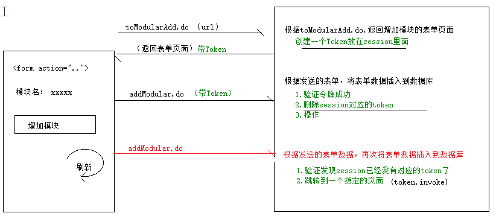

今天给大家带来的是页面防重提交之令牌机制技术，如有不足之处，敬请指正。那么首先我们必须知道页面防重是什么？  

例如：我们在浏览器输入表单信息提交后，会将数据插入到数据库中，此时浏览器会保存上一次请求的数据，如果我们不做页面防重，当我们点击页面刷新按钮时，就会再次将已经填好的表单提交，再次插入到数据库中。  
  

要解决这个问题，首先要理解**token机制（令牌机制）**  

如何理解token机制：**通俗的讲就好比古代将军带兵出征打仗，但是将军如果在千里之外需要执行皇帝的命令，只能皇帝派亲信带着皇帝的信物虎符（虎符一分为二）来传达命令。若亲信带着的虎符与将军的虎符匹配，则证明为皇帝真实命令。我们这次的令牌机制与此情景十分相似。**  

  

Token机制的实现：  

1. 我们在进入提交数据的表单页面之前，先创建一个Token给页面
2. 在页面表单设置Token，作为表单的参数
3. 提交数据到服务器后，首先判断是否是一个防重提的表单，如果是，就判断是否是 需要创建Token还是校验删除Token，还是处理重提。
4. 如果是处理重提交表单，需要页面指定一个跳转路径  

##### 创建一个注解判断请求方法是否支持防重提交  
作用：用于标识方法是否需要防重提交  

```java
package com.xkt.annotation;

import java.lang.annotation.Documented;
import java.lang.annotation.ElementType;
import java.lang.annotation.Retention;
import java.lang.annotation.RetentionPolicy;
import java.lang.annotation.Target;

/**
 * 自定义一个Token注解，用于标识防重提交的方法
 * @author lzx
 *
 */
@Target(value=ElementType.METHOD)
@Retention(RetentionPolicy.RUNTIME)
@Documented
public @interface TokenForm {
	
	//用于标记需要防重提交的方法，创建Token的属性
	boolean create() default false;
	//用于标记防重提交方法的，删除Token的属性
	boolean remove() default false;
}
```

##### 编写拦截器  
```java
package com.xkt.interceptor;

import java.util.UUID;

import javax.servlet.http.HttpServletRequest;
import javax.servlet.http.HttpServletResponse;
import javax.servlet.http.HttpSession;

import org.springframework.web.method.HandlerMethod;
import org.springframework.web.servlet.HandlerInterceptor;
import org.springframework.web.servlet.ModelAndView;

import com.xkt.annotation.TokenForm;

/**
 * @author lzx
 *
 */
public class TokenInterceptor implements HandlerInterceptor {

	@Override
	public boolean preHandle(HttpServletRequest request, HttpServletResponse response, Object handler)
			throws Exception {
		// 第一步：获得调用处理方法的注解
		// 1.获得方法
		HandlerMethod hm = (HandlerMethod) handler;
		// 2.获得方法调用的Token的注解
		TokenForm tokenForm = hm.getMethodAnnotation(TokenForm.class);

		// 第二步：判断是否有Token注解
		if (tokenForm != null) {
			HttpSession session = request.getSession();
			if (tokenForm.create() == true) {
				// 将Token唯一标识创建在服务器中，并在页面中作用域中取得，以便于在提交表单时进行验证
				session.setAttribute("token", UUID.randomUUID().toString());
			}
			if (tokenForm.remove() == true) {
				// 判断表单的Token是否与服务端的Token相同
				// 1.获取表单的Token
				String formToken = request.getParameter("token");
				// 2.获取服务端的Token
				Object sessionToken = session.getAttribute("token");
				// 表单传递过来的Token与服务端相同，允许操作，并且删除session的Token
				if (formToken.equals(sessionToken)) {
					// 如果相同，则移除服务端的Token
					session.removeAttribute("token");
				} else {
					// 若不同，跳转到指定的路径（由页面传递token.invoke来指定）
					String invoke = request.getParameter("token.invoke");
					response.sendRedirect(request.getContextPath() + invoke);
					return false;
				}

			}
		}
		return true;
	}

	@Override
	public void postHandle(HttpServletRequest request, HttpServletResponse response, Object handler,
			ModelAndView modelAndView) throws Exception {
	}

	@Override
	public void afterCompletion(HttpServletRequest request, HttpServletResponse response, Object handler, Exception ex)
			throws Exception {
	}

}

```

##### 配置拦截器（代码中的令牌拦截器部分）  
```java
package com.xkt.config;

import org.springframework.context.annotation.Bean;
import org.springframework.context.annotation.Configuration;
import org.springframework.web.servlet.config.annotation.DefaultServletHandlerConfigurer;
import org.springframework.web.servlet.config.annotation.EnableWebMvc;
import org.springframework.web.servlet.config.annotation.InterceptorRegistration;
import org.springframework.web.servlet.config.annotation.InterceptorRegistry;
import org.springframework.web.servlet.config.annotation.WebMvcConfigurerAdapter;
import org.springframework.web.servlet.view.InternalResourceViewResolver;
import org.springframework.web.servlet.view.JstlView;

import com.xkt.interceptor.LoginStatusInterceptor;
import com.xkt.interceptor.PermissionInterceptor;
import com.xkt.interceptor.TokenInterceptor;

/**
 * @author lzx
 *
 */
@Configuration
@EnableWebMvc // <mvc:annotation-driver/>
public class MvcConfig extends WebMvcConfigurerAdapter {

	//<mvc:default-servlet-handler/>
	@Override
	public void configureDefaultServletHandling(DefaultServletHandlerConfigurer configurer) {
		configurer.enable();
	}

	// 配置视图解释器
	@Bean
	public InternalResourceViewResolver getInternalResourceViewResolver() {

		InternalResourceViewResolver resolver = new InternalResourceViewResolver();
		// 支持JSTL的视图
		resolver.setViewClass(JstlView.class);
		// 配置视图前缀
		resolver.setPrefix("/WEB-INF/views/");
		// 配置视图后缀
		resolver.setSuffix(".jsp");
		return resolver;
	}

	@Bean
	public PermissionInterceptor getPermissionInterceptor() {
		PermissionInterceptor permission = new PermissionInterceptor();
		return permission;
	}

	@Override
	public void addInterceptors(InterceptorRegistry registry) {
		// 1.登录状态过滤
		LoginStatusInterceptor loginStatus = new LoginStatusInterceptor();
		InterceptorRegistration loginStatusRegistration = registry.addInterceptor(loginStatus);
		// 拦截所有请求
		loginStatusRegistration.addPathPatterns("/**");
		// 排除登陆请求不拦截
		loginStatusRegistration.excludePathPatterns("/admin/loginAdmin");

		// 2.权限控制
		PermissionInterceptor permission = this.getPermissionInterceptor();
		InterceptorRegistration permissionRegistration = registry.addInterceptor(permission);
		// 拦截所有请求
		permissionRegistration.addPathPatterns("/**");
		// 排除登陆请求
		permissionRegistration.excludePathPatterns("/admin/loginAdmin");
		// 排除注销请求
		permissionRegistration.excludePathPatterns("/admin/undoAdmin");

		// 3.令牌拦截器
		TokenInterceptor token= new TokenInterceptor();
		InterceptorRegistration tokenRegistration = registry.addInterceptor(token);
		tokenRegistration.addPathPatterns("/**");

	}

}
```
  
  
##### 指定页面的两个参数支持防重提交  
**(两个type="hidden"的input标签)**

```html
<form action="${pageContext.request.contextPath}/admin/addAdmin" method="post" class="form-horizontal" role="form">
	<!-- 页面令牌 -->
	<!-- token的值从作用域中取出，在页面提交时用来比对 -->
	<!-- 当页面token与服务端token不匹配时，token.invole指定跳转路径 -->
	<input type="hidden" name="token" value="${sessionScope.token}"/>
	<input type="hidden" name="token.invoke" value="/admin/toAdminAdd"/>
	<div class="form-group">
		<label class="col-sm-3 control-label no-padding-right" for="form-field-1"> 用户名 </label>

		<div class="col-sm-9">
			<input name="admin_name" type="text" id="form-field-1" placeholder="用户名" class="col-xs-10 col-sm-5" />
		</div>
	</div>
	<div class="form-group">
		<label class="col-sm-3 control-label no-padding-right" for="form-field-1"> 账号名 </label>

		<div class="col-sm-9">
			<input name="admin_account" type="text" id="form-field-1" placeholder="账号名" class="col-xs-10 col-sm-5" />
		</div>
	</div>

	<div class="form-group">
		<label class="col-sm-3 control-label no-padding-right" for="form-field-1"> 密码 </label>

		<div class="col-sm-9">
			<input name="admin_pwd" type="password" id="form-field-1" placeholder="密码" class="col-xs-10 col-sm-5" />
		</div>
	</div>
	<div class="form-group">
		<label class="col-sm-3 control-label no-padding-right" for="form-field-1"> 用户状态 </label>

		<div class="col-sm-9">
			<select name="admin_status">
			   <c:forEach var="dictionary" items="${applicationScope.global_dictionarys}">
			   		<c:if test="${dictionary.dictionary_type_code==10002}">
			   			<option value="${dictionary.dictionary_value}">${dictionary.dictionary_name}</option>
			   		</c:if>
			   </c:forEach>
			</select>
		</div>
	</div>
	<div class="form-group">
		<label class="col-sm-3 control-label no-padding-right" for="form-field-1"> 角色 </label>

		<div class="col-sm-9">
			<select name="role_id">
				<c:forEach var="role" items="${applicationScope.global_roles}">
					<option value="${role.role_id}">${role.role_name}</option>
				</c:forEach>
			</select>
		</div>
	</div>
	<div class="form-group">
		
		<div class="col-sm-7 text-right">
			<button type="submit" class="btn btn-primary">增加后台用户</button>
		</div>
	</div>
</form>
```

##### 附：后台添加token处的两个方法  

```java
/**
	 * 增加管理员 请求路径：${pageContext.request.contextPath }/admin/addAdmin
	 * 
	 * @param admin
	 * @param request
	 * @return
	 */
	@RequestMapping("/addAdmin")
	@TokenForm(remove=true)
	public String addAdmin(@RequestParam Map<String, Object> admin, HttpServletRequest request) {

		try {
			//将密码md5加密后再插入
			admin.put("admin_pwd", Md5Utils.md5((String)admin.get("admin_pwd")));
			LOGGER.debug("------增加管理员------" + admin);
			Map<String, Object> result = adminService.insert(admin);
			if (result != null) {
				request.setAttribute("admin_add_msg", "增加管理员成功");
			} else {
				request.setAttribute("admin_add_msg", "增加管理员失败");
			}
		} catch (Exception e) {
			// TODO Auto-generated catch block
			e.printStackTrace();
			request.setAttribute("admin_add_msg", "增加管理员失败");
		}

		return "/manager/adminAdd";
	}


	/**
	 * 跳转到增加页面 请求路径：${pageContext.request.contextPath}/admin/toAdminAdd
	 * 
	 * @return
	 */
	@RequestMapping("/toAdminAdd")
	@TokenForm(create=true)
	public String toAdminAdd() {
		
		return "/manager/adminAdd";
	}
```