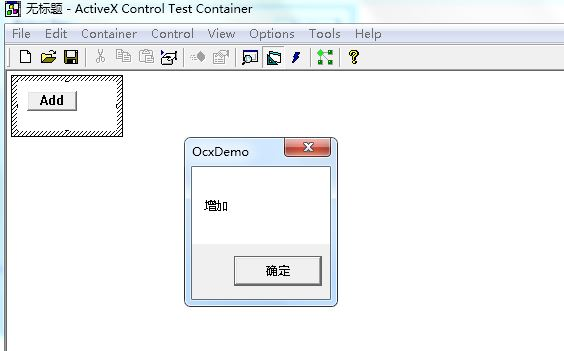

###### 前言  
1. OCX是典型的ActiveX控件，常见的OCX控件有很多，IE浏览器、Word、Excel等都提供各种各样的OCX控件。
2. OCX控件的优点是可以在其他应用程序中嵌入使用。OCX控件做为插件、外挂式的应用非常灵活方便。
3. 一般用的比较多的是做为视频、图片、图表等显示区域控件。最近碰到几个按钮的功能要封装成OCX控件，供其它程序使用。网上大概搜索了下，资料不多，于是自己写了下来，以供查找。  

###### 创建OCX项目  
1. 打开VC6.0，创建MFC ActiveX项目，工程名称：OcxDemo。  
  
2. 按照向导步骤操作，点击“完成”创建项目成功。  
  

3. 在OcxDemoCtrl.h文件中定义“增加”按钮。  
```c++
//按钮IDC
#define IDC_BUTTON_ADD  0x2001    //"增加"按钮
private:
    //"增加"按钮
    CButton m_BtnAdd;
```

4. 增加自绘“增加”按钮方法  
  

5. 在OcxDemoCtrl.cpp新生成的CreateBtnAdd方法中添加创建按钮相关代码。  
```c++
m_BtnAdd.Create(_T("Add"), WS_CHILD|WS_VISIBLE|BS_PUSHBUTTON, CRect(10,10,60,30), this, IDC_BUTTON_ADD);
```  

6. 对“增加”按钮，增加响应事件  

```c++
//OcxDemoCtrl.h
private:
    //"增加"按钮
    CButton m_BtnAdd;
    //"增加"按钮单击响应
    void OnButtonAdd();
    
//OcxDemoCtrl.cpp
BEGIN_MESSAGE_MAP(CActiveXDemoCtrl, COleControl)
    //{{AFX_MSG_MAP(CActiveXDemoCtrl)
    // NOTE - ClassWizard will add and remove message map entries
    //    DO NOT EDIT what you see in these blocks of generated code !
    ON_BN_CLICKED(IDC_BUTTON_ADD, OnButtonAdd)
    //}}AFX_MSG_MAP
    ON_OLEVERB(AFX_IDS_VERB_PROPERTIES, OnProperties)
END_MESSAGE_MAP()

void COcxDemoCtrl::OnButtonAdd()
{
    MessageBox("增加");
}
```

7. 删除OnDraw中代码。  
```c++
//pdc->FillRect(rcBounds, CBrush::FromHandle((HBRUSH)GetStockObject(WHITE_BRUSH)));
//pdc->Ellipse(rcBounds);  
```

8. 编译生成OcxDemo.ocx。   

###### 测试OcxDemo.ocx  
1. 打开ActiveX Control Test Container工具，插入OcxDemo.ocx。  
  

2. Invoke:CreateBtnAdd方法。  
  

3. 测试CreateBtnAdd方法，成功。  
  


###### VC6调用OCX控件  
1. 打开VC6.0，创建MFC AppWizard[exe]对话框项目，工程名称：OcxTestDemo。  
  

2. 插入OcxTestDemo.ocx到控件面板。  
  

3. 对控件添加关联成员变量：m_OcxDemoCtrl。  
  

4. `BOOL COcxTestDemoDlg::OnInitDialog()`添加自绘“增加”按钮方法。  
```c++
m_OcxDemoCtrl.CreateBtnAdd();
```

5. 编译生成OcxTestDemo.exe，查看调用OcxDemo.oxc效果。  
  
