Don Box 在《COM 本质论》中说，对接口，类对象和套间有了彻底的理解，那么使用COM，没有翻不过去的山头。如果你对C++有深入的理解，那么《COM本质论》中对接口和类对象的阐述很清晰，理解并不困难。但套间是一个比较抽象的概念，而书上对这部分只是理论的叙述，没有提供具体的例子，理解起来就更困难了。在此我把自己找到的一些例子和自己的理解总结以下，以期给初学者提供一些入门的方法。闲话打住，开始正文吧。  

##### 关于多线程（Multithreading）  

子曰：本立道生。也就是说我们明白事物所存在的原因，自然也就明白事物是怎么回事了。如果我们清楚了套间(Apartment)的产生原因，再去理解套间，就容易许多了。我们先来看看，为什么需要套间？套间是为解决多线程中使用组件而产生的，首先我们来了解一下多线程。  

###### 理解进程（Processes）和线程（Threading）  

理解线程，先从进程（Processes）开始，一般书上对进程的描述都比较抽象，都说进程是一个运行的程序的实例，进程拥有内存，资源。我这儿试着用一段汇编程序来解释一下进程，看看能不能帮你加深一下印象。我们先来看一段简单的汇编程序（你不理解汇编的话，建议找本书看看，一点不懂汇编，很难对其它高级语言有太深的理解）。  

```asm
; 汇编程序示例
data_seg segment  ；定义数据段  
    n_i  dw   ?
data_seg ends

stack_seg segment ；定义堆栈
dw 128 dup(0)
    tos label word
statck_seg ends


code1 segment   ；定义代码段
main proc far
    assume cs:ccode,ds;data,seg,ss:stack_seg

start:
move ax,stack_seg   ；将定义的堆栈段的地址保存到ss
mov ss,ax
mov sp,offset tos     ；将堆栈的最后地址保存到sp，堆栈是从下到上访问的

push ds　　；保存旧的数据段
sub ax,ax
push ax

mov ax,data_seg     ；将定义的数据段保存到ds
mov ds,ax

call fact               ；调用子函数
…….             ；其它操作省略
ret　　   ；返回到系统
main endp

fact proc near　　　　   ；子函数定义
……              ；具体操作省略
ret　　；返回到调用处
fact endp
code1 ends
end start

;示例1：汇编程序结构
```

从以上程序我们看到，一个程序可以分为代码段，数据段，堆栈段等几部分。汇编编译器在编译的时候会将这些文件转化为成一个标准格式（在windows下被称为PE文件格式）的文件（很多时候可执行文件被命名为二进制文件，我不喜欢这个名字，我觉得它容易给人误解；事实上计算机上所有的文件都是0和1组成的，都是二进制文件；真正不同的就是处理这些文件的方式；EXE文件需要操作系统来调用，TXT文件需要写字本来打开；但其本质上并没有什么不同，只是在不同的组合上，二进制数有不同的意义）。该文件格式会把我们的代码按格式安放在不同的部分。程序必须在内存中，才可以执行。在程序运行前，操作系统会按照标准格式将这些内容加载到内存中。这些数据加载到内存中也需要按照一定的格式，CPU提供了DS,CS，SS等段寄存器，这样代码段的开始位置需要被CS指定，数据段的开始位置需要用DS来指定，SS需要指向堆栈的开始位置等。在DOS下，每次只能运行一个程序，这些内容基本构成了进程。但在Windows下，丰富了进程的内容，还包括一些数据结构用来维护我们程序中用到的图标，对话框等内容，以及线程。其实进程就是程序在内存中的组织形式，有了这样的组织形式，程序才可能运行。也就是说，当程序加载到内存中去后，就形成了一个进程。  

我们知道，CPU中拥有众多的寄存器，EAX，EBX等，而CPU的指令一般都是通过寄存器来实现的。其中有一个寄存器叫做EIP（Instruction Pointer，指令寄存器），程序的有序执行，是靠它来完成的。看下面的例子：  
```asm
……
mov eax，4
mov ebx，5
……
```

假如我们的程序运行到mov eax，4，那么EIP就会指向该句代码所在的内存的地址。当这行代码执行完毕之后，那么EIP会自动加一，那么它就会指向mov ebx，4。而程序的执行就是靠EIP的不断增加来完成的（跳转的话，EIP就变成了跳转到的地址）。在Windows系统下，进程并不拥有EIP，EAX，那么只有进程，一个程序就无法运行。而拥有这些寄存器的是线程，所以说进程是静态的。  

我们知道一个CPU下只有一个EIP，一个EAX，也就是说同一时刻只能有一个线程可以运行，那么所说的多线程又是什么呢？事实上同一时刻也只有一个线程在运行，每个线程运行一段时间后，它会把它拥有的EIP，EAX等寄存器让出来，其它线程占有这些寄存器后，继续运行。因为这段时间很短，所以我们感觉不出来。这样我们就可以在一边听音乐的时候，一边玩俄罗斯方块了。为了实现不同的线程之间的转换，CPU要求操作系统维护一份固定格式的数据（该数据存在于内存中），这份数据叫做Task-State Segment(TSS)，在这份数据结构里，维护着线程的EAX，EIP，DS等寄存器的内容。而CPU还有一个寄存器叫做Task Register（TR），该寄存器指向当前正在执行的线程的TSS。而线程切换事实上就是TR指向不同的TSS，这样CPU就会自动保存当前的EAX，EBX的信息到相应的TSS中，并将新的线程的信息加载到寄存器。  

事实上线程不过上一些数据结构，这些结构保存了程序执行时候需要的一些信息。我们可以在windows提供的头文件中找到一些影子，安装VC后在它的include目录下有一个Winnt.h文件。在该文件中，我们可以找到这样一个struct(_CONTEXT)。这就是线程切换时需要的数据结构（我不确定Windows内部是否用的就是这个结构，但应该和这份数据相差无几）。

```c
//
// Context Frame
//
//  This frame has a several purposes: 1) it is used as an argument to
//  NtContinue, 2) is is used to constuct a call frame for APC delivery,
//  and 3) it is used in the user level thread creation routines.
//
//  The layout of the record conforms to a standard call frame.
//
 
typedef struct _CONTEXT {
 
//
// The flags values within this flag control the contents of
// a CONTEXT record.
//
// If the context record is used as an input parameter, then
// for each portion of the context record controlled by a flag
// whose value is set, it is assumed that that portion of the
// context record contains valid context. If the context record
// is being used to modify a threads context, then only that
// portion of the threads context will be modified.
//
// If the context record is used as an IN OUT parameter to capture
// the context of a thread, then only those portions of the thread''s
// context corresponding to set flags will be returned.
//
// The context record is never used as an OUT only parameter.
//
 
DWORD ContextFlags;
 
//
// This section is specified/returned if CONTEXT_DEBUG_REGISTERS is
// set in ContextFlags.  Note that CONTEXT_DEBUG_REGISTERS is NOT
// included in CONTEXT_FULL.
//
 
DWORD   Dr0;
DWORD   Dr1;
DWORD   Dr2;
DWORD   Dr3;
DWORD   Dr6;
DWORD   Dr7;
 
//
// This section is specified/returned if the
// ContextFlags word contians the flag CONTEXT_FLOATING_POINT.
//
 
FLOATING_SAVE_AREA FloatSave;
 
//
// This section is specified/returned if the
// ContextFlags word contians the flag CONTEXT_SEGMENTS.
//
 
DWORD   SegGs;
DWORD   SegFs;
DWORD   SegEs;
DWORD   SegDs;
 
//
// This section is specified/returned if the
// ContextFlags word contians the flag CONTEXT_INTEGER.
//
 
DWORD   Edi;
DWORD   Esi;
DWORD   Ebx;
DWORD   Edx;
DWORD   Ecx;
DWORD   Eax;
 
//
// This section is specified/returned if the
// ContextFlags word contians the flag CONTEXT_CONTROL.
//
 
DWORD   Ebp;
DWORD   Eip;
DWORD   SegCs;　　　　    // MUST BE SANITIZED
DWORD   EFlags;　　　　   // MUST BE SANITIZED
DWORD   Esp;
DWORD   SegSs;
 
//
// This section is specified/returned if the ContextFlags word
// contains the flag CONTEXT_EXTENDED_REGISTERS.
// The format and contexts are processor specific
//
 
BYTE    ExtendedRegisters[MAXIMUM_SUPPORTED_EXTENSION];
 
} CONTEXT;
```

好了，线程就先讲这么多了。如果对进程和线程的内容感兴趣，可以到Intel的网站下载PDF格式的电子书《IA-32 Intel Architecture Software Developer’s Manual》，纸版的书也可以在这儿预定（他们会免费邮寄给你）。通过这套书，你可以对CPU的结构有一个清晰的认识。另外可以找几本讲解Windows系统的书看看，不过这类的好书不多，最著名的是《Advance Windows》，不过也是偏向于实用，对系统结构的讲解不多。也是，要完全去了解这部分的细节，太困难了，毕竟微软没有给我们提供这部分的源码。幸好，其实我们理解它大致的原理就足够用了。  

###### 多线程存在的问题  
我们首先看一段多线程程序（该程序可以在Code的MultiThreading中找到）：  

```c++
#include < iostream >
#include < windows.h >

int g_i = 10;  /* 一个全局变量 */

DWORD WINAPI ThreadProc( LPVOID lpv )
{
	g_i += 10;
	std::cout << "In the Thread " << ::GetCurrentThreadId() << ",the first g_i is " << g_i << "!" << std::endl;
	Sleep( 5000 ); /* 睡眠 */
	g_i += 10;
	std::cout << "In the Thread " << ::GetCurrentThreadId() << ",the secend g_i is " << g_i << "!" << std::endl;
	return(0);
}

int main( int argc, char* argv[] )
{
	DWORD threadID[2];
	HANDLE hThreads[2];

	for ( int i = 0; i <= 1; i++ ) /* 创建两个线程 */
		hThreads[i] = ::CreateThread( NULL,0,ThreadProc,NULL, 0, & threadID[i] );

	WaitForMultipleObjects( 2, hThreads, TRUE, INFINITE );  /* 等待线程结束 */

	for ( i = 0; i <= 1; i++ )
		::CloseHandle( hThreads[i] );                   /* 关闭线程句柄 */
	
	system( "pause" );
	return(0);
}
```
这段程序的本意是让全局变量累次加10，并打印出操作后的数值。但我们运行程序后的结果如下，可以看到程序的运行结果非我们所愿。打印出的结果是一串乱序的文字。   
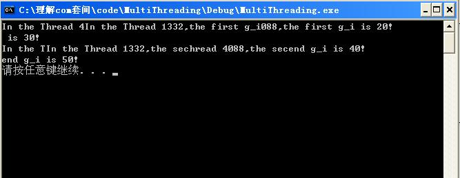  

如何解决这个问题呢？我们需要利用同步机制来控制我们的多线程程序，现在我们使用临界区来解决这个问题。代码如下：（在Code的MultiThreading中将进入临界区和离开临界区的代码前的注释去掉就可以了）  

```c++
#include < iostream >
#include < windows.h >

int g_i = 10;  //一个全局变量
 
CRITICAL_SECTION cs;  //一个临界区变量

DWORD WINAPI ThreadProc(LPVOID lpv)
{
    EnterCriticalSection(&cs);  //进入临界区
    g_i += 10;
    std::cout < <  "In the Thread " < <   ::GetCurrentThreadId() < <   ",the first g_i is "  < <   g_i < <    "!"  < <   std::endl;
    ::LeaveCriticalSection(&cs);
    Sleep(5000); //睡眠
    EnterCriticalSection(&cs);
    g_i += 10;
    std::cout < <    "In the Thread " < <  ::GetCurrentThreadId() < <  ",the secend g_i is "  < <  g_i < <  "!" < <  std::endl;
    ::LeaveCriticalSection(&cs);
    return 0;
}

int main(int argc, char* argv[])
{
    DWORD threadID[2];
    HANDLE hThreads[2];
    InitializeCriticalSection(&cs);
    for(int i = 0; i < = 1; i++ )            //创建两个线程
        hThreads[i] = ::CreateThread(NULL,0,ThreadProc,NULL,0,&threadID[i]);

    WaitForMultipleObjects(2,hThreads,TRUE,INFINITE);   //等待线程结束
    for(i = 0; i < = 1; i++ )
        ::CloseHandle(hThreads[i]);             //关闭线程句柄
        
    system("pause");
    return 0;
}
```

再次运行，结果就是我们所需要的了。   
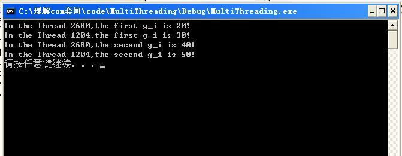  

如上所示我们通过在代码中加入EnterCriticalSection和LeaveCriticalSection来实现对数据的保护，如我们只在程序开头和结尾填加这两个函数的话，也不会太复杂，但是这样也就失去了多线程的意义。程序不会更快，反而会变慢。所以我们必须在所有需要保护的地方，对我们的操作进行保护。程序如果庞大的话，这将是一个烦琐而枯燥的工作，而且很容易出错。如果是我们自己使用的类的话，我们可以选择不使用多线程，但组件是提供给别人用的。开发者无法阻止组件使用者在多线程程序中使用自己提供的组件，这就要求组件必须是多线程安全的。但并不是每个开发者都愿意做这样的工作，微软的COM API设计者为了平衡这个问题，就提出了套间的概念。   

注意：以上只是一个简单的例子，事实上多线程中需要保护的部分一般集中在全局数据和静态数据之上，因为这样的数据每个进程只有一份，如上所示的g_i。（想对多线程程序有更深入的认识，可以找侯捷翻译的《Win32多线程程序设计》看看，90年代出的书，到现在还畅销，足可以说明它的价值）  


##### 套间所要解决的问题 　　  

从多线程的描述中，我们知道，套间所要解决的问题是帮助组件的开发者在实现多线程下调用组件时候的同步问题。我们还是先看一段简短的程序。  

我们首先使用ATL创建一个简单的组件程序，该程序有一个接口(ITestInterface1)，该接口支持一个方法TestFunc1。（该组件可以在附加的源码的“Apartment\TestComObject1”目录下找到）我们通过以下的程序调用该组件。(该程序可以在附加的源码的“Apartment\ErrorUseApartment”目录下找到)  

```c++
#define _WIN32_WINNT 0x0400
#include < windows.h >
#include < iostream >

#include "..\TestComObject1\TestComObject1_i.c"
#include "..\TestComObject1\TestComObject1.h"

DWORD WINAPI ThreadProc(LPVOID lpv)
{
    HRESULT hr = CoInitializeEx(NULL, COINIT_APARTMENTTHREADED);
    if ( FAILED(hr) )
    {
        std::cout << "CoinitializeEx failed!" << std::endl;
        return 0;
    }
    
    ITestInterface1 *pTest = NULL;
    hr = ::CoCreateInstance(CLSID_TestInterface1,0,CLSCTX_INPROC,IID_ITestInterface1,(void**)&pTest);
    if ( FAILED(hr) )
    {
        std::cout << "CoCreateInstance failed!" << std::endl;
        return 0;
    }
    
    hr = pTest->TestFunc1();
    if ( FAILED(hr) )
    {
        std::cout << "TestFunc1 failed!" << std::endl;
        return 0;
    }

    pTest->Release();
    ::CoUninitialize();
    return 0;
}

int main(int argc, char* argv[])
{
    HRESULT hr = CoInitializeEx(NULL, COINIT_APARTMENTTHREADED);

    if ( FAILED(hr) )
    {
        std::cout << "CoinitializeEx failed!" << std::endl;
        return 0;
    }

    ITestInterface1 *pTest = NULL;
    hr = ::CoCreateInstance(CLSID_TestInterface1,0,CLSCTX_INPROC,IID_ITestInterface1,(void**)&pTest);

    if ( FAILED(hr) )
    {
        std::cout << "CoCreateInstance failed!" << std::endl;
        return 0;
    }

    DWORD threadID;
    HANDLE hThreads  =   ::CreateThread(NULL, //创建一个进程
                            0,
                            ThreadProc,
                            NULL,  //将pTest作为一个参数传入新线程
                            0,
                            &threadID);

    hr = pTest->TestFunc1();
    if ( FAILED(hr) )
    {
        std::cout << "TestFunc1 failed!" << std::endl;
        return 0;
    }

    ::WaitForSingleObject(hThreads,INFINITE);   //等待线程结束
    ::CloseHandle(hThreads);                //关闭线程句柄
    pTest->Release();
    ::CoUninitialize();
    
    system("pause");
    return 0;
}
```
该段程序将main中定义的ITestInterface1对象，通过指针传到了新建的线程中。运行该段程序，结果如下，又是一串乱序的文字串。也就是说我们需要在TestComObject1中对TestFunc1进行线程同步控制。但大多数人并不想这样做，因为我们开发的组件大多数情况下并不会在多线程执行。但为了避免低概率事件发生后的不良后果，套间出场了。   

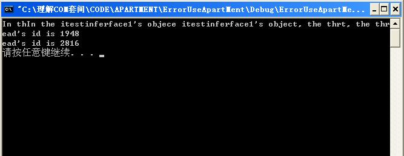  


##### 套间如何实现数据的同步  

我们已经知道套间的目的是用来实现数据的同步，那么套间如何来实现呢？如果我们能保证COM对象中的函数只能在该对象中的另一个函数执行完以后，才能开始执行（也就是说组件中的函数只能一个一个的执行），那么我们的问题就可以解决了。是的，你可以发现，这样的话，就失去了多线程的优势；但套间的目的是保证小概率下的线程安全，损耗一些性能，应该比出现逻辑错误强点。   

那么又如何保证同一对象下的所有方法都必须按顺序逐个执行呢？微软的COM API设计者们借用了Windows的消息机制。我们先来看一下windows的消息机制图。   
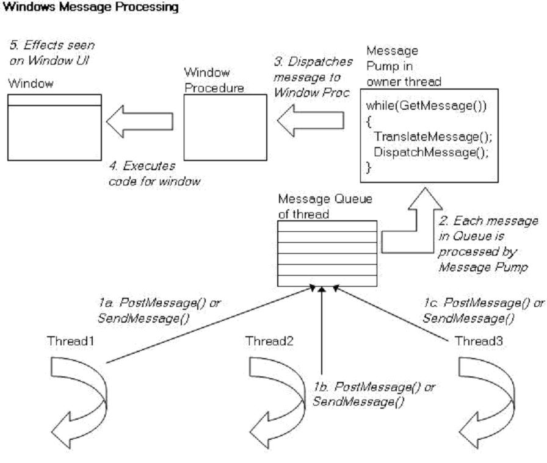  

我们可以看到所有线程发出的消息都回首先放到消息队列中，然后在通过消息循环分发到各自窗口去，而消息队列中的消息只能一个处理完后再处理另一个，借助消息机制，就可以实现COM的函数一个一个的执行，而不会同时运行。Windows的消息机制是通过窗口来实现的，那么一个线程要接收消息，也应该有一个窗口。 COM API的设计者在它们的API函数中实现了一个隐藏的窗口。在我们调用CoInitializeEx(NULL, COINIT_APARTMENTTHREADED)的时候，会生成这个窗口。（如果你对softice等动态调试工具熟悉的话，可以通过跟踪源码来跟踪CoInitializeEx函数，可以发现它会调用API函数CreateWindowEx）。该窗口是隐藏的,有了这个窗口，就可以支持消息机制，就有办法来实现对象中函数的逐一执行。这样当对象指针被传到其它线程的时候，从外部调用该对象的方法的时候，就会先发一个消息到原线程，而不再直接访问对象了。套间的原理大致就是这样。我们再来看看COM中的套间类型。  


##### 套间的类型  
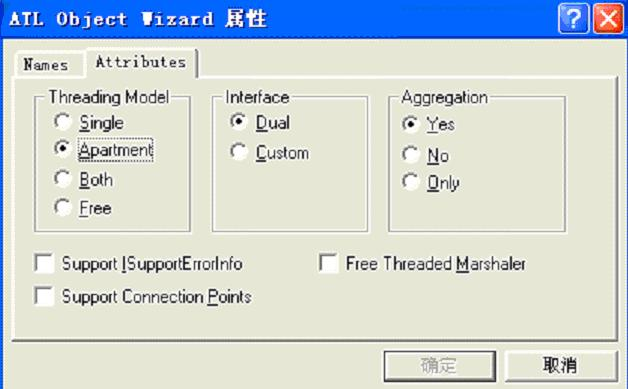  

我们首先看看ATL为我们提供的线程类型：Single，Apartment，Both，Free。我们还是通过例子来说明它们的不同。我们仍然用我们使用刚才实现的TestComObject1来进行测试，先对它实现的唯一方法进行一下说明。  
```c++
STDMETHODIMP CTestInterface1::TestFunc1()
{
    // TODO: Add your implementation code here
    std::cout << "In the itestinferface1''s object, the thread''s id is " << ::GetCurrentThreadId() << std::endl;
    return S_OK;
}
```

该方法非常简单，就是打印出该方法运行时，所在的线程的ID号。如果在不同的线程中调用同一个对象的时候，通过套间，发送消息，最终该对象只应该在一个线程中运行，所以它的线程ID号应该是相同的。我们将通过该ID值来验证套间的存在。  

###### Single  
先来看我们的示例程序（在Code/Apartment/SingleApartment目录下可以找到该工程）：  
```c++
#define _WIN32_WINNT 0x0400

#include < windows.h >
#include < iostream >
#include "..\TestComObject1\TestComObject1_i.c"
#include "..\TestComObject1\TestComObject1.h"

DWORD WINAPI ThreadProc(LPVOID lpv)
{
    HRESULT hr = CoInitializeEx(NULL, COINIT_APARTMENTTHREADED);
    if ( FAILED(hr) )
    {
        std::cout << "CoinitializeEx failed!" << std::endl;
        return 0;
    }

    ITestInterface1 *pTest = NULL;

    hr = ::CoCreateInstance(CLSID_TestInterface1,0,CLSCTX_INPROC,IID_ITestInterface1,(void**)&pTest);
    if ( FAILED(hr) )
    {
        std::cout << "CoCreateInstance failed!" << std::endl;
        return 0;
    }
    hr = pTest->TestFunc1();
    
    if ( FAILED(hr) )
    {
        std::cout << "TestFunc1 failed!" << std::endl;
        return 0;
    }
    pTest->Release();
    ::CoUninitialize();
    return 0;
}

int main(int argc, char* argv[])
{
    HRESULT hr = CoInitializeEx(NULL, COINIT_APARTMENTTHREADED);
    if ( FAILED(hr) )
    {
        std::cout << "CoinitializeEx failed!" << std::endl;
        return 0;
    }
    ITestInterface1 *pTest = NULL;

    hr = ::CoCreateInstance(CLSID_TestInterface1,0,CLSCTX_INPROC,IID_ITestInterface1,(void**)&pTest);
    if ( FAILED(hr) )
    {
        std::cout << "CoCreateInstance failed!" << std::endl;
        return 0;
    }

    hr = pTest->TestFunc1();
    if ( FAILED(hr) )
    {
        std::cout << "TestFunc1 failed!" << std::endl;
        return 0;
    }

    DWORD threadID;
    HANDLE hThreads[1];
    hThreads[0]  =   ::CreateThread(NULL,   //创建一个进程
                        0,
                        ThreadProc,
                        (LPVOID)pTest,  //将pTest作为一个参数传入新线程
                        0,
                        &threadID);

    ::WaitForSingleObject(hThreads,INFINITE);   //等待线程结束
    ::CloseHandle(hThreads);                //关闭线程句柄
    pTest->Release();
    ::CoUninitialize();

    system("pause");
    return 0;
}
```
以下是运行结果：   
  

可以看到，在main中我们创建了一个ITestInterface1接口对象，并调用TestFunc1，此处会输出一个线程ID――ThreadID1。之后主线程生成一个线程，在该线程中，我们会再次生成一个ITestInterface1接口对象，此处再次调用TestFunc1，可以看到输出了另一个线程ID――ThreadID2。因为是不同的对象，所以它们的线程ID号不同。(注意了，此处并没有跨线程调用对象，并不在套间的保护范围)  

好了，我们该来看看Single类型的套间了。如果你和我一样懒，不想为此去写一个single类型的接口，那么打开你的注册表。  
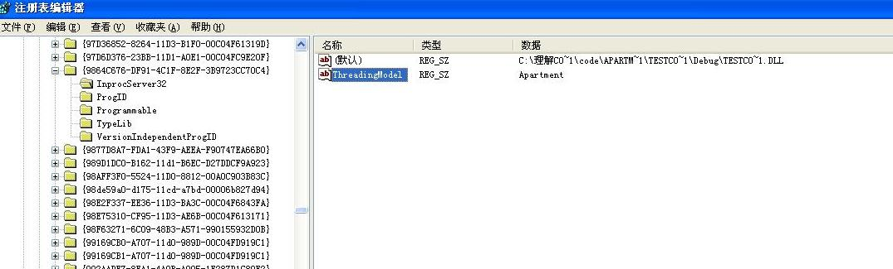  

找到我们的接口ID，在InprocServer32项下，将ThreadingModel的值改为Single，或者将该项删除（这样也代表是Single套间）。我们再来运行该程序，再看运行结果。   
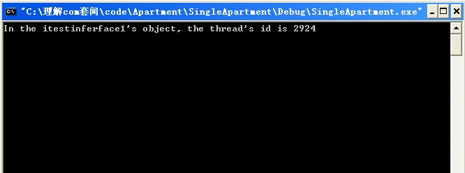  

当打印出一个线程ID的时候，程序就停止了。Why？刚开始，我也被搞的头晕脑胀。到MSDN中查找WaitForSingleObject，原来WaitForSingleObject会破坏程序中的消息机制，这样在创建的线程中，TestFunc1需要通过消息机制来运行，消息机制破坏，就无法运行了。哎！还的再改程序。在查查《Win32多线程程序设计》，原来在GUI中等待线程需要用MsgWaitForMultipleObjects。好的，我们需要重新写一个函数，专门用来实现消息同步。  
```c++
DWORD ApartMentMsgWaitForMultipleObject(HANDLE *hHandle,DWORD dwWaitCout, DWORDdwMilliseconds)
{
    BOOL bQuit = FALSE;
    DWORD dwRet;

    while(!bQuit)
    {
        int rc;
        rc = ::MsgWaitForMultipleObjects(
            dwWaitCout,　// 需要等待的对象数量
            hHandle,    // 对象树组
            FALSE,      //等待所有的对象
            (DWORD)dwMilliseconds,  // 等待的时间
            (DWORD)(QS_ALLINPUT | QS_ALLPOSTMESSAGE)　　// 事件类型　　 
        );

        //等待的事件激发
        if( rc ==  WAIT_OBJECT_0 ) {          
            dwRet = rc;
            bQuit = TRUE;
        }else if( rc == WAIT_OBJECT_0 + dwWaitCout ){//其他windows消息        

            MSG msg;
            while (PeekMessage(&msg, NULL, 0, 0, PM_REMOVE))
            {
                TranslateMessage (&msg);
                DispatchMessage(&msg)
            }          
        }
    }
    return dwRet;
}
```

该函数用来处理消息的同步，也够麻烦的，还需要自己写这段程序。这段程序的意思是如果等待的事件被激发，那么设置bQuit为TURE，那么退出消息循环。如果接收到其它的消息的话，再分发出去。好了，把我们的程序再改一下：  
```c++
//  ::WaitForSingleObject(hThreads,INFINITE);   //等待线程结束
ApartMentMsgWaitForMultipleObject(hThreads,1,INFINITE);
```
我们再来看一下运行结果。   
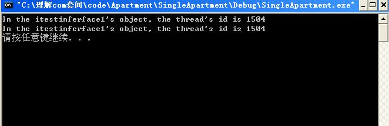  

我们可以看到两处调用TestFunc1，得到的线程ID是相同的。我们再通过VC的调试功能来看看第二个TestFunc1的运行过程。我们在两个TesfFunc1调用处设置断点，然后通过F11跟踪进TestFunc1来看看它的调用过程。以下是在Main中的调用过程。  
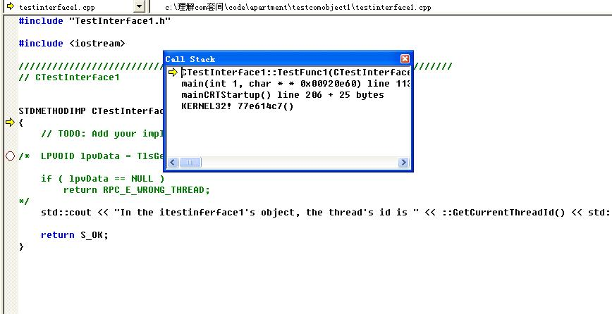  
通过Call Stack，我们可以看到，此处是在main中直接调用的。我们再来看第二处调用：  
  

我们可以看到TestFunc1的调用需要通过一连串的API方法来实现。你感兴趣的话，可以通过反汇编的方法来跟踪一下这些API，看看它们具体实现了什么，这里我们可以看到这些函数在dll中的大致位置，你可以使用W32DASM等反汇编工具打开这些dll，大致研究一下这些函数。  

好了，我们已经看到了Single套间的作用。那么Single套间究竟是什么意思呢？就是说每个被标志为Single的接口，在一个进程中只会存活在一个套间中。该套间就是进程创建的第一个套间。你可以将Main中与pTest相关的代码都去掉，只保留CoInitializeEx(NULL, COINIT_APARTMENTTHREADED)和线程的创建，再次运行该程序，可以发现创建线程中的TestFunc1仍然是通过消息来实现的。  

好了看过了Single，我们还是在注册表中，将ThreadingModel改为Apartment。通过修改注册表就可以实现对套间类型的控制，证明了套间和我们的程序本身没有什么关系，ATL的选项所做的作用也只是通过它来添加注册表。套间只是对系统的一种提示，由COM API通过注册表信息来帮我们实现套间。  

###### Apartment  
在第二部分（套间所要解决的问题），我们曾经提供了一个不同线程共享接口对象的方法，该方法是错误的（我们也可以通过程序阻止这种用法，稍候再叙）。此处我们提供一种正确的做法。以下代码在Apartment/Apartmenttest下可以找到。  
```c++
#define _WIN32_WINNT 0x0400

#include < windows.h >
#include < iostream >
#include "..\TestComObject1\TestComObject1_i.c"
#include "..\TestComObject1\TestComObject1.h"

DWORD WINAPI ThreadProc(LPVOID lpv)
{
	//HRESULT hr = CoInitializeEx(NULL, COINIT_APARTMENTTHREADED);
	HRESULT hr = CoInitializeEx(NULL, COINIT_MULTITHREADED);

	if ( FAILED(hr) )
	{
		std::cout << "CoinitializeEx failed!" << std::endl;
		return 0;
	}

	IStream *pStream = (IStream*)lpv;
	ITestInterface1 *pTest = NULL;

	hr = ::CoGetInterfaceAndReleaseStream(pStream,IID_ITestInterface1,(void**)&pTest);
	if ( FAILED(hr) )
	{
		std::cout << "CoGetInterfaceAndReleaseStream failed!" << std::endl;
		return 0;
	}

	hr = pTest->TestFunc1();
	if ( FAILED(hr) )
	{
		std::cout << "TestFunc1 failed!" << std::endl;
		return 0;
	}

	pTest->Release();
	::CoUninitialize();
	return 0;
}

 
DWORD ApartMentMsgWaitForMultipleObject(HANDLE *hHandle,DWORD dwWaitCout, DWORDdwMilliseconds)
{
	BOOL bQuit = FALSE;
	DWORD dwRet;
	 
	while(!bQuit)
	{
		int rc;
		rc = ::MsgWaitForMultipleObjects
				(
				dwWaitCout,　　　　// 需要等待的对象数量
				hHandle,            // 对象树组
				FALSE,              //等待所有的对象
				(DWORD)dwMilliseconds,  // 等待的时间
				(DWORD)(QS_ALLINPUT | QS_ALLPOSTMESSAGE)　　// 事件类型　　 
				);

	 
		if( rc ==  WAIT_OBJECT_0 ){          
			dwRet = rc;
			bQuit = TRUE;
		}else if( rc == WAIT_OBJECT_0 + dwWaitCout )        {
			MSG msg;
			while (PeekMessage(&msg, NULL, 0, 0, PM_REMOVE))
			{
			　　TranslateMessage (&msg);
			　　DispatchMessage(&msg);
			}          
		}
	}
	return dwRet;
}

 

int main(int argc, char* argv[])
{
	//HRESULT hr = CoInitializeEx(NULL, COINIT_APARTMENTTHREADED);
	HRESULT hr = CoInitializeEx(NULL, COINIT_MULTITHREADED);

	if ( FAILED(hr) )
	{
		std::cout << "CoinitializeEx failed!" << std::endl;
		return 0;
	}

	ITestInterface1 *pTest = NULL;
	hr = ::CoCreateInstance(CLSID_TestInterface1,0,CLSCTX_INPROC,IID_ITestInterface1,(void**)&pTest);

	if ( FAILED(hr) )
	{
		std::cout << "CoCreateInstance failed!" << std::endl;
		return 0;
	}

	hr = pTest->TestFunc1();
	if ( FAILED(hr) )
	{
		std::cout << "TestFunc1 failed!" << std::endl;
		return 0;
	}

	IStream *pStream = NULL;
	hr = ::CoMarshalInterThreadInterfaceInStream(IID_ITestInterface1,pTest,&pStream);

	if ( FAILED(hr) )
	{
		std::cout << "CoMarshalInterThreadInterfaceInStream failed!" << std::endl;
		return 0;
	}

	DWORD threadID;
	HANDLE hThreads[1];
	hThreads[0]  =   ::CreateThread(NULL,           //创建一个进程
	　　　　0,
	　　　　ThreadProc,
	　　　　(LPVOID)pStream,  //将pStream作为一个参数传入新线程
	　　　　0,
	　　　　&threadID);
	ApartMentMsgWaitForMultipleObject(hThreads,1,INFINITE);
	::CloseHandle(hThreads);                //关闭线程句柄
	pTest->Release();
	::CoUninitialize();

	system("pause");
	return 0;

}
```

我们通过CoGetInterfaceAndReleaseStream将main中的pTest变为pStream，然后将pStream作为参数传入到线程中，然后再通过CoGetInterfaceAndReleaseStream将pSteam变为接口指针。再来看看运行的结果：  
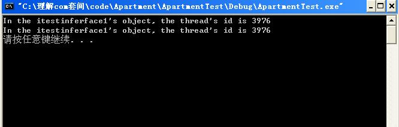  

可以看到两次运行，线程ID是相同的。好的，我们接着改变注册表，再将Apartment变为Free。然后再将两处的`HRESULT hr = CoInitializeEx(NULL, COINIT_APARTMENTTHREADED);`改为`HRESULT hr = CoInitializeEx(NULL, COINIT_MULTITHREADED)。`编译后再次执行该程序，再来看执行结果。  
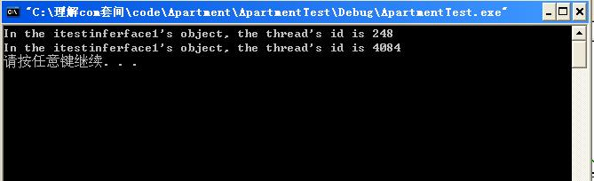  

我们可以看到两个线程的ID是不同的。你可以通过VC的Debug来看这两组程序的TesFunc1的调用情况，在第二种情况下，创建的线程中不会通过消息机制来调用该函数。   
通过对比，我们可以知道所说的套间，就是通过消息机制来控制不同线程中对对象的调用。这样就不需要组件的实现者来实现数据的同步。  

###### Free  

上节的例子，已经为我们提示了我们Free套间，其实系统对我们的组件不做控制，这样就需要组件的开发者对数据的同步做出控制。  

###### Both  
所谓Both，就是说该对象既可以运行在Apartment中，也可以运行在Free套间中。该类型的前提是它应该是Free类型的套间，也就是说组件自己实现了数据的同步。然后设置成Both类型。   

为什么需要Both类型的套间呢？想想假如我们在我们的组件中调用另一个组件，这样我们就需要在我们的组件中为所调用的组件来开辟一个套间。我们的套间是一个Apartment，而调用的组件是Free类型的，这样这两个对象就必须存在于不同的两个套间中。而跨套间的调用，需要通过中间代理来实现，这样必然会损失性能。但如果我们调用的套间类型是Both的话，它就可以和我们的组件同享一个套间，这样就可以提高效率。  

##### 缺省套间  
继续我们的测试，首先在注册表中将我们的接口类型改回Apartment。然后新建一个工程DefaultApartment。C++文件中的实现代码如下。  
```c++
#define _WIN32_WINNT 0x0400

#include < windows.h >
#include < iostream >

#include "..\TestComObject1\TestComObject1_i.c"
#include "..\TestComObject1\TestComObject1.h"

DWORD WINAPI ThreadProc(LPVOID lpv)
{
	HRESULT hr = CoInitializeEx(NULL, COINIT_APARTMENTTHREADED);
	//HRESULT hr = CoInitializeEx(NULL, COINIT_MULTITHREADED);

	if ( FAILED(hr) )
	{
		std::cout << "CoinitializeEx failed!" << std::endl;
		return 0;
	}

	IStream *pStream = (IStream*)lpv;
	ITestInterface1 *pTest = NULL;
	hr = ::CoGetInterfaceAndReleaseStream(pStream,IID_ITestInterface1,(void**)&pTest);

	if ( FAILED(hr) )
	{
		std::cout << "CoGetInterfaceAndReleaseStream failed!" << std::endl;
		return 0;
	}

	std::cout << "ThradProc''s threadid is " << ::GetCurrentThreadId() << std::endl; //输出ThradProc的线程ID
	hr = pTest->TestFunc1();

	if ( FAILED(hr) )
	{
		std::cout << "TestFunc1 failed!" << std::endl;
		return 0;
	}

	pTest->Release();
	::CoUninitialize();

	return 0;

}


DWORD ApartMentMsgWaitForMultipleObject(HANDLE *hHandle,DWORD dwWaitCout, DWORDdwMilliseconds)
{

	BOOL bQuit = FALSE;
	DWORD dwRet;

	while(!bQuit)
	{
		int rc;
		rc = ::MsgWaitForMultipleObjects
		(
			dwWaitCout,　　　　// 需要等待的对象数量
			hHandle,            // 对象树组
			FALSE,              //等待所有的对象
			(DWORD)dwMilliseconds,  // 等待的时间
			(DWORD)(QS_ALLINPUT | QS_ALLPOSTMESSAGE)　　// 事件类型　　 
		);

	 

		if( rc ==  WAIT_OBJECT_0 ){          
			dwRet = rc;
			bQuit = TRUE;
		}else if( rc == WAIT_OBJECT_0 + dwWaitCout ){

			MSG msg;
			while (PeekMessage(&msg, NULL, 0, 0, PM_REMOVE))
			{
			　　TranslateMessage (&msg);
			　　DispatchMessage(&msg);
			}          
		}

	}

	return dwRet;

}

 

int main(int argc, char* argv[])
{
	HRESULT hr = CoInitializeEx(NULL, COINIT_APARTMENTTHREADED);
	//HRESULT hr = CoInitializeEx(NULL, COINIT_MULTITHREADED);

	if ( FAILED(hr) )
	{
		std::cout << "CoinitializeEx failed!" << std::endl;
		return 0;
	}

	ITestInterface1 *pTest = NULL;
	hr = ::CoCreateInstance(CLSID_TestInterface1,0,CLSCTX_INPROC,IID_ITestInterface1,(void**)&pTest);

	if ( FAILED(hr) )
	{
		std::cout << "CoCreateInstance failed!" << std::endl;
		return 0;
	}

	std::cout << "main''s threadid is " << ::GetCurrentThreadId() << std::endl; //打印main的线程ID
	hr = pTest->TestFunc1();

	if ( FAILED(hr) )
	{
		std::cout << "TestFunc1 failed!" << std::endl;
		return 0;
	}

	IStream *pStream = NULL;
	hr = ::CoMarshalInterThreadInterfaceInStream(IID_ITestInterface1,pTest,&pStream);

	if ( FAILED(hr) )
	{
		std::cout << "CoMarshalInterThreadInterfaceInStream failed!" << std::endl;
		return 0;
	}

	DWORD threadID;
	HANDLE hThreads[1];
	hThreads[0] =   ::CreateThread(NULL,            //创建一个进程
	　　　　0,
	　　　　ThreadProc,
	　　　　(LPVOID)pStream,  //将pStream作为一个参数传入新线程
	　　　　0,
	　　　　&threadID);

	ApartMentMsgWaitForMultipleObject(hThreads,1,INFINITE);
	::CloseHandle(hThreads);                //关闭线程句柄
	pTest->Release();
	::CoUninitialize();

	system("pause");
	return 0;

}
```

此部分代码与我们测试Apartment时的代码基本相同，只是新增了输出main和创建线程的ID的语句。好的，我们来运行程序，可以得到如下的结果：  
  
我们可以看到main的线程ID和两个TestFunc1的线程ID相同。也就是说两个TestFunc1都是在main的线程中运行的。   
将我们的程序做些变动，将`CoInitializeEx(NULL, COINIT_APARTMENTTHREADED)`改为` CoInitializeEx(NULL, COINIT_MULTITHREADED)`。然后接着运行程序。我们再来看运行的结果。  
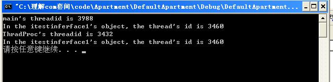  

我们可以看到两个TestFunc1的线程ID和main的不同了，和我们创建的线程也不同。这是为什么呢？CoInitializeEx是一个创建套间的过程，我们使用CoInitializeEx(NULL, COINIT_MULTITHREADED)后，没有为我们的组件创建合适的套间。这时候系统（也就是COM API，这里应该是通过CoCreateInstance来实现的）就会帮我们将我们的接口对象放入缺省套间，该套间并不运行在当前的线程中。我们再次在Debug下跟踪运行过程，可以发现在main中调用TestFunc1，也需要通过众多的API函数帮助完成，也就是说此处也是通过消息机制来完成的，这样性能上肯定会有影响。  

##### 阻止接口指针的非法使用  
在第二部分我们给出了一个通过直接传输接口指针到另外线程的例子，事实上这种方法是错误的，但COM API并没有帮助我们阻止这样的错误。这个任务可以由我们自己来完成。  

因为套间是和线程相关的，Apartment类型的接口方法只应该运行在一个套间中（其实这就是一个协议，并不是强制性的），那么我们可以通过线程的相关性质来实现。  

在线程中我们可以通过Thread Local Storage（TLS）来保存线程的相关信息，同一函数运行在不同的线程中，那么它所拥有的TLS也不相同。  

我们来动手改造我们的类实现，将CTestferface1进行改造。  
```c++
class ATL_NO_VTABLE CTestInterface1 :public CComObjectRootEx,public CComCoClass,public IDispatchImpl
{
private:
    DWORD dwTlsIndex;
public:
    CTestInterface1()
    {
        dwTlsIndex = TlsAlloc();
        HLOCAL l =  LocalAlloc(LMEM_FIXED, 1);
        TlsSetValue(dwTlsIndex, l);　　 
    }
```
我们先声明一个私有成员变量dwTlsIndex，它用来存放TLS的索引值（一个线程的TLS相当于一个数组，可以存放不同的数据）。再将构造函数中填入保存数据的代码。此处只是简单的分配了一个字节的地址，并将该地址通过TlsSetValue保存到TLS中去。  

然后再改造我们的TestFunc1函数。如下：  
```c++
STDMETHODIMP CTestInterface1::TestFunc1()
{
    // TODO: Add your implementation code here
    LPVOID lpvData = TlsGetValue(dwTlsIndex);
    if ( lpvData == NULL )
        return RPC_E_WRONG_THREAD;
    std::cout << "In the itestinferface1''s object, the thread''s id is " << ::GetCurrentThreadId() << std::endl;
    return S_OK;
}
```

这边也很简单，就是简单的通过TlsGetValue去尝试得到dwTlsIndex所标志的内容是否存在。如果不存在，那么就说明程序运行在了不同的套间中。就会返回RPC_E_WRONG_THREAD，这是COM设计者定义的宏，表示线程的非法使用。（由于我的懒惰，不再写新的COM了，只是简单的修改了TestComObject1，这部分新加的代码被我注释掉了，你如果想看这部分的效果，去掉注释就可以了）  

我们再运行ErrorUseApartment程序，发现TestFunc1已经无法输出线程号，而是直接返回RPC_E_WRONG_THREAD。再次运行ApartmentTest程序，发现这样的处理对它并没有影响。仍然正常运行。  

##### 什么是套间？  
我们从外部表现上对套间进行了了解，而套间究竟是什么？潘爱民译的《Com 本质论》说：套间既不是进程，也不是线程，然而套间拥有进程和线程的某些特性。我觉得，这句话翻译的不到位，总让人感觉套间似乎是和进程或者线程等同的东西。找来原文看看：An apartment is neither a process nor a thread; however, apartments share some of the properties of both。这里的share被译成了拥有，但我感觉此处翻译为使用或者分享可能更贴切一些。不过原文事实上也很容易给初学者带来误导。其实套间只是保存在线程中的一个数据结构（还有一个隐藏着的窗口），借用该结构使套间和线程之间建立起某种关系，通过该关系，使得COM API通过该信息可以建立不同套间中的调用机制。这部分涉及到列集，散集（我们调用CoMarshalInterThreadInterfaceInStream，CoGetInterfaceAndReleaseStream的过程）。在列集和散集过程中，COM API会帮我们建立一个不同套间中对象通信机制，这部分涉及到了代理，存根和通道的内容。通过代理来发送调用信息，通过通道发送到存根，再通过存根调用实际的方法（其实那个隐藏的窗口就是为存根来服务的）。所做的这一切不过是为了实现不同套间中可以通过消息来调用对象。你可以找《Com 本质论》来看看，这部分的内容比较繁杂，但我感觉比起套间的概念，还是比较容易的。  

具体实现套间，在线程的TLS究竟保存了什么信息呢？罪恶的微软隐藏了这边部分内容，我们无法得到这部分的材料。这可能也是套间理解起来如此困难的一个原因，套间呈现给我们的是一个抽象的概念。但理解其实际意义后，抽不抽象已经没什么关系，因为它所隐藏的不过是创建和使用套间时候繁杂的调用其它API函数的过程，事实上并没有太多的神秘可言。对我们开发者来说，能明白套间的意义，已经足够了。  
  
  好了，稍微总结一下：套间是保存在线程的TLS中的一个数据结构，通过该结构可以帮助不同的套间之间通过消息机制来实现函数的调用，以保证多线程环境下，数据的同步。  
