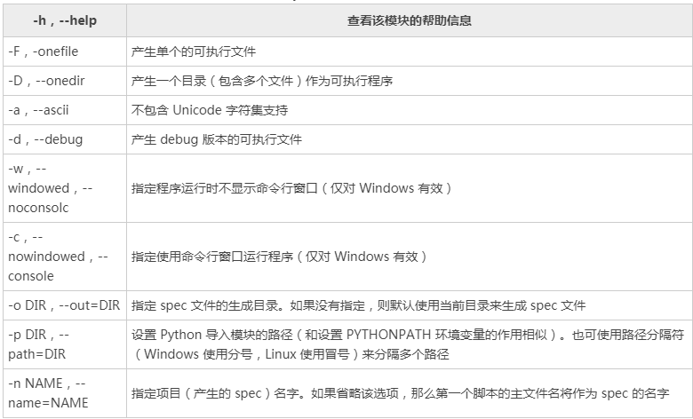

在创建了独立应用（自包含该应用的依赖包）之后，还可以使用 PyInstaller 将 [Python](/python/) 程序生成可直接运行的程序，这个程序就可以被分发到对应的 Windows 或 Mac OS X 平台上运行。  

# 1.安装 PyInstalle
-------------

Python 默认并不包含 PyInstaller 模块，因此需要自行安装 PyInstaller 模块。  
  
安装 PyInstaller 模块与安装其他 Python 模块一样，使用 pip 命令安装即可。在命令行输入如下命令：  

`pip install pyinstaller`

强烈建议使用 pip 在线安装的方式来安装 PyInstaller 模块，不要使用离线包的方式来安装，因为 PyInstaller 模块还依赖其他模块，pip 在安装 PyInstaller 模块时会先安装它的依赖模块。  
  
运行上面命令，应该看到如下输出结果：

`Successfully installed pyinstaller-x.x.x`

其中的 x.x.x 代表 PyInstaller 的版本。  
  
在 PyInstaller 模块安装成功之后，在 Python 的安装目录下的 `Scripts(D:\Python\Python36\Scripts)` 目录下会增加一个 pyinstaller.exe 程序，接下来就可以使用该工具将 Python 程序生成 EXE 程序了。  

# 2.PyInstaller生成可执行程序
------------------

PyInstaller 工具的命令语法如下：  

`pyinstaller 选项 Python 源文件`

不管这个 Python 应用是单文件的应用，还是多文件的应用，只要在使用 pyinstaller 命令时编译作为程序入口的 Python 程序即可。  

PyInstaller工具是跨平台的，它既可以在 Windows平台上使用，也可以在 Mac OS X 平台上运行。在不同的平台上使用 PyInstaller 工具的方法是一样的，它们支持的选项也是一样的。

下面先创建一个 app 目录，在该目录下创建一个 app.py 文件，文件中包含如下代码：  

```python
from say_hello import *
def main():
    print('程序开始执行')
    print(say_hello('孙悟空'))
# 增加调用main()函数
if __name__ == '__main__':
    main()
```

接下来使用命令行工具进入到此 app 目录下，执行如下命令：  

`pyinstaller -F app.py`

执行上面命令，将看到详细的生成过程。当生成完成后，将会在此 app 目录下看到多了一个 dist 目录，并在该目录下看到有一个 app.exe 文件，这就是使用 PyInstaller 工具生成的 EXE 程序。  
  
在命令行窗口中进入 dist 目录下，在该目录执行 app.exe ，将会看到该程序生成如下输出结果：

`程序开始执行  
孙悟空，您好！`

由于该程序没有图形用户界面，因此如果读者试图通过双击来运行该程序，则只能看到程序窗口一闪就消失了，这样将无法看到该程序的输出结果。  
  
在上面命令中使用了-F 选项，该选项指定生成单独的 EXE 文件，因此，在 dist 目录下生成了一个单独的大约为 6MB 的 app.exe 文件（在 Mac OS X 平台上生成的文件就叫 app，没有后缀）；与 -F 选项对应的是 -D 选项（默认选项），该选项指定生成一个目录（包含多个文件）来作为程序。  
  
下面先将 PyInstaller 工具在 app 目录下生成的 build、dist 目录删除，并将 app.spec 文件也删除，然后使用如下命令来生成 EXE 文件。  

`pyinstaller -D app.py`

执行上面命令，将看到详细的生成过程。当生成完成后，将会在 app 目录下看到多了一个 dist 目录，并在该目录下看到有一个 app 子目录，在该子目录下包含了大量 .dll 文件和 .pyz 文件，它们都是 app.exe 程序的支撑文件。在命令行窗口中运行该 app.exe 程序，同样可以看到与前一个 app.exe 程序相同的输出结果。  
  
PyInstaller 不仅支持 -F、-D 选项，而且也支持如表 1 所示的常用选项。  
  


在表 1 中列出的只是 PyInstaller 模块所支持的常用选项，如果需要了解 PyInstaller 选项的详细信息，则可通过 pyinstaller -h 来查看。

  
下面再创建一个带图形用户界面，可以访问 [MySQL](/mysql/) 数据库的应用程序。  
  
在 app 当前所在目录再创建一个 dbapp 目录，并在该目录下创建 Python 程序，其中 exec\_select.py 程序负责查询数据，main.py 程序负责创建图形用户界面来显示查询结果。  
  
exec\_select.py 文件包含的代码如下：

```python
# 导入访问MySQL的模块
import mysql.connector
def query_db():
    # ①、连接数据库
    conn = conn = mysql.connector.connect(user='root', password='32147',
        host='localhost', port='3306',
        database='python', use_unicode=True)
    # ②、获取游标
    c = conn.cursor()
    # ③、调用执行select语句查询数据
    c.execute('select * from user_tb where user_id > %s', (2,))
    # 通过游标的description属性获取列信息
    description = c.description
    # 使用fetchall获取游标中的所有结果集
    rows = c.fetchall()
    # ④、关闭游标
    c.close()
    # ⑤、关闭连接
    conn.close()
    return description, rows
```

mian.py 文件包含的代码如下：

```python
from exec_select import *
from tkinter import *
def main():
    description, rows = query_db()
    # 创建窗口
    win = Tk()
    win.title('数据库查询')
    # 通过description获取列信息
    for i, col in enumerate(description):
        lb = Button(win, text=col[0], padx=50, pady=6)
        lb.grid(row=0, column=i)
    # 直接使用for循环查询得到的结果集
    for i, row in enumerate(rows):
        for j in range(len(row)):
            en = Label(win, text=row[j])
            en.grid(row=i+1, column=j)
    win.mainloop()
if __name__ == '__main__':
    main()
```
通过命令行工具进入 dbapp 目录下，在该目录下执行如下命令：

`Pyinstaller -F -w main.py`

上面命令中的 -F 选项指定生成单个的可执行程序，-w 选项指定生成图形用户界面程序（不需要命令行界面）。运行上面命令，该工具同样在 dbapp 目录下生成了一个 dist 子目录，并在该子目录下生成了一个 main.exe 文件。  

直接双击运行 main.exe 程序（该程序有图形用户界面，因此可以双击运行），读者可自行查看运行结果。