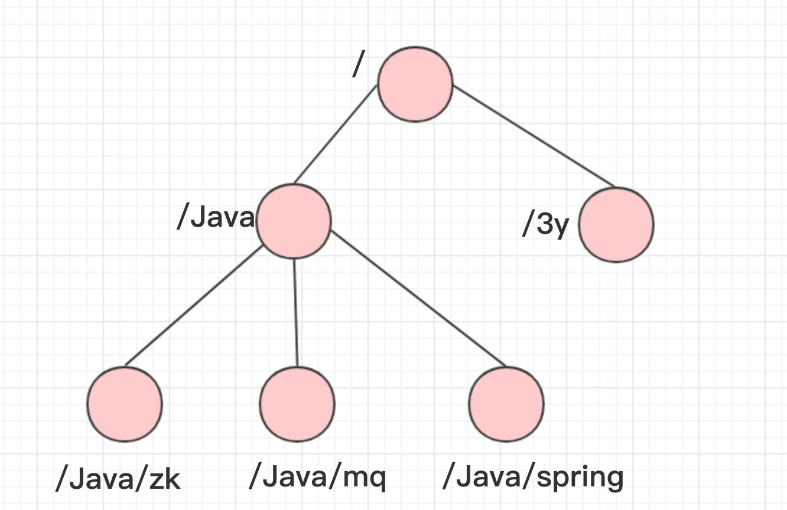
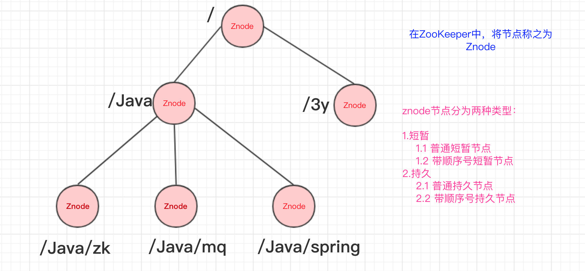
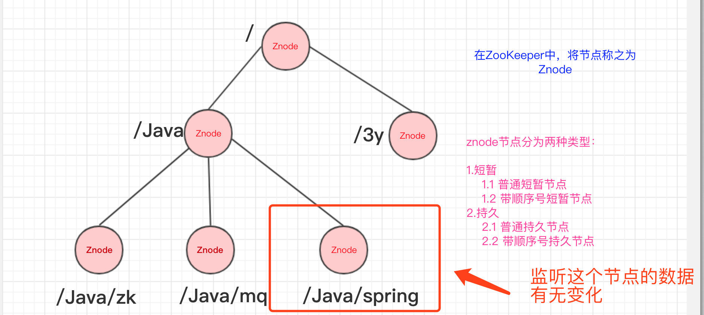
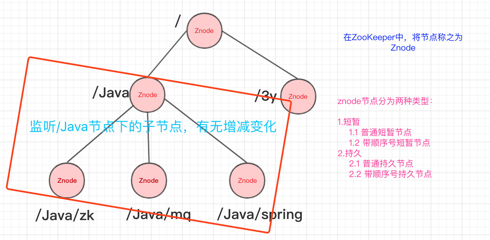
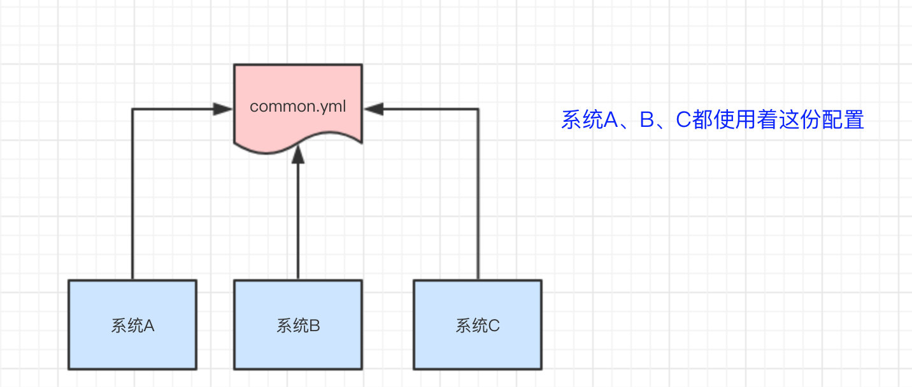
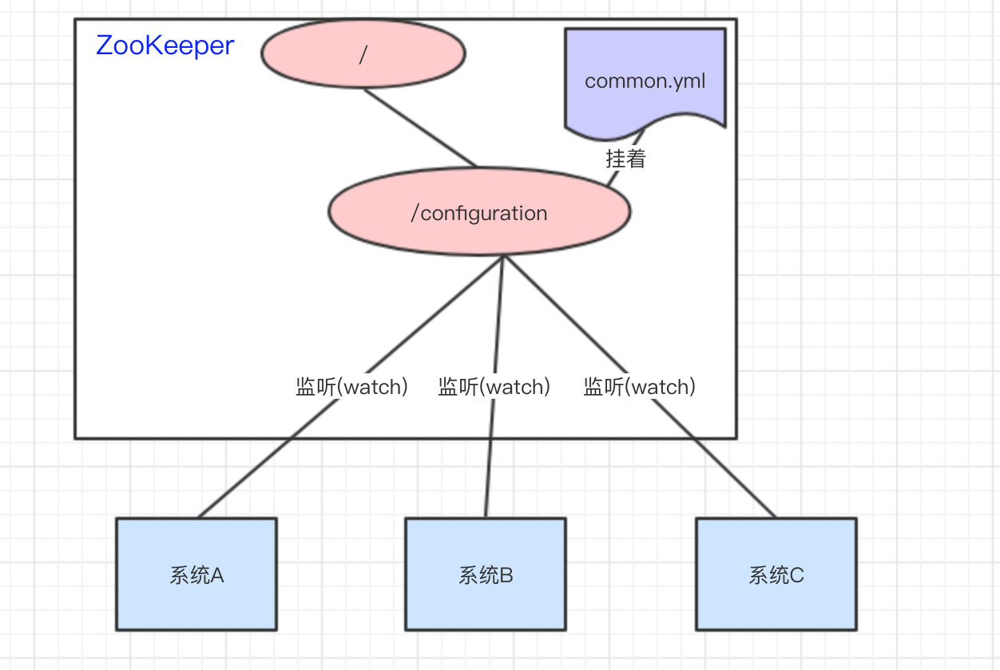
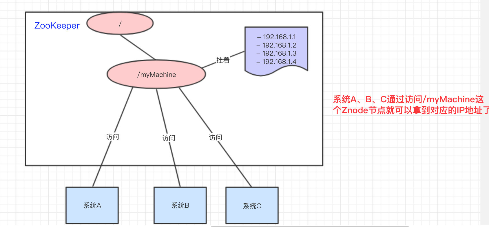
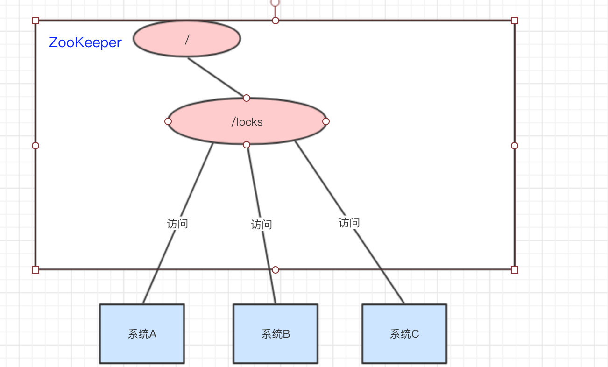
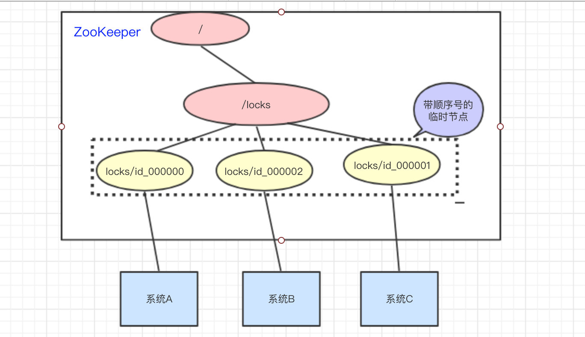
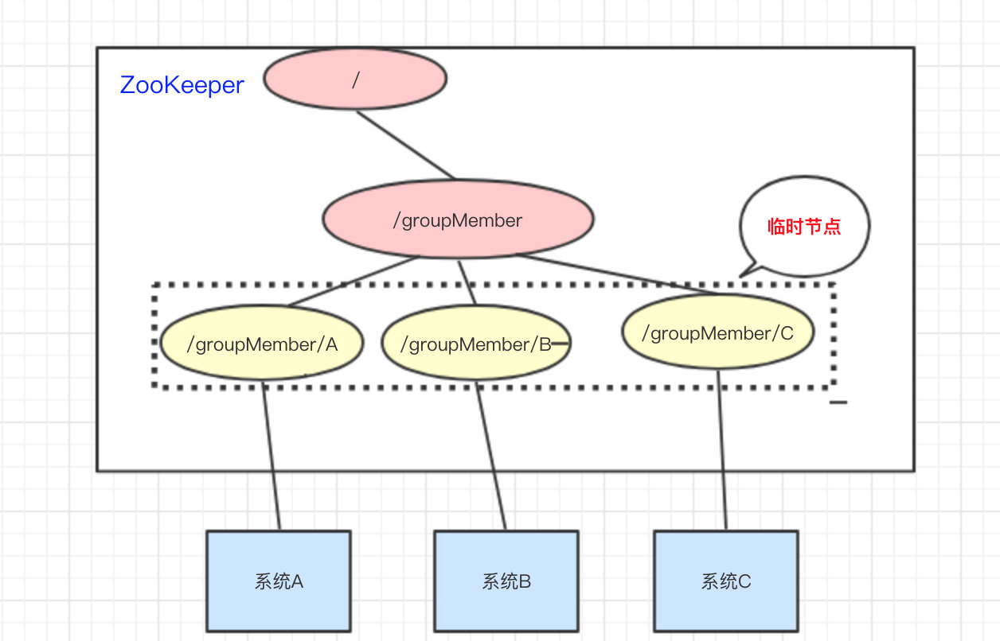

###### 介绍  

* ZooKeeper主要服务于分布式系统，可以用ZooKeeper来做：统一配置管理、统一命名服务、分布式锁、集群管理。  
* 使用分布式系统就无法避免对节点管理的问题(需要实时感知节点的状态、对节点进行统一管理等等)，而由于这些问题处理起来可能相对麻烦和提高了系统的复杂性，ZooKeeper作为一个能够通用解决这些问题的中间件就应运而生了。  

ZooKeeper的数据结构，跟Unix文件系统非常类似，可以看做是一颗`树`，每个节点叫做`ZNode`。每一个节点可以通过路径来标识，结构图如下：  
  

那ZooKeeper这颗"树"有什么特点呢？？ZooKeeper的节点我们称之为Znode，Znode分为两种类型：  

* 短暂/临时(Ephemeral)：当客户端和服务端断开连接后，所创建的Znode(节点)会自动删除
* 持久(Persistent)：当客户端和服务端断开连接后，所创建的Znode(节点)不会删除  

`ZooKeeper和Redis一样，也是C/S结构(分成客户端和服务端)`
  

###### 监听器  
在上面我们已经简单知道了ZooKeeper的数据结构了，ZooKeeper还配合了监听器才能够做那么多事的。  
常见的监听场景有以下两项：  

* 监听Znode节点的数据变化
* 监听子节点的增减变化  

  
  

没错，通过监听+Znode节点(持久/短暂[临时])，ZooKeeper就可以玩出这么多花样了。  

###### ZooKeeper是怎么做到的  
下面我们来看看用ZooKeeper怎么来做：统一配置管理、统一命名服务、分布式锁、集群管理。  

1. 统一配置管理  
比如我们现在有三个系统A、B、C，他们有三份配置，分别是`ASystem.yml、BSystem.yml、CSystem.yml`，然后，这三份配置又非常类似，很多的配置项几乎都一样。  
    * 此时，如果我们要改变其中一份配置项的信息，很可能其他两份都要改。并且，改变了配置项的信息很可能就要重启系统  
    于是，我们希望把`ASystem.yml、BSystem.yml、CSystem.yml`相同的配置项抽取出来成一份公用的配置common.yml，并且即便common.yml改了，也不需要系统A、B、C重启。  
      
    做法：我们可以将common.yml这份配置放在ZooKeeper的Znode节点中，系统A、B、C监听着这个Znode节点有无变更，如果变更了，及时响应。  
      
    参考资料：  
    * 基于zookeeper实现统一配置管理  
        https://blog.csdn.net/u011320740/article/details/78742625  

2. 统一命名服务  
    统一命名服务的理解其实跟域名一样，是我们为这某一部分的资源给它取一个名字，别人通过这个名字就可以拿到对应的资源。  
    比如说，现在我有一个域名www.java3y.com，但我这个域名下有多台机器：  
    * 192.168.1.1
    * 192.168.1.2
    * 192.168.1.3
    * 192.168.1.4  
    别人访问www.java3y.com即可访问到我的机器，而不是通过IP去访问。  
      

3.  分布式锁  
    锁的概念在这我就不说了，如果对锁概念还不太了解的同学，可参考下面的文章  
    * [Java锁？分布式锁？乐观锁？行锁？](https://mp.weixin.qq.com/s?__biz=MzI4Njg5MDA5NA==&mid=2247484989&idx=1&sn=7beaa0db8b29cc8758c7846fe04dfbd2&chksm=ebd7473cdca0ce2a7aea8e6e2a22a5c183b8be3f1cdc93f8d7c3842a560eb5668071cebe5e37&token=948022247&lang=zh_CN#rd)  
    
    我们可以使用ZooKeeper来实现分布式锁，那是怎么做的呢？？下面来看看：
    系统A、B、C都去访问/locks节点  
      

访问的时候会创建带顺序号的临时/短暂(EPHEMERAL_SEQUENTIAL)节点，比如，系统A创建了id_000000节点，系统B创建了id_000002节点，系统C创建了id_000001节点。  

  

接着，拿到/locks节点下的所有子节点(id_000000,id_000001,id_000002)，判断自己创建的是不是最小的那个节点  
    
   * 如果是，则拿到锁。  
       * 释放锁：执行完操作后，把创建的节点给删掉  
   * 如果不是，则监听比自己要小1的节点变化  

举个例子：  
    
   * 系统A拿到/locks节点下的所有子节点，经过比较，发现自己(id_000000)，是所有子节点最小的。所以得到锁
   * 系统B拿到/locks节点下的所有子节点，经过比较，发现自己(id_000002)，不是所有子节点最小的。所以监听比自己小1的节点id_000001的状态
   * 系统C拿到/locks节点下的所有子节点，经过比较，发现自己(id_000001)，不是所有子节点最小的。所以监听比自己小1的节点id_000000的状态
   * …...
   * 等到系统A执行完操作以后，将自己创建的节点删除(id_000000)。通过监听，系统C发现id_000000节点已经删除了，发现自己已经是最小的节点了，于是顺利拿到锁
   * ….系统B如上  
     

4. 集群状态  
    经过上面几个例子，我相信大家也很容易想到ZooKeeper是怎么"感知"节点的动态新增或者删除的了。  
    还是以我们三个系统A、B、C为例，在ZooKeeper中创建临时节点即可：  
      
    只要系统A挂了，那/groupMember/A这个节点就会删除，通过监听groupMember下的子节点，系统B和C就能够感知到系统A已经挂了。(新增也是同理)  
    除了能够感知节点的上下线变化，ZooKeeper还可以实现动态选举Master的功能。(如果集群是主从架构模式下)  
    原理也很简单，如果想要实现动态选举Master的功能，Znode节点的类型是带顺序号的临时节点(EPHEMERAL_SEQUENTIAL)就好了。  
    * ookeeper会每次选举最小编号的作为Master，如果Master挂了，自然对应的Znode节点就会删除。然后让新的最小编号作为Master，这样就可以实现动态选举的功能了。  

###### 最后  
这篇文章主要讲解了ZooKeeper的入门相关的知识，ZooKeeper通过Znode的节点类型+监听机制就实现那么多好用的功能了！  

参考资料：  

* [分布式服务框架 Zookeeper](https://www.ibm.com/developerworks/cn/opensource/os-cn-zookeeper/index.html)
* [ZooKeeper初识整理(老酒装新瓶)](https://lxkaka.wang/2017/12/21/zookeeper/)
* [ZooKeeper](https://www.cnblogs.com/sunshine-long/p/9057191.html)
* [ZooKeeper 的应用场景](https://zhuanlan.zhihu.com/p/59669985)