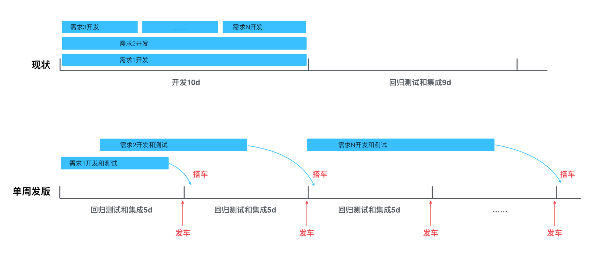
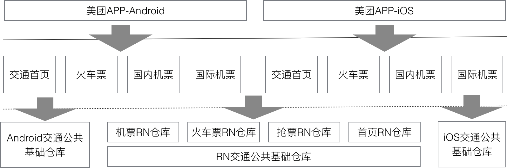
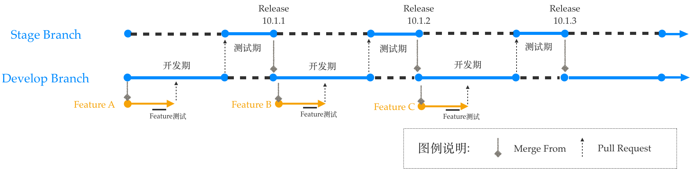
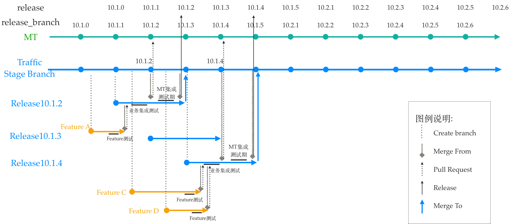
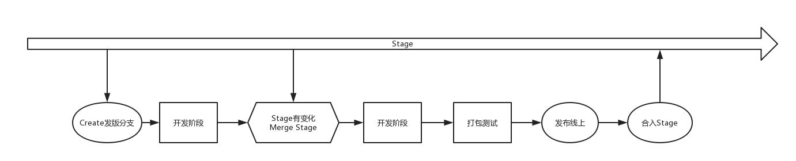
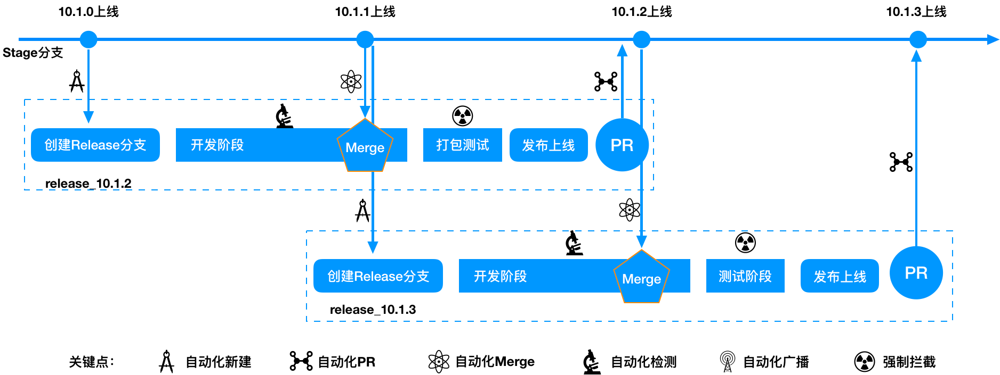

https://my.oschina.net/meituantech/blog/3000094  

##### 背景  

目前，互联网产品呈现出高频优化迭代的趋势，需求方希望尽早地看到结果，并给予及时反馈，所以技术团队需要用“小步快跑”的姿势来做产品，尽早地交付新版本。基于以上背景，美团客户端研发平台适时地推行了单周发版的迭代策略。单周版本迭代的优点可以概括为三个方面：更快地验证产品创意是否符合预期，更灵活地上线节奏，更早地修复线上Bug。  

首先说一下美团平台的发版策略，主要变更点是由之前的每四周发一版改为每周都有发版。具体对比如下：  

* （旧）三周迭代指的是2周开发+1周半测试，依赖固定的排期和测试时间，如果错过排期，则需要等待至少20天方可跟着下个版本迭代发布，线上验证产品效果的时间偏长。具体示例描述如下：  
      
 
* （新）单周版本迭代指一周一发版，单周迭代版本排期、测试不再依赖固定时间节点，需求开发并测试完成，就可以搭乘最近一周的发版“小火车”，跟版发布直接上线。对于一般需求而言，这将会大大缩短迭代时间。  

##### 业务方研发人员的痛点  

在之前按月发版的迭代节奏下，基本上所有的需求都属于串行开发，每个版本的开发流程比较固定。从“评审-开发-提测-灰度-上线”各个环节都处于一个固定的时间点来顺序执行，开发人力资源的协调方式也相对简单。全面推进单周发版之后，并不能把所有需求压缩到5天之内开发完成，而是会存在大量的并行开发的场景，之前的固定时间节点全部被打破，由固定周期变成了动态化调配，这给业务方的需求管理和研发人员人力管理都带来了指数式复杂度的提升。一旦进入并行开发，需求之间会产生冲突和依赖关系，版本代码也会随之产生冲突和依赖，这也大大提高了开发过程中的分支管理成本，如何规范化管理分支，降低分支冲突，把控代码质量，是本文接下来要讨论的重点。  

下面描述了几种典型的单周发版带来的问题：  

* **业务需求开发周期不固定，会存在大量的多版本、多需求并行开发。平台只提供了单周发版的基础策略，每5天发一版，业务方完成需求即可搭车发版。**  

对于各业务方来说，需求开发往往并不是都能在5天内完成，一般需求在5~10天左右，在之前串行发版模式下这个问题其实也存在，但并不突出，在单周发版的前提下，都要面临跨版本开发，意味着多个版本多个需求会同步并行开发，这给业务方的分支管理带来了极大的挑战。  

* **业务方架构复杂，仓库依赖多，单周发版分支创建合并维护成本大。**  

交通业务线涉及火车票、国内机票、国际机票多条业务线，代码仓库除了业务线的独立仓库，还有交通首页，交通公共仓库，RN仓库等多个仓库，Android端6个Git仓库，iOS端5个仓库，RN5个仓库，共计16个Git仓库。  

多仓库频繁发版分支代码存在安全风险，容易漏合代码，冲掉线上代码。  

  

* **业务线自身的公共基础库需求变动频繁。也需要具备单周发版的能力。**  

例如交通公共基础仓库，承载了很多交通业务线的UI功能组件，这些公共组件的业务变化频繁，公共基础仓库变化的同时，可能会对使用组件的业务产生影响，需要同步的升级发版。美团平台的策略是公共服务组件每四个小版本统一升级一次，但对业务方自身组件这种策略限制较大，还是需要公共组件也要具备随时发版的能力。  

##### 单周发版分支管理解决方案  

针对上面提出的问题，交通客户端团队通过技术培训、流程优化、关键点检测、自动化处理等方式保证分支代码的安全。技术培训主要是加强技术人员分支管理的基本知识，Git的正确使用方法，这里不做过多描述。本文主要讨论关键点检测，以及如何进行自动化的分支管理。  

在实施单周发版之前，业务方代码仓库只有两个分支，Develop分支，即开发分支；Stage分支，即发版分支；开发流程基本在串行开发模式，每个版本10天开发，8天测试，然后进入下一版本的开发。  

  

这种方式只能适用于节奏固定的长周期开发方式，对于多版本并行开发来说，有点力不从心，显然已经不能承载当前更灵活的发版节奏。  

针对这些问题，我们推出了如下分支管理结构。总的来说，就是废除之前作为开发分支的Develop分支，建立对应的Release发版分支，每个版本打包从Release分支直接打包；同时Stage分支不再承担打包职责，而是作为一个主干分支实时同步所有已发布上线的功能，Stage分支更像一个“母体”，孵化出Release分支和其它Feature分支；当Release分支测试通过、并且发版上线之后，再合入到Stage分支，此时所有正在开发中的其它分支都需要同步Stage分支的最新代码，保证下一个即将发布的版本的功能代码的完整性。  

  

上面的流程描述可能有些复杂，下面是简化的流程图，每个版本都有自己的生命周期：  

  

* 从Stage创建一个Release分支；
* 进入开发阶段；
* 如果Stage分支有变化，同步Stage分支；
* 打包测试；
* 测试通过，发布线上；
* 发布线上之后，合回Stage分支。  

为了适应单周发版，新的开发流程也引入了很多新的挑战。例如下图所示的一个Branch分支中涉及的六个关键点：创建分支、合入主干、主干变化通知、Merge主干变化、检测主干同步、未同步拦截，除了这些还要考虑多仓库同步操作的问题，还有热修复版本的管理方式的问题。能否把这些关键节点合理的规范和把控起来，是我们当前应对多分支并行开发的主要难点：  

  

如何更高效的解决这些问题呢？结合我们当前使用的工具：Git + Atlassian Stash 代码仓库管理工具；Jenkins Build打包工具；大象（美团内部通讯工具）内网通信工具。目前这三个开发工具已经非常成熟、稳定，并且接口丰富易于扩展，我们需要配合当前单周发版的分支管理模式，利用这些工具来进行扩展开发，正所谓“要站在巨人的肩膀上”。  

* **创建分支Release分支如何创建，何时创建，分支命名规范定义如何约束？**  

创建Release分支，本质上是从Stage新建一个分支，当前提前一个周期创建新的发版分支，例如在10.1.1版本Release后，创建10.1.3版本的分支，此时10.1.2版本处于开发测试阶段。业务方所有的分支命名和平台的分支命名保持一致，采用Release/x.x.x的格式，但同时需要升级成为即将发布的Release版本号，例如10.1.3。  

现在交通业务线多达十几个仓库，每个仓库每周都要操作一次需要耗费大量人力。之前每个分支的创建都是通过Stash或者手工创建，能不能自动化批处理的创建呢？答案是肯定的。对此，我们采用了Jenkins的方式，需要建立一个Jenkins Job, 基本原理就是通过命令行的方式进行Branch的创建，然后通过Job管理，批处理建立所有仓库的Release分支，这样就收敛了Branch的创建，即采用统一的命名规范，并且同时升级版本号。这就解决了创建分支的难点，实现了自动化创建分支，并且实现了规范化命名。  

* **如何知道Stage分支有变化，变化后需要做什么，不做会怎样？**  

一个好的开发习惯，就是每天写码之前都同步主分支，但是还是需要一个机制来确保同步。这里做了三个措施来确保各个分支和Stage是保持同步的：一个通知，一个警告，一次拦截。这三个步骤解决主干变化通知、检测主干同步、未同步拦截的问题。  

**一个通知：**具体路径如下，建立了一个内部推送公众账号和一个Jenkins监听Job，当所有交通业务仓库Stage分支有代码改动，通知所有对应的开发人员，该仓库有代码变化，请及时合入。  

**一次警告：**本地开发过程中，每次提交代码到远端仓库时，会触发一个Stage分支代码同步检测的脚本，如果发现未同步，会通过内部通讯系统通知提交者存在未同步主分支问题。但这里目前并不做强制拦截，保证分支代码开发的整体流畅性。  

**最终拦截：**在开发分支打包的过程中强制拦截，最终功能代码上线还是需要打包操作。在打包操作时统一收口，由于之前打包也是在Jenkins上来完成的，这里我们也是通过在打包Jenkins上接入了分支合并检测的插件，这样每次打包时会再次检测和主分支的同步情况。如果发现未同步则打包失败，确保每次发版都包含当前线上已有代码的功能，防止新版本丢失功能。  

* **如何合并分支，如何保证漏合？**  

和上面提到的第一个如何创建分支的问题类似，通过Jenkins Job来进行批量操作，可以一键创建所有分支的Pull Request；在每个版本发版之前，统一进行一次打包，合入美团的主分支，防止多个仓库有漏合的情况。

* **公共基础库版本策略？**  
  
公共基础和业务分支保持同样的策略，通过批处理脚本同时建立分支，合并分支，监听分支变化，需要注意的是，每次版本升级，公共基础库也需要同步的打包，并且强制业务库升级。不然，如果基础仓库存在接口变动，有的业务升级了，有的业务没升级，最终会导致无法合入主分支，进而无法打出App包。  

* **热修复的版本管理策略？**  

热修复确实是一种非常规的处理方式。从原则上来讲，热修复需要在对应的Release分支上进行修改，然后把修改合入Stage分支，同时需要同步到其它正在开发的分支。实际的处理需要根据具体情况来分析，是否需要对线上多个版本热修复。如果多版本都要修复就不能再合入Stage分支，否则会导致Stage分支冲突，如果把Stage分支合入需要热修复的其它分支，会把线上当前最新代码带入历史旧版本，会导致版本兼容性问题。最终执行起来可能还是对热修复版本进行单独处理，不一定要进行Stage主分支的同步，热修复的版本管理成本会比较高，更多的需要人工介入。  

##### 未来展望  

目前整体的分支发版流程已经基本完成，现在已经稳定运行了10个小版本，同时没有出现因为分支管理问题而引发的线上问题。  

不过，当前整体流程的自动化程度还有待提高，每周需要人工去触发，很多代码合并过程中的冲突问题还需要人工去解决。未来我们希望能够自动化地根据平台的版本号自动创建分支，并且对于一些简单的冲突问题拥有自动化的处理能力。随着单周发版的不断成熟，未来对于持续交付能力也将不断提升，发版节奏可以不限于单周，一周两版或是更快的发版节奏也成为一种新的可能。  
