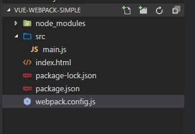
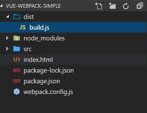
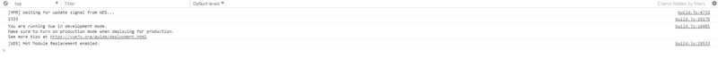
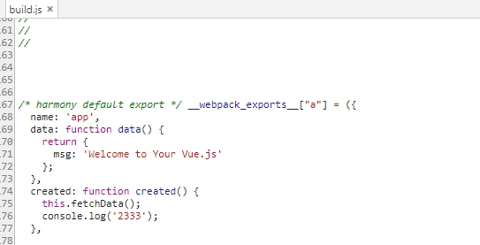
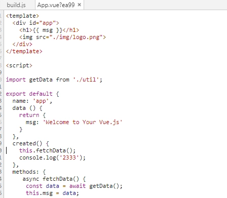
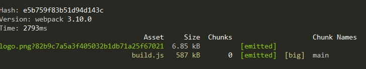
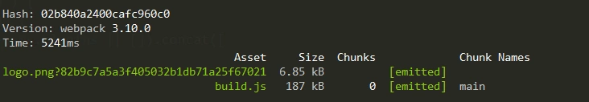

**注： 本文webpack基于3.10.0， webpack4部分内容可能不再适用！！！！**  

[演示代码下载](https://github.com/deepred5/vue-webpack-simple)  

#### 安装webpack  

```console
npm i webpack -g
```

webpack4还要单独安装  

```console
npm i webpack-cli -g
```

#### 项目初始化  

新建一个文件夹vue-webpack-simple

```console
#新建package.json
npm init -y

#安装vue webpack webpack-dev-server
npm i vue --save
npm i webpack webpack-dev-server --save-dev
```

根目录下新建index.html  

```html
<!DOCTYPE html>
<html lang="en">
<head>
    <meta charset="UTF-8">
    <meta name="viewport" content="width=device-width, initial-scale=1.0">
    <meta http-equiv="X-UA-Compatible" content="ie=edge">
    <title>Document</title>
</head>
<body>
    
</body>
</html>
```

根目录下新建webpack.config.js  

```javascript
var path = require('path');
var webpack = require('webpack');

module.exports = {};
```

新建src文件夹，src文件夹下新建main.js  

目前整个项目的结构如下:  
  


#### js模块化  

在ES6出现之前，js是没有统一的模块体系。  

服务器端使用CommonJS规范,而浏览器端又有AMD和CMD两种规范  

webpack的思想就是一切皆模块，官方推荐使用commonJS规范，这使得我们浏览器端也可以使用commonJS的模块化写法  

```javascript
module.exports = {}
```

src目录下新建一个util.js  

```javascript
module.exports = function say() {
    console.log('hello world');
}
```

main.js  

```javascript
var say = require('./util');
say();
```

修改webpack.config.js  

```javascript
var path = require('path');
var webpack = require('webpack');

module.exports = {
    entry: './src/main.js', // 项目的入口文件，webpack会从main.js开始，把所有依赖的js都加载打包
    output: {
        path: path.resolve(__dirname, './dist'), // 项目的打包文件路径
        publicPath: '/dist/', // 通过devServer访问路径
        filename: 'build.js' // 打包后的文件名
    },
    devServer: {
        historyApiFallback: true,
        overlay: true
    }
};
```

修改package.josn  

```javascript
"scripts": {
    "dev": "webpack-dev-server --open --hot",
    "build": "webpack --progress --hide-modules"
  },
```

**注意：webpack-dev-server会自动启动一个静态资源web服务器 --hot参数表示启动热更新**  

修改index.html，引入打包后的文件  

```html
<!DOCTYPE html>
<html lang="en">

<head>
    <meta charset="UTF-8">
    <meta name="viewport" content="width=device-width, initial-scale=1.0">
    <meta http-equiv="X-UA-Compatible" content="ie=edge">
    <title>Document</title>
</head>

<body>
    <script src="/dist/build.js"></script>
</body>

</html>
```

运行  

```console
npm run dev
```

可以发现浏览器自动打开的一个页面，查看控制台，有`hello world`打出  

我们随意修改util.js，可以发现浏览器会自动刷新，非常方便。  

如果我们希望看打包后的bundle.js文件，运行`npm run build`  

可以看到生成了一个dist目录，里面就有打包好后的bundle.js  
  

webpack默认不支持转码es6，但是`import export`这两个语法却单独支持。所以我们可以改写前面的模块化写法  

util.js  

```javascript
export default function say() {
    console.log('hello world ');
}
```

main.js  

```javascript
import say from './util';

say();
```


#### 引入vue  

下面我们来试着引入vue(目前不考虑单文件.vue)  

main.js  

```javascript
import Vue from 'vue';

var app = new Vue({
  el: '#app',
  data: {
    message: 'Hello Vue!'
  }
});
```

index.html  

```html
<!DOCTYPE html>
<html lang="en">

<head>
    <meta charset="UTF-8">
    <meta name="viewport" content="width=device-width, initial-scale=1.0">
    <meta http-equiv="X-UA-Compatible" content="ie=edge">
    <title>Document</title>
</head>

<body>
    <div id="app">
        {{message}}
    </div>
    <script src="/dist/build.js"></script>
    
</body>

</html>
```

还要注意一点：要修改webpack.config.js文件  

```javascript
var path = require('path');
var webpack = require('webpack');

module.exports = {
    entry: './src/main.js',
    output: {
        path: path.resolve(__dirname, './dist'),
        publicPath: '/dist/',
        filename: 'build.js'
    },
    devServer: {
        historyApiFallback: true,
        overlay: true
    },
    resolve: {
        alias: {
            'vue$': 'vue/dist/vue.esm.js'
        }
    }
};
```

重新运行npm run dev，可以看到，页面正常显示了`Hello World`  


#### 引入scss和css  

webpack默认只支持js的模块化，如果需要把其他文件也当成模块引入，就需要相对应的loader解析器  

```console
npm i node-sass css-loader vue-style-loader sass-loader --save-dev
```

webpack.config.js  

```javascript
var path = require('path');
var webpack = require('webpack');

module.exports = {
    entry: './src/main.js',
    output: {
        path: path.resolve(__dirname, './dist'),
        publicPath: '/dist/',
        filename: 'build.js'
    },
    devServer: {
        historyApiFallback: true,
        overlay: true
    },
    resolve: {
        alias: {
            'vue$': 'vue/dist/vue.esm.js'
        }
    },
    module: {
        rules: [
            {
                test: /\.css$/,
                use: [
                    'vue-style-loader',
                    'css-loader'
                ],
            }
        ]
    }
};
```

解释：  

```javascript
{
    test: /\.css$/,
    use: [
        'vue-style-loader',
        'css-loader'
    ],
}
```

这段代码意思是：匹配后缀名为css的文件,然后分别用css-loader，vue-style-loader去解析  

解析器的执行顺序是从下往上(先css-loader再vue-style-loader)  

**注意：因为我们这里用vue开发，所以使用vue-style-loader，其他情况使用style-loader**  

css-loader使得我们可以用模块化的写法引入css,vue-style-loader会将引入的css插入到html页面里的style标签里  

要引入scss也是同理的配置写法:  

```javascript
module: {
        rules: [
            {
                test: /\.css$/,
                use: [
                    'vue-style-loader',
                    'css-loader'
                ],
            },
            {
                test: /\.scss$/,
                use: [
                    'vue-style-loader',
                    'css-loader',
                    'sass-loader'
                ],
            },
            {
                test: /\.sass$/,
                use: [
                    'vue-style-loader',
                    'css-loader',
                    'sass-loader?indentedSyntax'
                ],
            }]
    }
```

我们现在来试下  

在src目录下新建style目录，style目录里新建common.scss  

```css
body {
    background: #fed;
}
```

main.js  

```css
import './style/common.scss';
```

发现css样式有用了  


#### 使用babel转码  

ES6的语法大多数浏览器依旧不支持,bable可以把ES6转码成ES5语法，这样我们就可以大胆的在项目中使用最新特性了  

```console
npm i babel-core babel-loader babel-preset-env babel-preset-stage-3 --save-dev
```

在项目根目录新建一个.babelrc文件  

```json
{
  "presets": [
    ["env", { "modules": false }],
    "stage-3"
  ]
}
```

webpack.config.js添加一个loader  

```javascript
{
    test: /\.js$/,
    loader: 'babel-loader',
    exclude: /node_modules/
}
```

exclude表示忽略node_modules文件夹下的文件，不用转码  

现在我们来试下async await语法吧  

util.js  

```javascript
export default function getData() {
    return new Promise((resolve, reject) => {
        resolve('ok');
    })
}
```

main.js  

```javascript
import getData from './util';
import Vue from 'vue';

import './style/common.scss';

var app = new Vue({
  el: '#app',
  data: {
    message: 'Hello Vue!'
  },
  methods: {
    async fetchData() {
      const data = await getData();
      this.message = data;
    }
  },
  created() {
    this.fetchData();
  }
});
```

这时控制台会报一个错误`regeneratorRuntime is not defined`，因为我们没有安装`babel-polyfill`  

```console
npm i babel-polyfill --save-dev
```

然后修改webpack.config.js的入口  

```javascript
entry: ['babel-polyfill', './src/main.js'],
```

重新npm run dev，可以发现正常运行了  


#### 引入图片资源  

把图片也当成模块引入  

```console
npm i file-loader --save-dev
```

webpack.config.js添加一个loader  

```javascript
{
    test: /\.(png|jpg|gif|svg)$/,
    loader: 'file-loader',
    options: {
        name: '[name].[ext]?[hash]'
    }
}
```

在src目录下新建一个img目录，存放一张图片logo.png  

修改main.js  

```javascript
import getData from './util';
import Vue from 'vue';

import './style/common.scss';


Vue.component('my-component', {
  template: '',
  data() {
    return {
      url: require('./img/logo.png')
    }
  }
})

var app = new Vue({
  el: '#app',
  data: {
    message: 'Hello Vue !'
  },
  methods: {
    async fetchData() {
      const data = await getData();
      this.message = data;
    }
  },
  created() {
    this.fetchData()
  }
});
```

修改index.html  

```html
<!DOCTYPE html>
<html lang="en">

<head>
    <meta charset="UTF-8">
    <meta name="viewport" content="width=device-width, initial-scale=1.0">
    <meta http-equiv="X-UA-Compatible" content="ie=edge">
    <title>Document</title>
</head>

<body>
    <div id="app">
        {{message}}
        <my-component/>
    </div>
    <script src="/dist/build.js"></script>
    
</body>

</html>
```

可以看见，图片也被正确加载了  


#### 单文件组件  

在前面的例子里，我们使用 Vue.component 来定义全局组件  

在实际项目里，更推荐使用单文件组件  

```console
npm i vue-loader vue-template-compiler --save-dev
```

添加一个loader  

```json
{
    test: /\.vue$/,
    loader: 'vue-loader',
    options: {
        loaders: {
            'scss': [
                'vue-style-loader',
                'css-loader',
                'sass-loader'
            ],
            'sass': [
                'vue-style-loader',
                'css-loader',
                'sass-loader?indentedSyntax'
            ]
        }
    }
}
```

在src目录下新建一个App.vue  

```javascript
<template>
  <div id="app">
    <h1>{{ msg }}</h1>
    
    <input type="text" v-model="msg">
  </div>
</template>

<script>

import getData from './util';

export default {
  name: 'app',
  data () {
    return {
      msg: 'Welcome to Your Vue.js'
    }
  },
  created() {
    this.fetchData();
  },
  methods: {
     async fetchData() {
      const data = await getData();
      this.msg = data;
    }
  }
}
</script>

<style lang="scss">
#app {
  font-family: "Avenir", Helvetica, Arial, sans-serif;

  h1 {
    color: green;
  }
}
</style>
```

main.js  

```javascript
import Vue from 'vue';
import App from './App.vue';

import './style/common.scss';

new Vue({
  el: '#app',
  template: '<App/>',
  components: { App }
})
```

index.html  

```html
<!DOCTYPE html>
<html lang="en">

<head>
    <meta charset="UTF-8">
    <meta name="viewport" content="width=device-width, initial-scale=1.0">
    <meta http-equiv="X-UA-Compatible" content="ie=edge">
    <title>Document</title>
</head>

<body>
    <div id="app"></div>
    <script src="/dist/build.js"></script>
</body>

</html>
```

npm run dev，可以发现单文件被正确加载了  


#### source-map  

在开发阶段，调试也是非常重要的一项需求。  

App.vue  

```javascript
created() {
    this.fetchData();
    console.log('23333');
}
```

我们故意打一个console，打开控制台  
  

我们点击进入这个console的详细地址  
  

进入的是打包后的build.js，我并不知道是在哪个组件里写的，这就造成了调试困难  

这时就要修改webpack.config.js  

```javascript
module.exports = {
    entry: ['babel-polyfill', './src/main.js'],
    // 省略其他...

    devtool: '#eval-source-map'
};
```

重新npm run dev  
  

这次调试，它直接返回那个组件的源代码了，这不是被打包过的！  


#### 打包发布  

我们先试着npm run build打包一下文件  
  

会发现，打包后的build.js非常大，有500多k了  

在实际发布时，会对文件进行压缩，缓存，分离等等优化处理  

```console
npm i cross-env --save-dev
```

修改package.json  

```json
"scripts": {
    "dev": "cross-env NODE_ENV=development webpack-dev-server --open --hot",
    "build": "cross-env NODE_ENV=production webpack --progress --hide-modules"
}
```

这次我们设置了环境变量，打包时，NODE_ENV是production  

然后修改webpack.config.js，判断NODE_ENV为production时，压缩js代码  

```javascript
var path = require('path');
var webpack = require('webpack');

module.exports = {
    // 省略...
}

if (process.env.NODE_ENV === 'production') {
    module.exports.devtool = '#source-map';
    module.exports.plugins = (module.exports.plugins || []).concat([
      new webpack.DefinePlugin({
        'process.env': {
          NODE_ENV: '"production"'
        }
      }),
      new webpack.optimize.UglifyJsPlugin(),
    ])
  }
```

重新打包  
  

可以看见，压缩效果非常明显！  

至此，一个非常简单的vue开发环境搭建成功。  

**注意：本文中的配置还有非常多可以优化的地方，比如分离js和css**