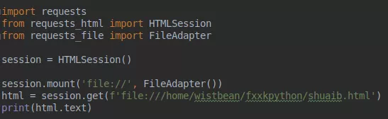
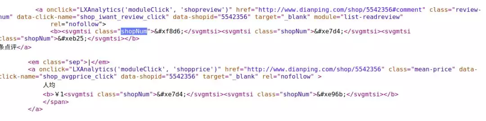
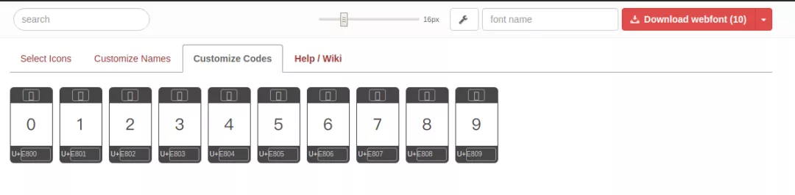

#### 举个例子  
  

这时候我们通过 requests 去请求  
  

在这里请求的是本地的网页，所以需要挂载一下 FileAdapter，接着会得到这样的源代码  
  
（应该这样写：<p></p>）  

问题来了  

怎么把帅b的个人信息搞一下,让返回的 HTML 里面拿不到呢,可以通过添加 css 来打乱顺序  

就以「**姓名**」为例, 来定义一个 css 的类元素  
  

这里定义了两个属性, 一个是用来将它移除屏幕, 一个就是不要占了行高, 反正就是用来**隐藏**我们的干扰信息,接着 HTML 就可以这样写  
  

再来定义一个 css 属性  
  

意思就是说，在 EFG 选择器的这个标签后追加内容, 所以我们真正的代码就是这样  
  

那么这时候普通用户看到的网页, 是可以看到关键信息的  
  

而这个时候,你来爬取得到的却是这样的  
  


得到的结果是不是, 可以让你懵逼一会了？一些没耐心的人, 看到这里应该就不打算爬下去了,哈哈哈  


#### 来看看大众点评的广州按摩店  

http://www.dianping.com/guangzhou/ch30/g141  
  


假设你想爬取这些数据,你开始性冲冲的看它的源码  
  

结果发现，我去,怎么数字变成一个方块？我们来看看它的 css  
  

这里定义了一个 PingFangSC-Regular 的字体,猫腻应该就出在这里了,我们去掉 css 定义的字体,可以看到数字也跟着消失  
  


这个是时候你是不是好像发现了什么,来看看这个页面的源代码文件  
  

每个数字都是变成了, **&#x**开头的神秘代码,这个时候你是不是又好像发现了什么,这其实就是一种 css 的加密方式, **加密自定义字体**,让你爬取的时候拿不到关键的数据  

还是得先站在对方的角度,想想这种丧尽天良的方式,到底是怎么做到的呢？这就要从前端的开发说起了,在我们的电脑里面,都有一些字体库,比如什么宋体啊，黑体啊等等,所以你在上网的时候  
看到的网页的字体都差不多,没有什么千差万别的情况,但是有些公司想要自家的,网页上的文字更加炫酷一点,就是想要不一样,就是要显得牛逼,比如苹果的官网,就整了一些自定义的字体  

  

而要实现这种方式, 在 css3 中定义字体和字体文件路径,就可以使用了  

```css
@font-face { 
    font-family: "自定义字体的名称"; 
    src: "自定义字体的路径"
}
```

接下来,就在一开始的帅b页面中,实现一下像大众点评这样的反爬吧,可以在以下链接下载苹方字体  

**https://github.com/zongren/font/raw/master/PingFang-SC-Regular.ttf**  

  

我们要对字体的数字加密,可以使用 **fonttools** 来提取数字  

```console
pip install fonttools
```
安装好了之后就可以使用, 如下命令来提取了  

```console
pyftsubset /home/shuaib/Desktop/PingFang-SC-Regular.ttf --text="1234567890" --output-file="PingFang-Num.tty"
```

这里的`/home/shuaib/Desktop/PingFang-SC-Regular.ttf`是你下载的字体文件路径,`--text="1234567890"`是你要提取的内容,`--output-file="PingFang-Num.tty"`  
定义你提取后的字体文件  

ok,运行之后你在该路径下,就会生成一个新的字体文件了  
  

打开看就都是数字啦  

  

有了数字字体文件之后,接下来就是对字体加密了,以下这个网站可以对字体加密 **http://fontello.com/**  
  

不过这个网站仅支持 svg 格式的,所以我们可以把 ttf 转化成 svg 格式,小帅b发现这个网站不错,**https://convertio.co/zh/ttf-svg/**  
  

那就转化一波呗  
  

下载下来之后,再回到 fontello,把 svg 拖进去  
  

然后就变成这个样子  
  

选中要加密的字  
  

然后点击Customize Codes   
  

这时候就可以对字加密啦,接着点击右上角,下载加密后的字体文件  
  

那么现在,我们就有了所需要的文件了  
  


赶紧在帅b的页面试试看吧, 首先定义一下,我们自定义文件的路径和名称,比如这里我们的字体就叫帅b  
  


接着我们就可以使用刚刚加密的 code 了  
  

打开网页  
  

可以看到数字正常显示,而源码  
  

变成了方块了,字体也指向了shuaib  
  

是不是和大众点评的一模一样了