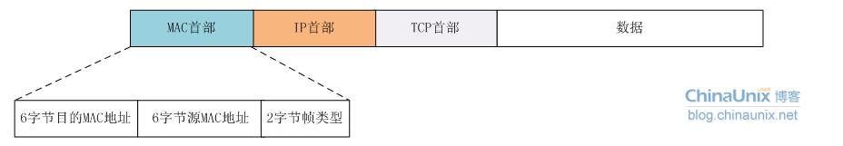
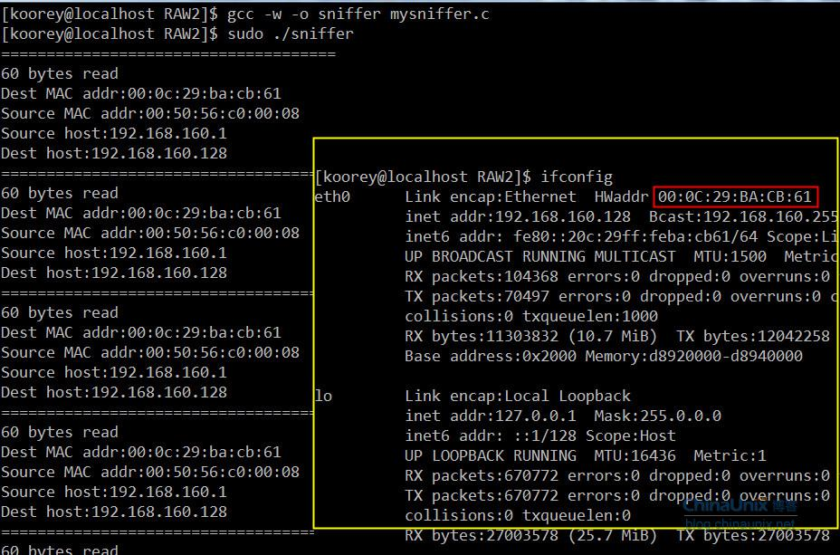

可以接收链路层MAC帧的原始套接字  
    前面我们介绍过了通过原始套接字socket(AF_INET, SOCK_RAW, protocol)我们可以直接实现自行构造整个IP报文，然后对其收发。提醒一点，在用这种方式构造原始IP报文时，第三个参数protocol不能用IPPROTO_IP，这样会让系统疑惑，不知道该用什么协议来伺候你了。    
     今天我们介绍原始套接字的另一种用法：直接从链路层收发数据帧，听起来好像很神奇的样子。在Linux系统中要从链路层(MAC)直接收发数帧，比较普遍的做法就是用libpcap和libnet两个动态库来实现。但今天我们就要用原始套接字来实现这个功能。  
       
     这里的2字节帧类型用来指示该数据帧所承载的上层协议是IP、ARP或其他。  
     为了实现直接从链路层收发数据帧，我们要用到原始套接字的如下形式：  
```c++
   socket(PF_PACKET, type, protocol)
```
1. 其中`type`字段可取`SOCK_RAW`或`SOCK_DGRAM`。它们两个都使用一种与设备无关的标准物理层地址结构`struct sockaddr_ll{}`，但具体操作的报文格式不同：  
    SOCK_RAW：直接向网络硬件驱动程序发送(或从网络硬件驱动程序接收)没有任何处理的完整数据报文(包括物理帧的帧头)，这就要求我们必须了解对应设备的物理帧帧头结构，才能正确地装载和分析报文。也就是说我们用这种套接字从网卡驱动上收上来的报文包含了MAC头部，如果我们要用这种形式的套接字直接向网卡发送数据帧，那么我们必须自己组装我们MAC头部。这正符合我们的需求。  
    SOCK_DGRAM：这种类型的套接字对于收到的数据报文的物理帧帧头会被系统自动去掉，然后再将其往协议栈上层传递；同样地，在发送时数据时，系统将会根据`sockaddr_ll`结构中的目的地址信息为数据报文添加一个合适的MAC帧头。  
2. `protocol`字段，常见的，一般情况下该字段取`ETH_P_IP`，`ETH_P_ARP`，`ETH_P_RARP`或`ETH_P_ALL`，当然链路层协议很多，肯定不止我们说的这几个，但我们一般只关心这几个就够我们用了。这里简单提一下网络数据收发的一点基础。协议栈在组织数据收发流程时需要处理好两个方面的问题：“从上倒下”，即数据发送的任务；“从下到上”，即数据接收的任务。数据发送相对接收来说要容易些，因为对于数据接收而言，网卡驱动还要明确什么样的数据该接收、什么样的不该接收等问题。protocol字段可选的四个值及其意义如下：  

| protocol | 值 | 作用 |
| --- | --- | --- |
| ETH_P_IP | 0X0800 | `只接收`发往目的MAC是`本机`的IP类型的数据帧 |
| ETH_P_ARP | 0X0806 | `只接收` 发往目的MAC是`本机`的ARP类型的数据帧 |
| ETH_P_RARP | 0X8035 | `只接受`发往目的MAC是`本机`的RARP类型的数据帧 |
| ETH_P_ALL | 0X0003 | 接收发往目的MAC是本机的所有类型(ip,arp,rarp)的数据帧，同时还可以接收从本机发出去的所有数据帧。在混杂模式打开的情况下，还会接收到发往目的MAC为非本地硬件地址的数据帧。 |  

protocol字段可取的所有协议参见`/usr/include/linux/if_ether.h`头文件里的定义。  
最后，格外需要留心一点的就是，发送数据的时候需要自己组织整个以太网数据帧。和地址相关的结构体就不能再用前面的`struct sockaddr_in{}`了，而是`struct sockaddr_ll{}`，如下：  
```c++
struct sockaddr_ll{ 
    unsigned short sll_family; /* 总是 AF_PACKET */ 
    unsigned short sll_protocol; /* 物理层的协议 */ 
    int sll_ifindex; /* 接口号 */ 
    unsigned short sll_hatype; /* 报头类型 */ 
    unsigned char sll_pkttype; /* 分组类型 */ 
    unsigned char sll_halen; /* 地址长度 */ 
    unsigned char sll_addr[8]; /* 物理层地址 */ 
};
```
 sll_protocoll：取值在linux/if_ether.h中，可以指定我们所感兴趣的二层协议；  
 sll_ifindex：置为0表示处理所有接口，对于单网卡的机器就不存在“所有”的概念了。如果你有多网卡，该字段的值一般通过ioctl来搞定，模板代码如下，如果我们要获取eth0接口的序号，可以使用如下代码来获取：  
```c++
struct  sockaddr_ll  sll;
struct ifreq ifr;

strcpy(ifr.ifr_name, "eth0");
ioctl(sockfd, SIOCGIFINDEX, &ifr);
sll.sll_ifindex = ifr.ifr_ifindex;
```

sll_hatype：ARP硬件地址类型，定义在 linux/if_arp.h 中。 取ARPHRD_ETHER时表示为以太网。  
sll_pkttype：包含分组类型。目前，有效的分组类型有：目标地址是本地主机的分组用的PACKET_HOST，物理层广播分组用的 PACKET_BROADCAST ，发送到一个物理层多路广播地址的分组用的 PACKET_MULTICAST，在混杂(promiscuous)模式下的设备驱动器发向其他主机的分组用的 PACKET_OTHERHOST，源于本地主机的分组被环回到分组套接口用的PACKET_OUTGOING。`这些类型只对接收到的分组有意义`。  
     sll_addr和sll_halen指示物理层(如以太网，802.3，802.4或802.5等)地址及其长度，严格依赖于具体的硬件设备。类似于获取接口索引sll_ifindex，要获取接口的物理地址，可以采用如下代码：  
```c++
struct ifreq ifr;

strcpy(ifr.ifr_name, "eth0");
ioctl(sockfd, SIOCGIFHWADDR, &ifr);
```

`缺省情况下，从任何接口收到的符合指定协议的所有数据报文都会被传送到原始PACKET套接字口，而使用bind系统调用并以一个sochddr_ll结构体对象将PACKET套接字与某个网络接口相绑定，就可使我们的PACKET原始套接字只接收指定接口的数据报文。`  
     接下来我们简单介绍一下网卡是怎么收报的，如果你对这部分已经很了解可以跳过这部分内容。网卡从线路上收到信号流，网卡的驱动程序会去检查数据帧开始的前6个字节，即目的主机的MAC地址，如果和自己的网卡地址一致它才会接收这个帧，不符合的一般都是直接无视。然后该数据帧会被网络驱动程序分解，IP报文将通过网络协议栈，最后传送到应用程序那里。往上层传递的过程就是一个校验和“剥头”的过程，由协议栈各层去实现。  
     接下来我们来写个简单的抓包程序，将那些发给本机的IPv4报文全打印出来：  
```c++
#include <stdio.h>
#include <stdlib.h>
#include <errno.h>
#include <unistd.h>
#include <sys/socket.h>
#include <sys/types.h>
#include <netinet/in.h>
#include <netinet/ip.h>
#include <netinet/if_ether.h>

int main(int argc, char **argv) {
   int sock, n;
   char buffer[2048];
   struct ethhdr *eth;
   struct iphdr *iph;

   if (0>(sock=socket(PF_PACKET, SOCK_RAW, htons(ETH_P_IP)))) {
     perror("socket");
     exit(1);
   }

   while (1) {
     printf("=====================================\n");
     //注意：在这之前我没有调用bind函数，原因是什么呢？
     n = recvfrom(sock,buffer,2048,0,NULL,NULL);
     printf("%d bytes read\n",n);

     //接收到的数据帧头6字节是目的MAC地址，紧接着6字节是源MAC地址。
     eth=(struct ethhdr*)buffer;
     printf("Dest MAC addr:%02x:%02x:%02x:%02x:%02x:%02x\n",eth->h_dest[0],eth->h_dest[1],eth->h_dest[2],eth->h_dest[3],eth->h_dest[4],eth->h_dest[5]);
     printf("Source MAC addr:%02x:%02x:%02x:%02x:%02x:%02x\n",eth->h_source[0],eth->h_source[1],eth->h_source[2],eth->h_source[3],eth->h_source[4],eth->h_source[5]);

     iph=(struct iphdr*)(buffer+sizeof(struct ethhdr));
     //我们只对IPV4且没有选项字段的IPv4报文感兴趣
     if(iph->version ==4 && iph->ihl == 5){
             printf("Source host:%s\n",inet_ntoa(iph->saddr));
             printf("Dest host:%s\n",inet_ntoa(iph->daddr));
     }
   }
}
```
编译，然后运行，要以root身份才可以运行该程序：  
  
    正如我们前面看到的，网卡丢弃所有不含有主机MAC地址00:0C:29:BA:CB:61的数据包，这是因为网卡处于非混杂模式，即每个网卡只处理源地址是它自己的帧！  
    这里有三个例外的情况：  
1. 如果一个帧的目的MAC地址是一个受限的广播地址（255.255.255.255)那么它将被所有的网卡接收。
2. 如果一个帧的目的地址是组播地址，那么它将被那些打开组播接收功能的网卡所接收。
3. 网卡如被设置成混杂模式，那么它将接收所有流经它的数据包。  
    前面我们刚好提到过网卡的混杂模式，现在我们就来迫不及待的实践一哈看看混杂模式是否可以让我们抓到所有数据包，只要在while循环前加上如下代码就OK了：  

```c++
struct ifreq ethreq;
… …
strncpy(ethreq.ifr_name,"eth0",IFNAMSIZ);
if(-1 == ioctl(sock,SIOCGIFFLAGS,&ethreq)){
     perror("ioctl");
     close(sock);
     exit(1);
}
ethreq.ifr_flags |=IFF_PROMISC;
if(-1 == ioctl(sock,SIOCGIFFLAGS,&ethreq)){
     perror("ioctl");
     close(sock);
     exit(1);
}
while(1){
   … …
}
```
至此，我们一个网络抓包工具的雏形就出现了。大家可以基于此做更多的练习，加上多线程机制，对收到的不同类型的数据包做不同处理等等，反正由你发挥的空间是相当滴大，“狐狸未成精，只因太年轻”。把这块吃透了，后面理解协议栈就会相当轻松。  
