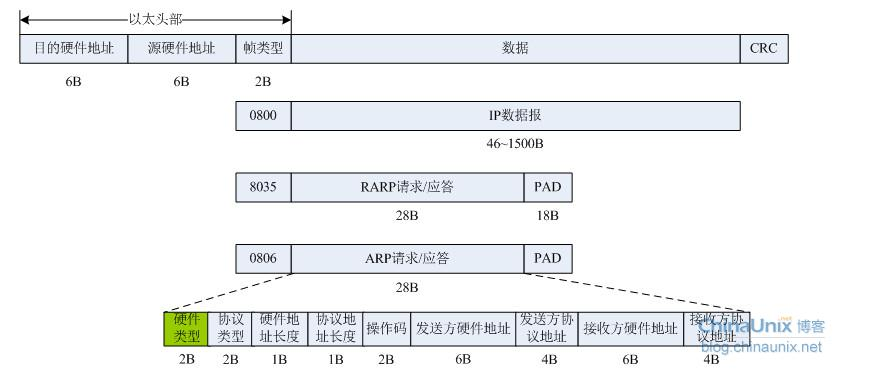
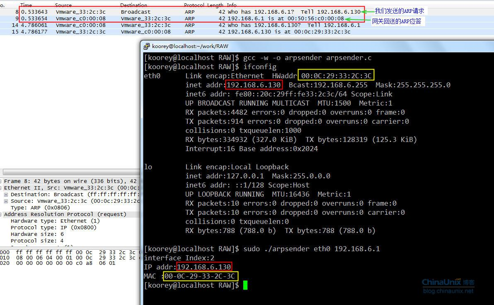
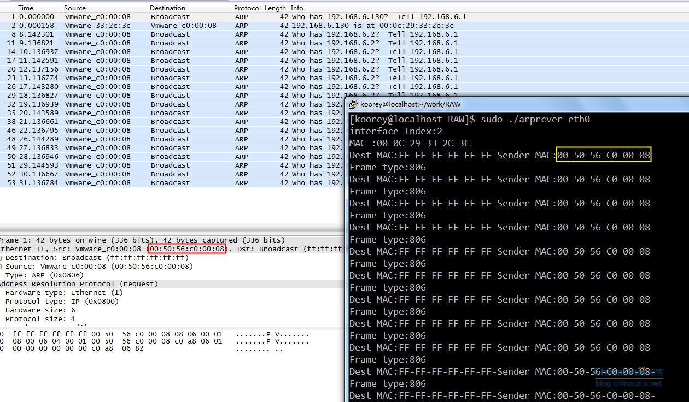

如何从链路层直接发送数据帧  
    本来以为这部分都弄完了，结果有朋友反映说看了半天还是没看到如何从链路层直接发送数据。因为上一篇里面提到的是从链路层“收发”数据，结果只“收”完，忘了“发”，实在抱歉，所以就有这篇续出来了。  
    上一节我们主要研究了如何从链路层直接接收数据帧，可以通过bind函数来将原始套接字绑定到本地一个接口上，然后该套接字就只接收从该接口收上来的对应的数据包。今天我们用原始套接字来手工实现链路层ARP报文的发送和接收，以便大家对原始套接字有更深刻的掌握和理解。  
    ARP全称为地址解析协议，是链路层广泛使用的一种寻址协议，完成32比特IP地址到48比特MAC地址的映射转换。在以太网中，当一台主机需要向另外一台主机发送消息时，它会首先在自己本地的ARP缓存表中根据目的主机的IP地址查找其对应的MAC地址，如果找到了则直接向其发送消息。如果未找到，它首先会在全网发送一个ARP广播查询，这个查询的消息会被以太网中所有主机接收到，然后每个主机就根据ARP查询报文中所指定的IP地址来检查该报文是不是发给自己的，如果不是则直接丢弃；只有被查询的目的主机才会对这个消息进行响应，然后将自己的MAC地址通告给发送者。  
     也就是说，链路层中是根据MAC地址来确定唯一一台主机。以太帧格式如下：  
       
     以太帧首部中2字节的帧类型字段指定了其上层所承载的具体协议，常见的有0x0800表示是IP报文、0x0806表示RARP协议、0x0806即为我们将要讨论的ARP协议。  
     硬件类型： 1表示以太网。  
     协议类型： 0x0800表示IP地址。和以太头部中帧类型字段相同。  
     硬件地址长度和协议地址长度：对于以太网中的ARP协议而言，分别为6和4；  
     操作码：1表示ARP请求；2表示ARP应答；3表示RARP请求；4表示RARP应答。  
我们这里只讨论硬件地址为以太网地址、协议地址为IP地址的情形，所以剩下四个字段就分别表示发送方的MAC和IP地址、接收方的MAC和IP地址了。  
注意：对于一个ARP请求报文来说，除了接收方硬件地址外，其他字段都要填充。当系统收到一个ARP请求时，会查询该请求报文中接收方的协议地址是否和自己的IP地址相等，如果相等，它就把自己的硬件地址和协议地址填充进去，将发送和接收方的地址互换，然后将操作码改为2，发送回去。  
下面看一个使用原始套接字发送ARP请求的例子：  
```c++
#include <stdio.h>
#include <stdlib.h>
#include <string.h>
#include <unistd.h>
#include <errno.h>
#include <sys/socket.h>
#include <sys/ioctl.h>
#include <sys/types.h>
#include <netinet/in.h>
#include <netinet/ip.h>
#include <netinet/if_ether.h>
#include <net/if_arp.h>
#include <netpacket/packet.h>
#include <net/if.h>
#include <net/ethernet.h>

#define BUFLEN 42

int main(int argc,char** argv){
    int skfd,n;
    char buf[BUFLEN]={0};
    struct ether_header *eth;
    struct ether_arp *arp;
    struct sockaddr_ll toaddr;
    struct in_addr targetIP,srcIP;
    struct ifreq ifr;

    unsigned char src_mac[ETH_ALEN]={0};
    unsigned char dst_mac[ETH_ALEN]={0xff,0xff,0xff,0xff,0xff,0xff}; //全网广播ARP请求
    if(3 != argc){
            printf("Usage: %s netdevName dstIP\n",argv[0]);
            exit(1);
    }

    if(0>(skfd=socket(PF_PACKET,SOCK_RAW,htons(ETH_P_ALL)))){
            perror("Create Error");
            exit(1);
    }

    bzero(&toaddr,sizeof(toaddr));
    bzero(&ifr,sizeof(ifr));
    strcpy(ifr.ifr_name,argv[1]);

    //获取接口索引
    if(-1 == ioctl(skfd,SIOCGIFINDEX,&ifr)){
           perror("get dev index error:");
           exit(1);
    }
    toaddr.sll_ifindex = ifr.ifr_ifindex;
    printf("interface Index:%d\n",ifr.ifr_ifindex);
    //获取接口IP地址
    if(-1 == ioctl(skfd,SIOCGIFADDR,&ifr)){
           perror("get IP addr error:");
           exit(1);
    }
    srcIP.s_addr = ((struct sockaddr_in*)&(ifr.ifr_addr))->sin_addr.s_addr;
    printf("IP addr:%s\n",inet_ntoa(((struct sockaddr_in*)&(ifr.ifr_addr))->sin_addr));

    //获取接口的MAC地址
    if(-1 == ioctl(skfd,SIOCGIFHWADDR,&ifr)){
           perror("get dev MAC addr error:");
           exit(1);
    }
    
    memcpy(src_mac,ifr.ifr_hwaddr.sa_data,ETH_ALEN);
    printf("MAC :%02X-%02X-%02X-%02X-%02X-%02X\n",src_mac[0],src_mac[1],src_mac[2],src_mac[3],src_mac[4],src_mac[5]);

    //开始填充，构造以太头部
    eth=(struct ether_header*)buf;
    memcpy(eth->ether_dhost,dst_mac,ETH_ALEN); 
    memcpy(eth->ether_shost,src_mac,ETH_ALEN);
    eth->ether_type = htons(ETHERTYPE_ARP);

    //手动开始填充用ARP报文首部
    arp=(struct arphdr*)(buf+sizeof(struct ether_header));
    arp->arp_hrd = htons(ARPHRD_ETHER); //硬件类型为以太
    arp->arp_pro = htons(ETHERTYPE_IP); //协议类型为IP

    //硬件地址长度和IPV4地址长度分别是6字节和4字节
    arp->arp_hln = ETH_ALEN;
    arp->arp_pln = 4;

    //操作码，这里我们发送ARP请求
    arp->arp_op = htons(ARPOP_REQUEST);
      
    //填充发送端的MAC和IP地址
    memcpy(arp->arp_sha,src_mac,ETH_ALEN);
    memcpy(arp->arp_spa,&srcIP,4);

    //填充目的端的IP地址，MAC地址不用管
    inet_pton(AF_INET,argv[2],&targetIP);
    memcpy(arp->arp_tpa,&targetIP,4);

    toaddr.sll_family = PF_PACKET;
    n=sendto(skfd,buf,BUFLEN,0,(struct sockaddr*)&toaddr,sizeof(toaddr));

    close(skfd);
    return 0;
}
```
结果如下：  
  
    可以看到，我向网关发送一个ARP查询请求，报文中携带了网关的IP地址以及我本地主机的IP和MAC地址。网关收到该请求后，对我的这个报文进行了回应，将它的MAC地址在ARP应答报文中发给我了。  
    在这个示例程序中，我们完全自己手动构造了以太帧头部，并完成了整个ARP请求报文的填充，最后用sendto函数，将我们的数据通过eth0接口发送出去。这个程序的灵活性还在于支持多网卡，使用时只要指定网卡名称(如eth0或eth1)，程序便会自动去获取指定接口相应的IP和MAC地址，然后用它们去填充ARP请求报文中对应的各字段。  
在头文件<net/thernet.h>里，主要对以太帧首部进行了封装：  

```c++
struct ether_header
{
   u_int8_t ether_dhost[ETH_ALEN]; /* destination eth addr */
   u_int8_t ether_shost[ETH_ALEN]; /* source ether addr */
   u_int16_t ether_type; /* packet type ID field */
} __attribute__ ((__packed__));
//在头文件<net/if_arp.h>中，对ARP首部进行了封装：

struct arphdr
{
    unsigned short ar_hrd; /* format of hardware address */
    unsigned short ar_pro; /* format of protocol address */
    unsigned char ar_hln; /* length of hardware address */
    unsigned char ar_pln; /* length of protocol address */
    unsigned short ar_op; /* ARP opcode (command) */
}
//而头文件<netinet/if_ether.h>里，又对ARP整个报文进行了封装：

struct ether_arp {
    struct arphdr ea_hdr; /* fixed-size 8 bytes header */
    u_int8_t arp_sha[ETH_ALEN]; /* sender hardware address */
    u_int8_t arp_spa[4]; /* sender protocol address */
    u_int8_t arp_tha[ETH_ALEN]; /* target hardware address */
    u_int8_t arp_tpa[4]; /* target protocol address */
};
#define arp_hrd ea_hdr.ar_hrd
#define arp_pro ea_hdr.ar_pro
#define arp_hln ea_hdr.ar_hln
#define arp_pln ea_hdr.ar_pln
#define arp_op ea_hdr.ar_op
```
最后再看一个简单的接收ARP报文的小程序：  

```c++
#include <stdio.h>
#include <stdlib.h>
#include <string.h>
#include <unistd.h>
#include <errno.h>
#include <sys/socket.h>
#include <sys/ioctl.h>
#include <sys/types.h>
#include <netinet/in.h>
#include <netinet/ip.h>
#include <netinet/if_ether.h>
#include <net/if_arp.h>
#include <netpacket/packet.h>
#include <net/if.h>
#define BUFLEN 60

int main(int argc,char** argv){
    int i,skfd,n;
    char buf[ETH_FRAME_LEN]={0};
    struct ethhdr *eth;
    struct ether_arp *arp;
    struct sockaddr_ll fromaddr;
    struct ifreq ifr;

    unsigned char src_mac[ETH_ALEN]={0};

    if(2 != argc){
        printf("Usage: %s netdevName\n",argv[0]);
        exit(1);
    }

    //只接收发给本机的ARP报文
    if(0>(skfd=socket(PF_PACKET,SOCK_RAW,htons(ETH_P_ARP)))){
        perror("Create Error");
        exit(1);
    }

    bzero(&fromaddr,sizeof(fromaddr));
    bzero(&ifr,sizeof(ifr));
    strcpy(ifr.ifr_name,argv[1]);

    //获取接口索引
    if(-1 == ioctl(skfd,SIOCGIFINDEX,&ifr)){
        perror("get dev index error:");
        exit(1);
    }
    fromaddr.sll_ifindex = ifr.ifr_ifindex;
    printf("interface Index:%d\n",ifr.ifr_ifindex);

    //获取接口的MAC地址
    if(-1 == ioctl(skfd,SIOCGIFHWADDR,&ifr)){
        perror("get dev MAC addr error:");
        exit(1);
    }

    memcpy(src_mac,ifr.ifr_hwaddr.sa_data,ETH_ALEN);
    printf("MAC :%02X-%02X-%02X-%02X-%02X-%02X\n",src_mac[0],src_mac[1],src_mac[2],src_mac[3],src_mac[4],src_mac[5]);

    fromaddr.sll_family = PF_PACKET;
    fromaddr.sll_protocol=htons(ETH_P_ARP);
    fromaddr.sll_hatype=ARPHRD_ETHER;
    fromaddr.sll_pkttype=PACKET_HOST;
    fromaddr.sll_halen=ETH_ALEN;
    memcpy(fromaddr.sll_addr,src_mac,ETH_ALEN);

    bind(skfd,(struct sockaddr*)&fromaddr,sizeof(struct sockaddr));

    while(1){
        memset(buf,0,ETH_FRAME_LEN);
        n=recvfrom(skfd,buf,ETH_FRAME_LEN,0,NULL,NULL);
        eth=(struct ethhdr*)buf;
        arp=(struct ether_arp*)(buf+14);

        printf("Dest MAC:");
        for(i=0;i<ETH_ALEN;i++){
            printf("%02X-",eth->h_dest[i]);
        }
        printf("Sender MAC:");
        for(i=0;i<ETH_ALEN;i++){
            printf("%02X-",eth->h_source[i]);
        }

        printf("\n");
        printf("Frame type:%0X\n",ntohs(eth->h_proto));

        if(ntohs(arp->arp_op)==2){
            printf("Get an ARP replay!\n");
        }
    }
    close(skfd);
    return 0;
}
```
 该示例程序中，调用recvfrom之前我们调用了bind系统调用，目的是仅从指定的接口接收ARP报文(由socket函数的第三个参数“ETH_P_ARP”决定)。可以对比一下，该程序与博文“Linux网络编程：原始套接字的魔力2”里介绍的抓包程序的区别。  
   

   小结：通过这几个章节的热身，相信大家对网络编程中常见的一系列API函数`socket,bind,listen,connect,sendto,recvfrom,close`等的认识应该会有一个较高的突破。当然，你也必须赶快对它们熟悉起来，因为后面我们不但要“知其然”，还要知其“所以然”。后面，我们会以这些函数调用为主线，看看它们到底在内核中做些哪些事情，而这又对我们理解协议栈的实现原理有什么帮助做进一步的分析和讨论。  
    