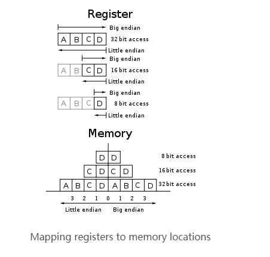
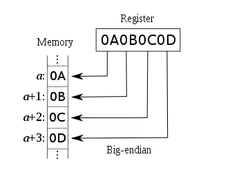
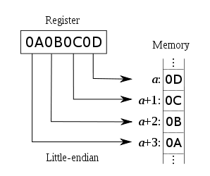

在各种计算机体系结构中，对于字节、字等的存储机制有所不同，因而引发了计算机通信领域中一个很重要的问题，即通信双方交流的信息单元（比特、字节、字、双字等等）应该以什么样的顺序进行传送。如果不达成一致的规则，通信双方将无法进行正确的编/译码从而导致通信失败。目前在各种体系的计算机中通常采用的字节存储机制主要有两种：  

big-edian和little-endian。  

#### 字节顺序 Endian  

现代的计算机系统一般采用字节(Octet, 8 bit Byte)作为逻辑寻址单位。当物理单位的长度大于1个字节时，就要区分字节顺序(Byte Order, orEndianness)。常见的字节顺序有两种：Big Endian(High-byte first)和Little Endian(Low-byte first)，这就是表2.1中的BE和LE。Intel X86平台采用Little Endian，而PowerPC处理器则采用了Big Endian。举例来说，整型数字$1234ABCD存储的时候就会有两种方式：  

|      字节顺序       |       内存数据       |                                                备注                                                |
| ------------------ | ------------------- | -------------------------------------------------------------------------------------------------- |
| Big Endian (BE)    | 0xAB 0xCD 0x12 0x34 | 此时的0xAB被称为[most significant byte](http://en.wikipedia.org/wiki/Most_significant_byte) (MSB)   |
| Little Endian (LE) | 0xCD 0xAB 0x34 0x12 | 此时的0xCD被称为[least significant byte](http://en.wikipedia.org/wiki/Least_significant_byte) (LSB) |  


词源：据Jargon File记载，endian这个词来源于Jonathan Swift在1726年写的讽刺小说 "Gulliver's Travels"（《格利佛游记》）。该小说在描述Gulliver畅游小人国时碰到了如下的一个场景。在小人国里的小人因为非常小（身高6英寸）所以总是碰到一些意想不到的问题。有一次因为对水煮蛋该从大的一端（Big-End）剥开还是小的一端（Little-End）剥开的争论而引发了一场战争，并形成了两支截然对立的队伍：支持从Big-End剥开的人Swift就称作Big-Endians而支持从Little-End剥开的人就称作Little-Endians……（后缀ian表明的就是支持某种观点的人:-）。Endian这个词由此而来。  

1980年，Danny Cohen在其著名的论文"On Holy Wars and a Plea for Peace"中为了平息一场关于在消息中字节该以什么样的顺序进行传送的争论而引用了该词。该文中，Cohen非常形象贴切地把支持从一个消息序列的MSB开始传送的那伙人叫做Big-Endians，支持从LSB开始传送的相对应地叫做Little-Endians。此后Endian这个词便随着这篇论文而被广为采用。  
  

#### 最高有效位 MSB: Most Significant Bit  

最高有效位(MSB)，有时候叫做最左边的位，是在一个n位二进制数字中的n-1位，这个位有最高的权重(2^(n-1))。第一个或最左边的位，当这个数字被用一般的方式书写时。  

#### 最低有效位 LSB: Least Significant Bit  

最低有效位(LSB)是给这些单元值的一个二进制整数位位置，就是，决定是否这个数字是偶数或奇数。LSB有时候是指最右边的位，因为写较不重要的数字到右边位置符号的协定。它类似于一个十进制整数的最不重要的数字，它是在一个(最右边)位置的数字。  

#### 大端Big-Endian  

低地址存放最高有效位（MSB），既高位字节排放在内存的低地址端，低位字节排放在内存的高地址端。  

计算机体系结构中一种描述多字节存储顺序的术语，在这种机制中最高有效位（MSB）存放在最低端的地址上。采用这种机制的处理器有IBM3700系列、PDP-10、Mortolora微处理器系列和绝大多数的RISC处理器。  
  


#### 小端Little-Endian  

低地址存放最低有效位（LSB），既低位字节排放在内存的低地址端，高位字节排放在内存的高地址端。  

计算机体系结构中一种描述多字节存储顺序的术语，在这种机制中最不重要字节（LSB）存放在最低端的地址上。采用这种机制的处理器有PDP-11、VAX、Intel系列微处理器和一些网络通信设备。该术语除了描述多字节存储顺序外还常常用来描述一个字节中各个比特的排放次序。  
  


#### 中端 Middle-Endian  

除了big-endian和little-endian之外的多字节存储顺序就是middle-endian，比如以4个字节为例：象以3-4-1-2或者2-1-4-3这样的顺序存储的就是middle-endian。这种存储顺序偶尔会在一些小型机体系中的十进制数的压缩格式中出现。  

#### 网络字节序 Network Order  

TCP/IP各层协议将字节序定义为Big-Endian，因此TCP/IP协议中使用的字节序通常称之为网络字节序。  


#### 主机序 Host Orader  

它遵循Little-Endian规则。所以当两台主机之间要通过TCP/IP协议进行通信的时候就需要调用相应的函数进行主机序（Little-Endian）和网络序（Big-Endian）的转换。

 
 #### C++怎样判别大端小端  

方法一:  

```c++
//使用宏的方法：
const int endian = 1;
#define is_bigendian() ( (*(char*) &endian) == 0 )
#define is_littlendbian() ( (*(char*) &endian) == 1 )

```

方法二：  

```c++
bool    IsLittleEndian()
{
    union   
    {    
        long    val;
        char    Char[sizeof(long)];
    }u;
    //    1-小端（Intel）;    0-大端(Motor)
    u.val = 1;  
    if ( u.Char[0] == 1 )
    {
        // 小端
        return true;
    }  
    else if ( u.Char[sizeof(long)-1] == 1 )
    {
        // 大端
        return false;  
    } 
    throw( "Unknown!" );
}

```

小知识:Java使用的是Big-Endian。