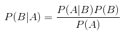

#### 朴素贝叶斯概述    

##### 前言  

“贝叶斯”又是一个响当当的名字，刚开始接触的是贝叶斯定理。贝叶斯分类器是一类分类算法的总称，是两种最为广泛的分类模型之一，另一种就是上篇中的决策树了。贝叶斯分类均以贝叶斯定理为基础，朴素贝叶斯是贝叶斯分类中最简单的一种，是基于贝叶斯定理与特征条件独立假设的分类方法。  

之前所学习的基于分类的K-means和决策树都是给出了分类的明确答案，但是分类势必是会产生错误结果，结合概率论的相关知识，我们在分类时，可以给出类别估计值，进而将赋予数据最优类别猜测。就分类而言，有时使用概率要比那些硬规则有效的多，贝叶斯准则和贝叶斯定理就是利用已知值来估计未知概率的方法。据此，我们可以使用概率论进行分类，首先从一个最简单的概率分类器开始，进而给出一些假设来学习朴素贝叶斯分类器。之所以称之为“朴素”，是因为在整个过程当中我们都使用的是最原始，最简单的假设。贝叶斯算法的基础是概率问题，分类的原理是通过某对象的先验概率，利用贝叶斯公式计算出它的后验概率（对象属于某一类的概率），选取具有最大后验概率的类作为该对象所属的类。就像那个特别有名的例子：在大街上碰到一个黑人，要让你猜测他是哪个洲的，你肯定首先会说非洲，为什么呢，因为黑人中非洲最多，在这里我们就选取了出现概率最大的类别。  

##### 贝叶斯定理  

贝叶斯定理对大家而言，应该都不会太陌生，今天再温习一下。首先说一下与贝叶斯定理密不可分的条件概率：`P(A|B) = P(AB) / P(B)`,其中P(A|B)表示的B发生的情况下A发生的概率，这就是条件概率。  

为什么要提出贝叶斯定理呢？因为现实生活中的很多问题，都是很容易求出P(A|B)，但P(B|A)却很难求出，而P(B|A)却相对更有用，由此贝叶斯定理产生。  

定义为：  


##### 朴素贝叶斯分类器  

分类的原理是通过某对象的先验概率，利用贝叶斯公式计算出它的后验概率（对象属于某一类的概率），选取具有最大后验概率的类作为该对象所属的类。把Ａ和Ｂ看作是随机变量，那么P(B|A)就是Ｂ的后验概率，P(B)是B的先验概率。  

对于朴素贝叶斯分类器，要做出两个假设：  

* 特征之间相互独立，即一个特征的出现于其它相邻的特征并无关系；
* 每个特征同等重要。  


#### 使用朴素贝叶斯进行文档分类  

机器学习的一个重要应用就是文档的分类，整个文档看成是实例，而文档中的元素相应的构成特征。我们可以观察文档中出现的词，并把每个词的出现与否相应的作为特征，进而构造分类器对文档进行分类。在这里我们一个留言社区为例，为了过滤掉那些内容不当的侮辱性言论，对此我们可以建立两个类别：侮辱性和非侮辱性，分别用0和1来表示。下面用python编程实现：  

##### 文本中获取特征  

```python
#coding:utf-8
from numpy import *
import sys
sys.path.append("E:\....")

##从文本中构建向量
def loadDataSet():
    postingList=[['my', 'dog', 'has', 'flea', 'problems', 'help', 'please'],
                 ['maybe', 'not', 'take', 'him', 'to', 'dog', 'park', 'stupid'],
                 ['my', 'dalmation', 'is', 'so', 'cute', 'I', 'love', 'him'],
                 ['stop', 'posting', 'stupid', 'worthless', 'garbage'],
                 ['mr', 'licks', 'ate', 'my', 'steak', 'how', 'to', 'stop', 'him'],
                 ['quit', 'buying', 'worthless', 'dog', 'food', 'stupid']]
    classVec = [0,1,0,1,0,1]    ##分别表示标签
    return postingList,classVec ##返回输入数据和标签向量
                 
def createVocabList(dataSet):
    vocabSet = set([])  
    for document in dataSet:
        vocabSet = vocabSet | set(document) 
    return list(vocabSet)##输出不重复的元素

def setOfWords2Vec(vocabList, inputSet):###判断了一个词是否出现在一个文档当中。
    returnVec = [0]*len(vocabList)
    for word in inputSet:
        if word in vocabList:
            returnVec[vocabList.index(word)] = 1
        else: print "the word: %s is not in my Vocabulary!" % word
    return returnVec###输入中的元素在词汇表时，词汇表相应位置为1，否则为0

'''
#测试
dataSet,classes = loadDataSet()
print(dataSet)
vocabList = createVocabList(dataSet)
print(vocabList)
setWordsVec = setOfWords2Vec(vocabList,dataSet[0])
print(setWordsVec)
'''
```


##### 得到每个特征的条件概率  

```python
##得到每个特征的条件概率
def trainNB0(trainMatrix,trainCategory):###输入的文档信息和标签
    numTrainDocs = len(trainMatrix)
    numWords = len(trainMatrix[0])
    pAbusive = sum(trainCategory)/float(numTrainDocs)
    p0Num = ones(numWords)
    p1Num = ones(numWords)      
    p0Denom = 2.0
    p1Denom = 2.0                     
    for i in range(numTrainDocs):
        if trainCategory[i] == 1:
            p1Num += trainMatrix[i]
            p1Denom += sum(trainMatrix[i])
        else:
            p0Num += trainMatrix[i]
            p0Denom += sum(trainMatrix[i])
    p1Vect = log(p1Num/p1Denom)          
    p0Vect = log(p0Num/p0Denom)   
    return p0Vect,p1Vect,pAbusive
'''
#测试
dataSet,classes = loadDataSet()
vocabList = createVocabList(dataSet)
trainMat = []
for item in dataSet:
    trainMat.append(setOfWords2Vec(vocabList,item))
                    
p0v,p1v,pAb = trainNB0(trainMat,classes)
print(p0v)
print(p1v)
print(pAb)
'''
```

##### 分类  

```python
#分类
def classifyNB(vec2Classify,p0Vec,p1Vec,pClass1):
    p1 = sum(vec2Classify * p1Vec) + log(pClass1)
    p0 = sum(vec2Classify * p0Vec) + log(1.0 - pClass1)
    if p1 > p0:
        return 1
    else:
        return 0

#词袋模型(返回所有词汇出现的次数）
def bagOfWords2VecMN(vocabList, inputSet):
    returnVec = [0]*len(vocabList)
    for word in inputSet:
        if word in vocabList:
            returnVec[vocabList.index(word)] += 1
    return returnVec

def testingNB():
    listOPosts,listClasses = loadDataSet()
    myVocabList = createVocabList(listOPosts)
    trainMat=[]
    for postinDoc in listOPosts:
        trainMat.append(setOfWords2Vec(myVocabList, postinDoc))
    p0V,p1V,pAb = trainNB0(array(trainMat),array(listClasses))
    testEntry = ['love', 'my', 'dalmation']
    thisDoc = array(setOfWords2Vec(myVocabList, testEntry))
    print testEntry,'classified as: ',classifyNB(thisDoc,p0V,p1V,pAb)
    testEntry = ['stupid', 'garbage']
    thisDoc = array(setOfWords2Vec(myVocabList, testEntry))
    print testEntry,'classified as: ',classifyNB(thisDoc,p0V,p1V,pAb)
'''
#测试
testingNB()
'''
```

分类算法这么多，要说贝叶斯分类器跟其它分类算法的区别，首先要说贝叶斯的分类准确率相对较高，而对于了解学习过程，还是决策树更适合。


#### tips  

Python有个强大的中文处理模块` jieba`（结巴），它不仅能对中文文本切词，如果碰到英文单词，也会以英文的默认形式切分。  

```python
# 文件解析函数，可处理中文和英文
def textParse1(bigString):
    import re
    import jieba
    listOfTokens = jieba.lcut(bigString)  # 使用jieba切分文本
    newList = [re.sub(r'\W*', '', s) for s in listOfTokens]  # 去掉标点符号
    return [tok.lower() for tok in newList if len(tok) > 0]  # 删除长度为0的空值
```