这次我们通过 [fiddler](http://mp.weixin.qq.com/s?__biz=MzU2ODYzNTkwMg==&mid=2247484103&idx=1&sn=e6535981a331d391ff05260e47d1e5d6&chksm=fc8bba56cbfc3340d9a9c08d40c2f74e4f8cb71fec806396de85b7b697e1fc7fd75ca5a754c4&scene=21#wechat_redirect) 来抓取, 手机上的请求,然后再把公众号的历史文章爬取下来最后制作成 pdf 文件,小帅b来画个图吧,具体就是这样  
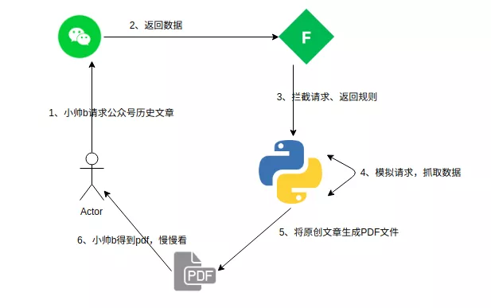  

ok,有了思路之后,我们就开干,先从数据抓包开始,将手机连好同个局域网的 WIFI,然后打开 fiddler,以小帅b的公众号为例,在手机上刷一下,**学习python的正确姿势**,这个公众号的历史文章  
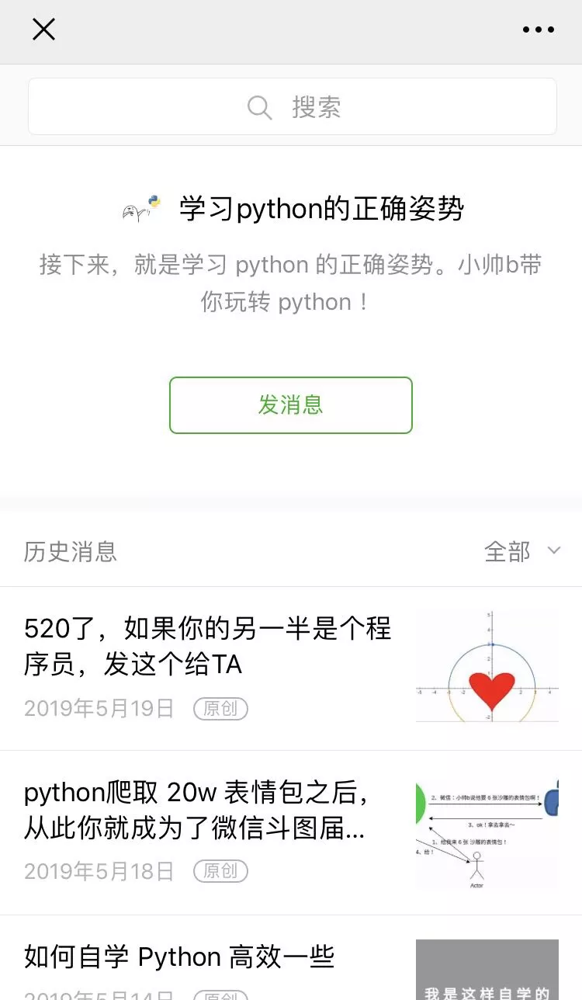  

往下多滑几下,然后来看看 fiddler 抓到了什么数据,可以发现就是这个接口一直在请求  
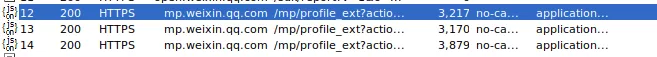  

来看看其中一个具体数据请求  
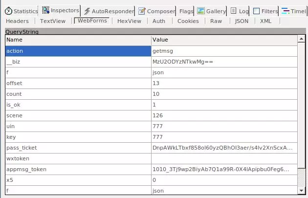  

可以发现,微信在获取公众号历史文章的时候,有这么些参数是要携带的,小帅b看了下,比较重要的两个参数是**offset** 和**is_ok**应该是用来加载更多文章的参数,  
其他的什么 token 参数,到时候我们直接复制到 python 中进行请求就好了,再来看看返回的数据长什么鸟样  
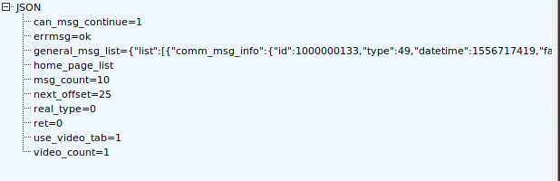  

返回了一个 json,这里有个 **next_offset** 字段,小帅b发现它就是用来下次请求的时候,用于 **offset** 这个字段的**can_msg_continue **,就是用于下次请求的 **is_ok** 字段的  
我们再来看看具体每次请求得到的,列表内容  
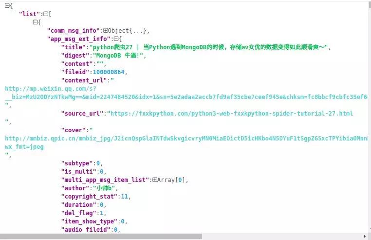  

数据很明显了list 里面的每一个 item都是小帅b发过的文章信息,标题、链接、作者、原文地址、封面图啥都有了. 那如何区分文章是否原创的呢?  
小帅b公众号都是原创的文章,所以只能去抓一下其他公众号的文章,看了一会发现,**copyright_stat = 11**,就是原创,知道了请求规则,以及返回数据的格式,  
接下来就可以使用代码获取啦,先来把 header 和 cookies 定义一下,假装自己是在用手机请求数据  
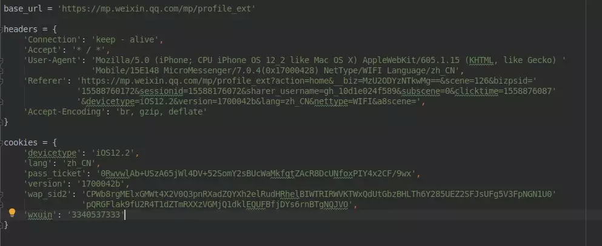  

在请求的时候,需要携带参数,这里主要是控制一下 offset ,用来加载更多数据  
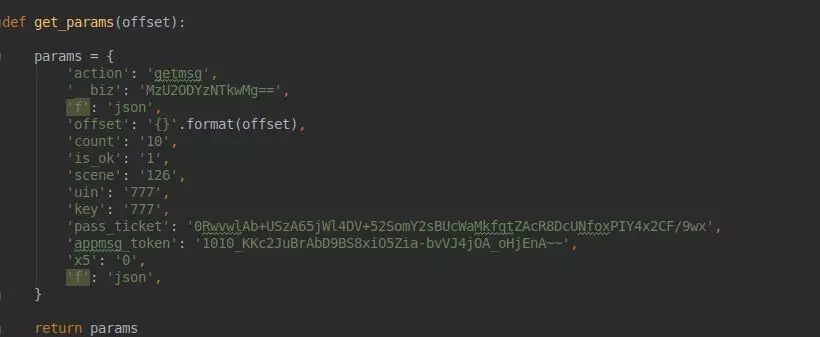  

定义好了之后,就可以使用 requests 进行请求了,先来获取所有的原创文章,然后打印一下看看  
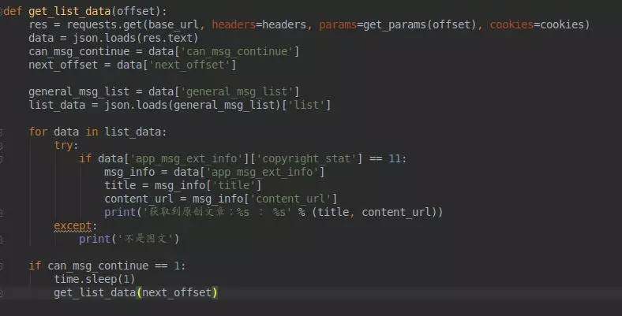  

主要就是将返回的数据,使用 json 进行解析,然后判断是否可以获取更多的数据,如果还有数据的话,我们就递归请求,ok,执行一波,  
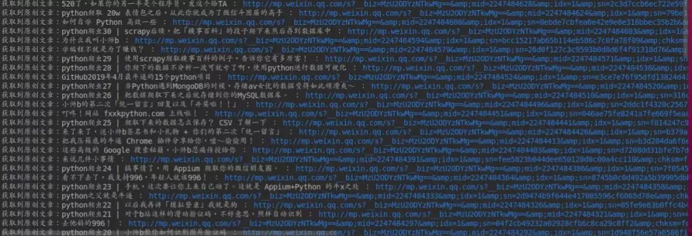  

公众号的所有原创文章,就被我们爬取下来啦  

接下来,把文章转化为 pdf 文件  

怎么弄,其实小帅b也不知道...,遇到事情不要慌,上 Google 搜索一下呗  
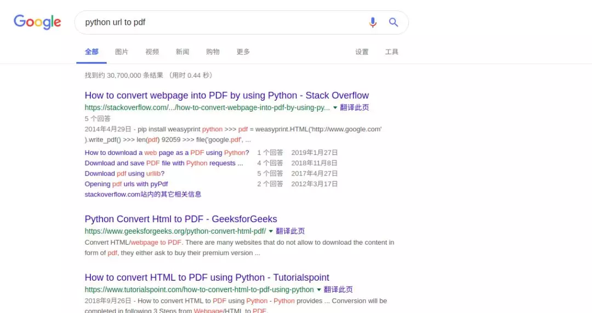  

装下b,用英文搜索,点进去第一个链接看看  
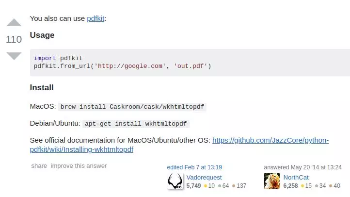  

赶紧安装试试看  
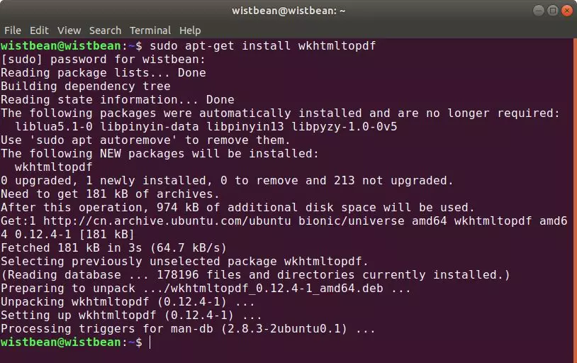  

安装完成之后,在代码使用一下  

```python
# 自己定义存储路径
pdfkit.from_url(content_url, '/home/wistbean/wechat_article/'+title+'.pdf')
```

执行  
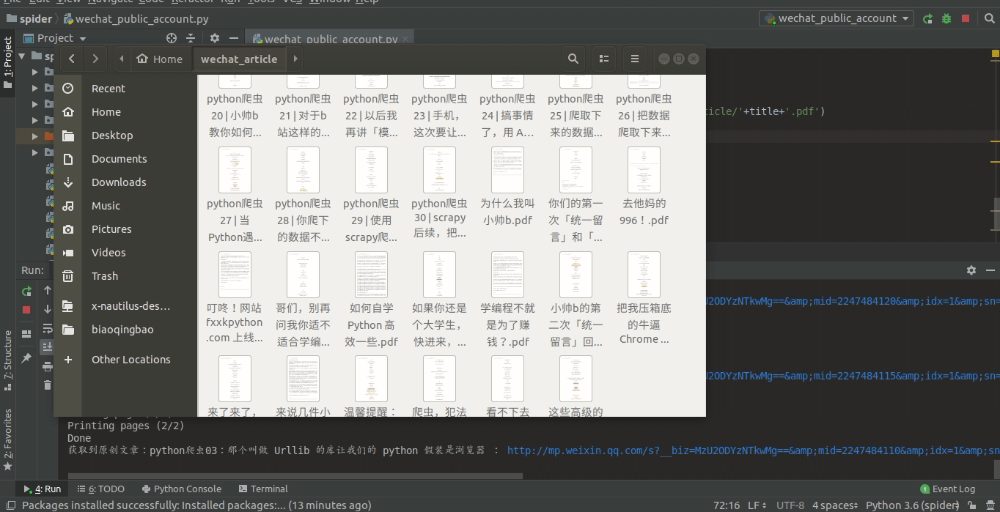  

可以可以,帅b的所有原创文章,就被保存下来啦  
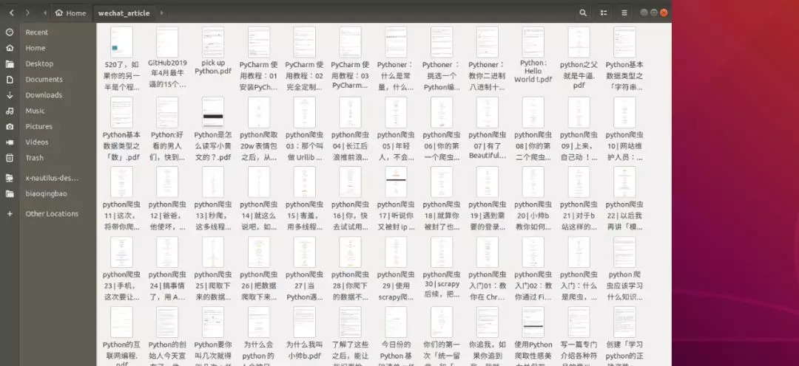  

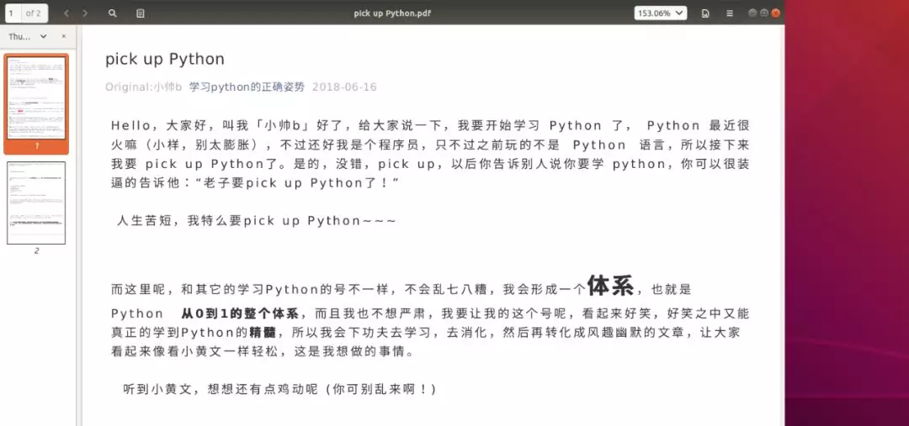  

