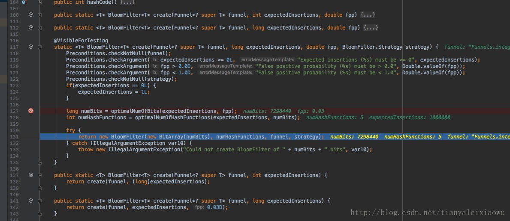
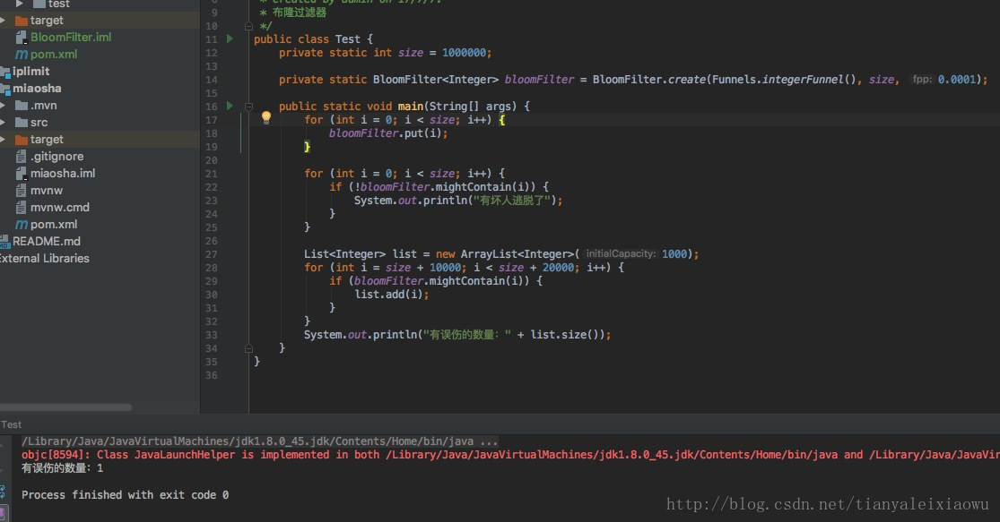
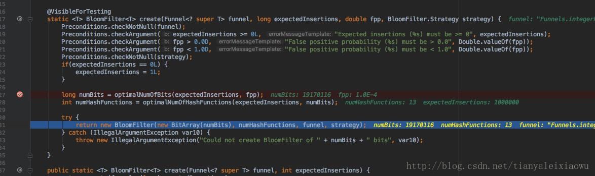

##### 介绍
###### 基本概念  

如果想判断一个元素是不是在一个集合里，一般想到的是将所有元素保存起来，然后通过比较确定。链表、树、散列表（又叫哈希表，Hash table）等等数据结构都是这种思路。但是随着集合中元素的增加，我们需要的存储空间越来越大。同时检索速度也越来越慢，上述三种结构的检索时间复杂度分别为O(n),O(\log n),O(n/k)。  

布隆过滤器的原理是，当一个元素被加入集合时，通过K个散列函数将这个元素映射成一个位数组中的K个点，把它们置为1。检索时，我们只要看看这些点是不是都是1就（大约）知道集合中有没有它了：如果这些点有任何一个0，则被检元素一定不在；如果都是1，则被检元素很可能在。这就是布隆过滤器的基本思想。  

###### 优点  

相比于其它的数据结构，布隆过滤器在空间和时间方面都有巨大的优势。布隆过滤器存储空间和插入/查询时间都是常数（O(k)）。另外, 散列函数相互之间没有关系，方便由硬件并行实现。布隆过滤器不需要存储元素本身，在某些对保密要求非常严格的场合有优势。  

布隆过滤器可以表示全集，其它任何数据结构都不能；  

k和m相同，使用同一组散列函数的两个布隆过滤器的交并差运算可以使用位操作进行。  

###### 缺点  

但是布隆过滤器的缺点和优点一样明显。误算率是其中之一。随着存入的元素数量增加，误算率随之增加。但是如果元素数量太少，则使用散列表足矣。  

另外，一般情况下不能从布隆过滤器中删除元素. 我们很容易想到把位数组变成整数数组，每插入一个元素相应的计数器加1, 这样删除元素时将计数器减掉就可以了。然而要保证安全地删除元素并非如此简单。首先我们必须保证删除的元素的确在布隆过滤器里面. 这一点单凭这个过滤器是无法保证的。另外计数器回绕也会造成问题。  

###### 使用场景  

* 爬虫的URL过滤。
* 日志分析
* 用户数统计等等等  

总之使用布隆过滤器应该是可能容忍小概率误判的场景，不然慎用  


##### 例子  

###### 使用1  

google的guava包中提供了BloomFilter类，我们直接使用它来进行一下简单的测试。  

新建一个maven工程，引入guava包  

```xml
<dependencies>
        <dependency>
            <groupId>com.google.guava</groupId>
            <artifactId>guava</artifactId>
            <version>22.0</version>
        </dependency>
</dependencies>
```

测试分两步：  

一. 我们往过滤器里放一百万个数，然后去验证这一百万个数是否能通过过滤器，目的是校验是坏人是否一定被抓。  
二. 我们另找1万个不在这一百万范围内的数，去验证漏网之鱼的概率，也就是布隆过滤器的误伤情况。  

```java
import com.google.common.hash.BloomFilter;
import com.google.common.hash.Funnels;
import java.util.ArrayList;
import java.util.List;
/**
 * Created by admin on 17/7/7.
 * 布隆过滤器
 */
public class Test {
    private static int size = 1000000;
    private static BloomFilter<Integer> bloomFilter = BloomFilter.create(Funnels.integerFunnel(), size);

    public static void main(String[] args) {
        for (int i = 0; i < size; i++) {
            bloomFilter.put(i);
        }

        for (int i = 0; i < size; i++) {
            if (!bloomFilter.mightContain(i)) {
                System.out.println("有坏人逃脱了");
            }
        }

        List<Integer> list = new ArrayList<Integer>(1000);
        for (int i = size + 10000; i < size + 20000; i++) {
            if (bloomFilter.mightContain(i)) {
                list.add(i);
            }
        }
        System.out.println("有误伤的数量：" + list.size());
    }
}
```  

运行后发现，没有坏人逃脱，当我们去遍历这一百万个数时，他们都在过滤器内被识别了出来。  

误伤的数量是330.也就是有330个不在过滤器内的值，被认为在过滤器里，被误伤了。  

错误概率是3%作用，为毛是3%呢。我们跟踪源码看一下就知道了。  

  

在create的多个重载方法中，最终走的是有4个参数的那个。我们上面用的是有2个参数的，注意看图片最下面，我们不填第三方参数时，默认补了一个0.03，这个就代表了允许的错误概率是3%。第四个参数是哈希算法，默认是BloomFilterStrategies.MURMUR128_MITZ_64，这个我们不去管它，反正也不懂。  

在第127行可以看到，要存下这一百万个数，位数组的大小是7298440，700多万位，实际上要完整存下100万个数，一个int是4字节32位，我们需要4X8X1000000=3千2百万位，差不多只用了1/5的容量，如果是HashMap，按HashMap 50%的存储效率，我们需要6千4百万位，所有布隆过滤器占用空间很小，只有HashMap的1/10-1/5作用。  

128行是hash函数的数量，是5，也就是说系统觉得要保证3%的错误率，需要5个函数外加700多万位即可。用3%误差换十分之一的内存占用。  

我们也可以修改这个错误概率，譬如我们改为0.0001万分之一。  

```java
private static BloomFilter<Integer> bloomFilter = BloomFilter.create(Funnels.integerFunnel(), size, 0.0001);
```

再次运行看看  

  

我们将28行改为10万个数，发现结果为“误伤12”。可以看到这个概率是比较靠谱的。  

当概率为万分之一时，我们看看空间占用。  
  
此时bit容量已经从700多万到1900万了，函数数量也从5变成了13.概率从3%缩减到万分之一。  


###### 使用2  
**题目:** 移动公司需要对已经发放的所有139段的号码进行统计排序，已经发放的139号码段的文件都存放在一个文本文件中（原题是放在两个文件中），一个号码一行，现在需要将文件里的所有号码进行排序，并写入到一个新的文件中；号码可能会有很多，最多可能有一亿个不同的号码（所有的139段号码），存入文本文件中大概要占1.2G的空间；JVM最大的内存在300以内，程序要考虑程序的可执行性及效率；只能使用Java标准库，不得使用第三方工具。   

这是个典型的大数据量的排序算法问题，首先要考虑空间问题，一下把.2G的数据读入内存是不太可能的，就算把壹亿条数据都转换成INT类型存储也要占接近400M的空间。当时做个题目我并没有想太多的执行效率问题，主要就考虑了空间，而且习惯性的想到合并排序，基本思想是原文件分割成若干个小文件并排序，再将排序好的小文件合并得到最后结果，算法大概如下：  

```text
1、顺序读取存放号码文件的中所有号码，并取139之后的八位转换为int类型；每读取号码数满一百万个（这个数据可配置）将已经读取的号码排序并存入新建的临时文件。
2、将所有生成的号码有序的临时文件合并存入结果文件。
```

这个算法虽然解决了空间问题，但是运行效率极低，由于IO读写操作太多，加上步骤1中的排序的算法（快速排序）本来效率就不高（对于电话排序这种特殊情况来说），导致1亿条数据排序运行3个小时才有结果。   

如何能够减少排序的时间呢？首当其冲的是减少IO操作，另外如果能够有更加好排序算法也行。前天无聊再看这个题目时突然想到大三时看《编程珠玑》时上面也有个问题的需求这个这个题目差不多，记得好像使用是位向量（实际上就是一个bit数组），用电话作为index，心中大喜，找到了解决此问题的最完美方案：用位向量存储电话号码，壹個号码占壹個bit，壹亿個电话号码也只需要大概12M的空间；算法大概如下：  

```text
1、初始化bits[capacity]；
2、顺序所有读入电话号码，并转换为int类型，修改位向量值：bits[phoneNum]=1；
3、遍历bits数组，如果bits[index]=1，转换index为电话号码输出。
```

由于Java中没有 bit 类型，一个 boolean 值占空间为 1byte（感兴趣的可以自己写程序验证），我自己写了個用 int 模拟 bit 数组的类，代码如下：  

```java
public class BitArray {
	private int[] bits = null;
	private int length;
	//用于设置或者提取int类型的数据的某一位(bit)的值时使用
	private final static int[] bitValue = {
		0x80000000,//10000000 00000000 00000000 00000000
		0x40000000,//01000000 00000000 00000000 00000000
		0x20000000,//00100000 00000000 00000000 00000000
		0x10000000,//00010000 00000000 00000000 00000000
		0x08000000,//00001000 00000000 00000000 00000000
		0x04000000,//00000100 00000000 00000000 00000000
		0x02000000,//00000010 00000000 00000000 00000000
		0x01000000,//00000001 00000000 00000000 00000000
		0x00800000,//00000000 10000000 00000000 00000000
		0x00400000,//00000000 01000000 00000000 00000000
		0x00200000,//00000000 00100000 00000000 00000000
		0x00100000,//00000000 00010000 00000000 00000000
		0x00080000,//00000000 00001000 00000000 00000000
		0x00040000,//00000000 00000100 00000000 00000000
		0x00020000,//00000000 00000010 00000000 00000000
		0x00010000,//00000000 00000001 00000000 00000000
		0x00008000,//00000000 00000000 10000000 00000000
		0x00004000,//00000000 00000000 01000000 00000000
		0x00002000,//00000000 00000000 00100000 00000000
		0x00001000,//00000000 00000000 00010000 00000000
		0x00000800,//00000000 00000000 00001000 00000000
		0x00000400,//00000000 00000000 00000100 00000000
		0x00000200,//00000000 00000000 00000010 00000000
		0x00000100,//00000000 00000000 00000001 00000000
		0x00000080,//00000000 00000000 00000000 10000000
		0x00000040,//00000000 00000000 00000000 01000000
		0x00000020,//00000000 00000000 00000000 00100000
		0x00000010,//00000000 00000000 00000000 00010000
		0x00000008,//00000000 00000000 00000000 00001000
		0x00000004,//00000000 00000000 00000000 00000100
		0x00000002,//00000000 00000000 00000000 00000010
		0x00000001 //00000000 00000000 00000000	00000001
	};
	public BitArray(int length) {
		if(length < 0){
			throw new IllegalArgumentException("length必须大于零！");
		}
		bits = new int[length / 32 + (length % 32 > 0 ? 1 : 0)];
		this.length = length;
	}
	//取index位的值
	public int getBit(int index){
		if(index <0 || index > length){
			throw new IllegalArgumentException("length必须大于零小于" + length);
		}
		int intData = bits[index/32];
		return (intData & bitValue[index%32]) >>> (32 - index%32 -1);
	}
	//设置index位的值，只能为0或者1
	public void setBit(int index,int value){
		if(index <0 || index > length){
			throw new IllegalArgumentException("length必须大于零小于" + length);
		}		
		if(value!=1&&value!=0){
			throw new IllegalArgumentException("value必须为0或者1");
		}
		int intData = bits[index/32];
		if(value == 1){
			bits[index/32] = intData | bitValue[index%32];
		}else{
			bits[index/32] = intData & ~bitValue[index%32];
		}
	}
	public int getLength(){
		return length;
	}	
}
```

bit 数组有了，剩下就是算法代码，核心代码如下：  

```java
bitArray = new BitArray(100000000);
//顺序读取所有的手机号码
while((phoneNum = bufferedReader.readLine())!=null){
	//取139号码的最后8位数字
	phoneNum = phoneNum.trim().substring(3);
	//将后8位转换为int类型
	phoneNumAsInt = Integer.valueOf(phoneNum);
	//设置对应bit值为1
	bitArray.setBit(phoneNumAsInt, 1);
}
//遍历bit数组输出所有存在的号码
for(int i = 0;i<sortUnit;i++){
	if(bitArray.getBit(i)==1){
		writer.write("139" + leftPad(String.valueOf(i + sortUnit*times), 8));
		writer.newLine();
	}
}
writer.flush();
```

经测试，修改后的算法排序时只需要20多兆的内存，壹亿条电话号码排序只要10分钟（时间主要花在IO上），看来效果还是很明显的。   

这个算法很快，不过也有他的局限性：  

```text
1、只能用于整数的排序，或者可以准确映射到正整数（对象不同对应的正整数也不相同）的数据的排序。
2、不能处理重复的数据，重复的数据排序后只有一条，如果有这种需求，可以在这个算法的基础上修改，给出现次数大于1的数据添加個计数器即可，然后存入Map中。
3、对于数据量极其大的数据处理可能还是比较占用空间，这种情况可配合多通道排序算法解决。
```
这个算法的思想源于[《 编程珠玑》](http://book.douban.com/subject/1230206/)中的 布隆过滤器（Bloom Filter），有兴趣的同学可以读读那本书，非常不错！ 