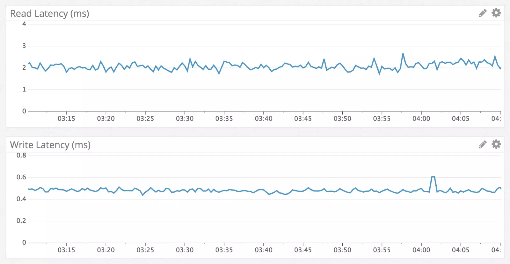

Discord 是一款国外的类似 YY 的语音聊天软件。Discord 语音聊天软件及我们的 UGC 内容的增长速度比想象中要快得多。随着越来越多用户的加入，带来了更多聊天消息。2016 年 7 月，每天大约有 4 千万条消息；2016 年 12 月，每天超过亿条。当写这篇文章时（2017 年 1 月），每天已经超过 1.2 亿条了。  

我们早期决定永久保存所有用户的聊天历史记录，这样用户可以随时在任何设备查找他们的数据。这是一个持续增长的高并发访问的海量数据，而且需要保持高可用。**如何才能搞定这一切？我们的经验是选择 Cassandra 作为数据库！**  


##### 我们在做什么  

Discord 语音聊天软件的最初版本在 2015 年只用了两个月就开发出来。在那个阶段，MongoDB 是支持快速迭代最好的数据库之一。所有 Discord 数据都保存在同一个 MongoDB 集群中，但在设计上我们也支持将所有数据很容易地迁移到一种新的数据库（我们不打算使用 MongoDB 数据库的分片，因为它使用起来复杂以及稳定性不好）。  

实际上这是我们企业文化的一部分：快速搭建来验证产品的特性，但也预留方法来支持将它升级到一个更强大的版本。  

消息保存在 MongoDB 中，使用 channel_id 和 created_at 的单一复合索引。到 2015 年 11 月，存储的消息达到了 1 亿条，这时，原来预期的问题开始出现：内存中再也放不下所有索引及数据，延迟开始变得不可控，是时候迁移到一个更适合这个项目的数据库了。  


##### 选择正确的数据库  

在选择一个新的数据库之前，我们必须了解当前的读/写模式，以及我们目前的解决方案为什么会出现问题。  

* 很显然，我们的读取是非常随机的，我们的读/写比为 50 / 50。
* 语音聊天服务器：它只处理很少的消息，每隔几天才发几条信息。在一年内，这种服务器不太可能达到 1000 条消息。它面临的问题是，即使请求量很小，它也很难高效，单返回 50 条消息给一个用户，就会导致磁盘中的许多次随机查找，并导致磁盘缓存淘汰。
* 私信聊天服务器：发送相当数量的消息，一年下来很容易达到 10 万到 100 万条消息。他们请求的数据通常只是最近的。它们的问题是，数据由于访问得不多且分散，因此不太可能被缓存在磁盘中。
* 大型公共聊天服务器：发送大量的消息。他们每天有成千上万的成员发送数以千计的消息，每年可以轻松地发送数以百万计的消息。他们几乎总是在频繁请求最近一小时的消息，因此数据可以很容易地被磁盘缓存命中。
* 我们预计在未来的一年，将会给用户提供更多随机读取数据的功能：查看 30 天内别人提及到你的消息，然后点击到某条历史记录消息，查阅标记（pinned）的消息以及全文搜索等功能。这一切导致更多的随机读取！！  

接下来我们来定义一下需求：  

* 线性可扩展性  -  我们不想等几个月又要重新考虑新的扩展方案，或者是重新拆分数据。
* 自动故障转移 （failover） -  我们不希望晚上的休息被打扰，当系统出现问题我们希望它尽可能的能自动修复。
* 低维护成本  -  一配置完它就能开始工作，随着数据的增长时，我们要需要简单增加机器就能解决。
* 已经被验证过的技术  -  我们喜欢尝试新的技术，但不要太新。
* 可预测的性能  -  当 API 的响应时间 95% 超过 80ms 时也无需警示。我们也不想重复在 Redis 或 Memcached 增加缓存机制。
* 非二进制存储  - 由于数据量大，我们不太希望写数据之前做一些读出二进制并反序列化的工作。
* 开源  -  我们希望能掌控自己的命运，不想依靠第三方公司。  

Cassandra 是唯一能满足我们上述所有需求的数据库。我们可以添加节点来扩展它，添加过程不会对应用程序产生任何影响，也可以容忍节点的故障。一些大公司如 Netflix 和苹果，已经部署有数千个 Cassandra 节点。数据连续存储在磁盘上，这样减少了数据访问寻址成本，且数据可以很方便地分布在集群上。它依赖 DataStax，但依旧是开源和社区驱动的。  

做出选择后，我们需要证明它实际上是可行的。  


##### 数据模型  

向一个新手描述 Cassandra 数据库最好的办法，是将它描述为 KKV 存储，两个 K 构成了主键。第一个 K 是分区键（partition key），用于确定数据存储在哪个节点上，以及在磁盘上的位置。一个分区包含很多行数据，行的位置由第二个 K 确定，这是聚类键（clustering key），聚类键充当分区内的主键，以及决定了数据行如何排序。可以将分区视为有序字典。这些属性相结合，可以支持非常强大的数据建模。  

前面提到过，消息在 MongoDB 中的索引用的是 channel_id 和 created_at，由于经常查询一个 channel 中的消息，因此 channel_id 被设计成为分区键，但 created_at 不作为一个大的聚类键，原因是系统内多个消息可能具有相同的创建时间。  

幸运的是，Discord 系统的 ID 使用了类似 Twitter Snowflake [1] 的发号器（按时间粗略有序），因此我们可以使用这个 ID。主键就变成（ channel_id， message_id）， message_id 是 Snowflake 发号器产生。当加载一个 channel 时，我们可以准确地告诉 Cassandra 扫描数据的范围。  

下面是我们的消息表的简化模式。  

```sql
CREATE TABLE messages (
  channel_id bigint,
  message_id bigint,
  author_id bigint,
  content text,
  PRIMARY KEY (channel_id, message_id)
) WITH CLUSTERING ORDER BY (message_id DESC);
```

Cassandra 的 schema 与关系数据库模式有很大区别，调整 schema 非常方便，不会带来任何临时性的性能影响。因此我们获得了最好的二进制存储和关系型存储。  

当我们开始向 Cassandra 数据库导入现有的消息时，马上看见出现在日志上的警告，提示分区的大小超过 100MB。发生了什么？！Cassandra 可是宣称单个分区可以支持 2GB！显然，支持那么大并不意味着它应该设成那么大。  

大的分区在进行压缩、集群扩容等操作时会对 Cassandra 带来较大的 GC 压力。大分区也意味着它的数据不能分布在集群中。很明显，我们必须限制分区的大小，因为一个单一的 channel 可以存在多年，且大小不断增长。  

我们决定按时间来归并我们的消息并放在一个 bucket 中。通过分析最大的 channel，我们来确定 10 天的消息放在一个 bucket 中是否会超过 100mb。Bucket 必须从 message_id 或时间戳来归并。  

```python
DISCORD_EPOCH = 1420070400000
BUCKET_SIZE = 1000 * 60 * 60 * 24 * 10


def make_bucket(snowflake):
   if snowflake is None:
       timestamp = int(time.time() * 1000) - DISCORD_EPOCH
   else:
       # When a Snowflake is created it contains the number of
       # seconds since the DISCORD_EPOCH.
       timestamp = snowflake_id >> 22
   return int(timestamp / BUCKET_SIZE)
  
  
def make_buckets(start_id, end_id=None):
   return range(make_bucket(start_id), make_bucket(end_id) + 1)
```

Cassandra 数据库的分区键可以复合，所以我们新的主键成为 （（ channel_id， bucket）， message_id）。  

```sql
CREATE TABLE messages (
   channel_id bigint,
   bucket int,
   message_id bigint,
   author_id bigint,
   content text,
   PRIMARY KEY ((channel_id, bucket), message_id)
) WITH CLUSTERING ORDER BY (message_id DESC);
```

为了方便查询最近的消息，我们生成了一个从当前时间到 channel_id（也是 Snowflake 发号器生成，要比第一个消息旧）的 bucket。然后我们依次查询分区直到收集到足够的消息。这种方法的缺点是，不活跃的 channel 需要遍历多个 bucket 从而收集到足够返回的消息。在实践中，这已被证明还行得通，因为对于活跃的 channel，查询第一个 bucket 就可以返回足够多的数据。  

将消息导入到 Cassandra 数据库十分顺利，我们准备尝试迁移到生产环境。  


##### 冒烟启动  

在生产环境引入新系统总是可怕的，因此最好在不影响用户的前提下先进行测试。我们将代码设置成双读/写到 MongoDB 和 Cassandra。  

一启动系统我们就收到 bug 追踪器发来的错误信息，错误提示 author_id 为 null。怎么会是 null ？这是一个必需的字段！在解释这个问题之前，先介绍一下问题的背景。  


##### 最终一致性  

Cassandra 是一个 AP 数据库，这意味着它牺牲了强一致性（C）来换取可用性（A），这也正是我们所需要的。在 Cassandra 中读写是一个反模式（读比写的代价更昂贵）。你也可以写入任何节点，在 column 的范围，它将使用“last write wins”的策略自动解决写入冲突，这个策略对我们有何影响？请看下面动画。  

在例子中，一个用户编辑消息时，另一个用户删除相同的消息，当 Cassandra 执行 upsert 之后，我们只留下了主键和另外一个正在更新文本的列。  

有两个可能的解决方案来处理这个问题：  

* 编辑消息时，将整个消息写回。这有可能找回被删除的消息，但是也增加了更多数据列冲突的可能。
* 能够判断消息已经损坏时，将其从数据库中删除。  

我们选择第二个选项，我们按要求选择一列（在这种情况下， author_id），如果消息是空的就删除。  

在解决这个问题时，我们也注意到我们的写入效率很低。由于 Cassandra 被设计为最终一致性，因此执行删除操作时不会立即删除数据，它必须复制删除到其他节点，即使其他节点暂时不可用，它也照做。  

Cassandra 为了方便处理，将删除处理成一种叫“墓碑”的写入形式。在处理过程中，它只是简单跳过它遇到的墓碑。墓碑通过一个可配置的时间而存在（默认 10 天），在逾期后，会在压缩过程中被永久删除。  

删除列以及将 null 写入列是完全相同的事情。他们都产生墓碑。因为所有在 Cassandra 数据库中的写入都是更新插入（upsert），这意味着哪怕第一次插入 null 都会生成一个墓碑。  

实际上，我们整个消息数据包含 16 个列，但平均消息长度可能只有了 4 个值。这导致新插入一行数据没缘由地将 12 个新的墓碑写入至 Cassandra 中。  

解决这个问题的方法很简单：只给 Cassandra 数据库写入非空值。  


##### 性能  

Cassandra 以写入速度比读取速度要快著称，我们观察的结果也确实如此。写入速度通常低于 1 毫秒而读取低于 5 毫秒。我们观察了数据访问的情况，性能在测试的一周内保持了良好的稳定性。没什么意外，我们得到了我们所期望的数据库。  
  

说到快速、一致的读取性能，这里有一个例子，跳转到某个上百万条消息的 channel 的一年前的某条消息，请看动画  
  


##### 巨大的意外  

一切都很顺利，因此我们将它切换成我们的主数据库，然后在一周内淘汰掉 MongoDB。Cassandra 工作一切正常，直到 6 个月后有一天，Cassandra 突然变得反应迟钝。我们注意到 Cassandra 开始出现 10 秒钟的 GC 全停顿（Stop-the-world） ，但是我们不知道原因。  

我们开始定位分析，发现加载某个 channel 需要 20 秒。一个叫 “Puzzles & Dragons Subreddit” 的公共 channel 是罪魁祸首。因为它是一个开放的 channel，因此我们也跑进去探个究竟。  

令我们惊讶的是，channel 里只有 1 条消息。我们也了解到他们用我们的 API 删除了数百万条消息，只在 channel 中留下了 1 条消息。  

上文提到 Cassandra 是如何用墓碑（在最终一致性中提及过）来处理删除动作的。当一个用户载入这个 channel，虽然只有 1 条的消息，Cassandra 不得不扫描百万条墓碑（产生垃圾的速度比虚拟机收集的速度更快）。  

我们通过如下措施解决：  

* 因为我们每晚都会运行 Cassandra 数据库修复（一个反熵进程），我们将墓碑的生命周期从 10 天降低至 2 天。
* 我们修改了查询代码，用来跟踪空的 buckets，并避免他们在未来的 channel 中加载。这意味着，如果一个用户再次触发这个查询，最坏的情况，Cassandra 数据库只在最近的 bucket 中进行扫描。  


##### 未来  

我们目前在运行着一个复制因子是 3 的 12 节点集群，并根据业务需要持续增加新的节点，我相信这种模式可以支撑很长一段时间。但随着 Discord 软件的发展，相信有一天我们可能需要每天存储数十亿条消息。  

Netflix 和苹果都维护了运行着数千个节点的集群，所以我们知道目前这个阶段不太需要顾虑太多。当然我们也希望有一些点子可以未雨绸缪。  


##### 近期工作  

将我们的消息集群从 Cassandra 2 升级到 Cassandra 3。Cassandra 3 有一个新的存储格式，可以将存储大小减少 50% 以上。新版 Cassandra 单节点可以处理更多数据。目前，我们在每个节点存储了将近 1TB 的压缩数据。我们相信我们可以安全地扩展到 2TB，以减少集群中节点的数量。  


##### 长期工作  

尝试下 Scylla [4]，它是一款用 C++ 编写与 Cassandra 兼容的数据库。在正常操作期间，我们 Cassandra 节点实际上是没有占用太多的 CPU，然而在非高峰时间，当我们运行修复（一个反熵进程）变得相当占用 CPU，同时，继上次修复后，修复持续时间和写入的数据量也增大了许多。 Scylla 宣称有着极短的修复时间。  

将没使用的 Channel 备份成谷歌云存储上的文件，并且在有需要时可以加载回来。我们其实也不太想做这件事，所以这个计划未必会执行。  


##### 结论  

切换之后刚刚过去一年，尽管经历过“巨大的意外”，一切还是一帆风顺。从每天 1 亿条消息到目前超过 1.2 亿条，一直保持着良好的性能和稳定性。由于这个项目的成功，因此我们将生产环境的其他数据也迁移到 Cassandra，并且也取得了成功。  

