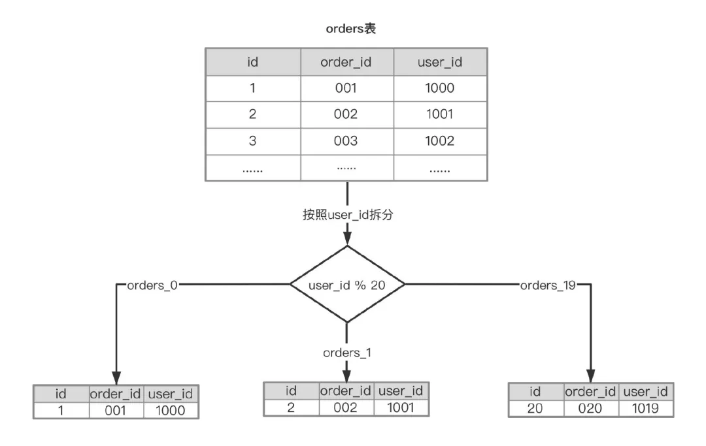
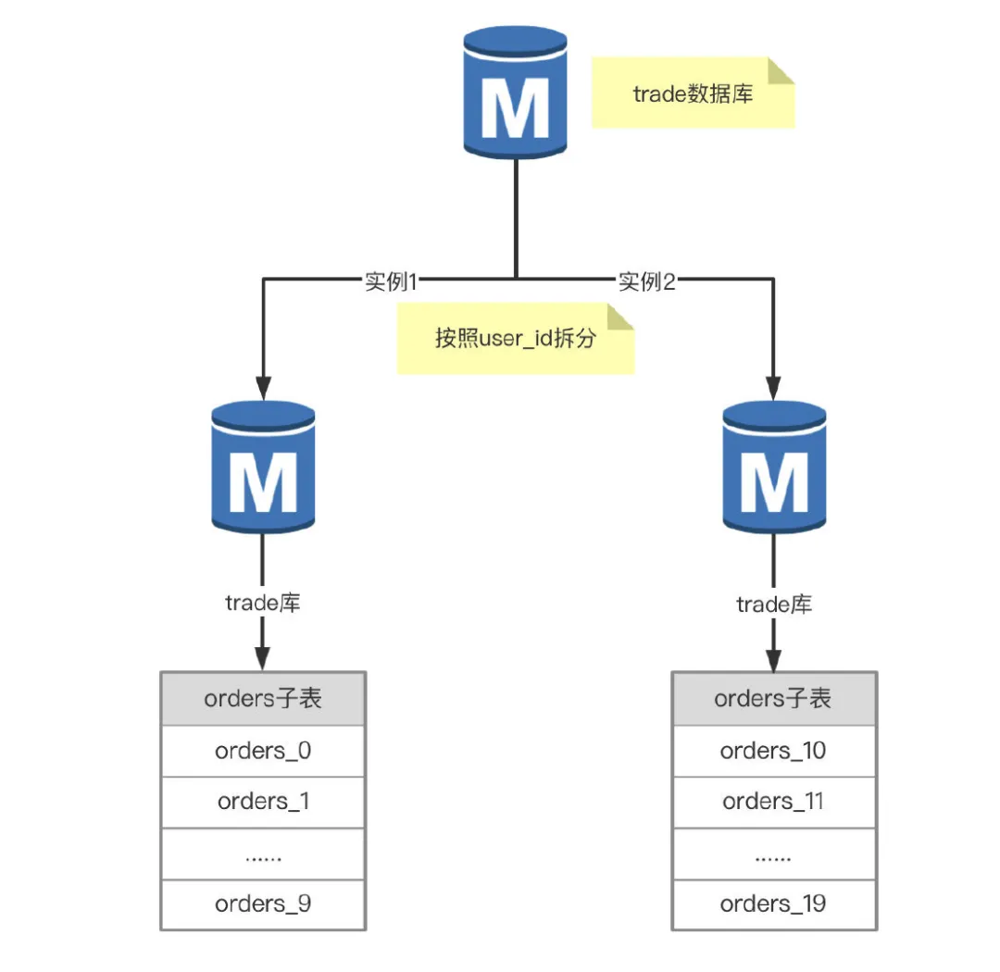
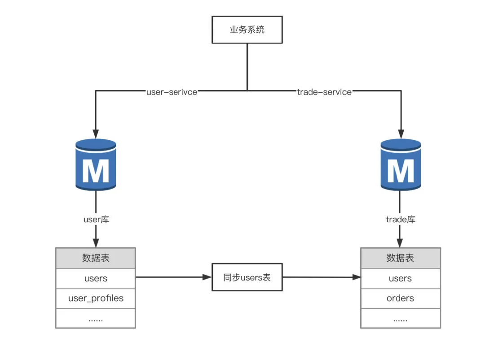

# 分库分表方案

我们都知道，随着业务量的增长，数据量也会随之增加，这个时候就需要关注业务大表，因为大表会影响查询性能，DDL变更时间很长，影响业务的可用性，同时导致从库延迟很大，如果业务做了读写分离，导致用户重复操作产生脏数据，例如重复下单。

今天就跟大家讨论下那些年MySQL使用过的分表分库的方案，分表分库后的问题以及解决方案，希望对您有新的收获哦。

MySQL表大小限制
----------

MySQL一般安装部署在Linux操作系统上（例如CentOS 7.4），默认都是InnoDB存储引擎，且开启了独立表空间选项（参数`innodb_file_per_table=1`），此时创建一个表 orders 就会自动生成一个数据文件 orders.ibd，文件大小是受操作系统 Block 大小限制的，下面是 ext3 文件系统块大小和最大尺寸的对应关系。
|  操作系统块大小   | 最大文件尺寸    | 最大文件系统尺寸    |
| :-- | :-- | :-- |
|  1KB   | 16GB    | 2TB    |
| 2KB    | 256GB    | 8TB    |
| 4KB    | 2TB    | 16TB    |
| 8KB    |  16TB   |  32TB   |

**查看操作系统页大小及块大小**

这就说明 MySQL 单表的最大尺寸不能超过 2TB，我们简单来算一下，假设一个表的平均行长度为32KB（InnoDB最大行长度限制65536字节，64KB），那么他最大能存储多少行数据？`4 x 1024 x 1024 x 1024 / 32 = 134217728`大约 1.4 亿不到。

对于饿了么，美团那外卖种交易系统的订单表 1.4 亿是很容易达到的，一天平均 2000W 订单，一周就到 1.4 亿了，没法玩了，一般都会采用异地多活的方案，根据用户的位置将数据写到相应的 IDC 数据中心，这其实也是一种高大上的分表方案，不在我们今天讨论范围啦。

分表方案
----

分表的应用场景是单表数据量增长速度过快，影响了业务接口的响应时间，但是 MySQL 实例的负载并不高，这时候只需要分表，不需要分库（拆分实例）。

我们知道，一个表大小是满足如下公式的：**TABLE\_SIZE = AVG\_ROW\_SIZE  x  ROWS**，从这里可以知道表太大，要么是平均行长度太大，也就说表的字段太多，要么是表的记录数太多。这就产生两种不同的分表方案，**即切分字段（垂直分表）和切分记录（水平分表）** 。

### 垂直分表

还是以订单表 orders 为例，按照字段进行拆分，这里面需要考虑一个问题，如何拆分字段才能表上的DML性能最大化，常规的方案是冷热分离（将使用频率高字段放到一张表里，剩下使用频繁低的字段放到另一张表里）。

orders 表通过拆分之后，就变成了 orders01 和 orders02 两张表，在磁盘上就会存储两个数据文件 orders01.ibd 和 orders02.ibd，orders 表最大尺寸就是 4TB 了，拆分完之后，该怎么查询呢？举个例子：

分析下上面的 SQL，select 后面的列分别位于两张表中（order\_id,order\_sn在orders01中，source在orders02中），上面的SQL可以查询重写为如下形式。

如果用了数据库中间件就会自动实现查询重写，例如 mycat，sharding-sphere，不用中间件的话，也可以实现的，就是稍微比较麻烦点，可以搞一个 route 表（主键ID, 原表名，字段名，子表名），每次解析SQL时都需要根据**原表名 + 字段名**去获取需要的子表，然后再改写 SQL，执行 SQL 返回结果，这种代码改造量太大，而且容易出错，故这种垂直拆分在实际业务中用的不多。

如果业务表中有必须的 Text 类型来存储数据，这时可以利用垂直拆分来减少表大小，将 text 字段拆分到子表中。

这样将 text 类型拆分放到子表中之后，原表的平均行长度就变小了，就可以存储更多的数据了。

### 水平分表

水平拆分表就是按照表中的记录进行分片，举个例子，目前订单表 orders 有 2000w 数据，根据业务的增长，估算一年之后会达到1亿，同时参考阿里云 RDS for MySQL 的最佳实践，单表不建议超过 500w，1亿数据分20个子表就够了。

**问题来了，按照什么来拆分呢？主键id还是用户的user\_id**，按主键ID拆分数据很均匀，通过ID查询 orders 的场景几乎没有，业务访问 orders 大部分场景都是根据 user\_id来过滤的，而且 user\_id 的唯一性又很高（一个 user\_id 对应的 orders 表记录不多，选择性很好），按照 user\_id 来作为 Sharding key能满足大部分业务场景，拆分之后每个子表数据也比较均匀。

这样就将 orders 表拆分成20个子表，对应到InnoDB的存储上就是20个数据文件（orders\_0.ibd，orders\_1.ibd等），这时候执行SQL语句`select order_id, order_sn, source from **orders** where user_id = 1001`;就能很快的定位到要查找记录的位置是在orders\_1，然后做查询重写，转化为SQL语句`select order_id, order_sn, source from **orders_01** where user_id = 1001`，这种查询重写功能很多中间件都已经实现了，常用的就是 sharding-sphere 或者 sharding-jdbc 都可以实现。

### 按月分表

对于账务或者计费类系统，每天晚上都会做前一天的日结或日账任务，每月的1号都会做月结或月账任务，任务执行完之后相关表的数据都已静态化了（业务层不需要这些数据），根据业务的特性，可以按月创建表，比如对于账单表 bills，就可以创建按月分表（十月份表bills\_202010，202011十一月份表），出完月账任务之后，就可以归档到历史库了，用于数据仓库ETL来做分析报表，确认数据都同步到历史库之后就可以删除这些表释放空间。

### MySQL分区表

你可能在想，上面的水平分表之后，还要改造代码要能保证 SQL 正确的路由，执行并返回结果，这个调用链路有点长吧，MySQL内部有没有分表的解决方案呢？其实是有的，可以考虑使用 MySQL 的 HASH 分区，常规的 hash 也是基于分区个数取模（%）运算的，跟上面的user\_id % 20是一样的，来看一个例子。

这样就创建了20个分区，对应磁盘上就是20个数据文件（orders#p#**p0**.ibd一直到orders#p#**p19**.ibd），来看一下SQL的执行过程。

从执行计划可以看到，通过分区键user\_id过滤，直接可以定位到数据所在的分区 p19（user\_id =1019 % 20 = 19，所以在p19分区上），进而去访问p19对应的数据文件 orders#p#**p19**.ibd 即可获得数据。这种方案的好处就是 MySQL 内部实现 SQL 路由的功能，不用去改造业务代码。

分库方案
----

聊了下分表的方案，那什么时候分库呢？我们知道，MySQL 的高可用架构大多都是一主多从，所有写入操作都发生在 Master 上，随着业务的增长，数据量的增加，很多接口响应时间变得很长，经常出现 Timeout，而且通过升级 MySQL 实例配置已经无法解决问题了，这时候就要分库，通常有两种做法：**按业务拆库和按表分库**，下面就介绍这两种分库方案啦。

### 按业务分库

举个例子，交易系统 trade 数据库单独部署在一台 RDS 实例，现在交易需求及功能越来越多，订单，价格及库存相关的表增长很快，部分接口的耗时增加，同时有大量的慢查询告警，升级 RDS 配置效果不大，这时候就需要考虑拆分业务，将库存，价格相关的接口独立出来。

这样按照业务模块拆分之后，相应的 trade 数据库被拆分到了三个 RDS 实例中，数据库的写入能力提升，服务的接口响应时间也变短了，提高了系统的稳定性。

### 按表分库

上面介绍了分表方案，常见的有垂直分表和水平分表（拆分后的子表都在同一个 RDS 实例中存储），对应的分库就是垂直分库和水平分库，这里的分库其实是拆分 RDS 实例，是将拆分后的子表存储在不同的 RDS 实例中，垂直分库实际业务用的很少，就不介绍了，主要介绍下水平分库。

举个例子，交易数据库的订单表 orders 有2亿多数据，RDS 实例遇到了写入瓶颈，普通的 insert 都需要50ms，时常也会收到 CPU 使用率告警，这时就要考虑分库了。根据业务量增长趋势，计划扩容一台同配置的RDS实例，将订单表 orders 拆分20个子表，每个 RDS 实例10个。

这样解决了订单表 orders 太大的问题，查询的时候要先通过分区键 user\_id 定位是哪个 RDS 实例，再定位到具体的子表，然后做 DML操作，问题是代码改造的工作量大，而且服务调用链路变长了，对系统的稳定性有一定的影响。其实已经有些数据库中间件实现了分库分表的功能，例如常见的 mycat，阿里云的 DRDS 等。

分布式数据库
------

通过上面的分表和分库方案的介绍，主要会遇到下面三类问题：

1.  MySQL单 Master 的写入性能瓶颈。
    
2.  分库分表后的 SQL 解析处理，服务调用链路变长，系统变得不稳定。
    
3.  分库分表后动态扩容不好实现，例如开始分了20个表，不影响业务的情况下扩容至50个表不好实现。
    

拆分后的问题
------

### 垂直拆分

1.  **跨库Join问题**
    

在垂直拆分之前，系统中所需的数据是可以通过表 Join 来完成的，而拆分之后，数据库可能分布式在不同 RDS 实例，Join 处理起来比较麻烦，根据 MySQL 开发规范，一般是禁止跨库 Join 的，那该怎么处理呢？

首先要考虑这种垂直拆分的合理性，如果可以调整，那就优先调整，如果无法调整，根据以往的实际经验，总结几种常见的解决思路。

*   **全局表**
    

用过 mycat 做分库分表的朋友都清楚，有个全局表的概念，也就是每个 DataNode 上都有一份全量数据，例如一些数据字典表，数据很少修改，可以避免跨库 Join 的性能问题。

*   **数据同步**
    

对于分布式系统，不同的服务的数据库是分布在不同的 RDS 实例上的，在禁止跨库 Join 的情况下，数据同步是一种解决方案。

通过数据同步工具将 user 库的 users 表实时同步到trade库中，这样就可以直接在 trade 库做 Join 操作，比较依赖于同步工具的稳定性，如果同步有延迟，就会导致数据不一致，产生脏数据，需要做好风险评估和兜底方案。

2.  **分布式事务问题**
    

拆分之后，数据分布在不同的 RDS 实例上，对表的 DML 操作就变成了多个子表的 DML 操作，就涉及到分布式事务，也要遵循事务 ACID 特性，同时也会提到两个重要的理论：**CAP**（Consistency一致性，Availability可用性，Partition tolerance分区容忍性Partitiontolerance）和**BASE**（Basically Available基本可用， Soft state软状态，Eventually consistent最终一致性），进而产生了解决分布式事务问题不同的方案。

**MySQL XA事务**

MySQL支持分布式事务（XA 事务或者 2PC 两阶段提交），分为两个阶段：**Prepare 和  Commit**，事务处理过程如下

如果任何一个 XA Client 否决了此次提交，所有数据库都要求 XA Manager 回滚它们在事务中的信息，优点是可以最大程度保证了数据的强一致，适合对数据强一致要求很高的业务场景；缺点就是实现复杂，牺牲了可用性，对性能影响较大，不适合高并发高性能场景。

**本地消息表**

本地消息表实现方式应该是业界使用最多的，其核心思想是将分布式事务拆分成本地事务进行处理，其基本的设计思想是将远程分布式事务拆分成一系列的本地事务。

**处理过程**

**消息生产方**：需要额外建一个消息表，并记录消息发送状态，消息表和业务数据要在一个事务里提交，也就是说他们要在一个数据库里面。然后消息会经过 MQ 发送到消息的消费方，如果消息发送失败，会进行重试发送。

**消息消费方**：需要处理这个消息，并完成自己的业务逻辑，此时如果本地事务处理成功，表明已经处理成功了，如果处理失败，那么就会重试执行。如果是业务上面的失败，可以给生产方发送一个业务补偿消息，通知生产方进行回滚等操作。

生产方和消费方定时扫描本地消息表，把还没处理完成的消息或者失败的消息再发送一遍。如果有靠谱的自动对账补账逻辑，这种方案还是非常实用的。

### 水平拆分

1.  **分布式全局唯一ID**
    

MySQL InnoDB的表都是使用自增的主键ID，分库分表之后，数据表分布不同的分片上，如果使用自增 ID 作为主键，就会出现不同分片上的主机 ID 重复现象，可以利用 Snowflake 算法生成唯一ID。

2.  **分片键选择**
    

选择分片键时，需要先统计该表上的所有的 SQL，尽量选择使用频率且唯一值多的字段作为分片键，既能做到数据均匀分布，又能快速定位到数据位置，例如user\_id，order\_id等。

3.  **数据扩容**
    

举个例子，目前交易数据库 trade 中的订单表 orders 已经做了水平分库（位于两个不同RDS实例上），这时发现两个 RDS 写入性能还是不够，需要再扩容一个RDS，同时将 orders 从原来的 20 个子表扩容到 40个（user\_id % 40），这就需要迁移数据来实现数据重平衡，既要停机迁移数据，又要修改代码，有点出力不讨好的感觉啦。

4.  **跨库Join问题**
    

跟垂直拆分中的跨库 Join 问题是一样的。

5.  **跨库排序分页**
    

在处理`order by user_id limit n`场景是，当排序字段就是分片字段 user\_id 的时候，通过分片键可以很容易定位到具体的分片，而当排序字段非分片字段的时候，例如`order by create_time`，处理起来就会变得复杂，需要在不同的分片节中将数据进行排序并返回，并将不同分片返回的结果集进行汇总和再次排序，最后再返回给用户。

6.  **跨库函数处理**
    

在使用max，min，sum，count之类的函数进行统计和计算的时候，需要先在每个分片数据源上执行相应的函数处理，然后将各个结果集进行二次处理，最终再将处理结果返回。

7.  **ER分片**
    

在 RDBMS 系统中，表之间往往存在一些关联的关系，如果可以先确定好关联关系，并将那些存在关联关系的表记录存放在同一个分片上，就能很好地避免跨分片 join 问题。

8.  **非分片键过滤**
    
    大部分业务场景都可以根据分片键来过滤，但是有些场景没有分片键过滤，例如按照状态和时间范围来查询订单表 orders，常见的SQL 这样的。
    

    
   这种就很痛苦了，只能全部分片数据扫描一遍，将每个分片的数据Union之后再回复给客户端，这种场景可以考虑创建复合索引`（status，create_time）`让SQL走索引范围扫描，同时减少返回的数据量，如果是核心业务场景，可以考虑实时实时数仓（例如基于MPP架构的分析型数据库 ADB，分布式列式数据库 Clickhouse），将需要的表实时同步到数仓，然后再做处理，这也是实际业务中常见一种解决方案。
    

总结
--

上面聊了下 MySQ L的分表方案，分库方案，拆分后的问题以及给出了常用的解决方案，在实际开发中，会遇到核心业务表增长很快，数据量很大，MySQL 写入性能瓶颈的问题，这时需要根据业务的特性考虑分库分表，可以调研下相关的解决方案，主要有两种方案：代码改造（数据库中间件mycat，sharding-sphere）和分布式数据库（实际业务中使用比较多的有 PingCAP TiDB，阿里云 DRDS），可以优先使用分布式数据库方案，虽然成本会有所增加，但对应用程序没有侵入性，同时也可以比较好的支撑业务增长和系统快速迭代.