“黑云压城城欲摧，甲光向日金鳞开”，唐朝诗人李贺字面上描绘了黑云压城的自然景象，但实际描述的是敌军攻占城池的人马众多，来势汹汹，但是守城士兵依旧严阵以待，斗志昂扬。这种攻守的战争场面，和服务器的高并发压测十分相似。待压测的服务器应用类似于待攻占的城池，而测试软件需要做的就是构造出成千上百万的士兵，来攻占服务器的应用。  

如何构造出成千上百万的攻城士兵，是高并发测试的关键。而传统压力测试工具设计的时候并不是针对高并发测试设计的。针对高并发场景，传统压力测试工具往往自身是性能瓶颈。为适应高并发趋势，我们设计了TCPBurn，用于无状态协议的高并发压力测试，瞬间可以创造出任意多的攻城的精兵猛将。  

我们以消息推送服务为例，来模拟海量用户并发场景。千万并发连接测试相关的公开资料很少，据说要达到C10M（千万连接）并发，需要从根本上解决内核自身的问题。我们的实验希望验证linux服务器环境下Nginx能否承受千万连接的考验。  


#### 软硬件配置  

为进行千万并发连接测试，采用的软硬件如下：  
  

服务器IP地址采用192.168.25.89。  

TCPBurn采用IP欺骗的方式来模拟客户端，需要为客户端选择IP地址网段，这里我们选择内网IP地址来欺骗Nginx。  

客户端虚拟机IP地址和TCPBurn客户端所采用的IP地址关系如下：  
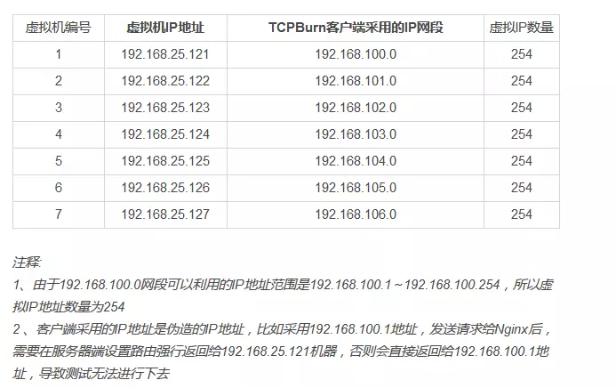  


虚拟机和服务器具体关系图如下（图中省略192.168前缀）：  
  


图中的城池便是我们待测试的Nginx服务；我们在城池的周围建立了7个营地，每个营地其实是客户端的虚拟机。接下来，我们需要在每个虚拟机上，通过TCPBurn来构建我们的精兵猛将。每个TCPBurn实例为客户端配置了254个IP地址，每个可用的IP地址类似于营地中的兵团，而TCPBurn可利用的端口区间为32768～65535，也就是每个兵团的士兵可达到32768个。这么计算下来，我们使用TCPBurn，在每个营地，轻而易举的便能够构造出254×32768=8323072个士兵，即800多万并发连接。在我们测试过程中，每一个营地会利用300万个地址空间来构造300万个客户端并发连接，需要大概500多M内存，而2000万并发连接，需要累计消耗3G多空间。  

服务器操作系统内核版本：`Linux 3.10.0-957.el7.x86_64`  

服务器CPU采样配置如下图：  
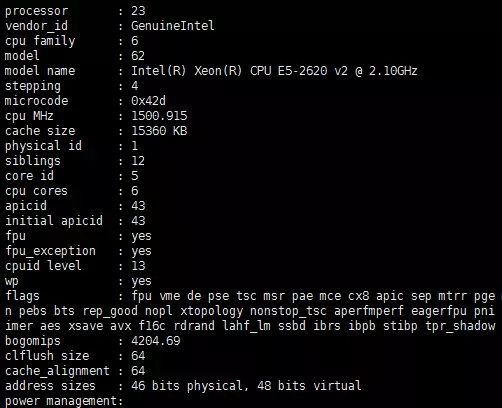  

服务器内存配置采样图：  
  

从上图可以看出服务器可用内存大概是200G左右（为性能考虑，海量并发测试不考虑swap空间），用来支撑2000万并发连接应用。在这个配置下，理论上每一个连接消耗资源不超过10k字节才可以做到（包括内核+应用）。  

虚拟机CPU采样配置如下图：  
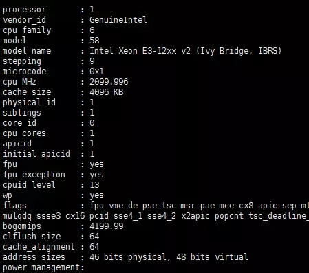  

虚拟机内存情况如下图：  
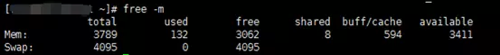  

虚拟机的硬件条件足够支持单个TCPBurn模拟300万并发连接。  


#### 服务器端系统参数配置  

为规避高并发带来的系统参数问题，需要在如下方面进行配置：  

##### 规避IP conntrack坑  

参考第21讲（IP CONNTRACK大坑，你跳不跳）内容，我们在服务器端配置了iptables命令来规避IP conntrack坑（两大坑，性能+连接无法建立）：  

具体命令：  

```console
iptables -t raw -A PREROUTING -p tcp --dport 8080 -j NOTRACK
iptables -t raw -A OUTPUT -p tcp --sport 8080 -j NOTRACK
```

这里8080是Nginx监听端口，意思是对出入8080端口的数据包不进行跟踪。设置上述命令可以降低内存和cpu资源消耗，并且也不会干扰测试的进行（21讲会详细讲述）。  

配置结果可以通过iptables来查看，见下图：  
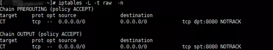


##### 规避文件句柄坑  

```console
ulimit -HSn 1000000
```

需要注意上述命令只对本终端有效，建议修改/etc/security/limits.conf。  

上述设置确保单个进程能够打开的句柄数量为100万。  

由于Nginx是多进程程序，所以可以配置多个进程的方式来支持2000万连接，理论上至少需要20个进程才能达到。  

##### 关闭rp filter设置  

由于TCPBurn采用了IP欺骗（原理类似流量复制工具TCPCopy，可参考课程TCPCopy相关部分），系统如果设置rp filter则会干扰测试的进行。  

由于被测试的服务器配置了rp filter过滤，为简单起见，在服务器端关闭所有rp_filter设置。  

##### 路由设置  

由于TCPBurn采用IP欺骗的方式来模拟大量客户端连接，需要在服务器端配置路由，使其响应能够回到发送请求的客户端虚拟机上。  

客户端虚拟机利用了7台虚拟机，所在的IP地址跟欺骗的IP网段地址对应关系如下：  

```console
192.168.25.121   <-------> 192.168.100.0

192.168.25.122   <-------> 192.168.101.0

192.168.25.123   <-------> 192.168.102.0

192.168.25.124   <-------> 192.168.103.0

192.168.25.125   <-------> 192.168.104.0

192.168.25.126   <-------> 192.168.105.0

192.168.25.127   <-------> 192.168.106.0
```

在 服务端进行路由设置：  

```console
route add -net 192.168.100.0 netmask 255.255.255.0 gw 192.168.25.121

route add -net 192.168.101.0 netmask 255.255.255.0 gw 192.168.25.122

route add -net 192.168.102.0 netmask 255.255.255.0 gw 192.168.25.123

route add -net 192.168.103.0 netmask 255.255.255.0 gw 192.168.25.124

route add -net 192.168.104.0 netmask 255.255.255.0 gw 192.168.25.125

route add -net 192.168.105.0 netmask 255.255.255.0 gw 192.168.25.126

route add -net 192.168.106.0 netmask 255.255.255.0 gw 192.168.25.127
```

上述路由设置的作用是请求从哪一台虚拟机过来，其响应就回到哪一台虚拟机。  


#### 服务器端Nginx部署安装  

我们需要部署一个消息推送Nginx服务，用来支持2000万模拟用户的消息推送服务 。  

具体安装请参考官网：https://github.com/wandenberg/nginx-push-stream-module  
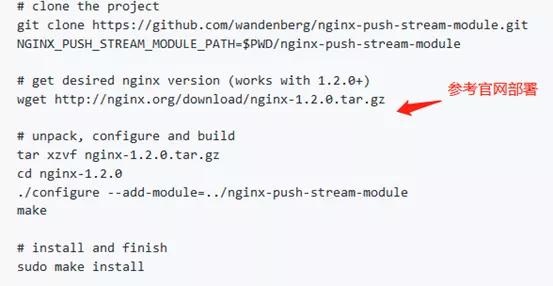  

Nginx配置参考下图：  
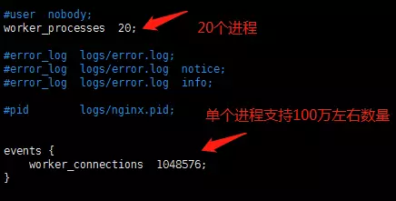  

上图中配置了20个进程，每一个进程支持1048576个连接，理论上可以支持2000万并发连接（1048576×20 > 20000000）。  

Nginx其它配置如下：  
  

监听端口采用8080端口。  


消息推送相关配置参数见下面两张图：  
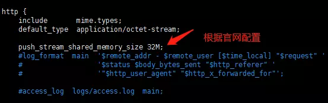  
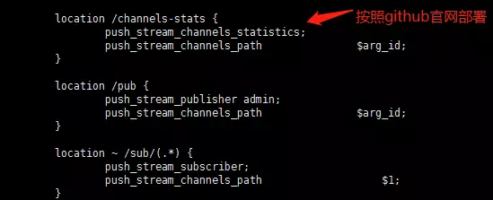  

完成上述步骤后，消息推送服务已经部署好，直接启动Nginx：  `./nginx`  

Nginx就可以等待用户发送请求过来。  


#### 客户端TCPBurn部署安装  

tcpburn（TCPBurn是由tcpburn和 intercept组成）运行，首先需要intercept的配合（具体工作原理图可以参考TCPCopy部分课程）。  

intercept工具的主要功能是截获Nginx消息推送服务的响应数据包，配合tcpcopy和tcpburn工具来完成用户会话回放。没有intercept的配合，tcpburn就无法工作。  

##### intercept安装运行  

intercept安装参考官网github地址：https://github.com/session-replay-tools/tcpburn  
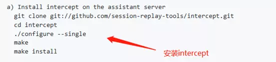  

如果编译的时候遇到问题，一般是因为没有安装相应的libpcap开发库，安装上即可（centos上可以使用命令：yum install libpcap-devel.x86_64）  

运行命令如下：  
  

需要注意的是，7台虚拟机运行的intercept命令都一样，具体命令如下：`./intercept -i eth1 -F 'tcp and src port 8080' -d`  

intercept命令参数说明如下：  

```console
-i 参数设置的是网卡设备名称，因环境不同会有差异。
```

例如，下图192.168.25.121对应的网卡设备是eth1，而Nginx返回给192.168.100.0网段的IP地址响应包都通过路由走向192.168.25.121（充当网关），经过的网卡就是eth1，所以-i参数选择eth1：  
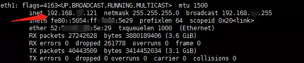  

```console
-F 参数设置过滤条件，需要加引号，引号里的内容类似tcpdump的过滤条件

-d 参数，设置-d代表以daemon方式运行
```

##### tcpburn安装  

安装tcpburn参考官网github地址：https://github.com/session-replay-tools/tcpburn  
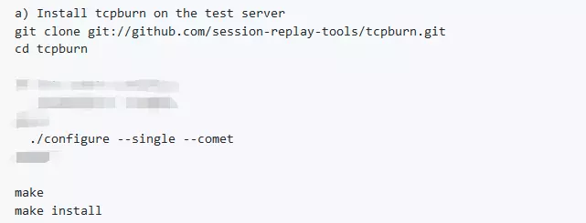  


##### 准备测试数据  
tcpburn不伪造原始数据，需要依赖外部抓包文件。  

在服务器端，我们采用如下命令来开启抓包：`tcpdump -i any tcp and port 8080 -s 1500 -w 8080.pcap -v `  

然后我们在另外一个终端下面访问Nginx服务：  
  

这些访问就会被tcpdump所捕获。  

我们累计开启5个终端，分别访问如下：  

```console
curl -s -v --no-buffer 'http://192.168.25.89:8080/sub/my_channel_1'

curl -s -v --no-buffer 'http://192.168.25.89:8080/sub/my_channel_2'

curl -s -v --no-buffer 'http://192.168.25.89:8080/sub/my_channel_3'

curl -s -v --no-buffer 'http://192.168.25.89:8080/sub/my_channel_4'

curl -s -v --no-buffer 'http://192.168.25.89:8080/sub/my_channel_5'
```

然后ctrl+c关闭服务器tcpdump抓包，5个请求都被捕获。利用wireshark来查看这些抓包数据，从下图中我们可以看出抓包文件捕获了5个请求作为tcpburn回放的请求。  
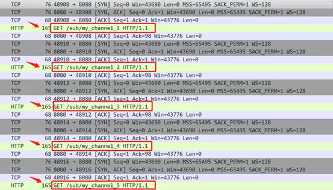  

我们把抓包文件8080.pcap放到每一个虚拟机tcpburn运行目录下面。  


##### 关闭客户端虚拟机ip forward功能  

客户端虚拟机必须关掉ip forward功能，否则那些回到虚拟机的响应数据包，会路由给真正的客户端机器（具体参考TCPCopy欺骗部分内容）。  

查看客户端ip forward是否开启的方法如下：`sysctl -a|grep ip_forward`  

如果`net.ipv4.ip_forward = 1`，那就必须在客户端`/etc/sysctl.conf`文件里面增加下面一行：  

```conf
net.ipv4.ip_forward = 0
```

并执行`sysct -p`使其生效  


#### 第一次冲击2000万并发失败  

在客户端虚拟机上利用tcpburn命令发起连接请求。  

在第一台虚拟机（192.168.25.121）tcpburn命令如下：  

```console
./tcpburn -x 8080-192.168.25.89:8080 -f /xxx/tcpburn/sbin/8080.pcap -s 192.168.25.121 -u 3000000 -c 192.168.100.x

#参数解释如下：
-x  8080-192.168.25.89:8080代表复制抓包文件的8080端口请求到192.168.25.89机器的8080端口应用
-f 参数指定抓包文件的路径
-s 参数指定运行intercept所在机器的IP地址（tcpburn与intercept一一对应）
-u 参数指定模拟用户的数量，-u 3000000代表一个tcpburn实例模拟300万用户
-c 参数代表300万用户采用的IP地址列表是从192.168.100.0网段去获取
```

由于客户端虚拟机和服务器都在同一个网段192.168.25.0，可能你会问客户端IP地址为什么不采用这个网段的地址呢？首先我们不想干扰本网段的应用，其次单台虚拟机采用的端口数是有限的。对服务器Nginx应用，由于客户端虚拟机TCP层的端口限制，最多模拟几万个连接，而TCPburn由于绕开了TCP端口限制，采用IP欺骗的方式，可以采用任意其它网段的IP地址，这样就可以利用海量的地址空间，从而为海量用户模拟打下基础。这里我们采用192.168.100.0网段，理论上可以利用254×32768=8323072（tcpburn采用的端口从32768开始）个连接，而我们这里只用了300万个连接。  

我们逐个运行TCPBurn。每一台虚拟机运行一个TCPBurn实例，包括tcpburn和intercept实例。intercept命令相同，而tcpburn命令在不同虚拟机的参数不同，需要修改-s参数和-c参数。下图是运行了第6个tcpburn实例时的情况，连接数量已经达到1600多万。  

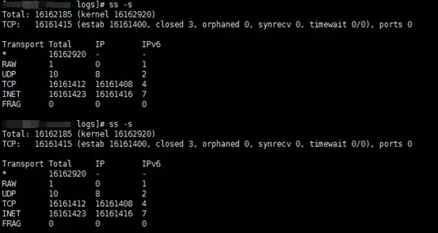  

此时的内存使用情况呢？参考下图，服务器还有60多G内存空间可以利用。  
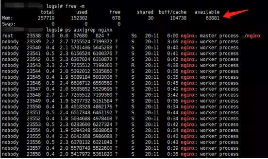  

此时的Nginx，情况如何？Nginx开始大量报too many open files错误，每秒大概输出这样的日志数量高达几十万，而我们的连接数量只是以每秒几千的速度缓慢增加。Nginx高频繁输出这样的错误日志，显然是不合理的，而且这样很快就会打爆磁盘空间。  
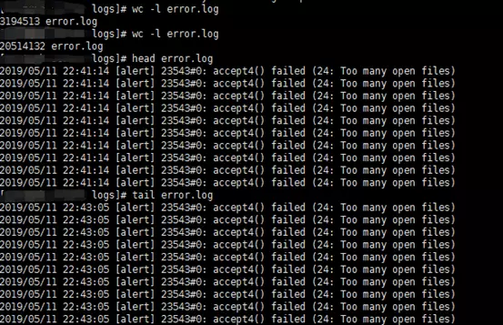  

此时，tcpburn运行过的命令如下图：  
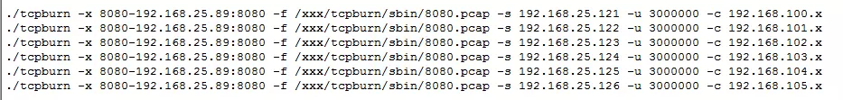  

第6个tcpburn实例并没有运行完毕。理论上，第6个tcpburn运行完，连接数量可达到1800万。  

继续观察一段时间，服务器连接数量不再增加，最终运行结果如下图：  
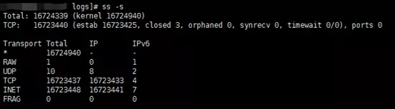  

服务器连接数量达到1672万后，就很难上升了，但从下图的内存来看，还有50多G空闲内存，这说明Nginx遇到accept连接瓶颈了。  
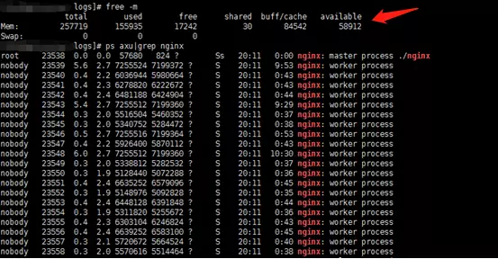  

我们继续试验，让这1600多万客户端连接都接收一个消息推送，以便查看Nginx运行和内存情况。  

下图我们在服务器端机器对my_channel_1发送了Goodbye消息，根据Nginx返回结果，会有3344639个客户端连接去接收这个消息。  

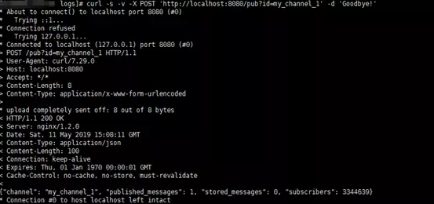  

同时我们查看Nginx运行情况，我们发现下图中的Nginx异常繁忙，因为有几百万的消息推送需要处理。  
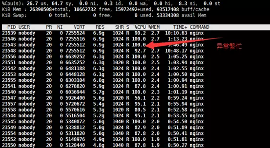  

对5个channel进行消息推送（服务器端执行），命令如下图：  

```console
curl -s -v -X POST 'http://localhost:8080/pub?id=my_channel_1' -d 'Goodbye!'
curl -s -v -X POST 'http://localhost:8080/pub?id=my_channel_2' -d 'Goodbye!'
curl -s -v -X POST 'http://localhost:8080/pub?id=my_channel_3' -d 'Goodbye!'
curl -s -v -X POST 'http://localhost:8080/pub?id=my_channel_4' -d 'Goodbye!'
curl -s -v -X POST 'http://localhost:8080/pub?id=my_channel_5' -d 'Goodbye!'
```

5个消息推送完以后，每一个客户端连接都会收到一个推送消息。  

根据下图，可以看出可用内存还有40多G空间，而整个消息推送过程，额外消耗了不少的内存。  
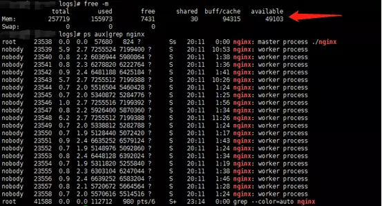  

通过这次测试，我们发现Nginx如下的问题：  

* 无缘无故地记录一些access log，而报错之前没有记录
* 频繁刷日志，容易导致磁盘空间耗满
* 负载不均衡，到1600多万连接就很难接收新的连接了
* 千万并发连接测试过程中，通过pkill nginx有时候关不掉  

因为最终内存还有40多G，说明还是有潜力的，我们需要找出瓶颈所在。  


#### 第二次冲击2000万并发成功  

通过如下命令尝试继续增加最大打开文件句柄数量  

```console
ulimit -HSn 1048580

-bash: ulimit: open files: cannot modify limit: Operation not permitted

ulimit -HSn 1048575

ulimit -HSn 1048576

ulimit -HSn 1048577

-bash: ulimit: open files: cannot modify limit: Operation not permitted
```

从中找出进程的最大文件句柄数量为1048576，然后利用如下命令：`sysctl -a|grep 1048576`  

看看哪些参数设置了这个值，结果发现如下：  

```conf
fs.nr_open = 1048576

fs.pipe-max-size = 1048576
```

其中pipe-max-size是pipe相关的，跟文件句柄最大支持数量没有关系，而nr_open是真正能够改变最大文件支持数量的参数。  

直接在`/etc/sysctl.conf` 文件里面增加：  

```conf
fs.nr_open = 2097152 
```

这里数量是原先的2倍大小。  

执行：`sysctl -p`  

参数生效  

需要注意的是，只有内核2.6.25及之后可以修改此参数。  

然后我们继续设置如下命令：`ulimit -HSn 2000000`  

系统不再报错，这样就能支持单个进程200万并发连接了。  

修改了系统参数后，需要继续修改Nginx配置文件：  
  

上图理论上可支持3000万连接，离2000万有一段距离，应该不会再报too many open files错误。  

重新启动nginx和tcpburn，继续新的一轮测试：  

执行tcpburn的实例如下图：  
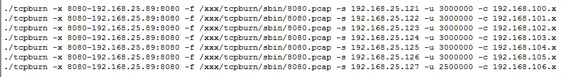  

累计会有2050万的并发连接请求发送到服务器。  

最终服务器端的连接数量突破了2000万连接，如下图：  
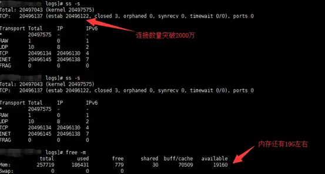  

这个时候服务器空闲内存只有19G了，还能不能应对2000万并发消息处理呢？  

我们继续在服务器端发送下述请求到Nginx服务：  

```console
curl -s -v -X POST 'http://localhost:8080/pub?id=my_channel_1' -d 'Goodbye!'
curl -s -v -X POST 'http://localhost:8080/pub?id=my_channel_2' -d 'Goodbye!'
curl -s -v -X POST 'http://localhost:8080/pub?id=my_channel_3' -d 'Goodbye!'
curl -s -v -X POST 'http://localhost:8080/pub?id=my_channel_4' -d 'Goodbye!'
curl -s -v -X POST 'http://localhost:8080/pub?id=my_channel_5' -d 'Goodbye!'
```

我们发现Nginx非常繁忙，如下图：  
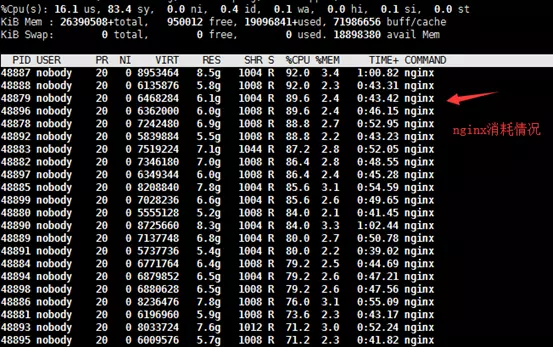  

利用free –m来查看内存情况，结果如下图：  
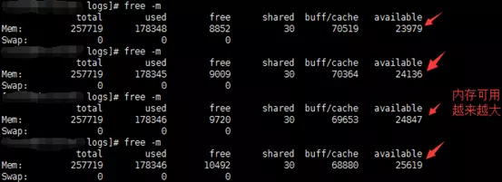  

为什么内存越来越多呢，我们查看Nginx日志，内容如下：  
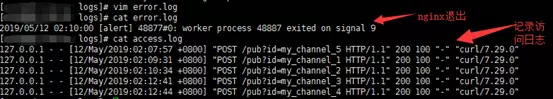  

进程48887的Nginx进程退出了，而且还是被杀退出的（signal 9）。  
  
我们看看服务器连接数量有没有下降，利用ss –s查看，如下图：  
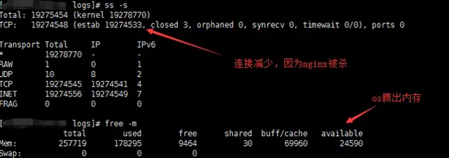  

连接数量也下降了，原因是Nginx进程48887被杀了。  

我们查看系统dmesg日志（直接运行dmesg），从下图我们看出进程48887（nginx）被OOM了，也即因为内存吃紧被操作系统选择性杀掉了，可用内存增加也就不足为奇了。  
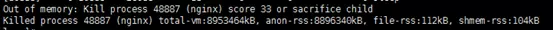  

整个测试到此为止，测试2000千万并发连接的目标顺利达到。  


#### 结束语  

通过这次测试，暴露了Nginx消息推送在极端海量并发情况下的问题，而且为了支持2000万并发连接，还需要修改系统参数fs.nr_open，以支持ulimit -HSn更大数量的设置。  

从这次测试过程中，可以证明Linux系统支持千万并发是可行的，而且也无需很多配置。实践是检验真理的标准，这句话还是挺有道理的。  

用户如果感兴趣，可以去尝试利用TCPBurn进行更加激进的性能测试，去探索海量连接场景下未知的Linux内核世界。btw，下面二维码是“TCP相关问题经典案例分析” 知识星球，有兴趣可以加入，一起探索TCP和应用的相关问题；也可以通过qq群：1013880537咨询TCPBurn相关问题。  
  
