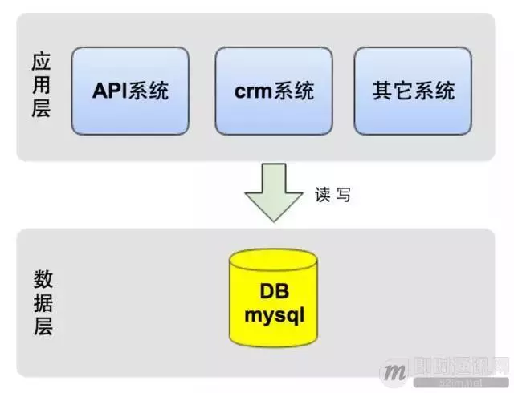
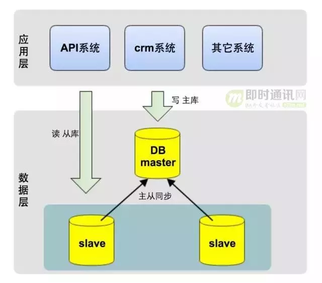
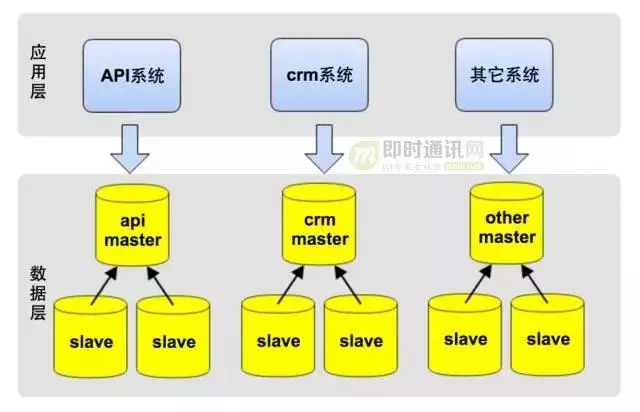
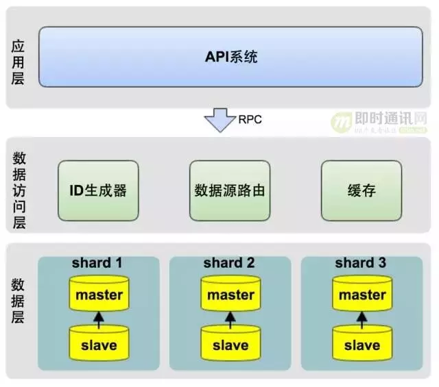
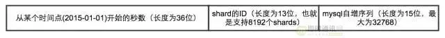

https://www.oschina.net/question/3915715_2290506  

##### 最初的技术架构: 简单直接  
开发语言：python  
数据库：    mysql  

如下图所示，应用层的几大系统都访问一个数据库：  
  

##### 中期架构优化：读写分离  
**读写分离方案**
利用MySQL的此特性，我们在应用服务端对每次请求做读写判断：  

* 若是写请求，则把这次请求内的所有DB操作发向主库；
* 若是读请求，则把这次请求内的所有DB操作发向从库。  
如下图所示：  
  
实现读写分离后，数据库的压力减少了许多，CPU使用率和IO使用率都降到了5%内，Slow Query也趋近于0。  
**主从同步、读写分离给我们主要带来如下两个好处：**  

* 减轻了主库（写）压力：达达的业务主要来源于读操作，做读写分离后，读压力转移到了从库，主库的压力减小了数十倍；
* 从库（读）可水平扩展（加从库机器）：因系统压力主要是读请求，而从库又可水平扩展，当从库压力太时，可直接添加从库机器，缓解读请求压力。  

**新状况出现：主从延迟问题**  
读写分离，暂时解决了MySQL压力问题，同时也带来了新的挑战：

* 业务高峰期，商家发完订单，在我的订单列表中却看不到当发的订单（典型的read after write）；
* 系统内部偶尔也会出现一些查询不到数据的异常。  

通过监控，我们发现，业务高峰期MySQL可能会出现主从延迟，极端情况，主从延迟高达10秒。  
那如何监控主从同步状态？在从库机器上，执行show slave status，查看Seconds_Behind_Master值，代表主从同步从库落后主库的时间，单位为秒，若同从同步无延迟，这个值为0。MySQL主从延迟一个重要的原因之一是主从复制是单线程串行执行。  

**那如何为避免或解决主从延迟？我们做了如下一些优化：**

* 优化MySQL参数，比如增大innodb_buffer_pool_size，让更多操作在MySQL内存中完成，减少磁盘操作；
* 使用高性能CPU主机；
* 数据库使用物理主机，避免使用虚拟云主机，提升IO性能；
* 使用SSD磁盘，提升IO性能。SSD的随机IO性能约是SATA硬盘的10倍；
* 业务代码优化，将实时性要求高的某些操作，使用主库做读操作。
  

**主库的写操作变的越来越慢**  
我们有一个应用系统在MySQL中记录日志，日志量非常大，近1亿行记录，而这张表的ID是UUID，某一天高峰期，整个系统突然变慢，进而引发了宕机。监控发现，这张表insert极慢，拖慢了整个MySQL Master，进而拖跨了整个系统。（当然在MySQL中记日志不是一种好的设计，因此我们开发了大数据日志系统。另一方面，UUID做主键是个糟糕的选择，在下文的水平分库中，针对ID的生成，有更深入的讲述）。  

**进一步对主库进行拆分，优化主库写操作慢的问题**  
这时，主库成为了性能瓶颈，我们意识到，必需得再一次做架构升级，将主库做拆分：  

* 一方面以提升性能；
* 另一方面减少系统间的相互影响，以提升系统稳定性。
这一次，我们将系统按业务进行了垂直拆分。  
如下图所示，将最初庞大的数据库按业务拆分成不同的业务数据库，每个系统仅访问对应业务的数据库，避免或减少跨库访问：  
  
垂直拆分后，数据库主库的压力，可见磁盘IO使用率已降低了许多，高峰期IO响应时间在2.33毫秒内，IO使用率最高只到22.8%：  

**最大的挑战是**  
`不能跨库join，同时需要对现有代码重构。单库时，可以简单的使用join关联表查询；拆库后，拆分后的数据库在不同的实例上，就不能跨库使用join了`。  

垂直分库过程中的经验教训，使我们制定了SQL最佳实践，其中一条便是程序中禁用或少用join，而应该在程序中组装数据，让SQL更简单。一方面为以后进一步垂直拆分业务做准备，另一方面也避免了MySQL中join的性能较低的问题。  
经过一个星期紧锣密鼓的底层架构调整，以及业务代码重构，终于完成了数据库的垂直拆分。拆分之后，每个应用程序只访问对应的数据库:  

* 将单点数据库拆分成了多个，分摊了主库写压力；  
* 拆分后的数据库各自独立，实现了业务隔离，不再互相影响。  

##### 为未来做准备，进一步升级架构：水平分库（sharding）  
**通过上一节的分享，我们知道：**  

* 读写分离，通过从库水平扩展，解决了读压力；
* 垂直分库通过按业务拆分主库，缓存了写压力。  
但技术团队是否就此高枕无忧？答案是：`NO`。  

**上述架构依然存在以下隐患：**  

* 单表数据量越来越大：如订单表，单表记录数很快将过亿，超出MySQL的极限，影响读写性能；
* 核心业务库的写压力越来越大：已不能再进一次垂直拆分，MySQL 主库不具备水平扩展的能力。  

以前，系统压力逼迫我们架构升级，这一次，我们需提前做好架构升级，实现数据库的水平扩展(sharding)。我们的业务类似于Uber，而Uber在公司成立的5年后（2014）年才实施了水平分库，但我们的业务发展要求我们在成立18月就要开始实施水平分库。  

**本次架构升级的逻辑架构图如下图所示：**  
  

**水平分库面临的第一个问题是，按什么逻辑进行拆分：**  

* 一种方案是按城市拆分，一个城市的所有数据在一个数据库中；
* 另一种方案是按订单ID平均拆分数据。  

按城市拆分的优点是数据聚合度比较高，做聚合查询比较简单，实现也相对简单，缺点是数据分布不均匀，某些城市的数据量极大，产生热点，而这些热点以后可能还要被迫再次拆分。  

按订单ID拆分则正相反，优点是数据分布均匀，不会出现一个数据库数据极大或极小的情况，缺点是数据太分散，不利于做聚合查询。比如，按订单ID拆分后，一个商家的订单可能分布在不同的数据库中，查询一个商家的所有订单，可能需要查询多个数据库。针对这种情况，一种解决方案是将需要聚合查询的数据做冗余表，冗余的表不做拆分，同时在业务开发过程中，减少聚合查询。  

反复权衡利弊，并参考了Uber等公司的分库方案后，我们最后决定按订单ID做水平分库。  

**从架构上，我们将系统分为三层：**  

* 应用层：即各类业务应用系统；
* 数据访问层：统一的数据访问接口，对上层应用层屏蔽读写分库、分库、缓存等技术细节；
* 数据层：对DB数据进行分片，并可动态的添加shard分片。
  
  水平分库的技术关键点在于数据访问层的设计。  

**数据访问层主要包含三部分：**  

* ID生成器：生成每张表的主键；
* 数据源路由：将每次DB操作路由到不同的shard数据源上；
* 缓存： 采用Redis实现数据的缓存，提升性能。  

**ID生成器是整个水平分库的核心，它决定了如何拆分数据，以及查询存储-检索数据：**  

* ID需要跨库全局唯一，否则会引发业务层的冲突；
* 此外，ID必须是数字且升序，这主要是考虑到升序的ID能保证MySQL的性能；
* 同时，ID生成器必须非常稳定，因为任何故障都会影响所有的数据库操作。  
我们的ID的生成策略借鉴了Instagram的ID生成算法。  

**我们具体的ID生成算法方案如下：**  
  
**如上图所示，方案说明如下：**  

* 整个ID的二进制长度为64位；
* 前36位使用时间戳，以保证ID是升序增加；
* 中间13位是分库标识，用来标识当前这个ID对应的记录在哪个数据库中；
* 后15位为MySQL自增序列，以保证在同一秒内并发时，ID不会重复。每个shard库都有一个自增序列表，生成自增序列时，从自增序列表中获取当前自增序列值，并加1，做为当前ID的后15位。  

