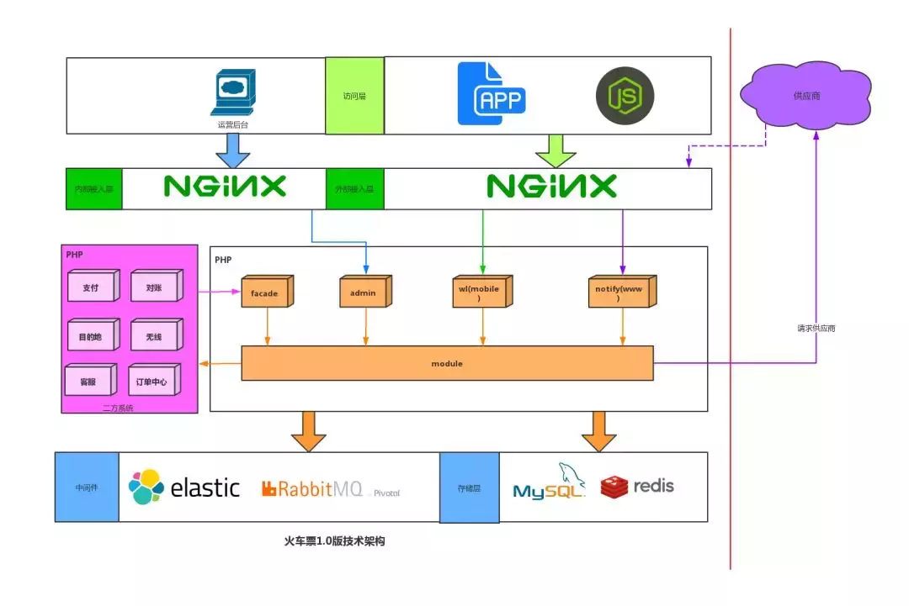

交通方式是用户旅行前要考虑的核心要素之一。为了帮助用户更好地完成消费决策闭环，马蜂窝上线了大交通业务。现在，用户在马蜂窝也可以完成购买机票、火车票等操作。  

与大多数业务系统相同，我们一样经历着从无到有，再到快速发展的过程。本文将以火车票业务系统为例，主要从技术的角度，和大家分享在一个新兴业务发展的不同阶段背后，系统建设与架构演变方面的一些经验。  

#### 第一阶段：从无到有  

在这个阶段，快速支撑起业务，填补业务空白是第一目标。基于这样的考虑，当时的火车票业务从模式上选择的是供应商代购；从技术的角度需要优先实现用户在马蜂窝 App 查询车次余票信息、购票、支付，以及取消、退票退款等核心功能的开发。  
  
**图1-核心功能与流程**  

##### 技术架构  

综合考虑项目目标、时间、成本、人力等因素，当时网站服务架构我们选择的是 LNMP（Linux 系统下 Nginx+MySQL+PHP）。整个系统从物理层划分为访问层 ( App，H5，PC 运营后台)，接入层 (Nginx)，应用层 (PHP 程序)，中间件层 (MQ，ElasticSearch)，存储层 (MySQL，Redis)。  

对外部系统依赖主要包括公司内部支付、对账、订单中心等二方系统，和外部供应商系统。  
  
**图 2-火车票系统 V1.0 技术架构**  

如图所示，对外展现功能主要分为两大块，一块是 C 端 App 和 H5，另外是运营后台。二者分别经过外网 Nginx 和内网 Nginx 统一打到 php train 应用上。程序内部主要有四个入口，分别是：  

* 供其他二方系统调用的 facade 模块
* 运营后台调用的 admin 模块
* 处理 App 和 H5 请求的 train 核心模块
* 处理外部供应商回调模块  

四个入口会依赖于下层 modules 模块实现各自功能。对外调用上分两种情况，一种是调用二方系统的 facade 模块满足其公司内部依赖；一种是调用外部供应商。基础设施上依赖于搜索、消息中间件、数据库、缓存等。  

这是典型的单体架构模式，部署简单，分层结构清晰，容易快速实现，可以满足初期产品快速迭代的要求，而且建立在公司已经比较成熟的 PHP 技术基础之上，不必过多担心稳定性和可靠性的问题。  

该架构支撑火车票业务发展了将近一年的时间，简单、易维护的架构为火车票业务的快速发展做出了很大的贡献。然而随着业务的推进，单体架构的缺陷逐渐暴露出来：  

* 所有功能聚合在一起，代码修改和重构成本增大
* 研发团队规模逐渐扩大，一个系统多人开发协作难度增加
* 交付效率低，变动范围难以评估。在自动化测试机制不完善的情况下，易导致「修复越多，缺陷越多」的恶性循环
* 伸缩性差，只能横向扩展，无法按模块垂直扩展
* 可靠性差，一个 Bug 可能引起系统崩溃
* 阻碍技术创新，升级困难，牵一发而动全身  

为了解决单体架构所带来的一系列问题，我们开始尝试向微服务架构演进，并将其作为后续系统建设的方向。  

#### 第二阶段：架构转变及服务化初探  

从 2018 年开始，整个大交通业务开始从 LNMP 架构向服务化演变。  

##### 架构转变——从单体应用到服务化  

工欲善其事，必先利其器」，首先简单介绍一下大交通在实施服务化过程中积累的一些核心设施和组件。  

我们最主要的转变是将开发语言从 PHP 转为 Java，因此技术选型主要围绕 Java 生态圈来展开。  

###### 开发框架与组件  
  
**图3-大交通基础组件**  

如上图所示，整体开发框架与组件从下到上分为四层。这里主要介绍最上层大交通业务场景下的封装框架和组件层：  

* mlang：大交通内部工具包
* mes-client-starter：大交通 MES 技术埋点采集上报
* dubbo-filter：对 Dubbo 调用的 tracing 追踪
* mratelimit：API 限流保护组件
* deploy-starter：部署流量摘除工具
* tul：统一登录组件
* cat-client：对 CAT 调用增强封装的统一组件  

###### 基础设施体系  

服务化的实施离不开基础设施体系的支持。在公司已有基础之上，我们陆续建设了：  

* 敏捷基础设施：基于 Kubernetes 和 Docker
* 基础设施监控告警：Zabbix，Prometheus，Grafana
* 业务告警：基于 ES 日志，MES 埋点 + TAlarm
* 日志系统 ：ELK
* CI/CD 系统：基于 Gitlab+Jekins+Docker+Kubernetes
* 配置中心：Apollo
* 服务化支撑 ：Springboot2.x+Dubbo
* 服务治理：Dubbo-admin，
* 灰度控制
* TOMPS ：大交通应用管理平台
* MPC 消息中心：基于 RocketMQ
* 定时任务：基于 Elastic-Job
* APM 系统 ：PinPoint，CAT
* PHP 和 Java 双向互通支持  

如上所述，初步构筑了较为完整的 DevOps + 微服务开发体系。整体架构如下：  
  
**图4-大交通基础设施体系**  

从上至下依次分为：  

* 访问层——目前有 App，H5 和微信小程序；
* 接入层——走公司公共的 Nginx，OpenResty；
* 业务层的应用——包括无线 API，Dubbo 服务；
* 消息中心和定时任务——部署在 Kubernetes+Docker 中
* 中间件层——包括 ElasticSearch，RocketMQ 等
* 存储层——MySQL，Redis，FastDFS，HBase 等  

此外，外围支撑系统包括 CI/CD、服务治理与配置、APM 系统、日志系统、监控告警系统。  

###### CI/CD 系统  

* CI 基于 Sonar + Maven(依赖检查，版本检查，编译打包) + Jekins
* CD 基于 Jekins+Docker+Kubernetes  

我们目前还没有放开 Prod 的 OPS 权限给开发，计划在新版 CD 系统中会逐步开放。  
  
**图5-CI/CD 体系**  

###### 服务化框架 Dubbo  

我们选择 Dubbo 作为分布式微服务框架，主要有以下因素考虑：  

* 成熟的高性能分布式框架。目前很多公司都在使用，已经经受住各方面性能考验，比较稳定；
* 可以和 Spring 框架无缝集成。我们的架构正是基于 Spring 搭建，并且接入 Dubbo 时可以做到代码无侵入，接入也非常方便；
* 具备服务注册、发现、路由、负载均衡、服务降级、权重调节等能力；
* 代码开源。可以根据需求进行个性化定制，扩展功能，进行自研发  

  
**图 6-Dubbo 架构**  

除了保持和 Dubbo 官方以及社区的密切联系外，我们也在不断对 Dubbo 进行增强与改进，比如基于 dubbo-fitler 的日志追踪，基于大交通统一应用管理中心的 Dubbo 统一配置管理、服务治理体系建设等。  

##### 服务化初探——抢票系统  

向服务化的演进决不能是一个大跃进运动，那样只会把应用拆分得七零八落，最终不但大大增加运维成本，而且看不到收益。  

为了保证整个系统的服务化演进过程更加平滑，我们首先选择了抢票系统进行实践探索。抢票是火车票业务中的一个重要版块，而且抢票业务相对独立，与已有的 PHP 电子票业务冲突较少，是我们实施服务化的较佳场景。  

在对抢票系统进行服务拆分和设计时，我们积累了一些心得和经验，主要和大家分享以下几点。  

###### 功能与边界  

简单来说，抢票就是实现用户提前下抢票单，系统在正式开售之后不断尝试为用户购票的过程。从本质上来说，抢票是一种手段，通过不断检测所选日期和车次的余票信息，以在有余票时为用户发起占座为目的。至于占座成功以后的处理，和正常电子票是没有什么区别的。理解了这个过程之后，在尽量不改动原有 PHP 系统的前提下，我们这样划分它们之间的功能边界：  
  
**图7-抢票功能划分**  

也就是说，用户下抢票单支付成功，待抢票占座成功后，后续出票的事情我们会交给 PHP 电子票系统去完成。同理，在抢票的逆向方面，只需实现「未抢到票全额退」以及「抢到票的差额退」功能，已出票的线上退和线下退票都由 PHP 系统完成，这就在很大程度上减少了抢票的开发任务。  

###### 服务设计  

服务的设计原则包括隔离、自治性、单一职责、有界上下文、异步通信、独立部署等。其他部分都比较容易把控，而有界上下文通俗来说反应的就是服务的粒度问题，这也是做服务拆分绕不过去的话题。粒度太大会导致和单体架构类似的问题，粒度太细又会受制于业务和团队规模。结合实际情况，我们对抢票系统从两个维度进行拆分：  

**从业务角度系统划分为供应商服务 (同步和推送)、正向交易服务、逆向交易服务、活动服务。**  
  
**图8-抢票服务设计**  

* 正向交易服务：包括用户下抢票单、支付、取消、出票、查询、通知等功能
* 逆向交易服务：包括逆向订单、退票、退款、查询、通知等
* 供应侧：去请求资源方完成对应业务操作、下抢票单、取消、占座、出票等
* 活动服务：包括日常活动、分享、活动排名统计等  

**从系统层级分为前端 H5 层前后分离、API 接入层、RPC 服务层，和 PHP 之间的桥接层、异步消息处理、定时任务、供应商对外调用和推送网关。**  
  
**图9-抢票系统分层**  

* 展示层：H5 和小程序，前后端分离
* API 层：对 H5 和小程序提供的统一 API 入口网关，负责对后台服务的聚合，以 HTTP REST 风格对外暴露
* 服务层：包括上节所提到的业务服务，对外提供 RPC 服务
* 桥接层：包括调用 PHP 的代理服务，对 Java 侧提供 Dubbo RPC 服务，以 HTTP 形式调用统一的 PHP 内部网关；对 PHP 提供的统一 GW，PHP 以 HTTP 形式通过 GW 来调用 Java 服务
* 消息层：异步的消息处理程序，包括订单状态变更通知，优惠券等处理
* 定时任务层：提供各种补偿任务，或者业务轮询处理  

###### 数据要素  

对于交易系统而言，不管是用何种语言，何种架构，要考虑的最核心部分终归是数据。数据结构基本反应了业务模型，也左右着程序的设计、开发、扩展与升级维护。我们简单梳理一下抢票系统所涉及的核心数据表：  

1. 创单环节：用户选择车次进入填单页以后，要选择乘车人、添加联系人，所以首先会涉及到乘车人表，这块复用的 PHP 电子票功能  

2. 用户提交创单申请后，将会涉及到以下数据表：  

* 订单快照表——首先将用户的创单请求要素存储起来
* 抢票订单表 (order)：为用户创建抢票单
* 区段表（segment）：用于一个订单中可能存在的连续乘车而产生的多个车次情况 (类似机票航段)
* 乘车人表 (passenger)：抢票单中包含乘车人信息
* 活动表 (activity)：反映订单中可能包含的活动信息
* 物品表 (item)：反映包含的车票，保险等信息
* 履约表：用户购买车票、保险后，最终会做票号回填，我们也叫票号信息表  

3. 产生占座结果后：用户占座失败涉及全额退款，占座成功可能涉及差额退款，因此我们会有退票订单表 (refund_order)；虽然只涉及到退款，但同样会有 refund_item 表来记录退款明细。  

###### 订单状态  

订单系统的核心要点是订单状态的定义和流转，这两个要素贯穿着整个订单的生命周期。  

我们从之前的系统经验中总结出两大痛点，一是订单状态定义复杂，我们试图用一个状态字段来打通前台展示和后端逻辑处理，结果导致单一订单状态多达 18 种；二是状态流转逻辑复杂，流转的前置因素判断和后置方向上太多的 if else 判断，代码维护成本高。  

因此，我们采用有限状态机来梳理抢票正向订单的状态和状态流转，关于状态机的应用，可以参照之前发过的一篇文章[《状态机在马蜂窝机票交易系统中的应用与优化》](http://mp.weixin.qq.com/s?__biz=Mzg5MTA4Mzg5NA==&mid=2247483775&idx=1&sn=78f4f6414ee57c627c4c31a93ee7d895&chksm=cfd38c66f8a40570ca670e09ff4dc5142023e79913f6c07081d6b8f79bdef220de9d0b1759bf&scene=21#wechat_redirect)，下图是抢票订单的状态流转图：  
  
**图10-抢票订单状态流转**  

我们将状态分为订单状态和支付状态，通过事件机制来推进状态的流转。到达目标态有两个前提：一是原状态，二是触发事件。状态按照预设的条件和路线进行流转，将业务逻辑的执行和事件触发与状态流转拆分开，达到解耦和便于扩展维护的目的。  

如上图所示，将订单状态定义为：初始化→下单成功→交易成功→关闭。给支付状态定义为：初始化→待支付→已支付→关闭。以正常 case 来说，用户下单成功后，会进入下单成功和待支付；用户通过收银台支付后，订单状态不变，支付状态为已支付；之后系统会开始帮用户占座，占座成功以后，订单会进入交易成功，支付状态不变。  

如果仅仅是上面的双状态，那么业务程序执行倒是简单了，但无法满足前台给用户丰富的单一状态展示，因此我们还会记录关单原因。关单原因目前有 7 种：未关闭、创单失败、用户取消、支付超时、运营关单、订单过期、抢票失败。我们会根据订单状态、支付状态、关单原因，计算出一个订单对外展示状态。  

###### 幂等性设计  

所谓幂等性，是指对一个接口进行一次调用和多次调用，产生的结果应该是一致的。幂等性是系统设计中高可用和容错性的一个有效保证，并不只存在于分布式系统中。我们知道，在 HTTP 中，GET 接口是天生幂等的，多次执行一个 GET 操作，并不会对系统数据产生不一致的影响，但是 POST，PUT，DELETE 如果重复调用，就可能产生不一致的结果。  

具体到我们的订单状态来说，前面提到状态机的流转是需要事件触发的，目前抢票正向的触发事件有：下单成功、支付成功、占座成功、关闭订单、关闭支付单等等。我们的事件一般由用户操作或者异步消息推送触发，其中任意一种都无法避免产生重复请求的可能。以占座成功事件来说，除了修改自身表状态，还要向订单中心同步状态，向 PHP 电子票同步订单信息，如果不做幂等性控制，后果是非常严重的。  

保证幂等性的方法有很多，以占座消息为例，我们有两个措施来保证幂等：  
1. 占座消息都带有协议约束的唯一 serialNo，推送服务可以判断该消息是否已被正常处理。
2. 业务侧的修改实现 CAS(Compare And Swap)，简单来说就是数据库乐观锁，如 `update order set order_status = 2 where order_id = '1234' and order_status = 1 and pay_status = 2 `。  

###### 小结  

服务化的实施具备一定的成本，需要人员和基础设施都有一定的基础。初始阶段，从相对独立的新业务着手，做好和旧系统的融合复用，能较快的获取成果。抢票系统在不到一个月的时间内完成产品设计，开发联调，测试上线，也很好地印证了这一点。  

#### 第三阶段：服务化推进和系统能力提升  
抢票系统建设的完成，代表我们迈出了一小步，也只是迈出了一小步，毕竟抢票是周期性的业务。更多的时间里，电子票是我们业务量的主要支撑。在新老系统的并行期，主要有以下痛点：  

1. 原有电子票系统由于当时因素影响，与特定供应商绑定紧密，受供应商制约较大；
2. 由于和抢票系统及大交通其他系统之间的兼容成本较高，导致我们统一链路追踪、环境隔离、监控告警等工作实施难度很大；
3. PHP 和 Java 桥接层承接太多业务，性能无法保证  

因此，卸下历史包袱，尽快完成旧系统的服务化迁移，统一技术栈，使主要业务得到更加有力的系统支撑，是我们接下来的目标。  

##### 与业务同行：电子票流程改造  

我们希望通过对电子票流程的改造，重塑之前应急模式下建立的火车票项目，最终实现以下几个目标：  

1. 建立马蜂窝火车票的业务规则，改变之前业务功能和流程上受制于供应侧规则的局面；
2. 完善用户体验和功能，增加在线选座功能，优化搜索下单流程，优化退款速度，提升用户体验；
3. 提升数据指标和稳定性，引入新的供应侧服务，提高可靠性；供应商分单体系，提升占座成功率和出票率；
4. 技术上完成到 Java 服务化的迁移，为后续业务打下基础
  
我们要完成的不仅是技术上的重构，而是结合新的业务诉求，去不断丰富新的系统，力求达到业务和技术的目标一致性，因此我们将服务化迁移和业务系统建设结合在一起推进。下图是电子票流程改造后火车票整体架构：  
  
**图11-电子票改造后的火车票架构**  

图中浅蓝色部分为抢票期间已经建好的功能，深蓝色模块为电子票流程改造新加入的部分。除了和抢票系统类似的供应商接入、正向交易、逆向交易以外，还包括搜索与基础数据系统，在供应侧也增加了电子票的业务功能。同时我们新的运营后台也已经建立，保证了运营支撑的延续性。  

项目实施过程中，除了抢票所说的一些问题之外，也着重解决以下几个问题。  

###### 搜索优化  

先来看用户一次站站搜索可能穿过的系统：  
  
**图12-站站查询调用流程**  

请求先到 twl api 层，再到 tsearch 查询服务，tsearch 到 tjs 接入服务再到供应侧，整个调用链路还是比较长的，如果每次调用都是全链路调用，那么结果是不太乐观的。因此 tsearch 对于查询结果有 redis 缓存，缓存也是缩短链路、提高性能的关键。站站查询要缓存有几个难点：  

1. 对于数据实时性要求很高。核心是余票数量，如果数据不实时，那么用户再下单占座成功率会很低
2. 数据比较分散。比如出发站，到达站，出发日期，缓存命中率不高
3. 供应侧接口不稳定。平均在 1000ms 以上  

综合以上因素考虑，我们设计 tsearch 站站搜索流程如下：  
  
**图13-搜索设计流程**  

如图所示，首先对于一个查询条件，我们会缓存多个渠道的结果，一方面是因为要去对比哪个渠道结果更加准确，另一方面可以增加系统可靠性和缓存命中率。  

我们将 Redis 的过期时间设为 10min，对缓存结果定义的有效期为 10s，首先取有效；如果有效为空，则取失效；如果失效也为空，则同步限时 3s 去调用渠道获取，同时将失效和不存在的缓存渠道交给异步任务去更新。需要注意通过分布式锁来防止并发更新一个渠道结果。最终的缓存结果如下：  
  

缓存的命中率会在 96% 以上，RT 平均在 500ms 左右，能够在保证用户体验良好的同时，做到及时的数据更新。  

###### 消息的消费

我们有大量业务是通过异步消息方式来处理的，比如订单状态变更消息、占座通知消息、支付消息等。除了正常的消息消费以外，还有一些特殊的场景，如顺序消费、事务消费、重复消费等，主要基于 RocketMQ 来实现。  

**顺序消费**  

主要应用于对消息有先后依赖的场景，比如创单消息必须先于占座消息被处理。RocketMQ 本身支持消息顺序消费，我们基于它来实现这种业务场景。从原理上来说也很简单，RocketMQ 限定生产者只能将消息发往一个队列，同时限定消费端只能有一个线程来读取，这样全局单队列，单消费者就保证了消息的顺序消费。  

**重复消费**  

RocketMQ 保障的是 At Least Once，并不能保证 Exactly Only Once，前面抢票我们也提过，一是通过要求业务侧保持幂等性，另外通过数据库表 message_produce_record 和 message_consume_record 来保证精准一次投递和消费结果确认。  

**事务消费**  

基于 RocketMQ 的事务消息功能。它支持二阶段提交，会先发送一条预处理消息，然后回调执行本地事务，最终提交或者回滚，帮助保证修改数据库的信息和发送异步消息的一致。  

###### 灰度运行  

歼十战机的总设计师曾说过一句话：「造一架飞机不是最难的，难的是让它上天」，对我们来说同样如此。3 月是春游季的高峰，业务量与日俱增，在此期间完成系统重大切换，我们需要完备的方案来保障业务的顺利切换。  

**方案设计**  

灰度分为白名单部分和百分比灰度部分，我们首先在内部进行白名单灰度，稳定后进入 20% 流量灰度期。  

灰度的核心是入口问题，由于本次前端也进行了完整改版，因此我们从站站搜索入口将用户引入到不同的页面，用户分别会在新旧系统中完成业务。  
  
**图14-灰度运行方案**  

###### 搜索下单流程  

App 在站站搜索入口调用灰度接口获取跳转地址，实现入口分流。  
  
**图15-搜索下单分流**  

###### 效果对比  
  
  

#### 近期规划  

我们只是初步实现了服务化在火车票业务线的落地实施，与此同时，还有一些事情是未来我们要去持续推进和改进的：  

1. **服务粒度细化：** 目前的服务粒度仍然比较粗糙。随着功能的不断增多，粒度的细化是我们要去改进的重点，比如将交易服务拆分为订单查询服务，创单服务，处理占座的服务和处理出票的服务。这也是 DevOps 的必然趋势。细粒度的服务，才能最大限度满足我们快速开发、快速部署，以及风险可控的要求。  
2. **服务资源隔离：** 只在服务粒度实现隔离是不够的。DB 隔离、缓存隔离、MQ 隔离也非常必要。随着系统的不断扩展与数据量的增长，对资源进行细粒度的隔离是另一大重点。
3. **灰度多版本发布：** 目前我们的灰度策略只能支持新老版本的并行，未来除了会进行多版本并行验证，还要结合业务定制化需求，使灰度策略更加灵活。  

#### 写在最后  

业务的发展离不开技术的发展，同样，技术的发展也要充分考虑当时场景下的业务现状和条件，二者相辅相成。比起设计不足而言，我们更要规避过度设计。  

技术架构是演变出来的，不是一开始设计出来的。我们需要根据业务发展规律，将长期技术方案进行阶段性分解，逐步达成目标。同时，也要考虑服务化会带来很多新问题，如复杂度骤增、业务拆分、一致性、服务粒度、链路过长、幂等性、性能等等。  

比服务支撑更难的是服务治理，这也是我们大家要深入思考和去做的事情。

原地址:https://my.oschina.net/u/4084220/blog/3042661