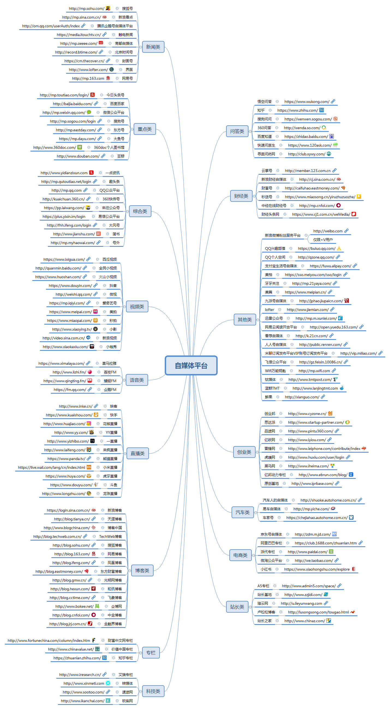

| 序号 |         自媒体平台         |              注册地址              |                                                                    缺点                                                                     |                                                                                                          优点                                                                                                          |
| --- | ------------------------- | --------------------------------- | ------------------------------------------------------------------------------------------------------------------------------------------- | ---------------------------------------------------------------------------------------------------------------------------------------------------------------------------------------------------------------------- |
| 1    | 今日头条                   | http://mp.toutiao.com/login/      | 单价低，粉丝的阅读才值钱，需要积累粉丝                                                                                                          | 今日头条已有9亿激活用户，流量巨大，一篇质量较好的趣味性文章，阅读量随便几十万。对于迅速引流吸粉，今日头条很牛。新手入门赚收益也可以选择它，没有新手期很方便。                                                                           |
| 2    | 百度百家号                 | http://baijia.baidu.com/          | 广告多，阅读体验一般。内容要求高，新手期也不是很容易过。                                                                                          | seo优化神器，排名效果没话说，权重很高，文章能快速被百度搜录。百度百家的单价很高，原创收益杠杠的                                                                                                                                  |
| 3    | 腾讯企鹅自媒体平台（企鹅号） | http://om.qq.com/userAuth/index   | 但想在上面操作引流还是有点难，特别是营销类的文章，几乎发布在上面，阅读为零，而且还不准留版权信息                                                      | 企鹅号的定位和其他自媒体平台有点不一样，发布的文章在天天快报、腾讯新闻客户端、微信新闻插件、手机QQ新闻插件、QQ公众号、手机腾讯网等渠道平台一键分发，原创好文章，曝光很高，是优质内容创业者的曝光神器。文章单价不错，新手期好过，做独家收益很高。 |
| 4    | UC自媒体（大鱼号）          | http://mp.uc.cn/register.html     | 但是这些流量很难引到自己的鱼塘，大多数操作UC订阅号的人都是靠UC订阅号自身的广告赚钱，跟今日头条的头条广告和企鹅媒体的流量主同个类型。                      | 属于阿里巴巴旗下的自媒体平台，针对移动端的流量，也是比较适合做娱乐性内容，做娱乐流量很不错。门槛低，平台的政策不错，收益可观。                                                                                                       |
| 5    | 微信公众号                 | http://mp.weixin.qq.com/          | 封闭式，且海量信息泛滥，阅读量锐减，公众号打开率低，碎片化的时间越来越难以掌控。                                                                     | 微信海量的用户，营销效果好，垂直性和私密性较强，能一对一互动。是企业品牌的第一自媒体、自助服务媒体。                                                                                                                              |
| 6    | 新浪微博粉丝服务平台        | http://weibo.com                  | 随着抖音等短视频平台的兴起，发展受限，新用户群体较少。                                                                                            | 微博作为社交媒体第一阵地，活跃度和用户数都遥遥领先，互联网乃至娱乐圈的事件都第一时间爆发在微博，是制造事件最好的平台。                                                                                                              |
| 7    | 抖音                      | https://www.douyin.com/           | 市场还比较杂乱，变现的方式虽然很多，但是难度也不小。                                                                                              | 抖音现在处于内容红利期，大量的流量在其中，只要你的内容新颖很容易收获曝光和粉丝。（抖音现在汇聚了巨大的流量，无论你的目的是什么，都可以在这个平台上注册了再说）                                                                          |
| 8    | 趣头条                     | https://mp.qutoutiao.net          | 不适合做排名和品牌，还是属于直接赚取收益的平台。                                                                                                 | 注册直接有收益，非常适合新手操作，可以快速获得满足感。(趣头条已经在美国上市了，虽然有人说他和品多多一样是野路子，但是人家确实挺大方，看和写都有收益。)                                                                                 |
| 9    | 惠头条                     | http://mp.cashtoutiao.com         |                                                                                                                                             | 和趣头条类似，适合新手操作。                                                                                                                                                                                              |
| 10   | 一点资讯                   | http://www.yidianzixun.com        | 发布文章和审核时间较慢，有推荐，权重比较高。发布的文章也容易被搜录，功能和搜狐公众号相似，适合做品牌和个人宣传                                          | 一点资讯类似今日头条，整体流量比头条小，适合偏情感类的自媒体入驻，会有不错的流量。                                                                                                                                              |
| 11   | QQ空间                    |                                   |                                                                                                                                             | QQ认证空间也很火，也就是现在的公众空间，现在QQ空间也有打赏功能，很多视频公众空间或者个人空间被打赏的还真不少                                                                                                                      |
| 12   | QQ兴趣部落                 | https://buluo.qq.com/             | 目前QQ的用户是95后，想要抓到这部分人的喜好比较难                                                                                                 | 做流量效果还是非常不错的。每个人都可以建立一个属于自己的QQ群部落，很多技术类的部落也是百万千万级别的粉丝量。有的部落就光靠话题打赏也能轻松月入过万                                                                                     |
| 13   | 搜狐自媒体                 | http://mp.sohu.com/               | 不太好注册。建议注册前先申请微信公众号和今日头条，发布几篇文章后再来申请，成功几率会大很多。                                                          | 权重高，排名好，容易搜录，特别适合做公司品牌宣传或个人品牌宣传。因为搜狐自媒体是百度的新闻源，只要选对关键词，流量非常大，是做霸屏和排名的神器                                                                                         |
| 14   | 新浪看点                   | http://mp.sina.com.cn/            |                                                                                                                                             |                                                                                                                                                                                                                        |
| 15   | 凤凰号自媒体               | http://zmt.ifeng.com/             | 想引流和曝光就算了。局限性较大，比如含腾讯字眼都无法发布。审核时间超慢，还很严，辅助材料非常关键                                                      | 比较适合做外链，流量和效果                                                                                                                                                                                                |
| 16   | 网易新闻自媒体             | http://open.m.163.com/            | 网易自媒体流量不大，和企鹅号差不多，比较适合做娱乐性的内容，专业性的不太适合入驻。发布的文章会泛起在网易新闻手机客户端中                                 |                                                                                                                                                                                                                        |
| 17   | 网易云阅读开放平台          | http://open.yuedu.163.com/        |                                                                                                                                             | 云阅读采取的是抓取网站RSS源，这样站长省去了更新内容的烦恼，如果你有网站直接RSS输出到云阅读了。网易云阅读APP体验还是不错的。                                                                                                        |
| 18   | 360自媒体（北京时间号）     | http://wemedia.so.com/            | 360自媒体升级后改名为北京时间号，也是模仿今日头条。属360企业的，自然在360搜索上的表现会不错，排名绝对不会差，适合做新闻源。申请难度挺大，得有料才能够通过。 |                                                                                                                                                                                                                        |
| 19   | 新浪博客                   | https://login.sina.com.cn/        | 流量较为分散，关注集中度不高，不利于同一兴趣人群的聚合。                                                                                          | 新浪博客权重很高，被百度搜录很简单，没有每天发布的数量限制                                                                                                                                                                   |
| 20   | 知乎                      | https://www.zhihu.com/            | 知乎问答没有收益，而且变现比较难的，还是推广为主。                                                                                               | 知乎权重高，很容易被百度搜录。只需将写好的文章，拿到上面去搜索相关的提问，然后回答，很快就能来流量。实在没有搜到关键词，可以拿两个号一问一答                                                                                          |
| 21   | 微淘公众平台               | http://we.taobao.com/             | 也是老马家的孩子，早期微淘都能获得官方推荐，现在推荐少了                                                                                          | 适合淘宝卖家、淘宝客。开淘宝店的朋友，建议注册，只要内容好，为店铺引流是很不错的。                                                                                                                                              |
| 22   | 简书                      | http://www.jianshu.com/           | 但变现较慢，需要耐心维护，广告控制严格。                                                                                                        | 简书是书写、编辑、发布功能于一体的在线写作编辑工具，风格清新，设计简洁                                                                                                                                                         |
| 23   | 卢松松博客                 | http://lusongsong.com/tougao.html | 审核是比较严格的                                                                                                                              | 关注草根创业者和站长的媒体博客。流量很牛，可投稿，优质的原创文章被发布各大媒体平台几率很高                                                                                                                                       |
| 24   | A5专栏                    | http://www.a5.net/                | 站长网A5专栏没什么流量                                                                                                                        | 比较合适做新闻源，优质干货文章审核通过后，很容易被同步到其它网站和平台，形成一种品牌效应。快的几分钟就可以被百度搜录                                                                                                                |
| 25   | 品途网                     | http://www.pintu360.com/          |                                                                                                                                             | 品途网是中国O2O第一媒体，在O2O领域最具影响力的资讯和服务平台。网站权重高，百度搜录快，如果你专业性强，对行业有深度的见解，可选择这个平台发布。这是专业自媒体人的好选择。                                                                 |
| 26   | 虎嗅网                     | http://www.huxiu.com/user/login   |                                                                                                                                             | 虎嗅网是一个个性化商业资讯与交流的平台，核心关注公众公司与创业型goon公司在内的一系类明星公司                                                                                                                                     |
| 27   | 易车自媒体                 | http://mp.yiche.com/              |                                                                                                                                             | 如果你是专注车的自媒体，或做车相关的企业，可以注册个看看                                                                                                                                                                     |
| 28   | 钛媒体                     | http://www.tmtpost.com/           |                                                                                                                                             | 平台很注重细节，据说发布的文章，小编都会仔细阅读。如果文章没通过，小编会告诉你哪些需要优化和提升，很尊重原创作者。(钛媒体是国内首家TMT社群媒体,最有钛度的一人一媒体平台)                                                                 |
| 29   | 东方号                     | http://mp.eastday.com/            | 注册要邀请码                                                                                                                                 |                                                                                                                                                                                                                        |
| 30   | 迅雷公众号                 | http://mp.m.xunlei.com/           |                                                                                                                                             |                                                                                                                                                                                                                        |
| 31   | Wifi万能钥匙自媒体         | http://mp.wifi.com                | 注册要邀请码                                                                                                                                 | Wifi万能钥匙自媒体用户数很大，也来凑热闹了！！                                                                                                                                                                             |
| 32   | 京东号自媒体               | http://zdm.m.jd.com/              |                                                                                                                                             |                                                                                                                                                                                                                        |
| 33   | 支付宝生活号自媒体          | https://fuwu.alipay.com/          |                                                                                                                                             |                                                                                                                                                                                                                        |
| 34   | 五条号                     | https://mp.wutiao.com/            |                                                                                                                                             |                                                                                                                                                                                                                        |
| 35   | 快传号                     | http://kuaichuan.360.cn/#!/login  |                                                                                                                                             |                                                                                                                                                                                                                        |