* Elasticsearch是个开源分布式搜索引擎，它的特点有：分布式，零配置，自动发现，索引自动分片，索引副本机制，restful风格接口，多数据源，自动搜索负载等。
* Logstash是一个完全开源的工具，他可以对你的日志进行收集、过滤，并将其存储供以后使用（如，搜索）。
* Kibana 也是一个开源和免费的工具，它Kibana可以为 Logstash 和 ElasticSearch 提供的日志分析友好的 Web 界面，可以帮助您汇总、分析和搜索重要数据日志。    

画了一个ELK工作的原理图：
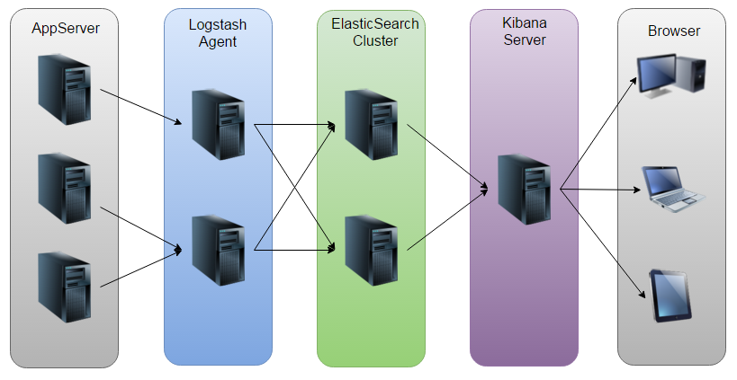  
如图：Logstash收集AppServer产生的Log，并存放到ElasticSearch集群中，而Kibana则从ES集群中查询数据生成图表，再返回给Browser。      
ELK下载：https://www.elastic.co/downloads/  
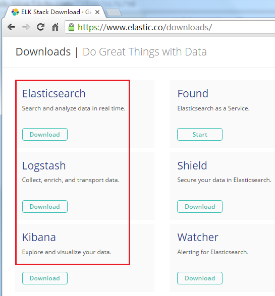  

**ElasticSearch**  
配置ElasticSearch：  
```bash
tar -zxvf elasticsearch-2.1.0.tar.gz
cd elasticsearch-2.1.0
```
安装Head插件（Optional）：  
```bash
./bin/plugin install mobz/elasticsearch-head
```
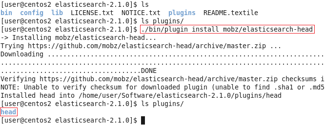  
然后编辑ES的配置文件：  
`vi config/elasticsearch.yml`  
修改以下配置项：  
```bash
cluster.name=es_cluster
node.name=node0
path.data=/tmp/elasticsearch/data
path.logs=/tmp/elasticsearch/logs
#当前hostname或IP，我这里是centos2
network.host=centos2
network.port=9200
```
其他的选项保持默认，然后启动ES：  
`./bin/elasticsearch`  
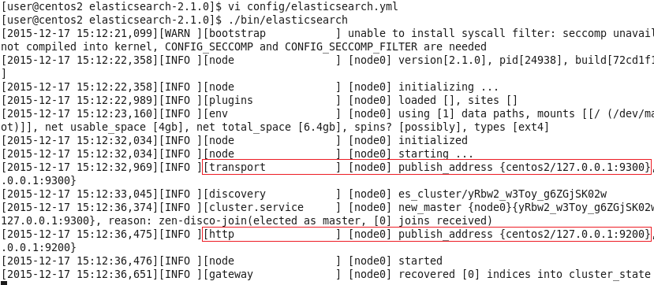  

可以看到，它跟其他的节点的传输端口为9300，接受HTTP请求的端口为9200。

使用ctrl+C停止。当然，也可以使用后台进程的方式启动ES：  
`./bin/elasticsearch &`  
然后可以打开页面localhost:9200，将会看到以下内容：  
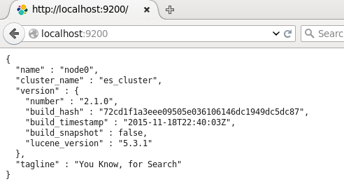  

返回展示了配置的cluster_name和name，以及安装的ES的版本等信息。刚刚安装的head插件，它是一个用浏览器跟ES集群交互的插件，可以查看集群状态、集群的doc内容、执行搜索和普通的Rest请求等。现在也可以使用它打开localhost:9200/_plugin/head页面来查看ES集群状态：  
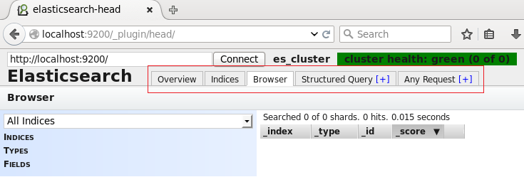  

可以看到，现在，ES集群中没有index，也没有type，因此这两条是空的。  

**Logstash**  
Logstash的功能如下：  
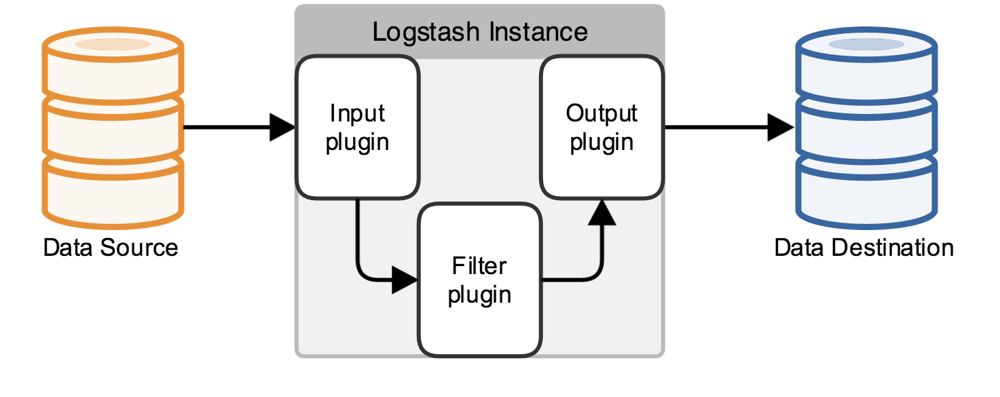  

其实它就是一个收集器而已，我们需要为它指定Input和Output（当然Input和Output可以为多个）。由于我们需要把Java代码中Log4j的日志输出到ElasticSearch中，因此这里的Input就是Log4j，而Output就是ElasticSearch。  

配置Logstash：  
```bash
tar -zxvf logstash-2.1.1.tar.gz
cd logstash-2.1.1
```
编写配置文件(名字和位置可以随意，这里我放在config目录下，取名为log4j_to_es.conf)：  
```bash
mkdir config
vi config/log4j_to_es.conf
```
输入以下内容：  
```bash
# For detail structure of this file
# Set: https://www.elastic.co/guide/en/logstash/current/configuration-file-structure.html
input {
  # For detail config for log4j as input, 
  # See: https://www.elastic.co/guide/en/logstash/current/plugins-inputs-log4j.html
  log4j {
    mode => "server"
    host => "centos2"
    port => 4567
  }
}
filter {
  #Only matched data are send to output.
}
output {
  # For detail config for elasticsearch as output, 
  # See: https://www.elastic.co/guide/en/logstash/current/plugins-outputs-elasticsearch.html
  elasticsearch {
    action => "index"          #The operation on ES
    hosts  => "centos2:9200"   #ElasticSearch host, can be array.
    index  => "applog"         #The index to write data to.
  }
}
```
logstash命令只有2个参数：  
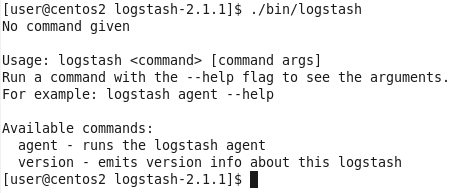  

因此使用agent来启动它（使用-f指定配置文件）：  
`./bin/logstash agent -f config/log4j_to_es.conf`  
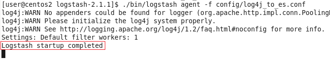  

到这里，我们已经可以使用Logstash来收集日志并保存到ES中了，下面来看看项目代码。

**Java项目**  
照例先看项目结构图：  
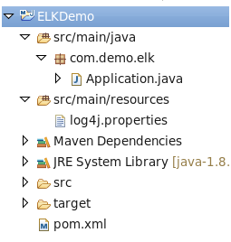  
pom.xml，很简单，只用到了Log4j库：  
```xml
<dependency>
    <groupId>log4j</groupId>
    <artifactId>log4j</artifactId>
    <version>1.2.17</version>
</dependency>
```
log4j.properties，**将Log4j的日志输出到SocketAppender**，因为官网是这么说的：  
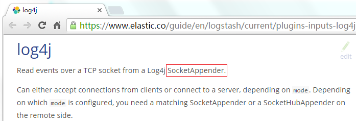  
```bash
log4j.rootLogger=INFO,console

# for package com.demo.elk, log would be sent to socket appender.
log4j.logger.com.demo.elk=DEBUG, socket

# appender socket
log4j.appender.socket=org.apache.log4j.net.SocketAppender
log4j.appender.socket.Port=4567
log4j.appender.socket.RemoteHost=centos2
log4j.appender.socket.layout=org.apache.log4j.PatternLayout
log4j.appender.socket.layout.ConversionPattern=%d [%-5p] [%l] %m%n
log4j.appender.socket.ReconnectionDelay=10000

# appender console
log4j.appender.console=org.apache.log4j.ConsoleAppender
log4j.appender.console.target=System.out
log4j.appender.console.layout=org.apache.log4j.PatternLayout
log4j.appender.console.layout.ConversionPattern=%d [%-5p] [%l] %m%n
```
注意：**这里的端口号需要跟Logstash监听的端口号一致，这里是4567。**  
Application.java，使用Log4j的LOGGER打印日志即可：  

```java
package com.demo.elk;

import org.apache.log4j.Logger;

public class Application {
    private static final Logger LOGGER = Logger.getLogger(Application.class);
    public static void main(String[] args) throws Exception {
        for (int i = 0; i < 10; i++) {
            LOGGER.error("Info log [" + i + "].");
            Thread.sleep(500);
        }
    }
}
```
用Head插件查看ES状态和内容  
运行Application.java，先看看console的输出（当然，这个输出只是为了做验证，不输出到console也可以的）：  
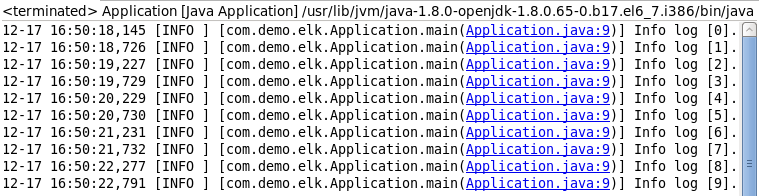  
再来看看ES的head页面：  
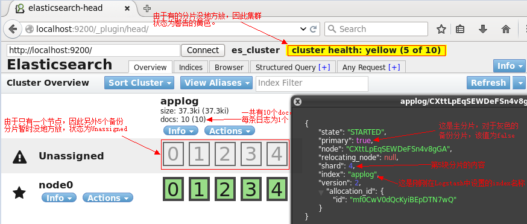  
切换到Browser标签：  
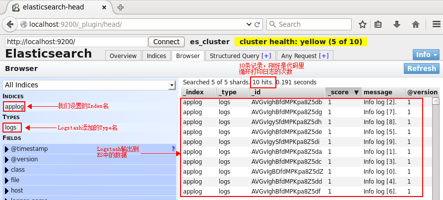  
单击某一个文档（doc），则会展示该文档的所有信息：  
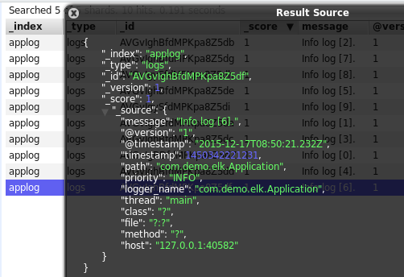    
可以看到，除了基础的message字段是我们的日志内容，Logstash还为我们增加了许多字段。而在https://www.elastic.co/guide/en/logstash/current/plugins-inputs-log4j.html中也明确说明了这一点：  
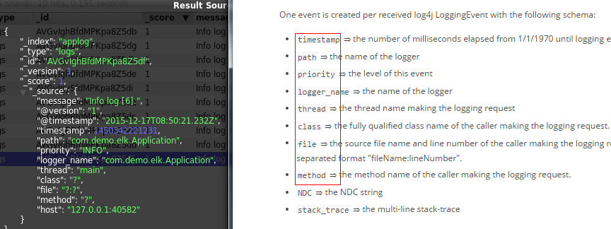  

上面使用了ES的Head插件观察了ES集群的状态和数据，但这只是个简单的用于跟ES交互的页面而已，并不能生成报表或者图表什么的，接下来使用Kibana来执行搜索并生成图表。  

**Kibana**  
配置Kibana:  
```bash
tar -zxvf kibana-4.3.0-linux-x86.tar.gz
cd kibana-4.3.0-linux-x86
vi config/kibana.yml
```
修改以下几项（由于是单机版的，因此host的值也可以使用localhost来代替，这里仅仅作为演示）：   
```bash
server.port: 5601
server.host: “centos2”
elasticsearch.url: http://centos2:9200
kibana.index: “.kibana”
```
启动kibana：  
`./bin/kibana`
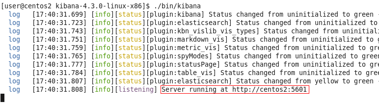  
用浏览器打开该地址：  
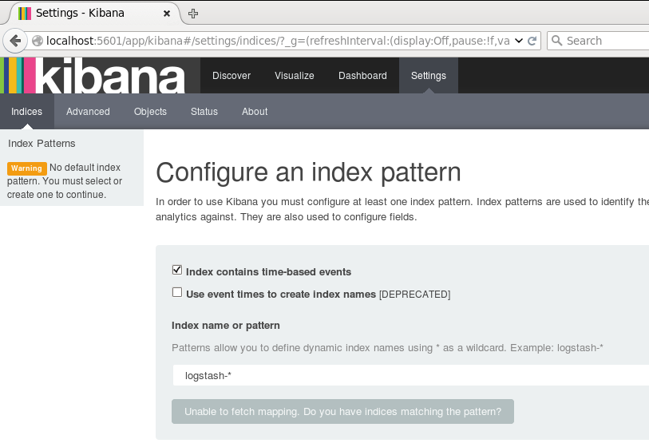  
为了后续使用Kibana，需要配置至少一个Index名字或者Pattern，它用于在分析时确定ES中的Index。这里我输入之前配置的Index名字applog，Kibana会自动加载该Index下doc的field，并自动选择合适的field用于图标中的时间字段：  
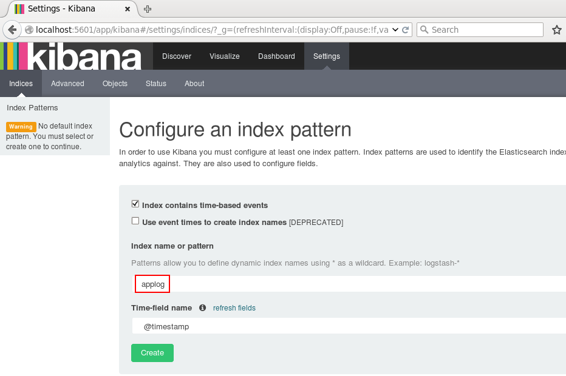  
点击Create后，可以看到左侧增加了配置的Index名字：  
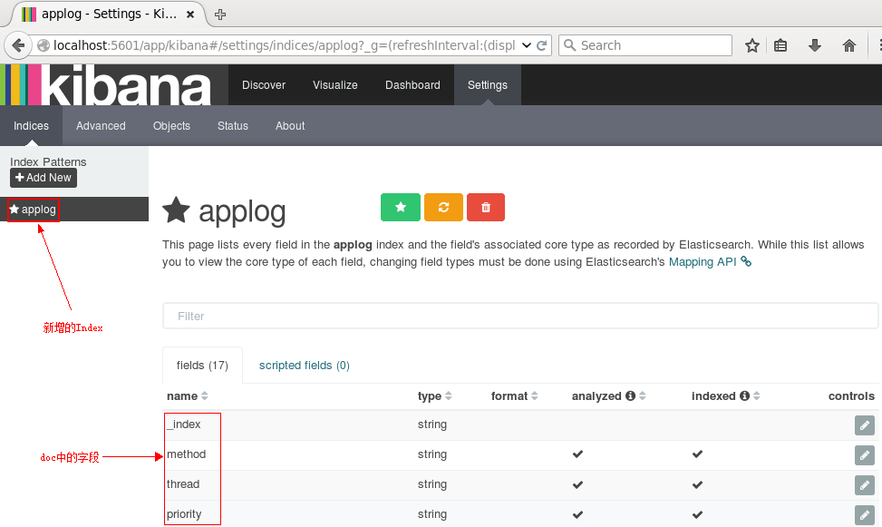  
接下来切换到Discover标签上，注意右上角是查询的时间范围，如果没有查找到数据，那么你就可能需要调整这个时间范围了，这里我选择Today：  
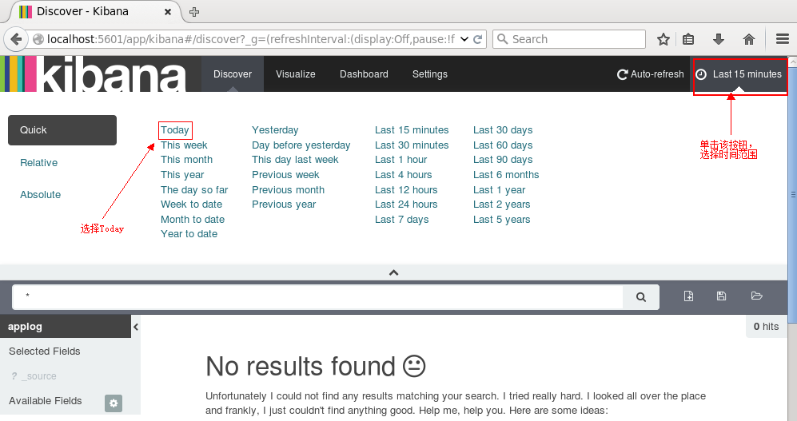  

接下来就能看到ES中的数据了：  
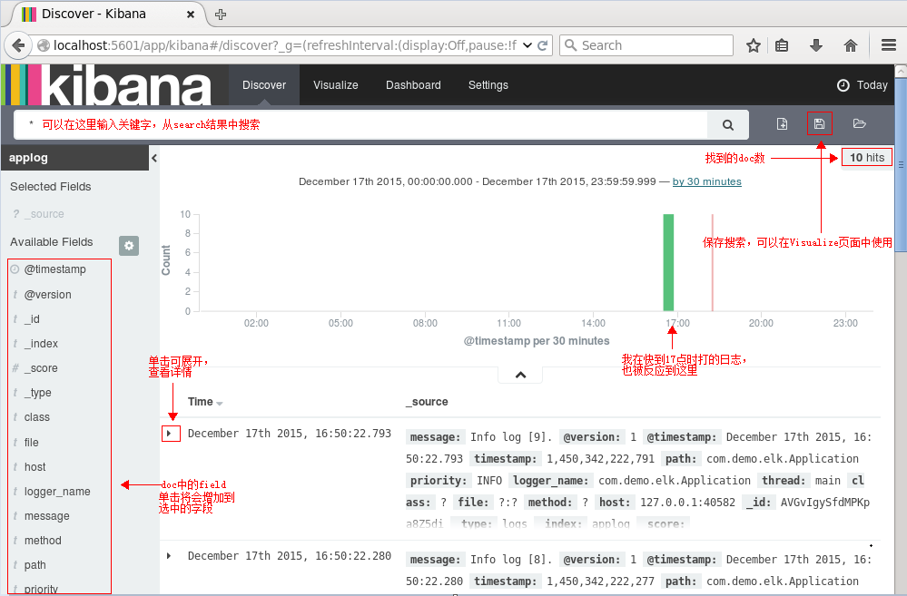  
点击右边的保存按钮，保存该查询为search_all_logs。接下来去Visualize页面，点击新建一个柱状图（Vertical Bar Chart），然后选择刚刚保存的查询search_all_logs，之后，Kibana将生成类似于下图的柱状图（只有10条日志，而且是在同一时间段的，比较丑，但足可以说明问题了：)  ）：  
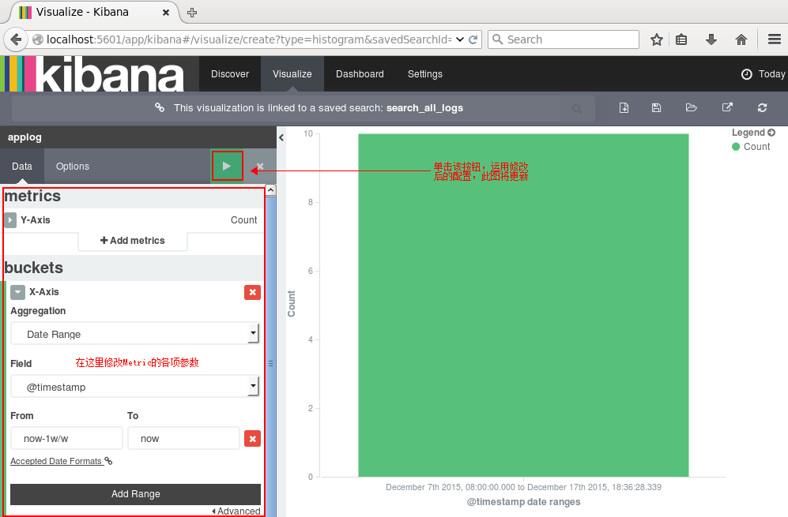  
你可以在左边设置图形的各项参数，点击Apply Changes按钮，右边的图形将被更新。同理，其他类型的图形都可以实时更新。  
点击右边的保存，保存此图，命名为search_all_logs_visual。接下来切换到Dashboard页面：  
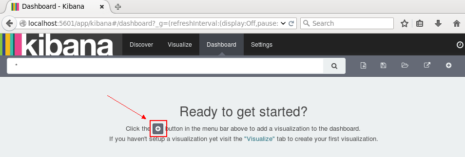  
单击新建按钮，选择刚刚保存的search_all_logs_visual图形，面板上将展示该图：  
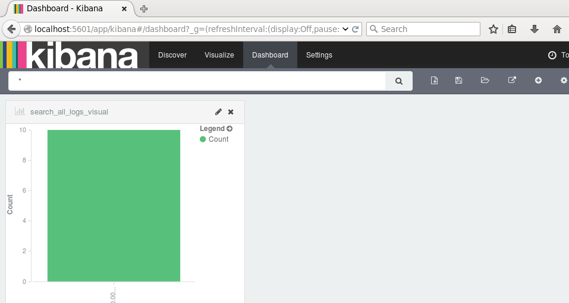  
如果有较多数据，我们可以根据业务需求和关注点在Dashboard页面添加多个图表：柱形图，折线图，地图，饼图等等。当然，我们可以设置更新频率，让图表自动更新：  
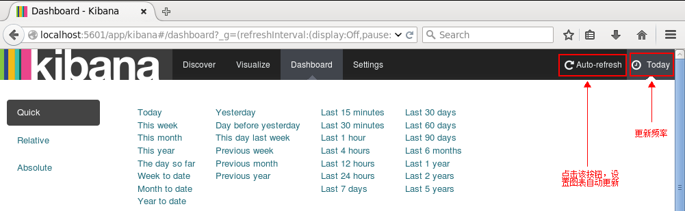  
  
如果设置的时间间隔够短，就很趋近于实时分析了。  
到这里，ELK平台部署和基本的测试已完成。