使用云服务商的企业邮箱服务器，太贵。免费的又有很多限制（例如每天只能发送一定量的邮件），不如自己搭建一个邮箱服务器来得快乐。  

# 必须的条件  

* 域名
* 一台服务器（Centos7）  

# 关于Poste  

poste有商业版和免费版（免费版的已经够用）。采用docker进行部署。还提供了WEB控制台，超级简单。  

官网: https://www.poste.io/   


# 开始之前  

首先你要在服务器上安装docker，不会自行Google。本帖子使用一个域名 undefined.design 作为演示（阿里云白嫖的域名），自己照着帖子操作的时候。要替换为自己的域名，照葫芦画瓢。  


# 1. 解析域名到服务器  

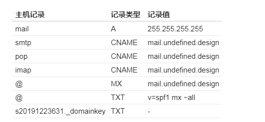  

对于你来说，就2个需要修改的地方  

* 把域名换成自己的
* 把服务器ip换成自己的  

最后一条解析记录 s20191223631._domainkey 先不用填写，后面会说。  

# 2. 安装Poste  

```console
docker run \
-p 25:25 \
-p 80:80 \
-p 110:110 \
-p 143:143 \
-p 443:443 \
-p 587:587 \
-p 993:993 \
-p 995:995 \
-v /etc/localtime:/etc/localtime:ro \
-v /srv/poste/data:/data \
--name "PosteServer" \
-h "mail.undefined.design" \
-t analogic/poste.io

记得在防火墙/安全组开放上面指定的端口
注意 -h 参数，要替换为自己的域名。其他的不用动，然后就是耐心等待。直到看到如下提示。表示安装成功。
```

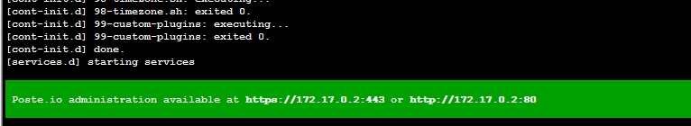  


# 3. 访问管理控制台  

打开浏览器，访问 mail.undefined.design，浏览器会给警告 您的连接不是私密连接，点击高级 -> 继续前往。等下会处理这个问题。  
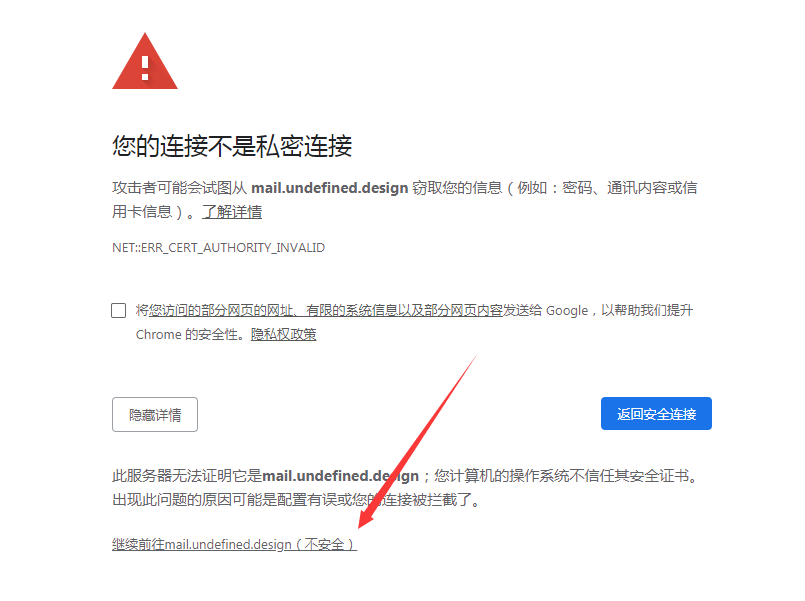  

**设置管理员账户以及密码，然后进入后台**  

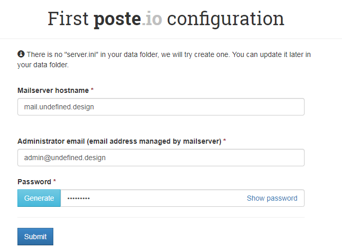  


# 4. 创建dkim 密钥  

Virtual domains -> undefined.design  
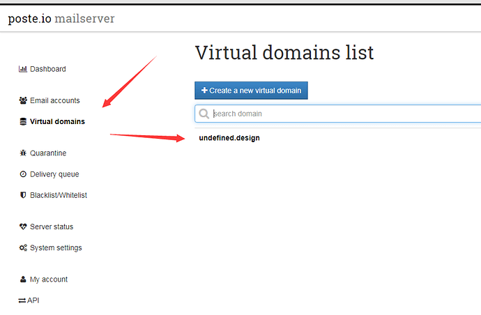  

点击 create new key，生成key  

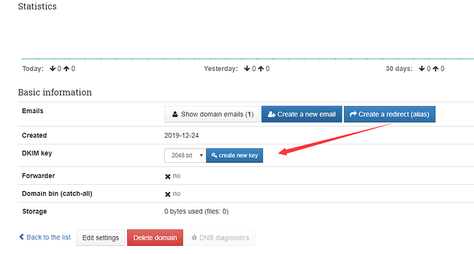  

把得到的key，添加到dns解析记录,就是上述留下的最后一条解析 s20191223631._domainkey  

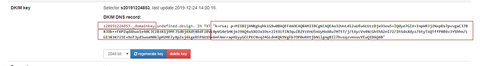  

最终的DNS解析  
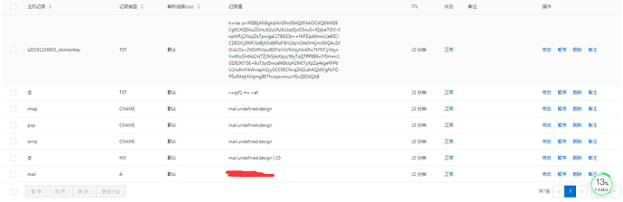  


# 5.生成SSL证书，解决浏览器SSL问题  

System Settings -> TLS certificate  
点击 issue free letsencrypt.org certificate 生成证书  
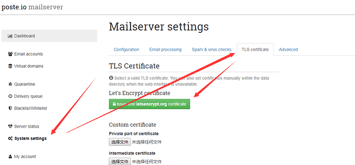  
如下方式填写域名，点击 Save changes。  

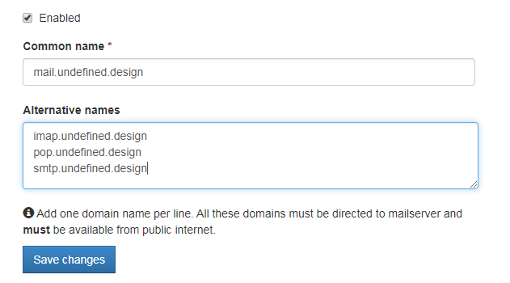  
然后等待申请完成。可以通过下面的日志查看进度。安装完成后，刷新页面就已经是HTTPS环境。  


# 6. 添加新的邮箱  

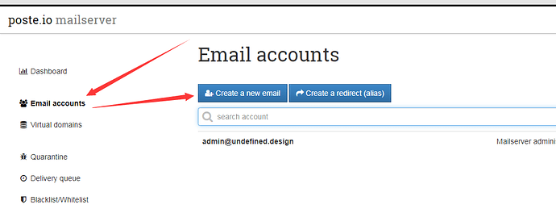  

设置好用户名，邮箱地址，密码  
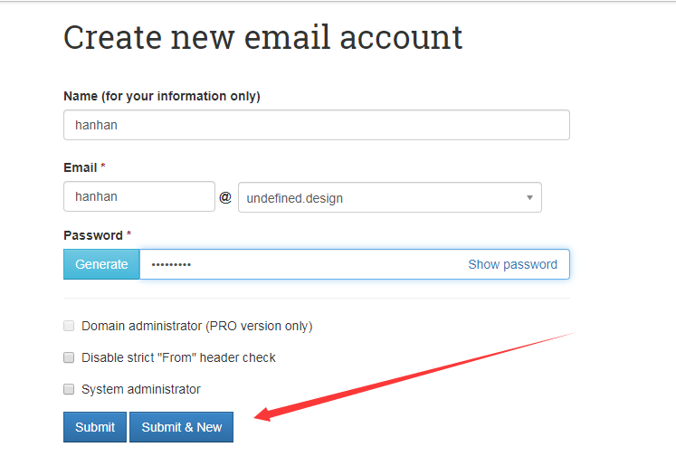  


# 7. 进入用户的管理控制台，使用新增的用户名邮箱密码登录  
https://mail.undefined.design/webmail/  

## 1. 开启邮件加密  
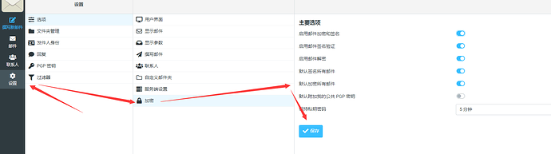  

## 2. 收发邮件  

通过控制台收发，太简单了。自己研究。  


# 8. 日志的查看  

`docker logs -f PosteServer`


# 9. 最后，可以通过官方文档了解更多功能  

https://www.poste.io/doc/