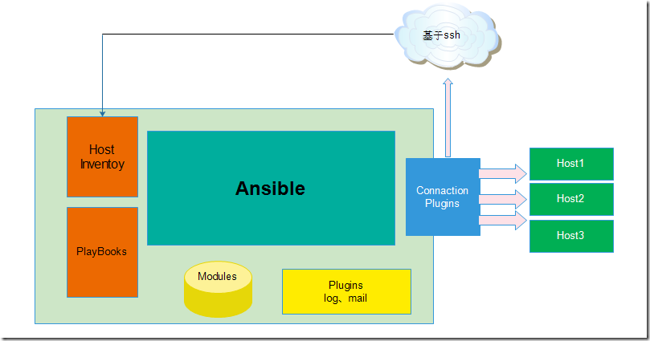

# 自动化运维工具之ansible
###### 什么样的情形需要批量部署
    * 操作系统的安装    常见的有collber,red hat satelite(redhat)系统专用。  
    * 操作系统的配置    常见的有cfengine,puppet,chef,func。其中puppet最受欢迎  
    * 批量程序的部署
    * 批量命令的运行查看状态信息  
   
###### ansible介绍
   * ansible的架构大致如下
  
   
  
ansible是新出现的运维工具是基于Python研发的糅合了众多老牌运维工具的优点实现了批量操作系统配置、批量程序的部署、批量运行命令等功能。  
运维工具常见的工作模式  
* agent模式: 基于ssl实现。代理工作在被监控端。像puppet。  
* agentless模式: 基于ssh服务实现工作在被监控端。监控端是ssh的客户端。   
ansible是工作在agentless模式下具有幂等性。ansible在控制端只需要告诉监控端的期望状态就可以实现批量部署。  
名词解释  
幂等性不会重复执行相同的指令。例如不会重复安装软件    
期望状态只需要告诉被监控端的期望状态  

ansible是基于模块工作的ansible本身没有批量部署的能力。真正具有批量部署的是ansible所运行的模块ansible只是提供一种框架。架构包括  
* 连接插件connection plugins负责和被监控端实现通信。  
* Host Inventory:指定操作的主机,是一个配置文件里面定义监控的主机  
* 各种模块核心模块command模块自定义模块  
* 借助于插件完成记录日志邮件等功能
* PlayBooks:剧本执行多个任务时。并非必需可以让节点一次性运行多个任务  

###### ansible的基本使用  
```bash
安装软件yum install ansible -y # 对应的软件在 epel 仓库中也可自己手动编译
#源码地址 https://pypi.python.org/packages/source/a/ansible/ansible-1.5.tar.gz 
```
定义Host Inventory  
```bash
# vim /etc/ansible/hosts  
[webhosts]  
172.16.10.22 ansible_ssh_user=root ansible_ssh_pass=guoting 
172.16.10.33 ansible_ssh_user=root ansible_ssh_pass=guoting 
解释  
#ansible_ssh_user=root 是ssh登陆用户  
#ansible_ssh_pass=guoting 是ssh登陆密码3、测试各个模块  
# 注意每个模块的用法可以使用 ansible-doc MOD 来查看例如ansible-doc copy  
   
ansible命令最常用的用法  
ansible <Host-partten> -m MOE -a 'MOD_ARV'所支持的模块可以使用ansible-doc -l来查看 
```
