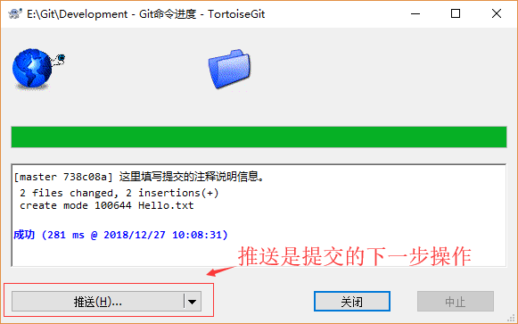
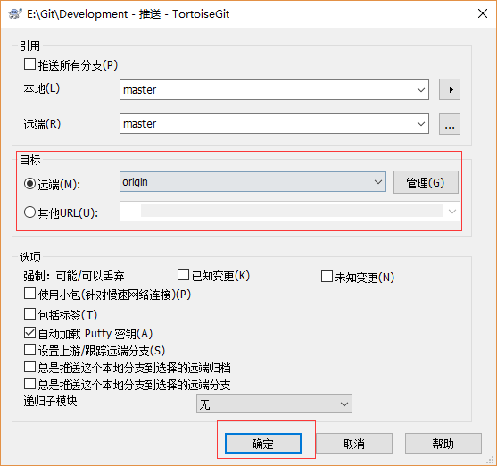

# 前言  

作为一个软件开发人员，不可能不知道Git。Git作为一个复杂的版本控制系统，命令之多，即使经常使用，一些命令也记不住，一般只记住几个常用的命令，不是所有使用Git命令行都是高效的。本教程不讲Git命令，而是先让你用上git，再去学习git。本教程应该称作TortoiseGit入门指南。因为下面要借助一个图形化的软件，TortoiseGit来操作git。用GUI（图形界面）再谈CLI（命令行），我相信这会更容易让人接受。  

# TortoiseGit 简介  

```console
TortoiseGit 简称 tgit， 中文名海龟Git。TortoiseGit是一个开放的GIT版本控制系统的源客户端。
TortoiseGit 支持Winxp/vista/win7/Win10，提供有中文版支持。
TortoiseGit 可以恢复您的文件的旧版本，并研究如何以及合适改变了历史数据，谁改变了它。下面教程针对使用TortoiseGit 的用户。
```

# 下载安装Git及Tortoisegit  
环境安装，需要依次安装以下：  
  

## 第1步：下载Git  
下载地址：https://git-for-windows.github.io/  

## 第2步：下载安装TortoiseGit及中文语言包    

[Tortoisegit及语言包下载](http://tortoisegit.org/download/)
[TortoiseGit 安装教程](https://jingyan.baidu.com/article/f3ad7d0f37a75d09c2345b6f.html)  

  

# Tortoisegit 配置  

1. 第1步： 首先，请选定一个存放Git项目的目录，这样方便管理. 如: E:\Git，然后在资源管理器中打开：  
  

2. 第2步： 在空白处点击鼠标右键，选择 --> TortoiseGit --> Settings，然后就可以看到配置界面：  
  

3. 第3步：选中General，在右边的 Language中选择简体中文(当然,你也可以继续使用英文)。取消勾选升级检查的复选框，可能还需要指定 git.exe 文件的路径，如 "D:\Program Files\Git\bin"。完成后，点击应用，确定关闭对话框。  
  

4. 第4步：配置用户，用户作为你操作git的个人标识，进入设置，点选左边的Git标签，可以发现,右边可以配置用户的名字与Email信息. 如下图所示：  
  

因为当前还没有本地项目,所以 “编辑本地 .git/config(L)” 按钮处于灰色不可用状态，如果在某个本地Git项目下打开配置对话框，那么这个按钮就可用,然后就可以编辑此项目的一些属性。  

点击 “编辑全局 .git/config(O)”按钮,会使用记事本打开全局配置文件，在全局配置文件中，在后面加上下面的内容（记住密码）:  

```ini
[credential]
  helper = store
```

完成后保存，关闭记事本，确定即可。  
则当你使用 HTTPS URL 方式推送项目到GitHub等在线仓库时，海龟git会记住你输入的用户名和密码（这里不是用户的姓名和Email哦），可以避免每次提交都要输入用户名和密码。（还有种方式，通过使用 SSH URL 来提交代码便可以一劳永逸了~~~）  
如果你编辑的是 本地 .git/config(L)，其实这个翻译为本地有点问题，应该叫局部，也就是在某个项目下面设置，只对此项目有效，配置是一样的。  

# Tortoisegit 使用示例  

克隆一个项目（分别从github仓库、自己搭建的gitblit 仓库上获取）  

```console
教程开始之前，补充一个知识点：
    本地仓库和远程git仓库的连接方式有两种：HTTPS 和 SSH，很多时候都是直接使用 HTTPS URL 方式克隆项目到本地，当然也有有些人使用SSH URL克隆到本地。这两种方式的主要区别在于：
    HTTPS：使用起来不用配置，对初学者来说会比较方便，只要复制HTTPS URL然后到git Bash里面直接用clone命令克隆到本地就好了，但是每次 fetch 和 push代码都需要输入账号和密码，这也是HTTPS 方式的麻烦之处。
    SSH：使用SSH URL方式需要在克隆之前先配置和添加好SSH key，因此，如果你想要使用SSH url克隆的话，你必须是这个项目的拥有者。否则你是无法添加SSH key的，另外ssh默认是每次fetch和push代码都不需要输入账号和密码，如果你想要每次都输入账号密码才能进行fetch和push也可以另外进行设置。多数介绍Git的博客里面采用的都是https的方式作为案例，今天主要是记录如何配置并在海龟git中使用SSH方式来提交和克隆代码。
```

1. 第1步：此处介绍通过SSH URL方式传输，使用之前需要先将本地的 SSH 公钥配置到 Git 服务器上。  

先查看SSH Key。在C盘用户主目录用户目录下，看看有没有.ssh目录，如果有，再看看这个目录下有没有id_rsa和id_rsa.pub这两个文件，如果已经有了，可直接跳到第2步。  
  

如果没有上述文件，则需要创建一个SSH Key，在任意文件夹下点击右键，选择 Git GUI Here。在弹出的程序中选择主菜单的【Help】→【Show SSH Key】：  
  

如果没有Key，则点击“Generate Key”生成一个SSH Key：  
  
把生成的全部内容拷出来。  
如果一切顺利的话，可以在用户主目录里找到.ssh目录，里面有id_rsa和id_rsa.pub两个文件，这两个就是SSH Key的秘钥对，id_rsa是私钥，不能泄露出去，id_rsa.pub是公钥，可以放心地告诉任何人。（其他创建SSH Key方式：[通过Shell命令方式创建](https://www.liaoxuefeng.com/wiki/0013739516305929606dd18361248578c67b8067c8c017b000/001374385852170d9c7adf13c30429b9660d0eb689dd43a000)）  

2. 第2步：把 SSH Key 填到Git 服务器的配置中。  

GitHub服务器：登陆GitHub，【头像】→【Settings】→【SSH and GPG Keys】→【New SSH Key】，填入上一步的复制的SSHKey，然后【Add SSH Key】：  
  

Gitblit 服务器（自己搭建 Git 服务器，[Gitblit的安装教程请看这里](https://www.cnblogs.com/anayigeren/p/10175367.html)），登录 Gitblit账户，在【头像】→【用户中心】→【SSH Keys】，填入上一步的复制的SSHKey，然后【添加】    
  
为什么GitHub需要SSH Key呢？因为GitHub需要识别出你推送的提交确实是你推送的，而不是别人冒充的，而Git支持SSH协议，所以，GitHub只要知道了你的公钥，就可以确认只有你自己才能推送。  

3. 第3步：要克隆 GitHub 或 Gitblit 上的项目，先要获取对应远程存储库的路径（注意：此处使用 SSH URL 方式）：  

GitHub仓库：从 GitHub项目页面上得到对应存储库的 giturl 路径：  
  

Gitblit 仓库：在存储库页面这个位置得到存储库的 giturl 路径：  
  

4. 第4步：在本地文件夹的空白位置处，右击鼠标，在菜单中选择【Git克隆】：  
  
把git 路径填写到URL，并选择本地文件目录，点击【确定】，弹出下载进度窗口。（服务器端至少要有一个文件，否则 pull的时候会报错 fatal: Couldn't find remote ref HEAD）  
  
克隆成功，则在文件夹上就可以看到角标标识：  
  

Git文件上角标符号说明：  
文件上的图标，可以反映出当前文件或者文件夹的状态：  
  
若是看不到可以查看该教程：[TortoiseGit状态图标不能正常显示的解决办法](https://www.cnblogs.com/xiesong/p/5761352.html)  


# 将代码提交到服务器  

Git的使用类似TFS、SVN等源代码或者文件管理器，惯例的流程：  
  

1. 第一步：改动，修改本地项目中的某些文件，如修改 README.md 内容，还可以增加一些文件， 如Hello.txt。
2. 第二步：提交本地，在本地项目的空白处点击鼠标右键，选择 【Git提交(C) -> "master"...】  
  

在弹出提交（Commit）对话框中完成提交说明信息，和选择需要提交的文件，可根据需要新建分支，然后点击 【提交】 按钮，将修改提交到**本地仓库**：  
  

弹出提交进度窗口，提交成功后还需要“推送”将本地仓库的修改推送到**远程仓库**。  
  

3. 第3步：同步拉取，在实际工作中，如果多人协作或者多个客户端进行修改，那么我们还要拉取别人推送到在线仓库的内容，所以在推送之前需要先执行同步拉取(Pull ...)操作。  
在本地仓库文件夹上【右击鼠标】→【Git同步】：  
  

打开Git同步窗口（包括常规操作及日志，同右击菜单快捷操作一样），点击【拉取(P)】，将远程分支拉取到本地：  
  

如果服务器上的文件没有被修改过，就会直接提示已经更新到最新，那你就可以直接进行下一步“推送(H)”操作了：  
  

反之，如果服务器上的文件被修改过了（本地文件修改前不是最新版本），就会提示冲突。先要解决冲突，然后再提交结果：  
  
需要注意的是，和使用TFS、SVN的习惯一样，你在修改本地内容之前，最好先 拉取（pull）一下，减少冲突的可能。  


4. 第四步：推送远程，将提交到本地仓库的修改推送到远程仓库，可以直接在提交成功后的提示窗口上点击【推送(H)...】，或者在Git同步窗口点击【推送(H)...】，鼠标右击的菜单上也有相应的快捷操作：选择 【TortoiseGit(T)】→【推送(H)...】  

弹出推送(push)对话框：  
  

一般保持默认,点击 “确定” 按钮  
然后弹出推送进度界面，可能要求你输入用户名，点击【确定】，然后要求输入密码，密码输入正确后，显示推送成功界面：  
  

如果你按照上一小节**Tortoisegit 配置**的设置操作，则输入密码以后会记住密码。密码会明文保存在C:\Users\用户名\.git-credentials 这个文件中，请小心保存。  

# 小结  
以上就是海龟Git常规的操作流程，git的功能很强大，相应的命令也很多，使用图形界面把Git的操作简化了确是大大的方便。除了小海龟还有[Source Tree](https://www.sourcetreeapp.com/)，也是开源且好用的Git GUI管理工具，待得有空小编再整理一份Source Tree的操作教程。补充一点，因为很多项目是在VS上进行开发的，所以更多的情况，我们不会去使用文件夹上的操作，而是结合VS的git模块来进行操作，查看[VS2017中使用Git进行版本控制](https://www.cnblogs.com/anayigeren/p/10185251.html)。  
