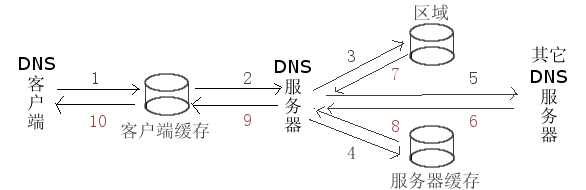

域名作为一棵倒挂的树，从根节点开始解析，直至叶子节点。通过下图更明确一下：  
  
从图的描述可以得知， 根域是以`点(.)`表示。明了这一点非常重要，因为它的意义会在Zone文件中得到体现。  
再加上客户端的请求解析流程图，会让整个流程更加清晰明了：  
  
详细的请求的顺序为：   

* 客户端Host文件标识
* 客户缓存
* 服务器区域设定
* 服务器缓存
* 其它服务器  
首先，看看已经安装好的bind程序。   
```bash
$ rpm -q bind  
bind-9.7.1-2.P2.fc13.i686  
$ rpm -q bind-chroot  
bind-chroot-9.7.1-2.P2.fc13.i686 
```
熟悉默认配置`/etc/named.conf`：   
```config
//  
// named.conf  
//  
// Provided by Red Hat bind package to configure the ISC BIND named(8) DNS  
// server as a caching only nameserver (as a localhost DNS resolver only).  
//  
// See /usr/share/doc/bind*/sample/ for example named configuration files.  
//  
  
options {  // 定义全局变量  
        listen-on port 53 { 127.0.0.1; }; // ipv4 监听端口  
        listen-on-v6 port 53 { ::1; };    // ipv6 监听端口  
        directory       "/var/named";     // 制定装载zone区域文件的目录  
        dump-file       "/var/named/data/cache_dump.db";    // cache  
        statistics-file "/var/named/data/named_stats.txt";  // statistics  
        memstatistics-file "/var/named/data/named_mem_stats.txt";  
        allow-query     { localhost; };   // 允许访问列表  
        recursion yes;  
  
        dnssec-enable yes;  
        dnssec-validation yes;  
        dnssec-lookaside auto;  
  
        /* Path to ISC DLV key */  
        bindkeys-file "/etc/named.iscdlv.key";  
}; // "}"后也得分号结束  
  
logging {  
        channel default_debug {  
                file "data/named.run";  
                severity dynamic;  
        };  
};  
  
zone "." IN {            // "."代表根区域  
        type hint;       // 根区域的类型就为hint  
        file "named.ca"; // 指定zone文件，默认已经生成  
};  
  
include "/etc/named.rfc1912.zones";  
```
注意，在最后一行还include一个conf文件，将本地地址都进行了映射。  
我们需要修改option的内容，并且添加新的zone：  

```config
option {  
        listen-on port 53 {   
               127.0.0.1;  
               192.168.60.14; // 为局域网其它机器提供Named服务，必须监听向本机IP发出的请求  
        };  
        ...  
        forwarders {          // 添加forwarders，指向其它DNS服务器  
               202.106.196.115;  
        };  
        allow-query{ any; };  // 开放访问权限  
        ...  
};  
  
zone "groupon.cn" IN {               // 解析groupon.cn  
        type master;  
        file "named.groupon.cn";     // 自定义的域名到IP的正向解析配置  
};  
  
zone "60.168.192.in-addr.arpa" IN {  // 本地内网为192.168.60.x  
        type master;  
        file "named.192.168.60";     // 自定义的IP到域名的反向解析配置  
};  
```

至此看来，named.conf的配置并不复杂，不过接下来的zone文件的配置就会改变你的看法。熟悉默认配置`/var/named/named.localhost `  
```config
; 注意，zone文件的注释是以分号";"开始的。  
  
$TTL 1D     ; 生存期, 默认单位为秒，另可设定为[W|D|H|M]  
  
; [zone] IN SOA [主机名] [管理员email] ([五组更新时间参数])  
; @=>zone IN SOA @=>主机名 rname.invalid.=>email  
; @代表根域  
; rname.invalid.解析为rname@invalid，第一个"."为"@"的替代，尾部的"."为根域，表明其为绝对URL。  
@       IN SOA  @ rname.invalid. (  
                                        0       ; serial  
                                        1D      ; refresh  
                                        1H      ; retry  
                                        1W      ; expire  
                                        3H )    ; minimum  
        NS      @          ; 直接输入域名，访问@  
        A       127.0.0.1  ; 直接输入域名，解析到的IPV4的IP  
        AAAA    ::1        ; 直接输入域名，解析到的IPV6的IP 
```

现在开始建立正向解析文件: `/var/named/named.groupon.cn `
```config
$TTL 1D  
@ IN SOA @ root.groupon.cn. (  
        2010110901  
        28800  
        14400  
        3600000  
        86400  
)  
  
        IN NS @               ; 直接输入域名，访问@  
        IN A 221.123.177.226  ; 直接输入域名(www)，解析到的外网IP  
store   IN A 192.168.60.42    ; 输入子域名，解析到的内网IP  
img     IN A 192.168.60.43  
```

建立反向解析文件:`/var/named/named.192.168.60`
```config
$TTL 1D  
@ IN SOA 60.168.192.in-addr.arpa. root.groupon.cn. (  
        2010110901  
        28800  
        14400  
        3600000  
        86400  
)  
  
@ IN NS www.groupon.cn.  
42 IN PTR store.groupon.cn.  ; 192.168.60.42 -> store  
43 IN PTR img.groupon.cn.    ; 192.168.60.43 -> img  
```
配置完毕，检查配置文件的正确性：   

```bash
# /usr/sbin/named-checkconf -z  
zone localhost/IN: loaded serial 0  
zone 60.168.192.in-addr.arpa/IN: loaded serial 2010110901  
zone groupon.cn/IN: loaded serial 2010110901  
```
看来一切正常， 这时就可以启动named服务器了。 

```bash
# /sbin/service named start  
Starting named:                                            [  OK  ]  
```
还要做的就是开通端口，并在客户端设定DNS地址为该服务器地址，强制刷新dns和测试：  
```bat
> ipconfig /flushdns  
  
Windows IP Configuration  
  
Successfully flushed the DNS Resolver Cache.  
  
> nslookup  
*** Can't find server name for address 192.168.60.36: Non-existent domain  
*** Default servers are not available  
Default Server:  UnKnown  
Address:  192.168.60.36  
  
> groupon.cn  
Server:  UnKnown  
Address:  192.168.60.36  
  
Name:    groupon.cn  
Address:  221.123.177.226  
  
> store.groupon.cn  
Server:  UnKnown  
Address:  192.168.60.36  
  
Name:    store.groupon.cn  
Address:  192.168.60.42  
  
> 192.168.60.42  
Server:  UnKnown  
Address:  192.168.60.36  
  
Name:    store.groupon.cn  
Address:  192.168.60.42  
```
大功告成！  
参考：

文件:`/etc/named.rfc1912.zones `
```config
// named.rfc1912.zones:  
//  
// Provided by Red Hat caching-nameserver package   
//  
// ISC BIND named zone configuration for zones recommended by  
// RFC 1912 section 4.1 : localhost TLDs and address zones  
// and http://www.ietf.org/internet-drafts/draft-ietf-dnsop-default-local-zones-02.txt  
// (c)2007 R W Franks  
//   
// See /usr/share/doc/bind*/sample/ for example named configuration files.  
//  
  
zone "localhost.localdomain" IN {  
    type master;  
    file "named.localhost";  
    allow-update { none; };  
};  
  
zone "localhost" IN {  
    type master;  
    file "named.localhost";  
    allow-update { none; };  
};  
  
zone "1.0.0.0.0.0.0.0.0.0.0.0.0.0.0.0.0.0.0.0.0.0.0.0.0.0.0.0.0.0.0.0.ip6.arpa" IN {  
    type master;  
    file "named.loopback";  
    allow-update { none; };  
};  
  
zone "1.0.0.127.in-addr.arpa" IN {  
    type master;  
    file "named.loopback";  
    allow-update { none; };  
};  
  
zone "0.in-addr.arpa" IN {  
    type master;  
    file "named.empty";  
    allow-update { none; };  
};  
```

文件:`/var/named/named.loopback`
```config
$TTL 1D  
@   IN SOA  @ rname.invalid. (  
                    0   ; serial  
                    1D  ; refresh  
                    1H  ; retry  
                    1W  ; expire  
                    3H )    ; minimum  
    NS  @  
    A   127.0.0.1  
    AAAA    ::1  
    PTR localhost.  
```

文件:`/var/named/named.empty`
```config
$TTL 3H  
@   IN SOA  @ rname.invalid. (  
                    0   ; serial  
                    1D  ; refresh  
                    1H  ; retry  
                    1W  ; expire  
                    3H )    ; minimum  
    NS  @  
    A   127.0.0.1  
    AAAA    ::1  
```


