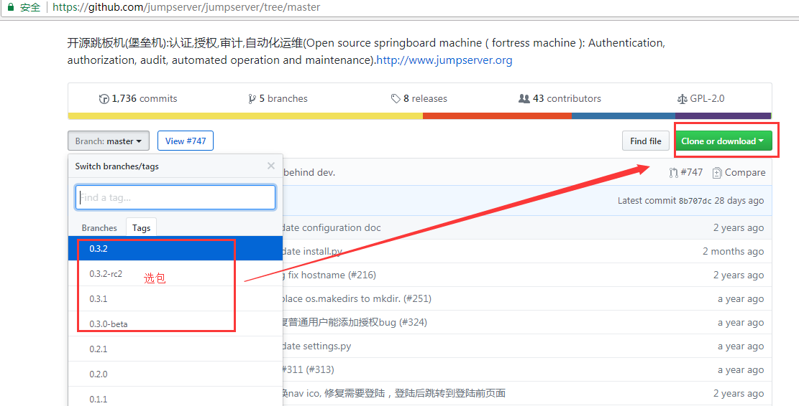
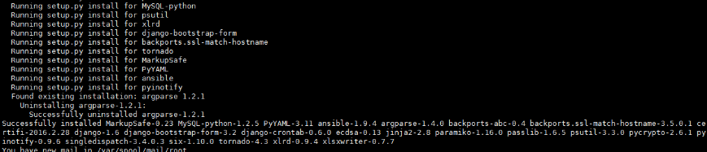
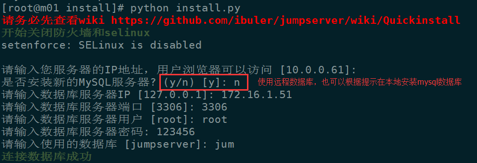
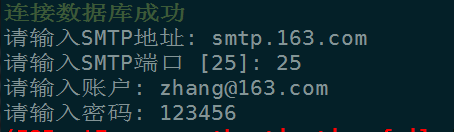
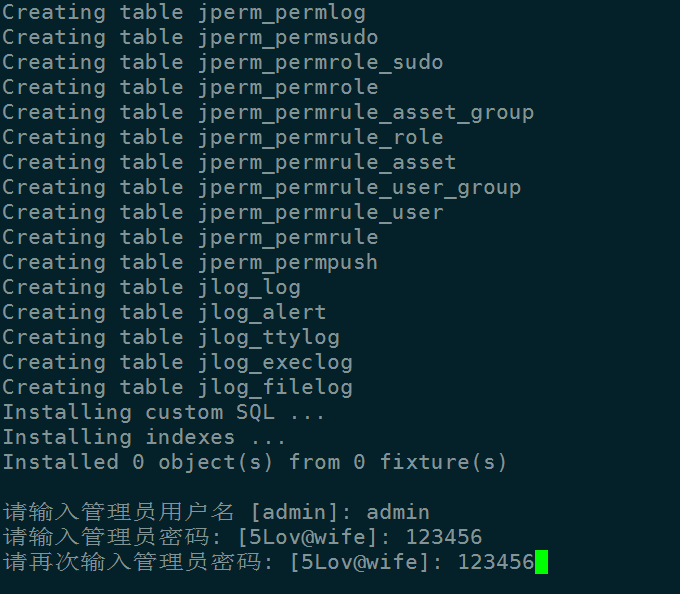
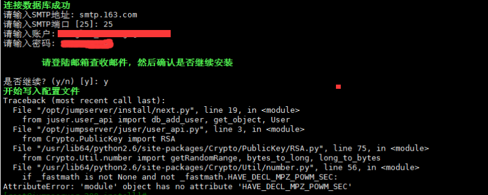
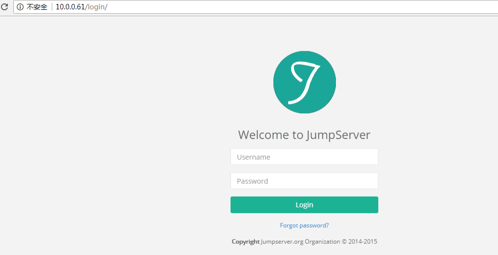

#### 摘要  

Jumpserver 是一款由python编写开源的跳板机(堡垒机)系统，实现了跳板机应有的功能。基于ssh协议来管理，客户端无需安装agent。  

**特点：**  

* 完全开源，GPL授权 
* Python编写，容易再次开发 
* 实现了跳板机基本功能，认证、授权、审计 
* 集成了Ansible，批量命令等 
* 支持WebTerminal 
* Bootstrap编写，界面美观 
* 自动收集硬件信息 
* 录像回放 
* 命令搜索 
* 实时监控 
* 批量上传下载  


github：https://github.com/jumpserver/jumpserver  

[docker快速安装](http://docs.jumpserver.org/zh/docs/dockerinstall.html)  

#### 安装环境  

jumpserver 3.0 安装  

服务器环境：  

```console
[root@m01 ~]# cat /etc/redhat-release 
CentOS release 6.9 (Final)
[root@m01 ~]# uname -r
2.6.32-696.el6.x86_64

jumpserver：172.16.1.61 
clients：172.16.1.51

#ps：操作只针对 jumpserver，clients 不会进行操作，只是环境需求
```

##### jumpserver依赖包安装  

```console
wget -O /etc/yum.repos.d/CentOS-Base.repo http://mirrors.aliyun.com/repo/Centos-6.repo
wget -O /etc/yum.repos.d/epel.repo http://mirrors.aliyun.com/repo/epel-6.repo
yum clean all && yum makecache 
yum -y install git python-pip mysql-devel gcc automake autoconf python-devel vim sshpass lrzsz readline-devel
```

##### 下载jumpserver安装包  

```console
cd /opt 
git clone https://github.com/jumpserver/jumpserver.git 
#注： 如果下载失败，则去github上面下载zip包，unzip解压缩即可
```

github下载：  
  


#### 执行快速安装脚本  

```console
cd /opt/jumpserver/install

pip install -r requirements.txt
```

  

**查看安装包：**`pip freeze`  

**执行安装脚本：**`[root@m01 install]# python install.py `  

##### 数据库配置  
  

**注：如果使用的远程数据库，mysql登录账户需要开启远程登录，手动创建数据库：**

```sql
create database jum character set utf8;
```

##### 邮箱设置（可跳过）  
  

##### 设置管理账号密码  
  

**注意事项：报错 输入smtp信息之后发现报错了，是python的pycrypto模块问题，需要卸载重装：**  

```console
pip uninstall pycrypto 
easy_install -i  https://pypi.douban.com/simple/  pycrypto
```

  

安装之后继续 `python install.py` 进行安装，并且输入 web管理员用户名和管理员密码，ok  
**注**  

* 根据提示输入相关信息，完成安装，安装完成后，请访问web，继续查看后续文档 
* 如果启动失败，请返回上层目录，手动运行 ./service.sh start 启动 
* 如果 `./service.sh start `启动失败   

```console
cd /opt/jumpserver 
python manage.py runserver 0.0.0.0:80 
python run_websocket.py 
```

* 如果启动失败，可能是由于80端口和3000端口已经被占用，或者数据库账号密码不对，请检查  


#### 访问登录  
  

#### jumpserver应用  
[点我查看jumpserver应用](https://github.com/jumpserver/jumpserver/wiki/v0.3.2-%E5%BA%94%E7%94%A8%E5%9B%BE%E8%A7%A3)

