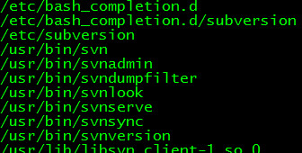
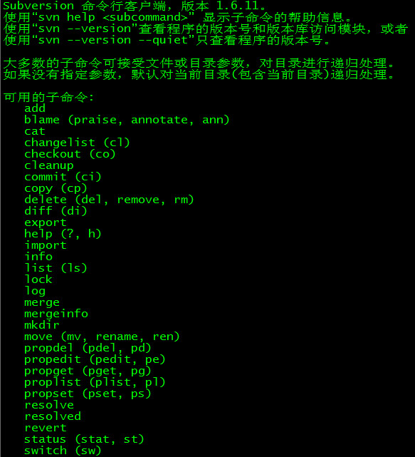
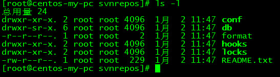
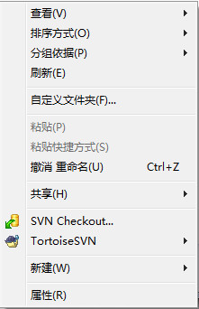
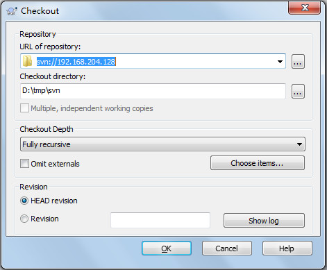
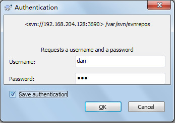

安装步骤如下：  
1. `yum install subversion`
2. 输入`rpm -ql subversion`查看安装位置，如下图  ：  
  
我们知道svn在bin目录下生成了几个二进制文件。
输入`svn --help`可以查看svn的使用方法，如下图。  
  
3. 创建svn版本库目录
`mkdir -p /var/svn/svnrepos`
4. 创建版本库
`svnadmin create /var/svn/svnrepos`  
执行了这个命令之后会在/var/svn/svnrepos目录下生成如下这些文件  
  

5. 进入conf目录（该svn版本库配置文件）
```bash
authz文件是权限控制文件
passwd是帐号密码文件
svnserve.conf SVN服务配置文件
```
6. 设置帐号密码
```bash
vi passwd
在[users]块中添加用户和密码，格式：帐号=密码，如dan=dan
```
7. 设置权限
```bash
vi authz
在末尾添加如下代码：
[/]
dan=rw
w=r
#意思是版本库的根目录dan对其有读写权限，w只有读权限。
```
8. 修改`svnserve.conf`文件
```bash
vi svnserve.conf
打开下面的几个注释：
anon-access = read #匿名用户可读
auth-access = write #授权用户可写
password-db = passwd #使用哪个文件作为账号文件
authz-db = authz #使用哪个文件作为权限文件
realm = /var/svn/svnrepos # 认证空间名，版本库所在目录
```
9. 启动svn版本库    `svnserve -d -r /var/svn/svnrepos`
10. 在windows上测试 新建一个测试文件夹，在该文件夹下右键选择 SVN checkout如下图(要事先安装TortoiseSVN)：  
  
填写SVN的地址，如下图：  
  
输入密码，如下图：  
  
