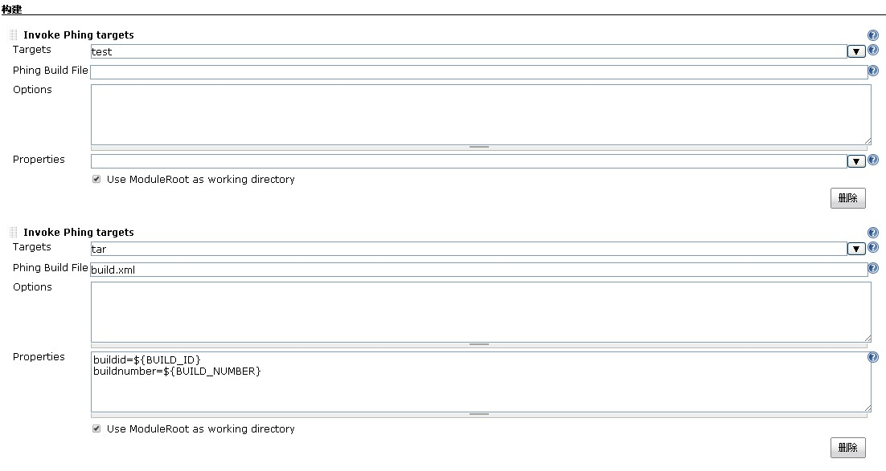

server为Ubuntu  

要实现在jenkins中实现php的自动化测试，首先需要Jenkins服务器上安装php测试框架，php的测试框架很多，在这里我们选择 PHPUnit Framework.  

##### 安装PHPUnit:  

```console
sudo apt-get install phpunit
```

如果出现如下错误:  

```console
PHP Warning: require_once(PHP/CodeCoverage/Filter.php): failed to open stream: No such file or directory in /usr/bin/phpunit on line 39
PHP Fatal error: require_once(): Failed opening required 'PHP/CodeCoverage/Filter.php' (include_path='.:/usr/share/php:/usr/share/pear') in /usr/bin/phpunit on line 39
```

可以通过下面方法安装:  

```console
sudo pear channel-discover pear.phpunit.de
sudo pear channel-discover pear.symfony-project.com
sudo pear channel-discover components.ez.no
sudo pear channel-discover pear.symfony.com
sudo pear update-channels
sudo pear upgrade-all
sudo pear install pear.symfony.com/Yaml
sudo pear install --alldeps phpunit/PHPUnit
sudo pear install --force --alldeps phpunit/PHPUnit
```

安装后执行phpunit --version 返回版本信息。表示安装成功。  

```console
root@dop-kvm-2:# phpunit --version
PHPUnit 3.7.28 by Sebastian Bergmann.
```

##### Jenkins一些插件  

* Subversion/Git    :    用于集成项目版本控制软件，根据需要选择（在上篇博文已安装使用）
* Phing/Ant           :    使用Phing或Apache Ant 对PHP项目做自动化构建
* CheckStyle          :    使用PHP CodeSniffer进行代码风格检查的工具。用于检查PHP代码是否有违反一组预先设置好的编码标准的一个PEAR包，内置了ZEND,PEAR的编码风格规则
* Clover PHP         :     使用phpunit进行单元测试的工具，可以被xdebug扩展用来生成代码覆盖率报告，并且可以与phing集成来自动测试，还可以和Selenium整合来完成大型自动化集成测试
* DRY                    :    使用PHPCPD(php copy paste detector)来发现项目中的重复代码
* HTML Publisher  :    用来发布phpunit代码覆盖率报告
* JDepend             :    使用PHP Depend分析php中静态代码，用来检查项目中的代码规模和复杂程度
* Plot                    :    使用phploc来统计php项目规模大小的工具，可以统计php的项目代码行数
* PMD                  :    使用phpmd(php mess dector),对基于pdepend的结果进行分析，一旦项目超过了pdepend中各具体指标的规定，将发出警告信息.
* Violations         ：    按照代码缺陷严重性集中显示pwd静态代码分析的结果
* xUnit                 :    使用JUnit的格式来输出phpunit的日志文件  

注意这些插件是jenkins为php项目所提供的一些插件,但并不是必须的，所以宅鸟只把最值得大家关注的怎么自动化测试、打包和发布来给大家讲解。  


##### 自动化测试、打包和发布  

先给出项目的目录结构:  

```console
root@dop-kvm-2:/home/jenkins/api# tree
.
├── aa.php
├── build.xml
├── create.php
└── test
    ├── DemoTest.php
    └── FunctionTest.php
1 directory, 5 files
```

注意：  

aa.php、create.php是项目的程序文件  

test目录下的DemoTest.php和FunxtionTest.php是项目的测试文件  

build.xml是jenkins持续集成测试打包部署的调用文件  

首先给出项目需要的build.xml文件:  

```xml
<?xml version="1.0" encoding="UTF-8"?>
<project name="api" default="build">
        <target name="build" depends="make_runtime,phpcs-ci,phploc,pdepend,phpcb,phpunit,phpdox,phpcpd"/>
        <property name="version-m"  value="1.1" />
        <property name="version"    value="1.1.0" />
        <property name="stability"  value="stable" />
        <property name="releasenotes" value="" />
        <property name="tarfile"     value="${phing.project.name}.${buildnumber}.${buildid}.tar.gz" />
        <property name="pkgfile"     value="${phing.project.name}.${version}.tgz" />
        <property name="distfile"    value="dist/${tarfile}" />
        <property name="tests.dir" value="test" />
        <fileset id="api.tar.gz" dir=".">
            <include name="test/**"/>
            <include name="*.php"/>
            <include name="*.xml"/>
        </fileset>
        <target name="make_runtime">
                <mkdir dir="${project.basedir}/Runtime" />
                <mkdir dir="${project.basedir}/build/logs" />
                <mkdir dir="${project.basedir}/build/pdepend" />
                <mkdir dir="${project.basedir}/build/code-browser" />
        </target>
        <target name="phpcs" description="Find coding standard violations using PHP_CodeSniffer">
                <exec executable="phpcs">
                        <arg value="--standard=${project.basedir}/build/phpcs.xml" />
                        <arg value="--ignore=autoload.php" />
                        <arg path="${project.basedir}/" />
                </exec>
        </target>
        <target name="phpcs-ci" description="Find coding standard violations using PHP_CodeSniffer">
                <exec executable="phpcs" output="${project.basedir}/build/build.log">
                        <arg value="--report=checkstyle" />
                        <arg value="--report-file=${project.basedir}/build/logs/checkstyle.xml" />
                        <arg value="--standard=${project.basedir}/build/phpcs.xml" />
                        <arg value="--ignore=" />
                        <arg path="${project.basedir}/" />
                </exec>
        </target>
                                                                                                                                                                                                                                                                                                                                                                                                                                                                                                                                                                                                                                                                                                                                                                                                                                                                                                                                                                                                                                                                                                                                                                                                                                                                                                                                                                                                                                                                                  
        <target name="phploc" description="Measure project size using PHPLOC">
                <exec executable="phploc">
                        <arg value="--log-csv" />
                        <arg value="${project.basedir}/build/logs/phploc.csv"/>
                        <arg path="${project.basedir}/"/>
                </exec>
        </target>
                                                                                                                                                                                                                                                                                                                                                                                                                                                                                                                                                                                                                                                                                                                                                                                                                                                                                                                                                                                                                                                                                                                                                                                                                                                                                                                                                                                                                                                                                  
        <target name="pdepend" description="Calculate software metrics using PHP_Depend">
                <exec executable="pdepend">
                        <arg value="--jdepend-xml=${project.basedir}/build/logs/jdepend.xml"/>
                        <arg value="--jdepend-chart=${project.basedir}/build/pdepend/dependencies.svg"/>
                        <arg value="--overview-pyramid=${project.basedir}/build/pdepend/overview-pyramid.svg"/>
                        <arg path="${project.basedir}/"/>
                </exec>
        </target>
                                                                                                                                                                                                                                                                                                                                                                                                                                                                                                                                                                                                                                                                                                                                                                                                                                                                                                                                                                                                                                                                                                                                                                                                                                                                                                                                                                                                                                                                                  
        <target name="phpmd" description="Perform project mess detection using PHPMD">
                <exec executable="phpmd">
                        <arg path="${project.basedir}/"/>
                        <arg value="text"/>
                        <arg value="${project.basedir}/build/phpmd.xml"/>
                </exec>
        </target>
                                                                                                                                                                                                                                                                                                                                                                                                                                                                                                                                                                                                                                                                                                                                                                                                                                                                                                                                                                                                                                                                                                                                                                                                                                                                                                                                                                                                                                                                                  
        <target name="phpmd-ci" description="Perform project mess detection using PHPMD">
                <exec executable="phpmd">
                        <arg path="${project.basedir}/"/>
                        <arg value="xml"/>
                        <arg value="${project.basedir}/build/phpmd.xml"/>
                        <arg value="--reportfile"/>
                        <arg value="${project.basedir}/build/logs/pmd.xml"/>
                </exec>
        </target>
                                                                                                                                                                                                                                                                                                                                                                                                                                                                                                                                                                                                                                                                                                                                                                                                                                                                                                                                                                                                                                                                                                                                                                                                                                                                                                                                                                                                                                                                                  
        <target name="phpcpd" description="Find duplicate code using PHPCPD">
                <exec executable="phpcpd">
                        <arg value="--log-pmd"/>
                        <arg value="${project.basedir}/build/logs/pmd-cpd.xml"/>
                        <arg path="${project.basedir}/"/>
                </exec>
        </target>
        <target name="phpdox" description="Generate API documentation using phpDox">
                <exec executable="phpdox"/>
        </target>
        <target name="phpunit" description="Run unit tests with PHPUnit">
                <exec executable="phpunit" />
        </target>
        <target name="test" description="Run PHPUnit tests">
            <phpunit haltonerror="true" haltonfailure="true" printsummary="true">
            <batchtest>
            <fileset dir="${tests.dir}">
                <include name="**/*Test.php" />
            </fileset>
            </batchtest>
            </phpunit>
        </target>
        <target name="phpcb" description="Aggregate tool output with PHP_CodeBrowser">
                <exec executable="phpcb">
                        <arg value="--log"/>
                        <arg path="${project.basedir}/build/logs"/>
                        <arg value="--source"/>
                        <arg path="${project.basedir}/"/>
                        <arg value="--output"/>
                        <arg path="${project.basedir}/build/code-browser"/>
                </exec>
        </target>
        <target name="check" description="Check variables" >
            <fail unless="version" message="Version not defined!" />
            <fail unless="buildnumber" message="buildnumber not defined!" />
            <fail unless="buildid" message="buildid not defined!" />
            <delete dir="dist" failonerror="false" />
            <mkdir dir="dist" />
        </target>
                                                                                                                                                                                                                                                                                                                                                                                                                                                                                                                                                                                                                                                                                                                                                                                                                                                                                                                                                                                                                                                                                                                                                                                                                                                                                                                                                                                                                                                                                  
        <target name="tar" depends="check" description="Create tar file for release">
            <echo msg="Creating distribution tar for ${phing.project.name} ${version}"/>
            <delete file="${distfile}" failonerror="false"/>
            <tar destfile="${distfile}" compression="gzip">
                <fileset refid="api.tar.gz"/>
            </tar>
        </target>
</project>
```

阅读build.xml后，大家可以了解一下内容:  

项目名称、版本、打后的包名称：  

```console
 <project name="api" default="build">
        <target name="build" depends="make_runtime,phpcs-ci,phploc,pdepend,phpcb,phpunit,phpdox,phpcpd"/>
        <property name="version-m"  value="1.1" />
        <property name="version"    value="1.1.0" />
        <property name="stability"  value="stable" />
        <property name="releasenotes" value="" />
        <property name="tarfile"     value="${phing.project.name}.${buildnumber}.${buildid}.tar.gz" />
        <property name="pkgfile"     value="${phing.project.name}.${version}.tgz" />
        <property name="distfile"    value="dist/${tarfile}" />
        <property name="tests.dir" value="test" />

```

打包时包括的文件和文件夹:这里还可以使用`exclude`排除文件和文件夹：  

```xml
<fileset id="api.tar.gz" dir=".">
           <include name="test/**"/>
           <include name="*.php"/>
           <include name="*.xml"/>
       </fileset>
```

测试文件所在地址：  

```xml
<target name="phpunit" description="Run unit tests with PHPUnit">
                <exec executable="phpunit" />
        </target>
        <target name="test" description="Run PHPUnit tests">
            <phpunit haltonerror="true" haltonfailure="true" printsummary="true">
            <batchtest>
            <fileset dir="${tests.dir}">
                <include name="**/*Test.php" />
            </fileset>
            </batchtest>
            </phpunit>
        </target>
```

了解这些后，我们开始在jenkins中新建autoTestTarAndPublish项目，选择:构建一个自由风格的软件项目：  

并且指定好代码库:如图所示  
  

然后再 增加构建步骤->Invoke Phing targets:  

增加两个 target: test,tar 分别与build.xml中的test,tar名称相对应  

  

给tar加上参数:  
  


然后在左边主菜单: 系统管理->系统设置->Publish over SSH 下添加主机:（这里宅鸟设置使用ssh免密码登陆）需要设置成从jenkins到要发布的web服务器的无密码登陆  
如图设置:  
  

这里添加设置的主机名是:134  

接下来我们就可以设置部署工作了:  

在添加构建步骤下来表中选择：`Send files or execute commands over SSh`,如果该选项未出现需要在插件管理中安装插件：[Publish Over SSH](http://wiki.jenkins-ci.org/display/JENKINS/Publish+Over+SSH+Plugin) 然后重启jenkins即可.  
  

然后在出现的SSH Publishers中选择要发布的主机：  

并填写打包文件地址，发布到远程server地址信息，并在Exec command文本框中填写解压等shell脚本:  

详情见图:  
  

此项设置完毕后，就可以发布php项目到134服务器上了:  

最后文件发布包的存档工作：  

增加构建后操作步骤：  
  

填写`dist/*.tar.gz`  
  

至此配置完毕后，点击 保存 按钮.我们就可以发布程序到指定服务器134上了.  

来看一下发布结果:  

回到项目左侧点击：立即构建:可以看到构建进度条，结束后可以在控制台看到输出结果:  
  

我们来到134上看：  
  

至此发布完毕.  

此时我们查看一下test/DemoTest.php文件内容：  

```php
<?php
class DemoTest extends PHPUnit_Framework_TestCase {
  public function testPass() {
      $this->assertTrue(true);
    }
  public function testFail() {
      $this->assertFalse(false);
    }
}
?>
```

我们把 testFail()改成下面：  

```php
<?php
class DemoTest extends PHPUnit_Framework_TestCase {
  public function testPass() {
      $this->assertTrue(true);
    }
  public function testFail() {
     $this->assertTrue(false);
    }
}
?>
```

`$this->assertTrue(false);`  

这个是错误的断定:  

提交文件后再次构建:  

我们可以看到本次构建失败，查看输出结果如下：  
  

当把测试用例修改回正确后，执行构建，发布正确。  

```php
<?php
class DemoTest extends PHPUnit_Framework_TestCase {
  public function testPass() {
      $this->assertTrue(true);
    }
  public function testFail() {
      $this->assertFalse(false);
    }
}
?>
```

  

ok，到此介绍结束.  

总结一下：  

jenkins根据项目根目录下的build.xml文件，并根据jenkins中targets的配置，首先自动执行test，当测试通过后，开始执行tar，打包完成后，开始链接远程webserver把程序包上传到远程webserver指定目录下，然后再根据jenkins下的command 执行解压操作,然后就可以根据自己的业务通过shell脚本进行自动处理自动发布的各项操作.  

如果在执行test过程中，出现发现测试用例不通过，则就发出错误报告，终止本次构建。  
