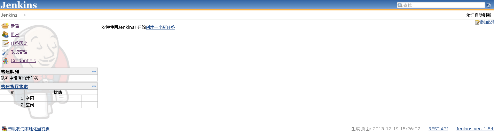

##### Jenkins 简介  

Jenkins是一个开源项目，提供了一种易于使用的持续集成系统，使开发者从繁杂的集成中解脱出来，专注于更重要的业务逻辑实现上。同时Jenkins能  

实施监控集成中存在的错误,提供详细的日志文件和提醒功能，还能用图表的形式形象的展示项目构建的趋势和稳定性。下面将介绍Jenkins的基本功能。  

##### Jenkins的安装非常简单  
 
服务器环境: Ubuntu 12.04.1 LTS  
安装jenkins  
 
```console
wget -q -O - http://pkg.jenkins-ci.org/debian/jenkins-ci.org.key | sudo apt-key add -
sudo sh -c 'echo deb http://pkg.jenkins-ci.org/debian binary/ > /etc/apt/sources.list.d/jenkins.list'
sudo apt-get update
sudo apt-get install jenkins
```

启动停止jenkins  

```console
sudo /etc/init.d/jenkins start
sudo /etc/init.d/jenkins stop

#Jenkins home: /var/lib/jenkins
#log路径:    /var/log/jenkins/jenkins.log
```

  

可以看到Jenkins默认使用的是:8080端口  

启动Jenkins后，我们看到一个后台进程在命令行模式下运行。此时在浏览器地址栏中打开 http://serverip:8080 就可以看到Jenkins的页面了  

Jenkins的可贵之处在于具有非常搞的可用性，从它的界面中能轻松地完成各种配置，更多的配置和使用信息，可以在Jenkins的官方网站上查询。  

Jenkins的主界面是:  
  

Jenkins提供了非常丰富的插件支持，使得Jenkins变得越来越强大。我们可以方便的安装各种第三方插件，从而方便快捷的集成第三方的应用。  

比如Jenkins提供了对于IBM Rational ClearCase的插件支持。  
  

此外，Jenkins还提供了强大的的管理和配置功能，包括系统配置、管理插件、查看系统信息、系统日志、节点管理、Jenkins命令行窗口、信息统计等功能。  

试试看，你就会发现Jenkins非常好用上手。  
  

##### 基于Jenkins快速搭建持续集成环境

正如前面所述,一个持续集成环境需要包括三个方面的要素：代码库、构建过程和持续集成服务器。对于Jenkins有初步了解后，我们通过一个实例来集中  

展示如何快速搭建一个简单的基于Jenkins的持续集成环境。  

我们使用Git作为版本控制库,Jenkins默认情况下是没有安装Git的.我们需要到插件管理界面中选中Git，然后点击安装重新启动来激活这个插件。安装成功后，可以在已安装选项卡上看到以下信息。  
  

接下来，我们开始新建一个Jenkins项目，我们选择 **"构建一个自由风格的软件项目"**  
  

然后我们可以很方便的配置个JenkinsTest项目了。Jenkins很任性的一点是在每个配置的右侧都有一个帮助的图标，点击图标Jenkins会告诉你如何配置这个选项。  

我的Git代码库地址是:`/home/jenkins/api.git`  
  

根据开发需要，设置分钟我们需要构建一次。选择 Build periodically,在日程表中填写 `* * * * *`  

* 第一个参数代表的是分钟 minute，取值 0~59；
* 第二个参数代表的是小时 hour，取值 0~23；
* 第三个参数代表的是天 day，取值 1~31；
* 第四个参数代表的是月 month，取值 1~12；
* 最后一个参数代表的是星期 week，取值 0~7，0 和 7 都是表示星期天。  

所以 `*  * * * *` 表示的就是每分钟执行一次构建。  

在"增加构建步骤"选择 `Execute Shell`  
  

选择和配置其他的选项，比如邮件提醒，然后点击 save 保存。  
  

接下来每分钟,jenkinsTest就会构建一次。我们可以在Jenkins中观察构建进度和最终的状态 成功或失败。太阳表示之前的构建没有任何失败，蓝色的小球表示构建成功。  
  

同时我们可以点击JenkinsTest查看单词构建的Console的输出结果。从中我们可以看到构建的第一步是从git服务器上checkout代码然后调用我们配置的命令  
  
  

我们可以看没分钟构建的列表。我们模拟一次构建失败的情况，我们把git版本库地址`/home/jenkins/api.git`的第一个"/"去掉后为：`home/jenkins/api.git`  
再看构建过程会发生什么...  
  

JenkinsTest构建发生了错误.查看详细信息如下:提示找不到版本库  
  

查看一下邮件：  
  

然后我们就可以在 Jenkins 中观察构建的状态了。一旦构建失败我们能看到相应的警示图标，同时，如果配置了邮件提醒，相关人员也会受到邮件。记住我们先前所提醒的那样，  

分析和处理构建的失败是优先级最高的工作。接下来，我们还可以加入更多的 Jenkins 项目来实现自动化测试等功能，让持续集成更方便有效地服务于项目开发。  
