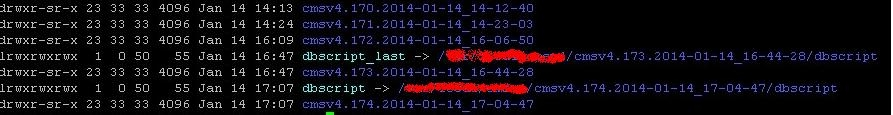

由于生产环境下网络拓扑比较复杂，下面宅鸟给出一个简化版的网路拓扑图.  
  

如果所示,我们目前有的资源是分别是:  

公司内网：  

* svn server 代码版本库
* jenkins 持续集成服务器  

公司公网服务器资源:  

* webserver1 公网测试服务器
* webserver2,webserver3公网正式服务器
* db1,db2公网正式db  

拿到这些资源我们该怎么规划部署我们的webapp到这些服务器呢?  

我们以phpweb为例,假设所有webserver都已经安装好lnmp环境，dbserver已经安装好mysql环境  

需要注意一点,`boss要求所有公网生产服务器必须通过跳板机登录,并且所有部署到生产服务器的代码都需要在svn源码库和线上服务器上都有历史记录,一旦程序发布后，有问题，可以方便回滚到之前稳定版本。`  

在这种情况下，我们该如何规划部署我们的程序呢?  

下面宅鸟给出自己的解决方案:(本例以cms系统为例)  

1. `在Jenkins系统中创建一个deploy_cmsv4_to_dev的job,在该jobs配置中添加svn源代码地址，通过自动化单元集成测试后，打包，然后通过Jenkins发布到测试服务器webserver1上，然后再进行人工测试，确定无误后，再在jenkins上给本次构建打tag,并在tag上注明版本日期等。`
2. `在Jenkins系统中再创建一个deploy_cmsv4_to_production的项目，该job发布时，引用刚已在deploy_cmsv4_to_dev的job中已经打好的tag，然后通过Jenkins把程序打包通过ssh上传到指定目录，然后通过跳板机把程序包发布到正式公网服务器(跳板机上需要安装自动化部署工具ansible，进行实现批量部署功能)。`  

关于ansible的安装在此不做详解。有感兴趣的同学可[点击这里](http://blog.chinaunix.net/uid-21458680-id-3599736.html),但需要注意的是需要配置好跳板机到公网上服务器上ssh免密码登录，以及在ansible的配置中添加公网webServerIp地址列表.  


`这里只做技术交流与分享，本篇涉及到公司公网ip地址以及涉及商业机密的地方均使用画图工具遮盖，给各位同学带来不阅读不便，深表歉意!`  


##### 下面开始宅鸟的部署之旅:  

第一步开始创建一个自由风格的到测试服务器上的job:deploy-cmsv4-to-dev ，进入配置界面 如图:  
  

在源码管理下选择Subversion:  

添加上项目svn地址如图:  
  

然后在增加构建步骤中选择Invoke Phing targets:  

添加自动测试和打包的target，target名称对应项目根目录下的build.xml文件  
  

然后在 增加构建步骤 中选择 Send files or execute commands over SSh:  
  

最后 在 增加构建后操作步骤 中 选择:Archive the artifacts  存档打包文件:  
  

配置完毕后，我们就可以构建本job.  

点击左上侧“立即构建”:  

我们就可以看到一个job开始执行，完毕后查看查看控制台输出结果如图所示：  
  

然后登录测试服务器webserver1上到发布的目录下查看是结果如图：  

注意:last本次发布上一个版本  
  

下面来看一下程序发布的历史版本列表:  
  

到此，公网测试服务器web程序发布完毕，然后就进入人工测试，测试通过后，就可以在jenkins服务器上给本次构建打tag然后就可以发到公网服务器了。  

在jenkins上给job打tag此处略去,给大家看一下宅鸟之前在发布程序时所打过的tag，如下图所示，右边显示  
标记的表示已打tag。  
  


##### 下面我们开始介绍公网服务器程序的发布过程:  

第一步、建一个自由风格的job名字为deploy-cmsv4-to-production  

在job配置中选中"构建化参数过程"复选框  
  

选择 List Subversion tags(and more),然后填写svn地址等如下信息  
  

然后再添加一个choice ，添加我们需要部署的服务器组，该地方的组名称需要在 跳板机的ansible配置文件中指定,并且给部署组指定一组webserver ip列表  
  
  

注:Choices可以添加多个服务器组(在ansible中指定,这里我们在cms_app_servers名称下指定了三台linux服务器做为webserver).  

在源代码管理中填写如下配置:  
  

下面再增加打包targets:  
  

再添加发布步骤: 选择 "send file or execute commands over SSH"  
  
  

最后存档:  
  
  

到此，生产服务器部署配置已经完成，下面就可以发布了。

选择Jenkins左上方的 "Build with Parameters"  

如图显示，上面的下拉菜单是 我们已经打好的tag列表,下面是部署服务器群组列表:  
  

然后点击"开始构建" jenkins就会按照我们事配置好的项，开始发布web程序了。  

在控制台输出信息中最后一行出现“Finished: SUCCESS”，表示发布已经成功。这样我们可以登录到生产服务器上查看我们已发布的程序。  

数据库升迁版本列表: 关于mysql迁移 不熟悉的同学可参看 宅鸟的另一篇博文:[Mysql迁移工具在生产环境下的使用](http://birdinroom.blog.51cto.com/7740375/1342147)  
  
  


我们通过跳板机到服务器下去:  

先登录到cms-app-1，然后到网站目录下查看通过ls -l |grep cmsv4命令查看结果如图:  
  

登录到cms-app-2,结果同cms-app-1如图:  
  

我们再检查一下nginx的配置:  
  

再登录到cms-app-3 结果亦然,至此我们的程序已经发布完毕。  

`仔细阅读的同学可能已经注意到在deploy-cmsv4-to-dev&deploy-cmsv4-to-production -> configure "Send files or execute commands over SSH"的"Exec command" 文本列表最后一条shell命令:`  

`cmsv4.${BUILD_NUMBER}.${BUILD_ID}/config/install.sh  ${BUILD_NUMBER} ${BUILD_ID}`  

`这个config文件夹下的install.sh脚本，是宅鸟根据自己公司的业务要求逻辑自己编写的，有兴趣的同学可以自己试着根据自己公司的业务需求自己编写以实现需求。`  

在此宅鸟给出一个install的简单实例(假设我们的项目名为myweb):  

```bash
#!/bin/bash
#created by lihuibin
#date 2014-01-15
#deploy web app to production install script
build_number=$1
build_id=$2
db_version="max_version"
myweb_path=/webdir/myweb/myweb.$build_number.$build_id
#项目配置文件
config_path=$myweb_path/config.php
ln -s $myweb_path/config/config.php  $config_path
#crontab
ln -s   $myweb_path/config/crontab.txt  /etc/cron.d/myweb
#初始化数据库，如果数据库不存在则自动创建
/usr/bin/php $myweb_path/mysqlMigrations/migrate.php init
if [ $? -ne 0 ];then
  echo "db version table init:"$?
  exit 1
fi
#列出线上数据库版本
/usr/bin/php $myweb_path/mysqlMigrations/migrate.php list
if [ $? -ne 0 ];then
  echo "db version list:"$?
  exit 1
fi
#更新数据库到最大版本
/usr/bin/php $myweb_path/mysqlMigrations/migrate.php  up $db_version
if [ $? -ne 0 ];then
  echo "db update:"$?
  exit 1
fi
#查看迁升后数据库版本列表，及当前数据库版本
/usr/bin/php $myweb_path/mysqlMigrations/migrate.php list
#web切换，给老版本改名，并且新版本程序接手老版本程序开始工作
web_path="/htdocs/myweb"
uploads='/webdir/myweb/uploaded'
if [ -L $web_path ];then
  ln -sfn $(readlink -f "/htdocs/myweb") "/htdocs/myweb_last"
  ln -sfn  $myweb_path $web_path
  echo "$myweb_path   $web_path  ln -s  :"$?
else
  if [ -d $web_path ];then
      mv -f $web_path"/uploaded" $uploads
      mv -f $web_path "/webdir/myweb/myweb_lagacy"
      ln -sfn  $myweb_path $web_path
      ln -sfn "/webdir/myweb/myweb_lagacy" "/htdocs/myweb_last"
  else
    ln -s  $myweb_path $web_path
    if [ ! -d "$uploads" ]; then
        mkdir -p $uploads
        chown -R www-data:www-data  $uploads
    fi
  fi
fi
ln -s  $uploads $myweb_path/uploaded
#赋权限
chown -R www-data:www-data  $myweb_path
#重新加载php5-fpm
/etc/init.d/php5-fpm reload
#nginx应用新配置
nginx=/etc/nginx/sites-enabled/myweb.conf
if [ -f $nginx ];then
 rm $nginx
fi
ln -s $myweb_path/config/myweb.conf $nginx
#nginx加载新配置
/etc/init.d/nginx reload
#删除临时文件
rm -rf /tmp/myweb.*
echo "/tmp/myweb.* rm -rf:"$?
```

