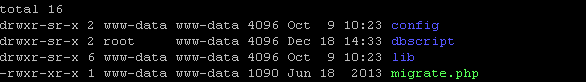
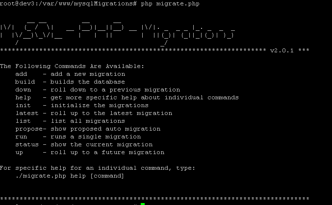

在产品迭×××发发布过程中，由于业务需求的增加，数据库难免会有结构调整等操作.  

在每个版本发布过程中怎么控制每个版本server端程序与数据库版本保持一致,以及数据库升级、回滚等操作.  

本博文宅鸟将向大家推荐一款mysql数据库迁移工具[mysql-php-migrations](https://github.com/davesloan/mysql-php-migrations)  

由于具体需求不同，宅鸟根据自己公司的情况将mysql-php-migrations做了一些修改来满应用!  

宅鸟修改改程序后的mysql迁移程序有以下目录:  
  

```console
config         配置文件

dbscript sql   脚本目录

lib            迁移程序类库

migrate.php    迁移命令执行入口
```

执行`php migrate.php`  
可以看到如下结果  
  

我们可以看到migrate.php有很多命令  

```console
php migrate.php add  test

结果:

  __ __         __      __

|\/|  (_ /  \|   __ |__)|__||__) __ |\/|. _  _ _ |_. _  _  _

|  |\/__)\_\/|__    |   |  ||       |  ||(_)| (_||_|(_)| )_)

   /                                    _/

******************************************************************** v2.0.1 ***

New migration created: file
/var/www/mysqlMigrations/dbscript/2013_12_18_14_50_45_test.php

*******************************************************************************

cd dbscript

total 16
-rw-r--r-- 1 www-data www-data 4837 Sep 29 09:21 2013_06_18_17_14_16_v1.php

-rw-r--r-- 1 www-data www-data  802 Sep 29 13:29 2013_09_29_12_00_12_v1.php

-rw-r--r-- 1 root     www-data  240 Dec 18 14:50 2013_12_18_14_50_45_test.php
```

此时dbscript目录已经新添加一个2013_12_18_14_50_45_test.php文件,改文件格式如下:  

```php
<?php
class Migration_2013_12_18_14_50_45 extends MpmMysqliMigration
{
        public function up(ExceptionalMysqli &$mysqli)
        {
                $mysqli->exec("DO 0");
        }
        public function down(ExceptionalMysqli &$mysqli)
        {
                $mysqli->exec("DO 0");
        }
}
?>
```

把需要修改的数据库脚本写在up函数中:  

把对应修改修改所做的回滚操作卸载down函数中  

`注意：在生产环境下建议只做数据库的向上变迁,不做down操作，避免用户有用数据丢失.`  

执行`php migrate.php list` 返回结果:  

```console
WARNING: Migration numbers may not be in order due to interleaving.
     #         Timestamp
   ========================================================================
     version           createtime              active  current note

     1371546856        2013-06-18 17:14:16     1       0       v1

     1380427212        2013-09-29 12:00:12     1       1       v1

     1387349445        2013-12-18 14:50:45     0       0       test

   Page 1 of 1, 3 migrations in all.


cd config 目录
cat db_config.php
```

```php
<?php
$db_config = (object) array();
$db_config->host = '127.0.0.1';
$db_config->port = '3306';
$db_config->user = 'dbuser';
$db_config->pass = 'dbpasswd';
$db_config->name = 'dbname';
$db_config->db_path = 'var/www/mysqlMigrations/dbscript/';
$db_config->method = 2;   //1 pdo,2 mysqli
?>
```

了解该程序基本结构后，我们来开始使用一下它:  

```console
cd mysqlMigrations
php migrate.php add test2  
```

在dbscript下生成 2013_12_18_15_06_14_test2.php  

执行命令:`php migrate.php list`  

可以看到版本结果:  

```console
#         Timestamp
   ========================================================================
     version           createtime              active  current note
     1371546856        2013-06-18 17:14:16     1       0       v1
     1380427212        2013-09-29 12:00:12     1       1       v1
     1387349445        2013-12-18 14:50:45     0       0       test
     1387350374        2013-12-18 15:06:14     0       0       test2

   Page 1 of 1, 4 migrations in all.

说明:
   version 每次迁移的版本号
   createtime 创建时间
   active  是否已经激活生效
   current 数据库当前所在版本标志
   note  迁移的注释
```

执行命令:`php migrate.php up 1387349445 `  可以把数据版本从 1380427212 迁移到 1387349445  

```console
#         Timestamp
   ========================================================================
     version           createtime              active  current note
     1371546856        2013-06-18 17:14:16     1       0       v1
     1380427212        2013-09-29 12:00:12     1       0       v1
     1387349445        2013-12-18 14:50:45     1       1       test
     1387350374        2013-12-18 15:06:14     0       0       test2

   Page 1 of 1, 4 migrations in all.
```

执行命令:`php migrate.php down 1380427212`        可以把数据版本从 1387349445 回滚到 1380427212  

执行`php migrate.php list`查看数据库版本回滚结果  

```console
 #         Timestamp
   ========================================================================
     version           createtime              active  current note
     1371546856        2013-06-18 17:14:16     1       0       v1
     1380427212        2013-09-29 12:00:12     1       1       v1
     1387349445        2013-12-18 14:50:45     0       0       test
     1387350374        2013-12-18 15:06:14     0       0       test2

   Page 1 of 1, 4 migrations in all.
```

如果要迁移到数据库最大版本可以执行一下命令:`php migrate.php up max_version`  

返回结果:  

```console
Migrating to 2013-12-18 15:06:14 (ID 1387350374)...
       Performing UP migration 2013-12-18 14:50:45 (ID 1387349445)... done.
       Performing UP migration 2013-12-18 15:06:14 (ID 1387350374)... done.
*******************************************************************************
```

查看`php migrate.php list`  

```console
#         Timestamp
   ========================================================================
     version           createtime              active  current note
     1371546856        2013-06-18 17:14:16     1       0       v1
     1380427212        2013-09-29 12:00:12     1       0       v1
     1387349445        2013-12-18 14:50:45     1       0       test
     1387350374        2013-12-18 15:06:14     1       1       test2

   Page 1 of 1, 4 migrations in all.
```

执行回滚:`php migrate.php down 1380427212      `  

返回一下结果:  

```console
Migrating to 2013-09-29 12:00:12 (ID 1380427212)...
       Performing DOWN migration 2013-12-18 15:06:14 (ID 1387350374)... done.
       Performing DOWN migration 2013-12-18 14:50:45 (ID 1387349445)... done.
  #         Timestamp
   ========================================================================
     version           createtime              active  current note
     1371546856        2013-06-18 17:14:16     1       0       v1
     1380427212        2013-09-29 12:00:12     1       1       v1
     1387349445        2013-12-18 14:50:45     0       0       test
     1387350374        2013-12-18 15:06:14     0       0       test2

   Page 1 of 1, 4 migrations in all.
```

通过执行一下操作，查看数据库中数据变化