# 1.怎么利用别人提供的规法代码和配置文件生成注释文档  

很多官方的协议栈和库都是按照doxygen的注释规范编写的，当我们拿到整个项目的时候，通常会有documentation目录或者doc目录，打开此目录通常会有doxygen目录和一个Doxyfile文件或者Doxyfile.cfg文件，这个就是doxygen的配置文件；安装好doxygen后，点击file->open,选择找到的配置文件。  
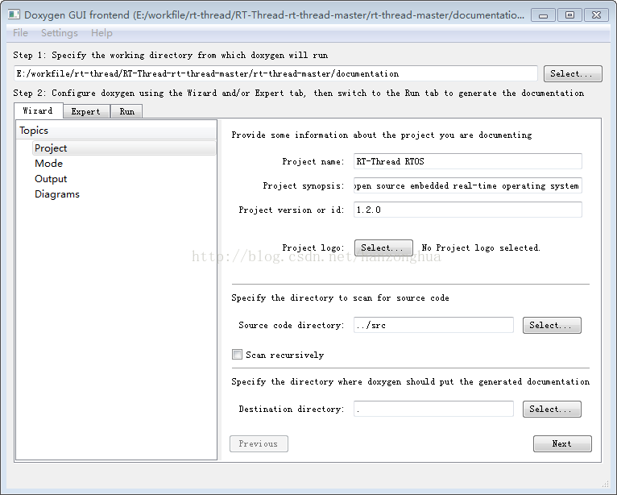  

上图是RT-Thread的库项目工程  

通常配置文件会把所以相应的配置项配置好，可以直接运行生成注释文档。我们可以看到destination directory 选项框中是一个“.”表示的文件的输出目录是doxygen的工程目录，即step1指示的目录。为了文件的整洁和不破坏原来的文件组织结构，我们可以在doxygen的工程目录下建一个文件夹用来保存输出文件，例如建立一个doc文件夹，最后就是点击左侧的run表项中的run doxygen按钮就可以生成文档了。  

# 2.doxygen的注释编写规范  

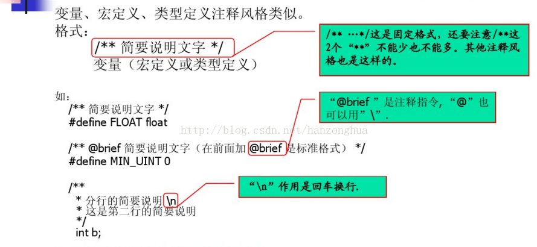  
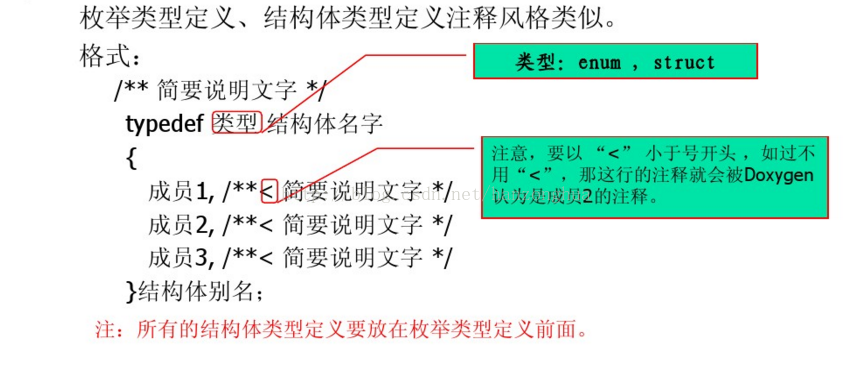  
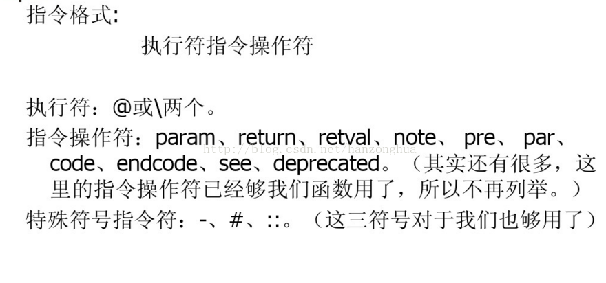  
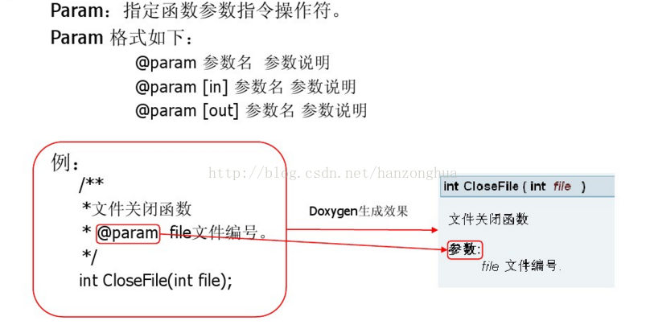  
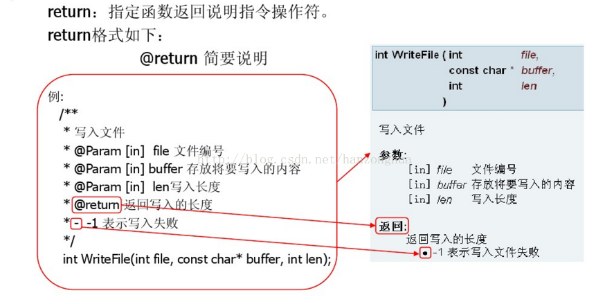  
  
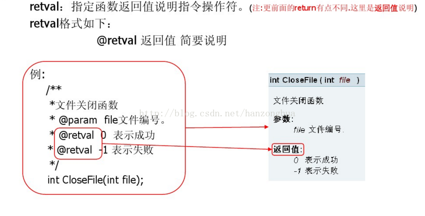  
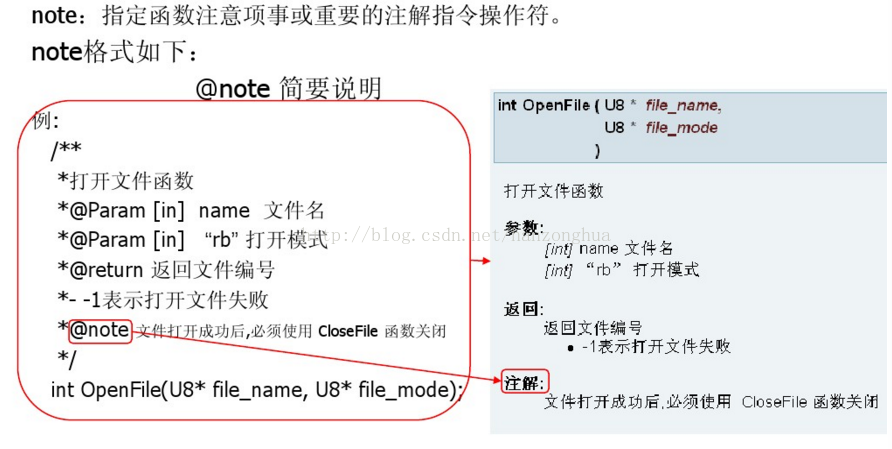  
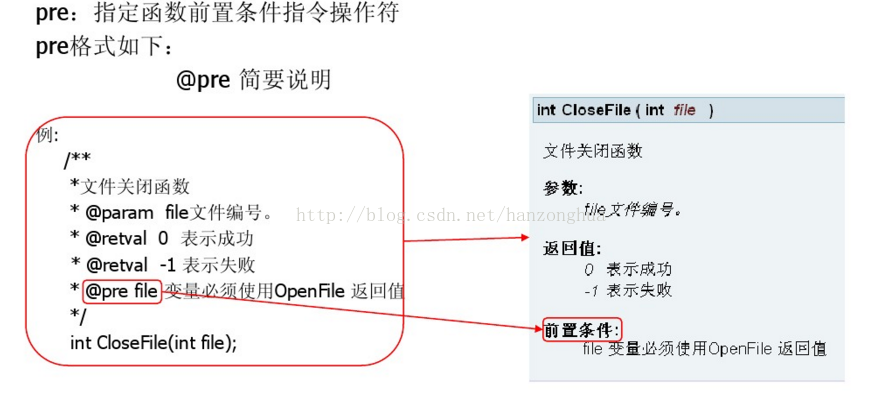  
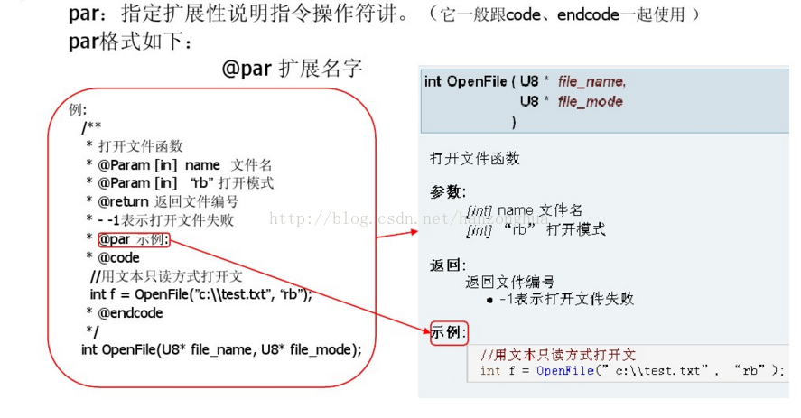  
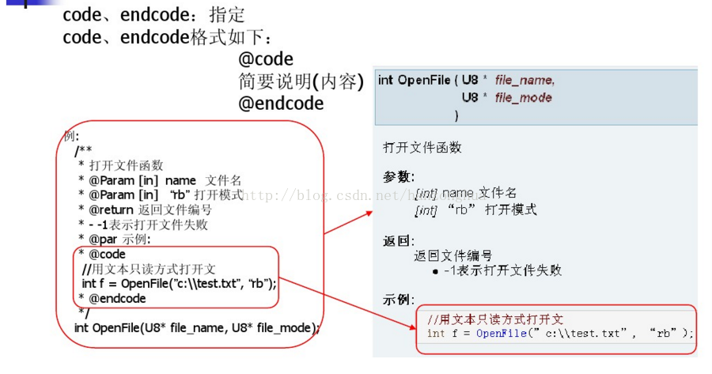  
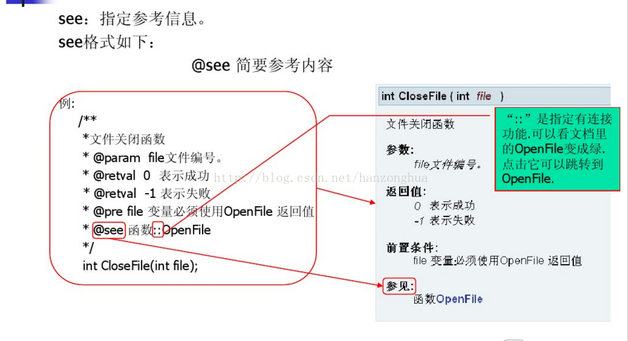  
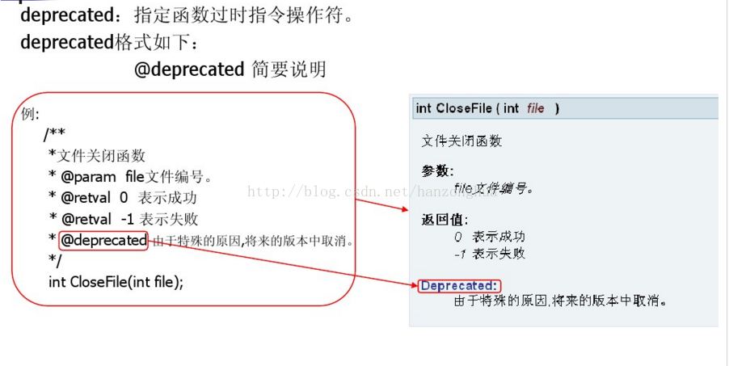  
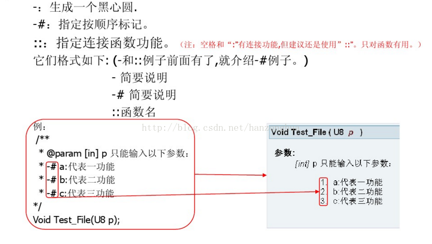  
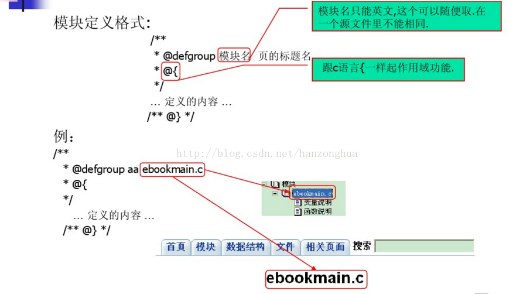  
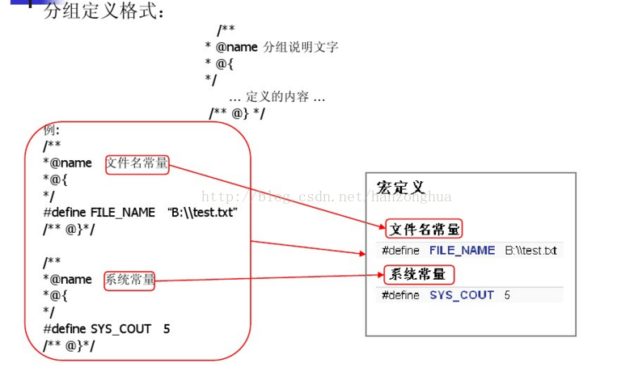