# H.264概述  

## 参考  
[【H.264/AVC视频编解码技术详解】一. 视频信息与压缩编码](https://blog.csdn.net/shaqoneal/article/details/52080975)  
[【H.264/AVC视频编解码技术详解】二. 主流视频编码标准的发展](https://blog.csdn.net/shaqoneal/article/details/52081001)  
[【H.264/AVC视频编解码技术详解】三. H.264简介](https://blog.csdn.net/shaqoneal/article/details/52081021)  
[【H.264/AVC视频编解码技术详解】四. 常见H.264视频编解码器（X264和JM）及参考软件JM的下载与编解码](https://blog.csdn.net/shaqoneal/article/details/52081030)  


## 一、视频编码标准化组织  

从事视频编码算法的标准化组织主要有两个，ITU-T和ISO。  

* ITU-T，全称International Telecommunications Union - Telecommunication Standardization Sector，即国际电信联盟——电信标准分局。该组织下设的VECG(Video Coding Experts Group)主要负责面向实时通信领域的标准制定，主要制定了H.261/H263/H263+/H263++等标准。
* ISO，全称International Standards Organization，即国际标准化组织。该组织下属的MPEG(Motion Picture Experts Group)，即移动图像专家组主要负责面向视频存储、广播电视、网络传输的视频标准，主要制定了MPEG-1/MPEG-4等。

实际上，真正在业界产生较强影响力的标准均是由两个组织合作产生的。比如MPEG-2、H.264/AVC和H.265/HEVC等。不同标准组织制定的视频编码标准的发展如下图所示：  
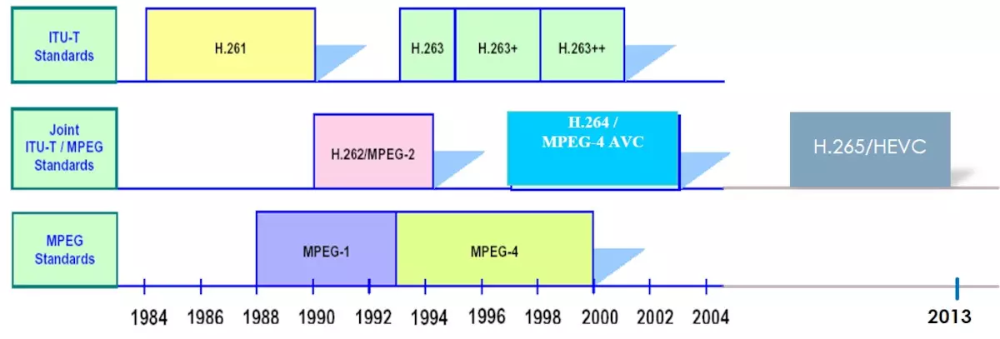  

**严格地讲，H.264标准是属于MPEG-4家族的一部分，即MPEG-4系列文档ISO-14496的第10部分，因此又称作MPEG-4/AVC。**同MPEG-4重点考虑的灵活性和交互性不同，H.264着重强调更高的编码压缩率和传输可靠性，在数字电视广播、实时视频通信、网络流媒体等领域具有广泛的应用。  

除了上述两个组织之外，其他比较有影响力的标准还有：  

* Google：VP8/VP9;
* Microsoft : VC-1;
* 国产自主标准：AVS/AVS+/AVS2  
  
  
## 二、视频压缩编码的基本技术  

视频信息之所以存在大量可以被压缩的空间，是因为其中本身就存在大量的数据冗余。其主要类型有：  

* 时间冗余：视频相邻的两帧之间内容相似，存在运动关系
* 空间冗余：视频的某一帧内部的相邻像素存在相似性
* 编码冗余：视频中不同数据出现的概率不同
* 视觉冗余：观众的视觉系统对视频中不同的部分敏感度不同  

针对这些不同类型的冗余信息，在各种视频编码的标准算法中都有不同的技术专门应对，以通过不同的角度提高压缩的比率。  

### 1. 预测编码  

预测编码可以用于处理视频中的时间和空间域的冗余。视频处理中的预测编码主要分为两大类：帧内预测和帧间预测。  

* 帧内预测：预测值与实际值位于同一帧内，用于消除图像的空间冗余；帧内预测的特点是压缩率相对较低，然而可以独立解码，不依赖其他帧的数据；通常视频中的关键帧都采用帧内预测。
* 帧间预测：帧间预测的实际值位于当前帧，预测值位于参考帧，用于消除图像的时间冗余；帧间预测的压缩率高于帧内预测，然而不能独立解码，必须在获取参考帧数据之后才能重建当前帧。  

通常在视频码流中，I帧全部使用帧内编码，P帧/B帧中的数据可能使用帧内或者帧间编码。  

### 2. 变换编码  

所谓变换编码是指，**将给定的图象变换到另一个数据域如频域上，使得大量的信息能用较少的数据来表示，从而达到压缩的目的。**  

目前主流的视频编码算法均属于有损编码，通过对视频造成有限而可以容忍的损失，获取相对更高的编码效率。而造成信息损失的部分即在于变换量化这一部分。在进行量化之前，首先需要将图像信息从空间域通过变换编码变换至频域，并计算其变换系数供后续的编码。  

在视频编码算法中通常使用正交变换进行变换编码，常用的正交变换方法有：**离散余弦变换(DCT)、离散正弦变换(DST)、K-L变换**等。  

### 3. 熵编码  

视频编码中的熵编码方法主要用于消除视频信息中的统计冗余。由于信源中每一个符号出现的概率并不一致，这就导致使用同样长度的码字表示所有的符号会造成浪费。通过熵编码，针对不同的语法元素分配不同长度的码元，可以有效消除视频信息中由于符号概率导致的冗余。  

在视频编码算法中常用的熵编码方法有变长编码和算术编码等，具体来说主要有：  

* UVLC(Universal Variable Length Coding)：主要采用指数哥伦布编码
* CAVLC(Context Adaptive Variable Length Coding)：上下文自适应的变长编码
* CABAC(Context Adaptive Binary Arithmetic Coding)：上下文自适应的二进制算数编码  

根据不同的语法元素类型指定不同的编码方式。通过这两种熵编码方式达到一种编码效率与运算复杂度之间的平衡。  


## 三、VCL NAL  

视频编码中采用的如预测编码、变化量化、熵编码等编码工具主要工作在slice层或以下，这一层通常被称为“视频编码层”(Video Coding Layer, VCL)。  

相对的，在slice以上所进行的数据和算法通常称之为“网络抽象层”(Network Abstraction Layer, NAL)。设计定义NAL层的主要意义在于提升H.264格式的视频对网络传输和数据存储的亲和性。  

## 四、档次与级别  

为了适应不同的应用场景，H.264也定义了三种不同的档次：  

* 基准档次(Baseline Profile)：主要用于视频会议、可视电话等低延时实时通信领域；支持I条带和P条带，熵编码支持CAVLC算法。
* 主要档次(Main Profile)：主要用于数字电视广播、数字视频数据存储等；支持视频场编码、B条带双向预测和加权预测，熵编码支持CAVLC和CABAC算法。
* 扩展档次(Extended Profile)：主要用于网络视频直播与点播等；支持基准档次的所有特性，并支持SI和SP条带，支持数据分割以改进误码性能，支持B条带和加权预测，但不支持CABAC和场编码。  

**CAVLC支援所有的H.264 profiles，CABAC则不支援Baseline以及Extended profiles。**  
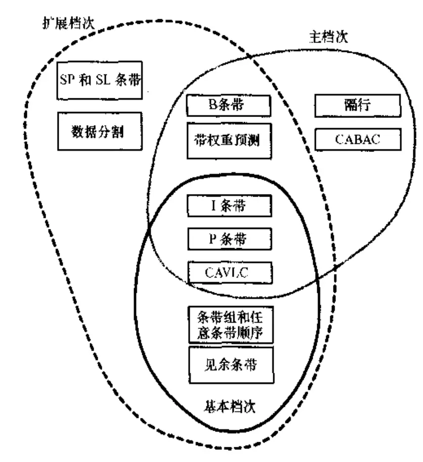  


## 五、常见编解码器X264 JM  

我们已经知道，H.264是一种视频压缩标准，其只规定了符合标准的码流的格式，以及码流中各个语法元素的解析方法。H.264标准并未规定编码器的实现或流程，这给了不同的厂商或组织在编码实现方面极大的自由度，并产生了一些比较著名的开源H.264编解码器工程。其中H.264编码器中最著名的两个当属JM和X264，这二者都属于H.264编码标准的一种实现形式。  

* JM:JM通常被认为是H.264标准制定团队所认可的官方参考软件，基本实现了H.264标准的全部特征。JM在运行时的运算过程较为复杂，而且没有采用汇编优化等加速方法，因此运行速度较慢，很难达到实时编解码。通常主要用于编解码技术的科学研究领域，目前（2016.7）最新版本为JM 19。
* X264:X264是另一个著名的H.264开源视频编码器，由开源组织VideoLan开发制定。X264是目前企业界应用最为广泛的开源编码器，主要因为X264相对于JM进行了大量的优化与简化，使其运行效率大幅提高，主要有对编码代价计算方法的简化以及添加了MMX、SSE汇编优化等部分。虽然编码的质量在某些情况下相对于JM略有下降，但是已无法掩盖其在可应用性，尤其是实时编码方面无可比拟的优势。  

参考:[JM和x264是什么关系？](https://blog.csdn.net/stpeace/article/details/8195620)  

再看JM encoder和x264, 自己编码一下，就可以发现，JM encoder实在太慢了，x264则相当快. 为什么呢？因为具体实现的方式不一样，打个简单比方JM encoder就像一个学院派的老师，比较严谨，略带完美主义情结，力求面面俱到, x264更像一个公司的大牛，少去了许多华而不实的东西，奉行实用至上，阉割掉一些看上去很美的东西, 所以编码效率那是相当高啊.  

初学H.264时，听别人说研究学术用JM，实际应用用x264. 其实不然，每个人的需求不同，研究学术就要用JM？要看研究的是什么东西，有些人做的是基于H.264的研究，而不是专门研究H.264, 动辄要编码上千帧，如果用JM，那就太慢了. 对某些基于H.264的研究者来说，运动估计是怎么估计出来的一点都不重要，熵编码是如何实现的一点都不重要，重要的是知道在哪个地方提取什么参量. 话说，人各有志，所以，到底用JM还是x264也是不过是人各有所需罢了.  

## 六、H264学习资源汇总  

[H264官方中文版PDF](http://read.pudn.com/downloads208/sourcecode/multimedia/981579/H.264%E5%AE%98%E6%96%B9%E4%B8%AD%E6%96%87%E7%89%88.pdf)  
[Akagi201/h.264-guide.md](https://gist.github.com/Akagi201/96add5cb981a6446e2ba)  
[ 雷霄骅-总结-视音频编解码技术零基础学习方法 ](https://blog.csdn.net/leixiaohua1020/article/details/18893769)  
[韦易笑 试简介视频编码技术？](https://www.zhihu.com/question/22567173/answer/73610451)  
[韦易笑 学习视频编码、解码知识需要哪些前置知识？](https://www.zhihu.com/question/26949947/answer/109563447)  
[H.264/AVC视频编解码技术详解系列](https://blog.csdn.net/shaqoneal/article/list/1)  


# 从零了解H264结构  

## 前言  

建议先看一下[FFmpeg3的iOS版的入门格式转换器(无编码)](http://www.iosxxx.com/blog/2017-07-29-FFmpeg3%E7%9A%84iOS%E7%89%88%E7%9A%84%E5%85%A5%E9%97%A8%E6%A0%BC%E5%BC%8F%E8%BD%AC%E6%8D%A2%E5%99%A8(%E6%97%A0%E7%BC%96%E7%A0%81).html),我们可以了解H264处于编解码层。为什么需要编码呢？比如当前屏幕是1280*720.一秒24张图片.那么我们一秒的视频数据是`1280*720(位像素)*24(张) / 8(1字节8位)(结果:B) / 1024(结果:KB) / 1024 (结果:MB) =  2.64MB`  

一秒的数据有2.64MB数据量。1分钟就会有100多MB。这对用户来说真心是灾难。所以现在我们需要一种压缩方式减小数据的大小.在更低 比特率(bps)的情况下依然提供清晰的视频。  

H264: H264/AVC是广泛采用的一种编码方式。我们这边会带大家了解。从大到小排序依次是 序列，图像，片组，片，NALU，宏块，亚宏块，块，像素。  

## 一. 原理  

H.264原始码流(裸流)是由一个接一个NALU组成，它的功能分为两层，VCL(视频编码层)和 NAL(网络提取层).  
`VCL(Video Coding Layer) + NAL(Network Abstraction Layer)`  

1. VCL：包括核心压缩引擎和块，宏块和片的语法级别定义，设计目标是尽可能地独立于网络进行高效的编码；
2. NAL：负责将VCL产生的比特字符串适配到各种各样的网络和多元环境中，覆盖了所有片级以上的语法级别。  

在VCL进行数据传输或存储之前，这些编码的VCL数据，被映射或封装进NAL单元。（NALU）。  
`一个NALU = 一组对应于视频编码的NALU头部信息 + 一个原始字节序列负荷(RBSP,Raw Byte Sequence Payload)`  

如图所示，上图中的NALU的头 + RBSP 就相当于一个NALU(Nal Unit),每个单元都按独立的NALU传送。H.264的结构全部都是以NALU为主，理解了NALU，就理解了H.264的结构。  

一个原始的H.264 NALU 单元常由 [StartCode] [NALU Header] [NALU Payload] 三部分组成，其中 Start Code 用于标示这是一个NALU 单元的开始，必须是”00 00 00 01” 或”00 00 01”  
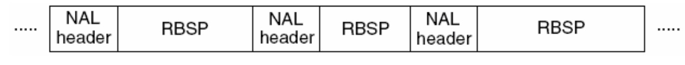  

### 1. NAL Header  
由三部分组成，forbidden_bit(1bit)，nal_reference_bit(2bits)（优先级），nal_unit_type(5bits)（类型）。  
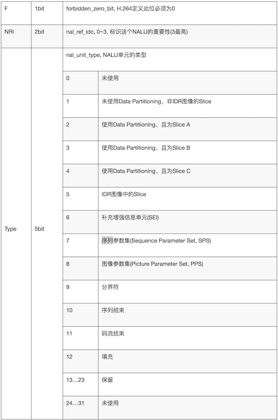  

举例来说：  
```X16
00 00 00 01 06:  SEI信息   
00 00 00 01 67:  0x67&0x1f = 0x07 :SPS
00 00 00 01 68:  0x68&0x1f = 0x08 :PPS
00 00 00 01 65:  0x65&0x1f = 0x05: IDR Slice

```

### 2. RBSP  
  
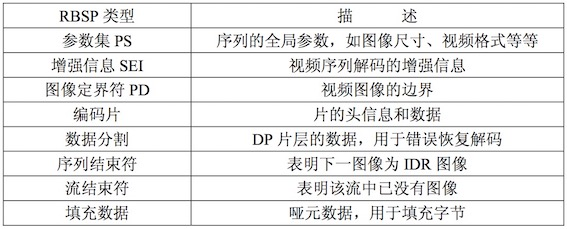  

SODB与RBSP  
SODB 数据比特串 -> 是编码后的原始数据.  
RBSP 原始字节序列载荷 -> 在原始编码数据的后面添加了 结尾比特。一个 bit“1”若干比特“0”，以便字节对齐。  
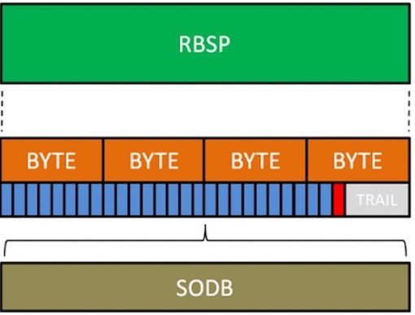  


## 二. 从NALU出发了解H.264里面的专业词语  
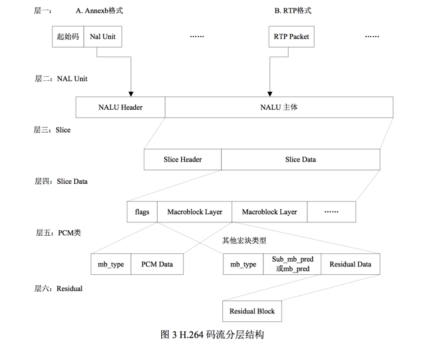  

```x16
1帧 = n个片
1片 = n个宏块
1宏块 = 16x16yuv数据
```

### 1. Slice(片)  
如图所示，NALU的主体中包含了Slice(片).`一个片 = Slice Header + Slice Data`  

片是H.264提出的新概念，通过编码图片后切分通过高效的方式整合出来的概念。一张图片有一个或者多个片，而片由NALU装载并进行网络传输的。但是NALU不一定是切片，这是充分不必要条件，因为 NALU 还有可能装载着其他用作描述视频的信息.  

那么为什么要设置片呢?  
设置片的目的是为了限制误码的扩散和传输，应使编码片相互间是独立的。某片的预测不能以其他片中的宏块为参考图像，这样某一片中的预测误差才不会传播到其他片中。  

可以看到上图中，每个图像中，若干宏块(Macroblock)被排列成片。一个视频图像可编程一个或更多个片，每片包含整数个宏块 (MB),每片至少包含一个宏块。片有一下五种类型:  

1. I 片:只包含I宏块
2. P 片:包含P和I宏块
3. B 片:包含B和I宏块
4. SP 片:包含P 和/或 I宏块,用于不同码流之间的切换
5. SI 片:一种特殊类型的编码宏块  

### 2. 宏块(Macroblock)  
刚才在片中提到了宏块.那么什么是宏块呢？  

宏块是视频信息的主要承载者。一个编码图像通常划分为多个宏块组成.包含着每一个像素的亮度和色度信息。视频解码最主要的工作则是提供高效的方式从码流中获得宏块中像素阵列。`一个宏块 = 一个16*16的亮度像素 + 一个8×8Cb + 一个8×8Cr彩色像素块组成。(YCbCr 是属于 YUV 家族的一员,在YCbCr 中 Y 是指亮度分量，Cb 指蓝色色度分量，而 Cr 指红色色度分量)`  

| 宏块分类 |                                                                                    意义                                                                                     |
| ------- | -------------------------------------------------------------------------------------------------------------------------------------------------------------------------- |
| I 宏块   | 利用从当前片中已解码的像素作为参考进行帧内预测                                                                                                                                  |
| P 宏块   | 利用前面已编码图像作为参考进行帧内预测，一个帧内编码的宏块可进一步作宏块的分割:即16×16.16×8.8×16.8×8亮度像素块。如果选了8×8的子宏块，则可再分成各种子宏块的分割，其尺寸为8×8，8×4，4×8，4×4 |
| B 宏块   | 利用双向的参考图像(当前和未来的已编码图像帧)进行帧内预测                                                                                                                         |

  
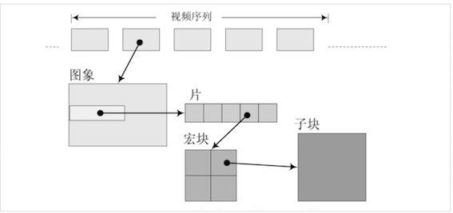  
在 H.264 中，句法元素共被组织成 序列、图像、片、宏块、子宏块五个层次。
句法元素的分层结构有助于更有效地节省码流。例如，再一个图像中，经常会在各个片之间有相同的数据，如果每个片都同时携带这些数据，势必会造成码流的浪费。更为有效的做法是将该图像的公共信息抽取出来，形成图像一级的句法元素，而在片级只携带该片自身独有的句法元素。  
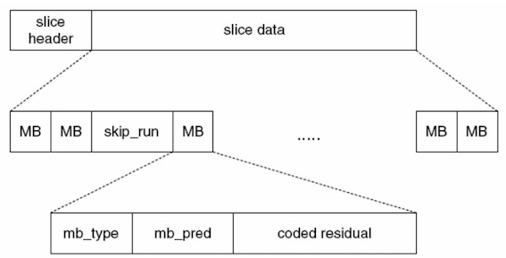  

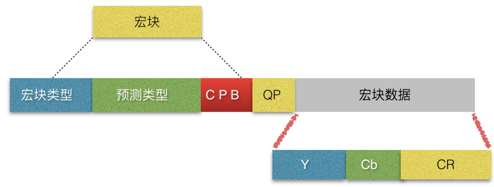  

|       宏块分类       |                                                          意义                                                          |
| ------------------- | ---------------------------------------------------------------------------------------------------------------------- |
| mb_type             | 确定该 MB 是帧内或帧间(P 或 B)编码模式，确定该 MB 分割的尺寸                                                                |
| mb_pred             | 确定帧内预测模式(帧内宏块)确定表 0 或表 1 参考图 像，和每一宏块分割的差分编码的运动矢量(帧间宏块，除 8×8 宏块分割的帧内 MB)        |
| sub_mb_pred         | (只对 8×8MB 分割的帧内 MB)确定每一子宏块的子宏 块分割，每一宏块分割的表 0 和/或表 1 的参考图象;每一 宏块子分割的差分编码运动矢量。 |
| coded_block_pattern | 指出哪个 8×8 块(亮度和彩色)包 编码变换系数                                                                                 |
| mb_qp_delta         | 量化参数的改变值                                                                                                         |
| residual            | 预测后对应于残差图象取样的编码变换系数                                                                                     |


### 3.图像,场和帧  
图像是个集合概念，顶 场、底场、帧都可以称为图像。对于H.264 协议来说，我们平常所熟悉的那些称呼，例如： I 帧、P 帧、B帧等等，实际上都是我们把图像这个概念具体化和细小化了。我们 在 H.264里提到的“帧”通常就是指不分场的图像；  

视频的一场或一帧可用来产生一个编码图像。一帧通常是一个完整的图像。当采集视频信号时，如果采用隔行扫描(奇.偶数行),则扫描下来的一帧图像就被分为了两个部分,这每一部分就被称为 [场],根据次序氛围: [顶场] 和 [底场]。  

|   方式    |           作用域            |
| --------- | --------------------------- |
| 帧编码方式 | 活动量较小或者静止的图像宜采用 |
| 场编码方式 | 活动量较大的运动图像                            |  

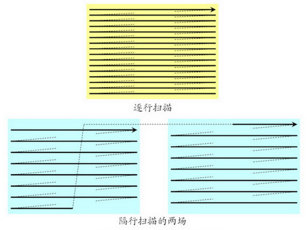  

### 4. I,P,B帧与pts/dts  

| 帧的分类 |                            中文                            |                                                                   意义                                                                    |
| ------- | --------------------------------------------------------- | ---------------------------------------------------------------------------------------------------------------------------------------- |
| I帧     | 帧内编码帧,又称intra picture                                | I 帧通常是每个 GOP（MPEG 所使用的一种视频压缩技术）的第一个帧，经过适度地压缩，做为随机访问的参考点，可以当成图象。I帧可以看成是一个图像经过压缩后的产物 |
| P帧     | 前向预测编码帧,又称predictive-frame                         | 通过充分将低于图像序列中前面已编码帧的时间冗余信息来压缩传输数据量的编码图像，也叫预测帧                                                           |
| B帧     | 双向预测帧,又称bi-directional interpolated prediction frame | 既考虑与源图像序列前面已编码帧，也顾及源图像序列后面已编码帧之间的时间冗余信息来压缩传输数据量的编码图像,也叫双向预测帧                                |  

I P B帧的不同:  

I frame:自身可以通过视频解压算法解压成一张单独的完整的图片。  
P frame：需要参考其前面的一个I frame 或者B frame来生成一张完整的图片。  
B frame:则要参考其前一个I或者P帧及其后面的一个P帧来生成一张完整的图片。  

|             名称             |                     意义                     |
| ---------------------------- | -------------------------------------------- |
| PTS(Presentation Time Stamp) | PTS主要用于度量解码后的视频帧什么时候被显示出来。 |
| DTS(Decode Time Stamp)       | DTS主要是标识内存中的bit流再什么时候开始送入解码器中进行解码。                                             |  

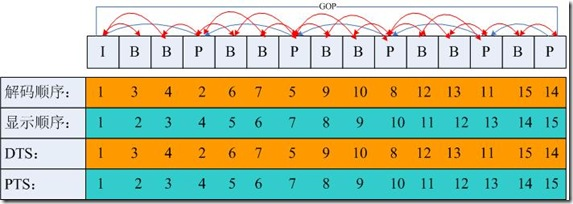  

DTS与PTS的不同:  

DTS主要用户视频的解码，在解码阶段使用。PTS主要用于视频的同步和输出，在display的时候使用。再没有B frame的时候输出顺序一样。  

### 5. GOP  
GOP是画面组，一个GOP是一组连续的画面。  
GOP一般有两个数字，如M=3，N=12.M制定I帧与P帧之间的距离，N指定两个I帧之间的距离。那么现在的GOP结构是`I BBP BBP BBP BB I`  

增大图片组能有效的减少编码后的视频体积，但是也会降低视频质量，至于怎么取舍，得看需求了  

### 6. IDR  
一个序列的第一个图像叫做 IDR 图像（立即刷新图像），IDR 图像都是 I 帧图像。  

I和IDR帧都使用帧内预测。I帧不用参考任何帧，但是之后的P帧和B帧是有可能参考这个I帧之前的帧的。IDR就不允许这样。
比如这种情况:`IDR1 P4 B2 B3 P7 B5 B6 I10 B8 B9 P13 B11 B12 P16 B14 B15` 这里的B8可以跨过I10去参考P7  

核心作用：  
H.264 引入 IDR 图像是为了解码的重同步，当解码器解码到 IDR 图像时，立即将参考帧队列清空，将已解码的数据全部输出或抛弃，重新查找参数集，开始一个新的序列。这样，如果前一个序列出现重大错误，在这里可以获得重新同步的机会。IDR图像之后的图像永远不会使用IDR之前的图像的数据来解码。  

## 三. 帧内预测和帧间预测  


### 1. 帧内预测（也叫帧内压缩）  
  
我们可以通过第 1、2、3、4、5 块的编码来推测和计算第 6 块的编码，因此就不需要对第 6 块进行编码了，从而压缩了第 6 块，节省了空间  

### 帧间预测（也叫帧间压缩）  
  

可以看到前后两帧的差异其实是很小的，这时候用帧间压缩就很有意义。  
这里涉及到几个重要的概念：块匹配，残差，运动搜索(运动估计),运动补偿.  

帧间压缩最常用的方式就是块匹配(Block Matching)。找找看前面已经编码的几帧里面，和我当前这个块最类似的一个块，这样我不用编码当前块的内容了，只需要编码当前块和我找到的快的差异(残差)即可。找最想的块的过程叫运动搜索(Motion Search),又叫运动估计。用残差和原来的块就能推算出当前块的过程叫运动补偿(Motion Compensation).  

## 四. 延伸  
最近我才知道FFmpeg也支持h264的硬编。具体还没有试验，接下来我会写demo来测试一下。直接用系统进行硬编的方式已经尝试过。接口还是蛮简单的。据说iOS11正式版会出H.265/HEVC硬编。目前Beta版暂不支持。如有支持，我会第一时间更新到博客，敬请期待！  

## 参考链接:  

1. [新一代视频压缩编码标准](H.264http://read.pudn.com/downloads147/ebook/635957/%E6%96%B0%E4%B8%80%E4%BB%A3%E8%A7%86%E9%A2%91%E5%8E%8B%E7%BC%A9%E7%BC%96%E7%A0%81%E6%A0%87%E5%87%86H.264.pdf)
2. [深入浅出理解视频编码H264结构](http://simplecodesky.com/2016/11/15/%E6%B7%B1%E5%85%A5%E6%B5%85%E5%87%BA%E7%90%86%E8%A7%A3%E8%A7%86%E9%A2%91%E7%BC%96%E7%A0%81H264%E7%BB%93%E6%9E%84/)
3. [关于视频的一些概念](http://www.samirchen.com/video-concept/)
4. [I,P，B帧和PTS，DTS的关系](http://www.cnblogs.com/qingquan/archive/2011/07/27/2118967.html)