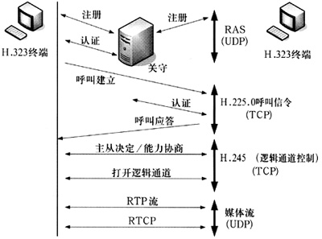

  

在H.323的王国里有许多成员（各种H.323节点），为了确保这个王国的正常运转，颂布了许多法令（H.323协议簇，其中主要有RAS、Q.931、H.245、TCP/IP、RTP/RTCP、UDP），无论是国王、还是臣民，大家都严格遵守这些法规。  

在这里将介绍H.323王国最重要的两个角色**国王（GK）、臣民（GW）**是如何遵照法规（RAS、Q.931、H.245）通信的。其中**国王与臣民之间的通信遵守RAS协议，臣民与臣民间的通信遵守Q.931、H.245协议。首先，臣民（GW）应向国王注册**。  

一个臣民（GW）诞生后，会使用RAS协议去寻找自己的国王（GK），他高声问到：“谁是我的国王请回答我！”，这时可能会有一个或者多个国王来响应：“你是我的臣民（GW），到我这里来注册吧，这是我的地址。”，当然国王也可以拒绝臣民（GW）的请求：“你不是我的臣民（GW），别来烦我。”  

如果臣民（GW）幸运地得到了多个国王的青睐，他可以选择一个国王并向他注册。注册成功后，臣民（GW）就可以享受国王提供的各种服务（如接入控制、带宽管理、地址翻译等功能）。这时，当臣民（GW）与另一臣民（GW）通信时，不需要知道对方的地址，只需告诉国王想要和谁通信，国王会把对方的地址找来给他。**对于那些没有找到国王的臣民（GW）来说就有点惨了，因为没有国王的帮助，他只能与自己相当熟悉的臣民（GW）通信（即知道对方的地址）。**  

臣民（GW）向国王注册可以有一个生命期，过了这个有效期，臣民（GW）还要再向国王注册。  

下面看看H.323的国王与臣民是如何帮助PSTN王国的臣民通过IP网相互通信的（即IP电话是如何实现的）。  

一个PSTN王国的臣民C想通过IP网送给他远方的朋友D一份特别的礼物，他跑去找与自己相熟的H.323王国的臣民A（GW），并把朋友的电话告诉他，请他帮助通过IP网找这个朋友（即一个PSTN用户拨打IP电话，呼入GW）。  

臣民A（GW）看不懂这个电话号码，他应该怎么做才能找到那位朋友呢？  

向国王（GK）寻求帮助，解析电话号码。  

由于在H.323王国里是使用IP协议通信的，所以臣民A（GW）拿到对方的电话号码是没有办法与对方联系的，他只有去寻找与对方相知的臣民B（目的GW）的地址。  

于是臣民A（GW）将电话号码发送给他注册的国王（GK），让国王帮助寻找臣民B（目的GW）的地址。首先国王会对臣民A（GW）的请求进行认证，认证通过后，国王才会去寻找臣民B（目的GW）的地址。如果国王不知道臣民B（目的GW）的地址（即这个GW未在该GK上注册），他会向其它的国王（GK）询问有谁知道臣民B（目的GW）的地址。  

当国王得到臣民B（目的GW）的地址后，就将该地址（呼叫信令传输地址=目的GW的IP地址+端口号）发回给臣民A（GW）。  

这样，就可以在这两个臣民（GW）间建立联系（建立呼叫信令信道，开始Q.931协议流程）。  

臣民A（GW）告诉臣民B（目的GW）：“我的朋友C有礼物要送给你的朋友D，他的电话是XXX，他在家吗？（即被叫用户C是否空闭）”，臣民B（目的GW）赶紧告诉D，别走开，有人要送礼物给你（即目的GW提醒被叫用户，并将该用户空闭态置为忙）。然后臣民B（目的GW）通知臣民A（GW）“一切搞掂”（即GWB向GWA发送CONNECTION消息后），双方开始讨论采用什么方式将朋友C的礼物送给朋友D（**即开始H.245协议流程，进行能力的协商**）。  

臣民A（GW）说：“朋友C的礼物是：播放一首凯利金的《GOING HOME》萨克斯曲给他听，我可以将这首曲子编辑为CD、VCD两种格式，你可以解读吗？”臣民B（目的GW）：“我这里的设备还没有升级呢，不好意思目前我只能解读CD格式的曲子”（这就是H.245中的所谓能力协商，通过协商，获得双方都可以接受的语音编解码类型）。臣民B（目的GW）通知臣民A（GW）传送曲子所使用的地址（即H.245中的打开RTP/RCTP通道，用于传送媒体流），这样，这份礼物在IP网的传送通道打开了。  

这时，朋友C开始通过电话线向远方的朋友D 播放乐曲，优美的乐曲经过电话线传送到臣民A（GW）处，臣民A（GW）将曲子压缩成CD的格式（进行语音编码压缩，并打成IP包发送到IP网上），通过IP网传送给臣民B（GW），臣民B（GW）再将编码解读还原成曲子通过电话线传送给朋友D。（IP电话就是这样拨通了！！！）  

--------------------------------------------------------------------------------华丽分割线----------------------------------------------------------------------------------------------  

**典型的呼叫过程如下**：  

1. 主叫通过PSTN或ISDN网络拨入当地ISP的VoIP网关。
2. 网关应答呼叫。
3. 网关使用自动号码鉴别（ANI）询问RADIUS 服务器，ANI是主叫的电话号码。
4. RADIUS服务器使用ANI检验呼叫者是否是已付费用户，如果ANI不在计费数据库中，提示用户拨入帐号和密码，并把收到信息发送给RADIUS 服务器验证。
5. RADIUS 服务器验证该用户已经计费后，网关开始进行二次拨号。
6. 网关收集主叫拨入的目标电话号码。
7. 网关通过咨询网闸启动H.323传送呼叫。
8. 网闸对照远端区域E.164前缀（zone E.164 prefixes）的匹配目标电话号码
9. 源网闸与终结网闸商议选择适当的远端区域内的网关来传送呼叫，远端网关的地址通过RAS协议被送回到主叫端。
10. 源网关通过IP网络到目标网关处理H.323呼叫。如果呼叫失败，源网关使用循环呼叫特性尝试其它终结网关。终结网关通过尝试所有的备份路径配置。
11. 终结网关启动本地PSTN网络处理呼叫。
12. 主叫起始标识由源网关和终结网关产生，并把它送到RADIUS服务器。 

**用户身份鉴定**  
可以在源网关使用基于RADIUS的授权来控制对VoIP网络的访问。当呼叫者拨打本地网关访问号码时，网关AAA接口收集用户帐号信息，并向RADIUS服务器发送用户的帐号信息。  

**用户帐号验证有两种方式:**  

1. 呼叫者身份证（ID）号Caller ID---如果该用户在家里打IP电话，RADIUS系统对照内部数据库比较用户的ID号,如果有效，该用户可听见二次拨号音。
2. 用户帐号Account code/PIN---如果用户从其它地方的电话机打电话，网关提示呼叫者输入帐号和密码，如果呼叫者输入的是有效的帐号和密码，呼叫者听到二次拨号音。

在呼叫者身份验证后，用户开始进行呼叫   

**交互语音应答功能**  
网关里集成了交互语音应答（IVR）应用软件，它提供语音提示和号码收集功能，可用于授权用户和目标地址识别。
