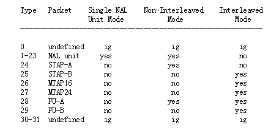
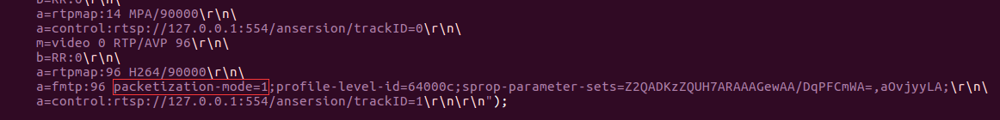
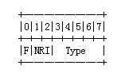
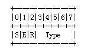

# 一、H264传输封包格式的2个概念  

## （1）组包模式（Packetization Modes）  

[RFC3984](http://www.rfc-editor.org/rfc/rfc3984.txt)中定义了3种组包模式：单NALU模式（Single Nal Unit Mode）、非交错模式（Non-interleaved Mode）和交错模式（Interleaved Mode）。  

“单NALU模式”：NALU封包在传输过程中必须是整包传输，不可以分包（指应用层的分包，并非指传输层）。而且NALU必须是严格按照解码顺序传输，也就是说，假设1s中连续的24帧分别标记为：frame1，frame2...，frame24，则传输必须严格按frame1，frame2...，frame24这个顺序传输。  

“非交错模式”：NALU必须是严格按照解码顺序传输，也就是说，假设1s中连续的24帧分别标记为：frame1，frame2...，frame24，则传输必须严格按frame1，frame2...，frame24这个顺序传输。该模式可以分包（指应用层的分包，并非指传输层）。  

“交错模式”：NALU可以不按照解码顺序传输，也就是说，假设1s中连续的24帧分别标记为：frame1，frame2...，frame24，则传输顺序可以是frame15，frame7，frame9...。该模式可以分包（指应用层的分包，并非指传输层）。  

## （2）封包类型（Packet Type）  

[RFC3984](http://www.rfc-editor.org/rfc/rfc3984.txt)中定义了7种封包类型：Nal Unit， STAP-A， STAP-B， MTAP16， MTAP24， FU-A， FU-B。这些类型分别对应着不同的传输属性（如支持应用层的“大包分小包”、“小包组大包”）。其中比较常见的是FU-A（Fragmentation Units A）这种类型。  

“组包模式”和“封包类型”一起规定了H264的传输格式，但它们之间也非随意组合的，具体如下图：  
  


# 二、SDP中的组包模式  

H264传输的组包模式在SDP中被指定，下图是截取的一段SDP内容  
  

其中“packetization-mode=1”即规定了H264的组包模式。3种组包模式分别对应编号0,1,2（见RFC3984），1表示“非交错模式”。  


# 三、本地NALU和传输中NALU  

## （1）本地NALU  

现在我们本地有一个NALU，大小为3000字节，如下图。  
  

其中NALU Header分别由，1bit禁止位，2bit权限位，和5bit类型位。  
  

其中type的有效值为1-12，分别代表了NALU的不同类型，数值0禁用，13-31保留（type由5bit表示，范围为0-31）。  

##  （2）传输中的NALU  

假设“组包模式”=“非交错模式”，“封包类型”=“FU-A”，并且将上述所述的包拆分成了3个进行传输，我们来举例说明传输中的NALU和本地的NALU的区别。  
  

以上就是按顺序传输到客户端的3个封包。与本地NALU不同的是，NALU Header的type不再是1-12，而是28（28表示FU-A传输格式，见[RFC3984](http://www.rfc-editor.org/rfc/rfc3984.txt)），真正的NALU的type被包含在FU-A Header中。  

FU-A Header的格式如下  
  

S（Start）：起始包指示位，即当传输的是第1个NALU分包时，该位置1。上图中Pack 1该位会被置位；  

E（End）：结束宝指示位，即当传输的是最后1个NALU分包时，该位置1。上图中Pack 3该位会被置位；  

R（Reserved）：保留位，忽略之。  

Type：NALU类型，即原来在NALU Header中的Type。  

当客户端收到这3个分包时，便可以将其还原成本地NALU的格式了。  


# 四、源码分析  

在nalu_types_h264.cpp中，首先分析函数：`size_t FU_A::CopyData(uint8_t * buf, uint8_t * data, size_t size)`它的作用是将data中的数据复制到buf中，一共复制size个字节，返回实际复制的字节数。其中buf为用户的缓冲区，data为rtp接收的数据。  

```c++
size_t FU_A::CopyData(uint8_t * buf, uint8_t * data, size_t size)
{
    size_t CopySize = 0;
    if(!buf || !data) return 0;

    StartFlag = IsPacketStart(data);
    EndFlag = IsPacketEnd(data);

    uint8_t NALUHeader = 0;
    NALUHeader = (uint8_t)(
            ParseNALUHeader_F(data)      |
            ParseNALUHeader_NRI(data)    |
            ParseNALUHeader_Type(data)
            );

    if(StartFlag) {

        // NALU start code size
        buf[0] = 0; buf[1] = 0; buf[2] = 0; buf[3] = 1;
        CopySize += 4;
        memcpy(buf + CopySize, &NALUHeader, sizeof(NALUHeader));
        CopySize += sizeof(NALUHeader);
    }
    const int FU_A_HeaderSize = 2;
    memcpy(buf + CopySize, data + FU_A_HeaderSize, size - FU_A_HeaderSize);
    CopySize += size - FU_A_HeaderSize;

    return CopySize;
}
```
  
仔细看一下源码，我们会发现该函数先解析data的前2个字节（IsPacketStart、IsPacketEnd、ParseNALUHeader_F、ParseNALUHeader_NRI和ParseNALUHeader_Type，源码如下），如果该数据为NALU的第1个RTP分包，则在其最前面添加{0,0,0,1}，以标注NALU的开头。  

```c++
bool FU_A::IsPacketStart(const uint8_t * rtp_payload)
{
    if(!IsPacketThisType(rtp_payload)) return false;

    uint8_t PacketS_Mask = 0x80; // binary:1000_0000

    return (rtp_payload[1] & PacketS_Mask);
}

bool FU_A::IsPacketEnd(const uint8_t * rtp_payload)
{
    if(!IsPacketThisType(rtp_payload)) return false;

    uint8_t PacketE_Mask = 0x40; // binary:0100_0000

    return (rtp_payload[1] & PacketE_Mask);
}

uint16_t FU_A::ParseNALUHeader_F(const uint8_t * rtp_payload)
{
    if(!rtp_payload) return FU_A_ERR;
    if(FU_A_ID != (rtp_payload[0] & FU_A_ID)) return FU_A_ERR;

    uint16_t NALUHeader_F_Mask = 0x0080; // binary: 1000_0000

    // "F" at the byte of rtp_payload[0]
    return (rtp_payload[0] & NALUHeader_F_Mask);
}

uint16_t FU_A::ParseNALUHeader_NRI(const uint8_t * rtp_payload)
{
    if(!rtp_payload) return FU_A_ERR;
    if(FU_A_ID != (rtp_payload[0] & FU_A_ID)) return FU_A_ERR;

    uint16_t NALUHeader_NRI_Mask = 0x0060; // binary: 0110_0000

    // "NRI" at the byte of rtp_payload[0]
    return (rtp_payload[0] & NALUHeader_NRI_Mask);

}

uint16_t FU_A::ParseNALUHeader_Type(const uint8_t * rtp_payload)
{
    if(!rtp_payload) return FU_A_ERR;
    if(FU_A_ID != (rtp_payload[0] & FU_A_ID)) return FU_A_ERR;

    uint16_t NALUHeader_Type_Mask = 0x001F; // binary: 0001_1111

    // "Type" at the byte of rtp_payload[0]
    return (rtp_payload[1] & NALUHeader_Type_Mask);
}
```


src=[https://www.cnblogs.com/ansersion/p/6959690.html](https://www.cnblogs.com/ansersion/p/6959690.html)