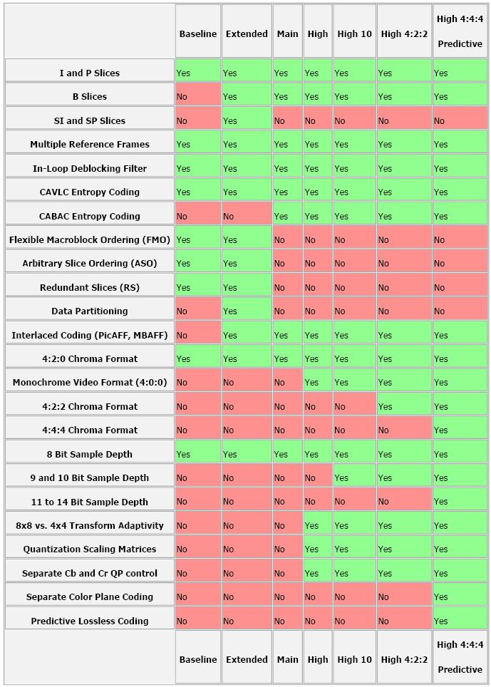
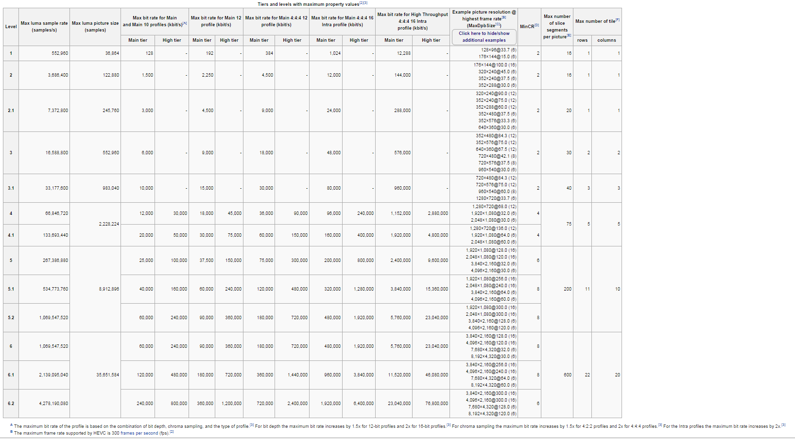

# 一、背景知识  

先科普一下profile和level。（这里讨论最常用的H264）  

H.264有四种画质级别,分别是baseline, extended, main, high：   

1. Baseline Profile：基本画质。支持I/P 帧，只支持无交错（Progressive）和CAVLC； 
2. Extended profile：进阶画质。支持I/P/B/SP/SI 帧，只支持无交错（Progressive）和CAVLC；(用的少) 
3. Main profile：主流画质。提供I/P/B 帧，支持无交错（Progressive）和交错（Interlaced）， 也支持CAVLC 和CABAC 的支持； 
4. High profile：高级画质。在main Profile 的基础上增加了8x8内部预测、自定义量化、 无损视频编码和更多的YUV 格式；   

H.264 Baseline profile、Extended profile和Main profile都是针对8位样本数据、4:2:0格式(YUV)的视频序列。在相同配置情况下，High profile（HP）可以比Main profile（MP）降低10%的码率。   

根据应用领域的不同，Baseline profile多应用于实时通信领域，Main profile多应用于流媒体领域，High profile则多应用于广电和存储领域。  

下图清楚的给出不同的profile&level的性能区别。   

## 1.1 profile   
  

## 1.2 level   
  


# 二、  

## 2.1 ffmpeg如何控制profile&level  

举3个例子吧   

```console
ffmpeg -i input.mp4 -profile:v baseline -level 3.0 output.mp4
ffmpeg -i input.mp4 -profile:v main -level 4.2 output.mp4
ffmpeg -i input.mp4 -profile:v high -level 5.1 output.mp4
```

如果ffmpeg编译时加了external的libx264，那就这么写：   

```console
ffmpeg -i input.mp4 -c:v libx264 -x264-params "profile=high:level=3.0" output.mp4
```

从压缩比例来说，baseline< main < high，对于带宽比较局限的在线视频，可能会选择high，但有些时候，做个小视频，希望所有的设备基本都能解码（有些低端设备或早期的设备只能解码 baseline），那就牺牲文件大小吧，用baseline。自己取舍吧！  

苹果的设备对不同profile的支持  
  


## 2.2 编码效率和视频质量的取舍(preset, crf)  

除了上面提到的，强行配置biterate，或者强行配置profile/level，还有2个参数可以控制编码效率。  

一个是preset，一个是crf。   

preset也挺粗暴，基本原则就是，如果你觉得编码太快或太慢了，想改改，可以用profile。   

preset有如下参数可用：  

```console
ultrafast, superfast, veryfast, faster, fast, medium, slow, slower, veryslow and placebo. 编码加快，意味着信息丢失越严重，输出图像质量越差。
```

CRF(Constant Rate Factor): 范围 0-51: 0是编码毫无丢失信息, 23 is 默认, 51 是最差的情况。相对合理的区间是18-28. 值越大，压缩效率越高，但也意味着信息丢失越严重，输出图像质量越差。  

举个例子吧。   

```console
# (参考自：https://trac.ffmpeg.org/wiki/Encode/H.264)
ffmpeg -i input -c:v libx264 -profile:v main -preset:v fast -level 3.1 -x264opts crf=18 
```

## 2.3 H265 (HEVC)编码tile&level控制  

### 背景知识  

和H264的profile&level一样，为了应对不同应用的需求，HEVC制定了“层级”(tier) 和“等级”(level)。tier只有main和high。level有13级，如下所示：   
  

不多说，直接给出怎么用。（supposed你用libx265编码）   

```console
ffmpeg -i input.mp4 -c:v libx265 -x265-params "profile=high:level=3.0" output.mp4
```