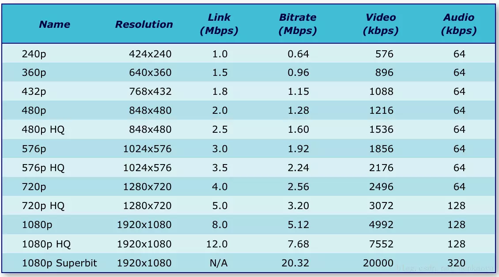

在各种视频编码标准中，行业一直在求追“高压缩比（数据量越小越好）”，同时又保证“高视频质量”的算法。鱼和熊掌不可兼得，视频编码是一种折中的游戏。参数“视频码率”的设定，就代表了这种折中的选择。码率越高，数据量越大，视频质量越好，码率越小，数据量越小，视频质量越差。  

但是，**码率大到一定阈值之后，码率的提升带来的视频质量改善就会变得微不足道**，所以这个码率阈值就显得非常重要。  

网上这篇文章[Video Encoding Settings for H.264 Excellence](http://www.lighterra.com/papers/videoencodingh264/#maximumkeyframeinterval)，就针对H.264视频编码，测试了不同视频分辨率下的码率阈值。  

其介绍了用于高质量H.264视频编码的一组分辨率，码率设置，以及这些选择背后的推理。这篇文章很好的帮我们解答了：针对H.264视频编码（对其他视频编码格式无效），给定一个视频分辨率，要设置什么视频码率，才能得到“最具性价比”的高质量视频画面。  

针对H.264编码格式，根据不同分辨率，推荐其对应的码率配置关系如下图所示：  

#### 宽屏  

  

#### 非宽屏  

  

#### 注：  

1. 以上列的码率基本上对应的是相应分辨率下最大码率的情况了
2. 而且需要考虑帧率，当帧率较低时百日15帧，可以再降低一些