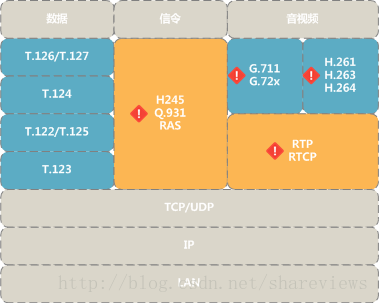
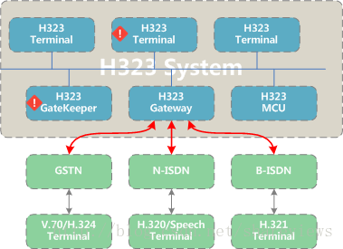

#### 1 H323协议族  
全数字化通信潮流势不可挡，传统电话业务也不例外。传统电话中中包含一套完整的话务信令，对应的VOIP中也需要信令系统，以解决寻找被叫方、建立应答、能力协商和多媒体通信等关键工作流。目前在国际上，比较有影响的IP电话方面的协议包括ITU-T提出的H.323协议和IETF提出的SIP协议。  

H.323标准为基于IP的音频，视频和数据通信提供了基础。H.32x是范围很大的协议族，可以在复杂网络中实现视频会议。另外该H.32x包括H.320和H.324，分别用于ISDN和PSTN通信。H.323协议族中H225和H245是协议的核心。H.225协议包含RAS与呼叫信令。H.245控制信令包含:能力协商和主从协商。H.323定义了基于网络的通信系统的四个主要组件：终端，网关，关守和多点控制单元。H323标准为智能设备带来了强大的多媒体通信能力。  

  

H.323是一个系统的规范，它使用多个ITU-T和IETF协议。H.323系统的核心是：  

* H.323协议总体定义了基于包交换网络的视频会议系统和终端。
* H.225呼叫信令协议，使两个H323实体能够建议多媒体通信。
* RAS协议从属于H.225.0，提供了H.323终端和Gatekeeper之间的地址解析和准入控制服务。
* H.245媒体通信控制协议定义了具体的通信控制信令，用于多媒体能力交互和信道控制。
* H.235协议定义了多媒体终端的通信安全和加密机制。
* H.283协议定义了逻辑通道传输的远端控制协议。
* H.248网关控制协议。
* H.460.1x 协议扩展定义了网络地址转换(NAT)/防火墙(FW)穿越
* G.7xx音频编码规范。
* H.26x视频编码规范，包括H.261、H.263、H.264等 视频编码格式。

##### 1.1 H323标准的演进  

* 1996年10月，H.323由ITU-T第十六研究小组颁布并成为一种多媒体通信的标准。在第一版本的H.323建议书中，主要描述了包交换网中的基本多媒体业务，即语音和数据业务。该版本协议中没有定义服务质量(QoS)指标。
* 1998年1月，H.323的第二个版本出现了，它的改进之处在于，从功能定义上极大地支持计算机网上的电话业务，使我们利用包交换网实现高质量语音传递成为可能(VoIP)。中国目前主要使用这个协议版本。
* 在H.323的第三个、第四个版本中加入了很多基于包交换网的其他类业务，例如传真业务、快速连接等。

#### 2 H323系统概述  
H.323标准提供了一种多端互联的多媒体通信服务的组件，协议和过程。H.323是第一个采用IETF标准RTP来通过IP网络传输音频和视频的VoIP标准。H.323为智能终端提供基于互联网协议（IP）的网络的分组网络的实时音频，视频和数据通信。H.323定义了基于网络的通信系统的四个主要组件：终端，网关，关守和多点控制单元；四种组件构成通信系统时，提供点对点和点对多点多媒体通信服务；网守，网关和MCU是H.323标准的逻辑上独立的组件，但可以实现为单个物理设备。  

##### 2.1 终端(Terminals)  
在实时双向多媒体通信中，H.323终端强制要求支持音频，可选支持数据和视频; 终端提供多媒体能力交换机制，保证多种多种多媒体终端可以互相配合。H.323终端提供的基本业务是基于IP网络的音频通信，扩展目标是与其他多媒体终端互通。H.323终端与SCN和无线网络上的H.324终端兼容，B-ISDN上的H.310终端，ISDN上的H.320终端，B-ISDN上的H.321终端以及保证QoS的H.322终端局域网。  

##### 2.2 网关(Gateways)：  
网关连接两个不同的网络。H.323网关提供H.323网络和非H.323网络之间的连接。H.323网关的作用是协议转换，即H323和其他通信协议的转换，两台H323终端之间直接通信没有必要经过网关。H323网关可以提供H323终端和异构网络中的终端(如PSTN网络中的H.324终端)之间的相互通信能力。H323网关用于转换或翻译：呼叫建立和释放的协议，多媒体能力协商协议，以及必要的媒体格式转换等。  

##### 2.3 网守(Gatekeepers)：  
H323网守主要负责H323设备的认证控制、地址解析、带宽管理和路由控制等。当H.323网络中不存在网守时，两个端点是不需要经过认证就能直接通信的。  

##### 2.4 多点控制单元  
MCU为三个或更多H.323终端的会议提供支持。参加会议的所有终端与MCU建立连接。MCU管理会议资源，在终端之间进行协商，以确定要使用的音频或视频编码器/解码器(CODEC)，并且可以处理媒体流。  
  

#### 3 H.323的特性和优势：  

* 广域网会议：许多用户希望从局域网到远程站点进行会议。
* 灵活性：H.323协议族可以包括具有不同功能的端点。
* 网络独立性： H.323协议族旨在运行在通用网络架构之上。
* 带宽管理：H.323协议族通过带宽管理来限制其网络内同时连接的H.323数量。
* 互操作性： H.323协议族得益于多媒体能力协商协议H245，用户无需担心接收点的兼容性问题。
* 编解码标准： H.323协议族采用通用的音视频数据流的压缩和解压缩协议,确保多端兼容性。
* 平台和应用程序的独立性： H.323协议族不受任何硬件或操作系统的限制。
* 组播支持： 支持多点组播视频会议，组播将单个数据包发送到网络上的一组目标，而无需复制。
* 多点支持：支持三个或以上端点的视频会议，并且而不需要专门的多点控制单元，但是MCU提供了更强大和更灵活的架构，用于托管多点会议。

#### 4 H323与SIP区别和联系  
SIP协议中的用户代理UA(User Agent)是一个逻辑实体，作用等同于H323系统中终端。SIP服务器作用等同于H.323的网守。SIP协议中的SDP作用等同于H323系统中H.245。SIP协议的作用等同于H323系统中中的RAS和Q.931协议。IETF的SIP体系和ITU-T的H323体系中，媒体流均采用RTP协议，不同主要体现在呼叫信令和控制信令  

H.323信令信息是符合ASN.1的二进制编码，需要特殊的编解码器。SIP信息是基于文本的，采用ISO10646以UTF-8编码，易于编码实现和调试。  

#### 参考文献  

* [H.323 Forum](http://www.h323forum.org/)
* [ITU H.323 Recommendation](http://www.itu.int/rec/recommendation.asp?type=folders&lang=e&parent=T-REC-H.323)
* [OpenH323 Project](http://www.openh323.org/)
* [H.323 Call Flow(pdf)](http://www.eventhelix.com/RealtimeMantra/Telecom/h323_call_flow.pdf)
* [Comparision of SIP and H.323(pdf)](http://www.cs.columbia.edu/~hgs/papers/Schu9807_Comparison.pdf)
* [SIP vs H.323](http://www.iptel.org/info/trends/sip.html)
* [A Primer on H.323](http://www.packetizer.com/voip/h323/papers/primer/)
* [Free H.323](http://www.h323.org/)
* [IBM J323 Engine](http://www.alphaworks.ibm.com/tech/j323engine)
* [OpenGatekeeper](http://opengatekeeper.sourceforge.net/)
