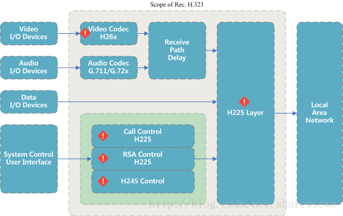

#### 1 H323终端概述  

声明支持H323协议族的多媒体终端，需要支持基本的H225协议，H245协议和音频编解码器单元。视频编解码器单元和用户数据应用是可选的。基本的H323终端包含：用户设备接口，视频编解码器，音频编解码器，远程信息处理设备，H.225.0层，系统控制功能和基于分组的网络的接口。  
  
323协议族并非面面俱到，一些相关高级特性由于已经存在标准，323协议族并不涉及。323协议族不涉及多个麦克风混音器和声学回声消除；不涉及摄像头的附加视频功能；不涉及使用T.120传输用户界面数据；不涉及连接网络接口的定义；不涉及用户界面和操作等。  

#### 2 H323协议族的分工  

* **(必要组件)呼叫信令单元(H225)**: 用于将传输的视频，音频，数据和控制流格式化为消息以输出到网络接口并检索所接收的视频，音频，数据，并控制来自已从网络接口输入的消息的流。在此外，它执行逻辑框架，序列编号，错误检测和错误根据每种媒体类型进行适当的更正
* **(必要组件)呼叫信令单元(H245)**: 用于提供呼叫控制，能力交换，命令信令指示和消息来打开和充分描述逻辑通道的内容。
* **(必要组件)视频编解码器(H.711, G.72x)**: 用于按照标准音频协议压缩和解压缩音频数据。逻辑上的发送端使用音频编码器编码来自麦克风的音频信号，得到压缩的音频数据，并传输出去；逻辑上的接收端接收来自发送端的压缩的音频数据，使用音频解码器解码压缩的音频数据并输出到扬声器。H.323终端应能够编码和解码G.711音频，可选的支持G.72x音频编解码。在H.245的能力交换期间，导出音频编码器使用的算法。
* **(可选组件)视频编解码器(H.26x)**: 用于按照标准视频协议压缩和解压缩视频数据。逻辑上的发送端使用视频编码器编码来自视频源原始视频数据，得到压缩的视频数据，并传输出去；逻辑上的接收端接收来自发送端的压缩的视频数据，使用视频解码器解码压缩的视频数据并输出到显示器。提供视频通信的H.323终端必须能够根据H.261 QCIF对视频进行编码和解码。可选地，终端可以也可以根据H.261或H.263的其他模式对视频进行编码和解码。
* **(可选组件)数据通道**: 若干路数据通道是可选的。数据通道可以是单向的或双向的取决于数据应用程序的要求。T.120建议书是H.323终端与终端之间数据互操作性的默认基础，建议书支持电子白板，静止图像传输，文件交换，数据库访问，音频会议等应用。任何数据应用程序可以使用H.245协商协商数据能力支持。
* **(可选组件)接收路径延迟**: 包括添加到媒体流的延迟，以保持同步以解决网络分组到达抖动问题。媒体流可选地在接收器中延迟处理以保持与其他媒体流的同步；媒体流可选地延迟处理以消除分组网络抖动带来的网络延迟。中间处理点（如MCU或网关）可能会更改视频和音频时间戳，接收端点可能会增加适当的延迟以优化音视频同步
* **(外部组件)基于分组的网络接口**: 网络接口必须提供所述的服务H.225.0建议书。这包括以下内容：可靠的(例如TCP，SPX)端到端服务对于H.245控制信道，数据信道和呼叫信令信道是强制性的。对于音频频道，视频来说，不可靠的（例如，UDP，IPX）端对端服务是强制性的频道和RAS频道。这些服务可能是双工或单工，单播或组播取决于应用，终端的能力以及网络的配置。

#### 3 H225协议的控制功能  
RAS信令功能使用H.225.0消息来执行注册，接纳，带宽终端和关守之间的变化，状态和脱离程序。 RAS信令信道独立于呼叫信令信道和H.245控制信道。H.245开放的逻辑信道程序不用于建立RAS信令信道。 在H.323终端中，RAS信令信道的建立优先于其他任何逻辑信道。特别注意：在网络中没有关守的环境中，不使用RAS信令信道；在网络中包含关守（一个区域）的环境中，RAS信令信道在两者之间打开端点和关守。  

呼叫信令功能使用H.225.0呼叫信令来建立两者之间的连接H.323端点。 呼叫信令信道独立于RAS信道和H.245控制通道。 H.245开放逻辑信道过程不用于建立呼叫信令信道。在H.323终端中， 呼叫信令信道的建立优先于H.245信道或其他任何逻辑信道。 特别注意：在没有关守的系统中，呼叫信令信道在涉及呼叫的两个端点之间打开；在包含一个关守系统中，呼叫信令信道在终端和终端之间打开关守。  

#### 4 H245协议的控制功能  
H.245控制功能使用H.245控制信道来传送端到端控制消息,来管理H.323实体的运作，包括能力交换，开放和关闭逻辑信道，模式偏好请求，流量控制消息和一般命令等。H.245建议规定了许多支持端到端的独立协议实体信号。协议实体由其语法（消息），语义和一组指定指定消息交换和与用户交互的过程。 H.245消息分为四类：请求，响应，命令和指示。H.323终端应支持以下H.245协议实体的语法，语义和过程：  

* Master/slave determination. H.245主从确定模块用于解决两个端点试图打开一个双向通道时可能存在的冲突。在这个过程中，两个端点随机交换号码在H.245 masterSlaveDetermination消息中，确定主从端点。 H.323端点应能够在主模式和从模式下运行。
* Capability Exchange. 规定进行单独的接收和发送能力，终端可随时重新发布能力集。
* Logical Channel Signalling. 每个逻辑信道能将来自发射机的信息发送到一个或多个接收机，并且是由每个传输方向唯一的逻辑信道号标识。逻辑通道使用openLogicalChannel和closeLogicalChannel消息打开和关闭。
* Bidirectional Logical Channel Signalling.
* Close Logical Channel Signalling.
* Mode Request. 接收机可以请求发射机使用H.245 requestMode消息发送特定模式。
* Round Trip Delay Determination.
* Maintenance Loop Signalling.
* General commands and indicatio.

#### 参考文献  

* [The Standard in Open Source H.323](https://www.h323plus.org/)
* [Web Real-Time Communication(WebRTC)](https://www.webrtc.org/)