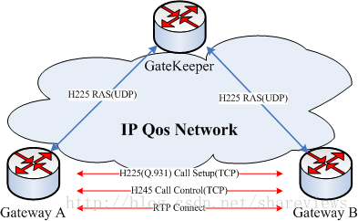
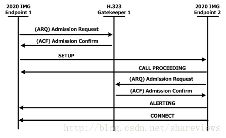
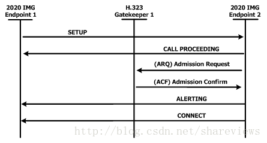
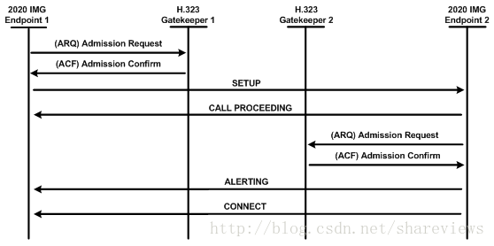

#### 1 H323协议族  
H.323协议族主要包含三种信令控制协议: RAS(H.225)信令,呼叫控制/呼叫设置(H.225)信令和媒体控制和传输(H.245)信令。三种信令的作用域如图-1所示。  
  

H323终端支持的呼叫建立模式,详见具体参见H323协议的8.1 Phase A – Call setup部分。  

* Basic call setup – Neither endpoint registered(use H225)
* Both endpoints registered to the same Gatekeeper(use RAS)
* Only calling endpoint has Gatekeeper(use RAS)
* Only called endpoint has Gatekeeper(use RAS)
* Both endpoints registered to different Gatekeepers(use RAS)

#### 2 RAS(H.225)信令  
RAS是在Gateway和GateKeeper之间使用的信令协议。RAS信道优先于任何其他信道之前打开，独立于呼叫建立和媒体传输信道。RAS使用用户数据报协议(UDP)端口1719(H.225 RAS消息)和1718(组播关守发现)  

#### 3 H.225呼叫控制/设置信令  
H.225呼叫控制信令用于建立H.323端点之间的连接。ITU H.225建议书规定了Q.931信令消息的使用和支持。在TCP端口1720上通过IP网络创建可靠的(TCP)呼叫控制通道。该端口为了连接，维护和断开呼叫而启动Q.931呼叫控制消息。  

当存在GateKeeper时，通过直接呼叫信令或GKRCS交换H.225呼叫建立消息。所选择的方法在RAS准入消息交换期间由GateKeeper决定。当不存在GateKeepe时，则H.225消息在端点之间直接交换。  

H323终端支持的呼叫建立模式,详见具体参见H323协议的8.1 Phase A – Call setup部分。  
  
  
  

#### 4 H.245媒体控制和传输  
H.245处理H.323实体之间的端到端控制消息。H.245程序建立音频，视频，数据和控制信道信息传输的逻辑信道。它用于协商频道使用和功能，如：流量控制和能力交换信息。H.245的详细说明请见下一章。  

#### 参考文献  

* [The Standard in Open Source H.323](https://www.h323plus.org/)
* [Web Real-Time Communication(WebRTC)](https://www.webrtc.org/)
* [a cross-platform solution to stream audio and video(ffmpeg)](http://www.ffmpeg.org/)
